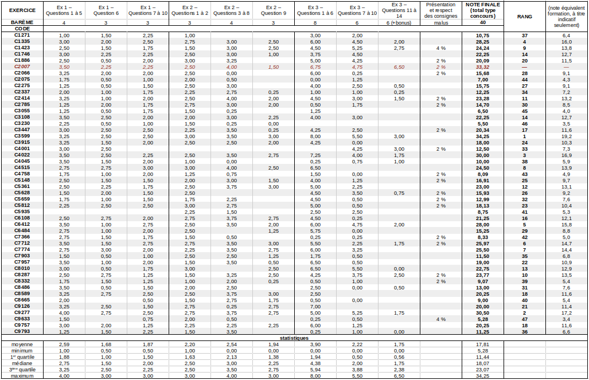
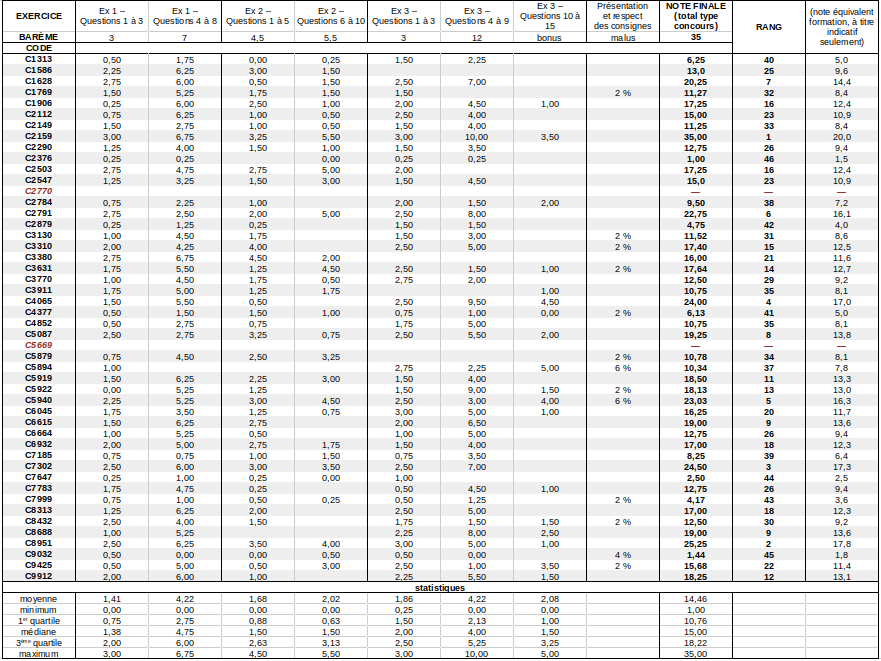
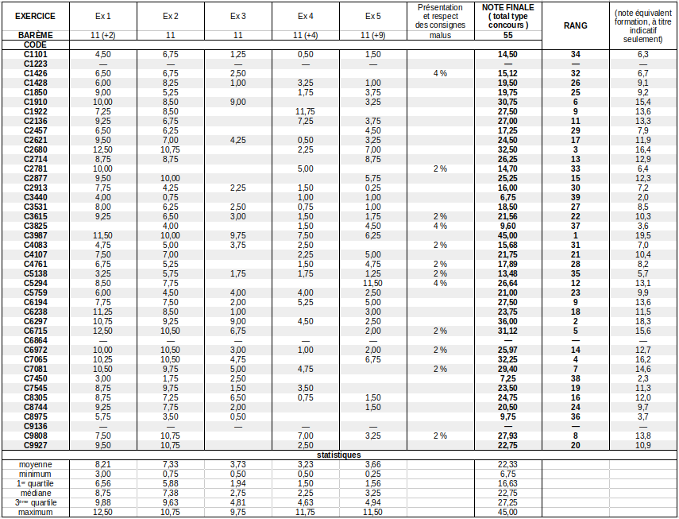
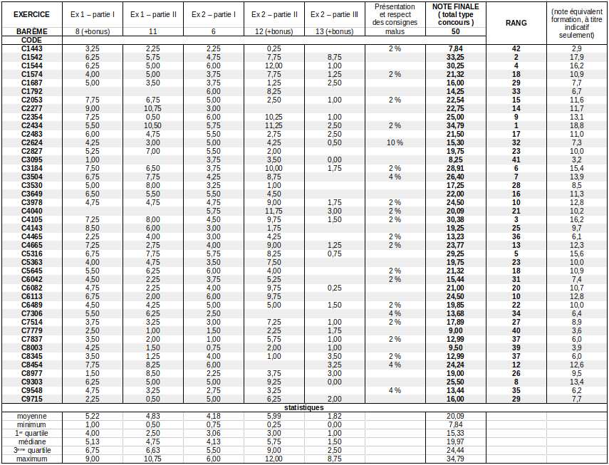
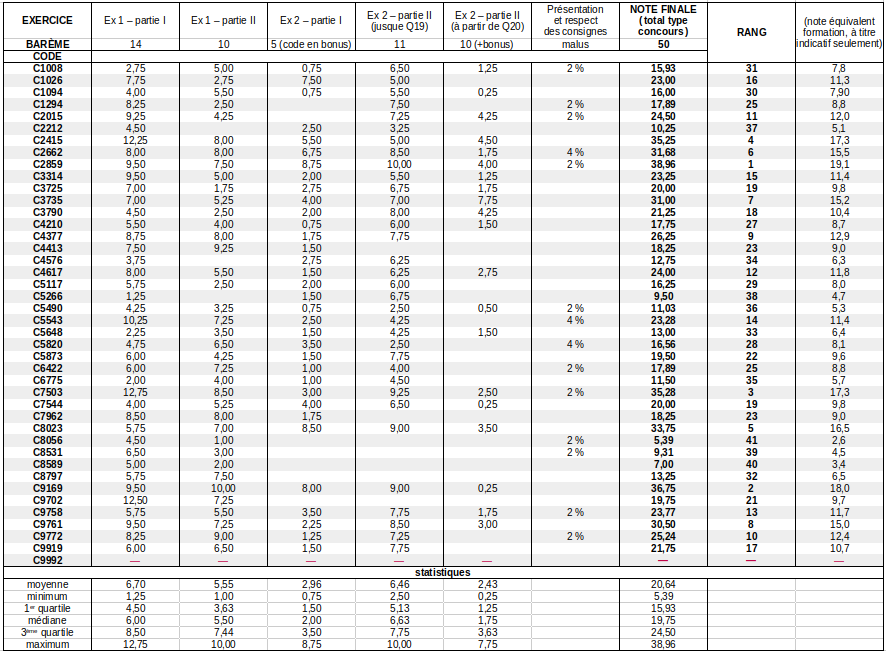
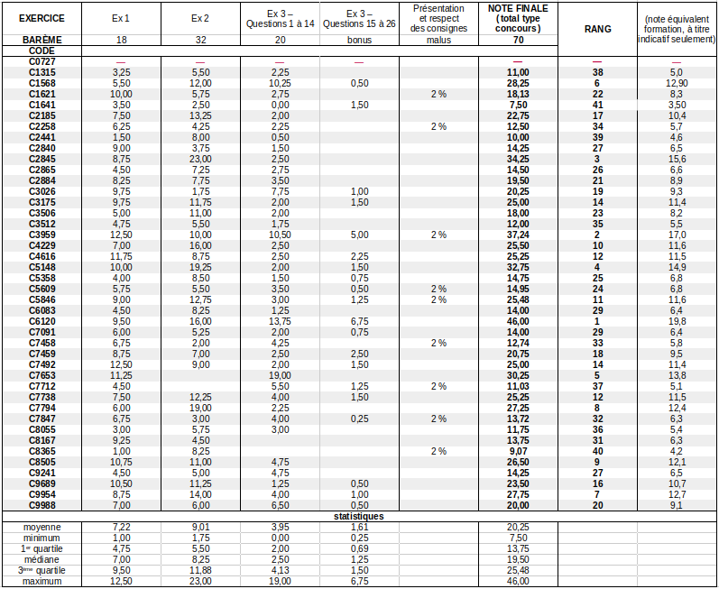
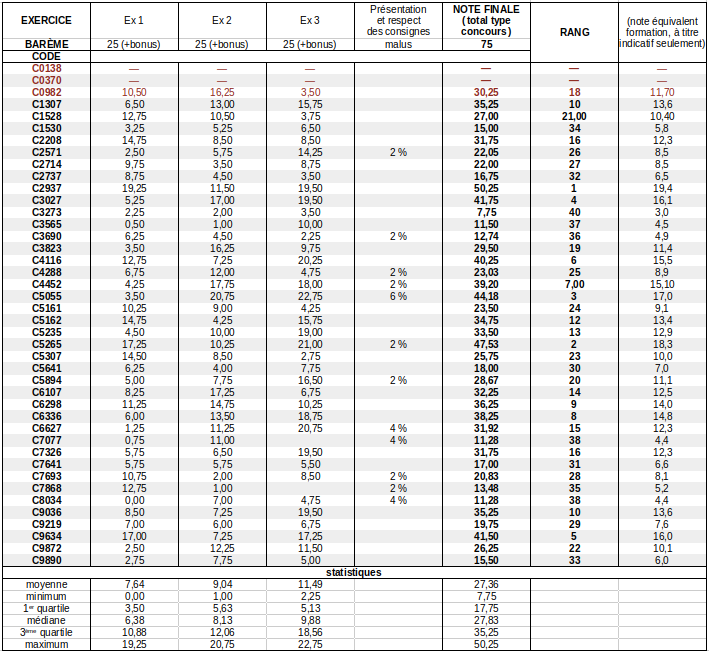

# Tableurs contenant les résultats des DS

* DS 1 :

    

* DS 2 :

    

* DS 3 :

    

* DS 4 :

    
  
* DS 5 :

    

* DS 6 :

    

* DS 7 :

    

---

Par *Justine BENOUWT*

Sous licence [*CC BY-NC-SA*](https://creativecommons.org/licenses/by-nc-sa/4.0/)

Source des images : *production personnelle*
