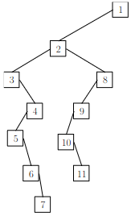
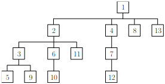
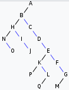

# TD : Arbres

### I. Définitions inductives sur les arbres binaires

1. Voir le cours ("entier" est un synonyme de "strict").
2. Voir le cours.
3. * `nb_internes(f) = 0` avec `f` l'arbre réduit à une feuille.
    * `nb_internes(N(e,g,d)) = 1 + nb_internes(g) + nb_internes(d)`.
4. *   `nb_feuilles(f) = 1` avec `f` l'arbre réduit à une feuille.
    *   `nb_feuilles(N(e,g,d)) = nb_feuilles(g) + nb_feuilles(d)`.
4. *   `prof_min(f) = 0` avec `f` l'arbre réduit à une feuille.
    *   `prof_min(N(e,g,d)) = 1 + min(prof_min(g), prof_min(d))`.
6. *   `maximum(f) = f` avec `f` l'arbre réduit à une feuille.
    *   `maximum(N(e,g,d)) = max(e, maximum(g), maximum(d))`.
7. * `in(e, ⊥) = FAUX` avec `⊥` l'arbre vide.
    * `in(e, N(x,g,d)) = in(e, g) OU in(e, d) OU (e = x)`.
8. *   `nb_prof(p, ⊥) = 0` avec `⊥` l'arbre vide.
    *   `nb_prof(0, N(e,g,d)) = 1` et `nb_prof(p, N(e,g,d)) = nb_prof(p-1,g)+nb_prof(p-1,d)` `si p > 0`.
9. * `diametre(⊥) = 0`.
    * `diametre(N(e,g,d)) = max(diametre(g), diametre(d), 2+h(g)+h(d))` avec `h` la hauteur.

Pour définir une fonction `f` sur un ensemble inductif, on définit le résultat de `f` pour chaque assertion de cet ensemble, et on définit le résultat de `f` pour les éléments de l'ensemble construits avec chaque règle d'inférence.

### II. Parcours d’arbres binaires

1. Premier arbre :

    * Largeur : R;G;S;D;K;M;N;A;T;X;U;Y;W
    * Profondeur préfixe : R;G;D;A;K;T;W;S;M;X;N;U;Y
    * Profondeur infixe : D;A;G;K;W;T;R;M;X;S;U;N;Y
    * Profondeur postfixe : A;D;W;T;K;G;X;M;U;Y;N;S;R

    Deuxième arbre :

    * Largeur : 2;7;6;3;4;5;0;8;1
    * Profondeur préfixe : 2;7;3;8;1;4;6;5;0
    * Profondeur infixe : 8;3;1;7;4;2;5;6;0
    * Profondeur postfixe : 8;1;3;4;7;5;0;6;2

2. Non.

3. Il y en a 14 (quatrième nombre de Catalan). Il suffit de dessiner les 14 squelettes possibles d’arbres non entiers à quatre nœuds puis d’étiqueter les nœuds de manière à obtenir le bon ordre infixe.

4. On obtient un peigne droit.

5. On obtient un peigne gauche.

6. Uniquement les arbres à 1 seul nœud.

### III. Raisonner sur les arbres binaires

1. Montrons par induction structurelle la propriété suivante : « Un arbre binaire entier à $n$ arcs possède $n+1$ nœuds. ». On note pour cette question $`n_a`$ le nombre de nœuds d'un arbre $a$ et $`r_a`$ son nombre d’arcs.

    * Assertion :

        L'arbre réduit à une feuille possède 0 arc et 1 nœud. La propriété est donc vraie.

    * Règle d'inférence :

        Supposons la propriété vraie pour deux arbres $g$ et $d$. Montrons qu'elle est vraie pour $`a = N(e, g, d)`$ pour toute étiquette $e$.

        Par définition, on a $`n_a = 1 + n_g + n_d \text{ et } r_a = 2 + r_g + r_d`$.

        Or $`n_g = r_g + 1 \text{ et } n_d = r_d+1`$ par hypothèse d'induction.

        Donc $`n_a = 1 + n_g + n_d = 1 + (r_g+1) + (r_d+1) = 1 + (2+r_g+r_d) = 1+r_a`$.

        La propriété est donc vraie pour $a$.

    La propriété est vraie pour l'assertion et reste vraie pour les arbres construits par application de la règle d'inférence, elle est donc vraie pour tout arbre.

2. Montrons par induction structurelle la propriété suivante : « Un arbre binaire entier à $n$ nœuds internes possède $n+1$ feuilles. ». On note pour cette question $`n_a`$ le nombre de nœuds internes d'un arbre $a$ et $`f_a`$ son nombre de feuilles.

    * Assertion :

        L'arbre réduit à une feuille possède 0 nœud interne et 1 feuille. La propriété est donc vraie.

    * Règle d'inférence :

        Supposons la propriété vraie pour deux arbres $g$ et $d$. Montrons qu'elle est vraie pour $`a = N(e, g, d)`$ pour toute étiquette $e$.

        Par définition, on a $`n_a = 1 + n_g+n_d \text{ et }f_a = f_g+f_d`$.

        Or $`f_g = 1 + n_g \text{ et } f_d=1+n_d`$ par hypothèse d'induction.

        Donc $`f_a = f_g+f_d = (1+n_g)+(1+n_d) = 1 + (1+n_g+n_d) = 1+n_a`$.

        La propriété est donc vraie pour $a$.

    La propriété est vraie pour l'assertion et reste vraie pour les arbres construits par application de la règle d'inférence, elle est donc vraie pour tout arbre.

3. Montrons par induction structurelle la propriété suivante : « Un arbre filiforme non vide possède 1 feuille. ».

    * Assertion :

        L'arbre filiforme réduit à une feuille possède 1 feuille. La propriété est donc vraie.

    * Règles d'inférences :

        Supposons la propriété vraie pour un arbre filiforme $g$. Montrons qu'elle est vraie pour $`a = N(e, g, \bot)`$ pour toute étiquette $e$.

        Par définition, le nombre de feuilles de $a$ est égal à la somme des nombres de feuilles de ses deux sous-arbres.

        Or l'arbre vide ne possède aucune feuille ; et $g$ possède 1 feuille par hypothèse d'induction.

        Donc $a$ possède 1 feuille.

        On montre de la même manière que la propriété est vraie pour $`a = N(e, \bot, d)`$ si elle est vraie pour l'arbre filiforme $d$.

    La propriété est vraie pour l'assertion et reste vraie pour les arbres construits par application des deux règles d'inférence, elle est donc vraie pour tout arbre filiforme.

4. Montrons par induction structurelle la propriété suivante : « Un arbre parfait de hauteur $H$ possède $`2^H`$ feuilles. ». On note pour cette question $`f_a`$ le nombre de feuilles d'un arbre $a$.

    * Assertion :

        L'arbre réduit à une feuille est de hauteur 0 et possède 1 feuille. La propriété est donc vraie.

    * Règle d'inférence :

        Supposons la propriété vraie pour deux arbres $g$ et $d$ de même hauteur $H$. Montrons qu'elle est vraie pour $`a = N(e, g, d)`$ pour toute étiquette $e$.

        L’arbre $a$ est de hauteur $`h(a) = 1 + \max(h(g), h(d)) = 1 + \max(H, H) = H+1`$

        Par définition, on a $`f_a = f_g+f_d`$.

        Or $`f_g = 2^H \text{ et } f_d=2^H`$ par hypothèse d'induction.

        Donc $`f_a = f_g+f_d = 2^H+2^H = 2^{H+1}=2^{h(a)}`$.

        La propriété est donc vraie pour $a$.

    La propriété est vraie pour l'assertion et reste vraie pour les arbres construits par application de la règle d'inférence, elle est donc vraie pour tout arbre parfait.

5. Montrons par induction structurelle la propriété suivante : « Un arbre parfait de hauteur $H$ possède $`2^H-1`$ nœuds internes. ». On note pour cette question $`n_a`$ le nombre de nœuds internes d'un arbre $a$.

    * Assertion :

        L'arbre réduit à une feuille est de hauteur 0 et possède 0 nœud interne. Comme $`2^0-1=0`$, la propriété est vraie.

    * Règle d'inférence :

        Supposons la propriété vraie pour deux arbres $g$ et $d$ de même hauteur $H$. Montrons qu'elle est vraie pour $`a = N(e, g, d)`$ pour toute étiquette $e$.

        L’arbre $a$ est de hauteur $`h(a) = 1 + \max(h(g), h(d)) = 1 + \max(H, H) = H+1`$

        Par définition, on a $`n_a = 1+n_g+n_d`$.

        Or $`n_g = 2^H-1 \text{ et } n_d=2^H-1`$ par hypothèse d'induction.

        Donc $`n_a = 1+n_g+n_d = 1+2^H-1+2^H-1 = 2^{H+1}-1=2^{h(a)}-1`$.

        La propriété est donc vraie pour $a$.

    La propriété est vraie pour l'assertion et reste vraie pour les arbres construits par application de la règle d'inférence, elle est donc vraie pour tout arbre parfait.

Pour les questions suivantes, je ne rédige pas les preuves, je donne juste une indication. Cependant n'hésitez pas à me le demander si vous avez un problème pour la rédaction.

6.   Preuve par induction structurelle sur l'ensemble inductif des arbres parfaits.
7.   Preuve par induction structurelle sur l’ensemble des arbres binaires non entiers.
8.   Preuve par récurrence sur la hauteur $h$.
9.   Preuve par récurrence forte sur $n$.
10.   Preuve par induction structurelle sur l'ensemble inductif des arbres binaires entiers.

### IV. Arbres d’arité quelconque

1. Définition inductive de l'ensemble des arbres d’arité quelconque non vides dont les étiquettes sont des entiers :

    * Assertion : un arbre réduit à une feuille est un arbre d’arité quelconque.

    * Règle d'inférence : si `a1, a2, ..., an` sont `n>0` arbres d’arité quelconque, et `e` un entier, alors `N(e, [a1, a2, ..., an])` est un arbre d’arité quelconque.

2. Définition inductive de la hauteur d'un arbre d’arité quelconque :

    *   `hauteur(f) = 0` avec `f` l'arbre réduit à une feuille.
    *   `hauteur(N(e, [a1, a2, ..., an])) = 1 + max(hauteur(a1), hauteur(a2), ..., hauteur(an))`.

3. Définition inductive du produit des étiquettes d'un arbre d’arité quelconque :

    *   `produit(f) = f` avec `f` l'arbre réduit à une feuille.
    *   `produit(N(e, [a1, a2, ..., an])) = e * produit(a1) * produit(a2) * ... * produit(an))`.

4. Définition inductive de l'arité d'un arbre d’arité quelconque :

    *   `arite(f) = 0` avec `f` l'arbre réduit à une feuille.
    *   `arite(N(e, [a1, a2, ..., an])) = max(n, arite(a1), arite(a2), ..., arite(an))`.

5. 

6. 

7. *   Largeur : A;B;C;D;E;F;G;H;I;J;K;L;M;N;O;P;Q

    * Profondeur préfixe : A;B;H;N;O;I;J;C;D;E;K;P;L;Q;F;G;M
    * Profondeur postfixe : N;O;H;I;J;B;C;D;P;K;Q;L;E;F;M;G;A

8. 

9. Parcours en largeur de la représentation LCRS : A;B;H;C;N;I;D;O;J;E;K;F;P;L;G;Q;M.

    Cela ne correspond pas au parcours en largeur de l’arbre d’arité quelconque d’origine.

10. *   Profondeur préfixe : A;B;H;N;O;I;J;C;D;E;K;P;L;Q;F;G;M
    *   Profondeur infixe : N;O;H;I;J;B;C;D;P;K;Q;L;E;F;M;G;A
    *   Profondeur postfixe : O;N;J;I;H;P;Q;L;K;M;G;F;E;D;C;B;A

11. Les parcours en profondeur dans l'ordre préfixe correspondent. Le parcours postfixe de l'arbre d'arité quelconque correspond au parcours infixe de sa conversion LCRS.

### V. Reconstruction d'arbres binaires depuis leurs parcours

1. Le parcours préfixe commence par un 2, il s'agit donc forcément de la racine. Il reste à déterminer où se situe la frontière entre les nœuds du sous-arbre gauche et ceux du sous-arbre droit de 2 parmi le reste `8;4;3;1;7;5;6`. Pour cela, on regarde le parcours infixe : les étiquettes avant 2 dans ce parcours (`4;8;3;1`) font par définition partie du sous-arbre gauche de 2 et celle après 2 dans ce parcours (`5;7;8`) font partie du sous-arbre droit de 2.

    On recommence ce raisonnement afin de construire les sous-arbres gauches et droits en question.

    Cela donne : `N(2, N(8, N(4, ⊥, ⊥), N(3, ⊥, N(1, ⊥, ⊥))), N(7, N(5, ⊥, ⊥), N(6, ⊥, ⊥)))`.

11. Soit `P` et `I` les parcours préfixes et infixes de l'arbre à reconstruire. On peut déduire un algorithme récursif directement de l'explication précédente :

    * On récupère `e` la première étiquette de `P`.
    * On récupère `n` le nombre de nœuds avant `e` dans `I`.
    * On construit récursivement `g`, l'arbre dont le parcours préfixe est `P[1->n]` et infixe est `I[0->n-1]`.
    * On construit récursivement `d`, l'arbre dont le parcours préfixe est `P[n+1->fin]` et infixe est `I[n+1->fin]`.
    * On renvoie un nœud de racine `e`, de sous-arbre gauche `g` et de sous-arbre droit `d`.

    (le cas de base est bien sûr `P` et `I` vides, auquel cas on renvoie ⊥)

12. En utilisant l'algorithme précédent, si on se retrouve lors d'un appel récursif avec `P` et `I` qui ne contiennent pas le même ensemble d'étiquettes, il ne peut pas s'agir des parcours d'un même arbre.

13. Non, car on peut plus trouver où se situe la frontière entre les nœuds du sous-arbre gauche et ceux du sous-arbre droit.

14. Il reste deux étapes : 

    * On ajoute la feuille 20 à la pile.
    * On dépile les deux arbres présents et on construit l'arbre de racine 12 et de sous-arbre gauche celui dépilé en second, et de sous-arbre droit celui dépilé en premier (la feuille 20 donc).

15. L'algorithme découle directement de l'illustration précédente. On construit une pile vide, puis on parcourt l'énumération postfixe, et pour chaque étiquette :

    * si c'est celle d'une feuille, on l'empile.
    * si c'est celle d'un nœud interne `e` :
        * on dépile un arbre `d` ;
        * on dépile un arbre `g` ;
        * on empile un nouvel arbre `N(e, g, d)`.

    Quand le parcours de l'énumération postfixe est terminé, il suffit de récupérer le seul arbre encore présent dans la pile.

16. On peut obtenir un algorithme similaire en parcourant le parcours préfixe à l'envers.

17. Non. Voir le cours.

---

Par *Justine BENOUWT*

Sous licence [*CC BY-NC-SA*](https://creativecommons.org/licenses/by-nc-sa/4.0/)

