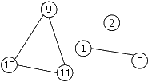
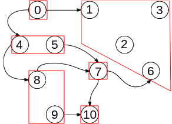
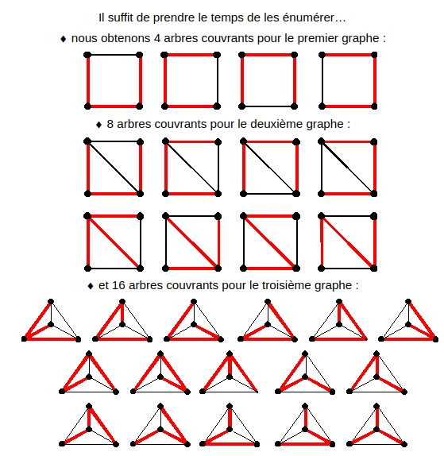

# TD : Raisonner sur les graphes

### Graphes non orientés

1. $d(1) = 2; d(2) = 0; d(3)=2;d(4)=2; d(5)=2;d(6)=2;d(7)=2;d(8)=2;d(9)=3;d(10)=3;d(11)=2$

    Son nombre chromatique est 3.

2. Il n'est pas connexe, il possède 4 composantes connexes. Il est cyclique, il possède 5 cycles si on ne tient pas compte de l'ordre des sommets, 32 en tenant compte de l’ordre.

3. Les composantes connexes induites par $\{1,3,4\}$ et $\{6,7,8\}$​ sont isomorphes.

4. Le sous-graphe induit par $\{1,2,3,9,10,11\}$ est :

    

    Si on retire l'arête $\{1,3\}$ par exemple, il n'est plus induit.

5. La somme des degrés des sommets d'un graphe est égale à 2 fois le nombre d'arêtes, donc est paire.

    Ainsi la somme des degrés pairs et des degrés impairs est paire, donc la somme des degré impairs est paire.

    Donc il y a un nombre pair de sommets de degré impair.

6. Par l'absurde, supposons que tous les degrés des sommets d'un graphe soient différents.

    Ainsi comme il y a $|S|$ sommets, il y a forcément un sommet de degré 0, un sommet de degré 1, un sommet de degré 2, ..., un sommet de degré $`|S|-1`$​.

    Or l'existence d'un sommet de degré $`|S|-1`$ impose que ce sommet soit relié par une arête à tous les autres sommets du graphe, ce qui est incompatible avec l'existence d'un sommet de degré 0 qui n'est relié à aucun sommet : contradiction.

    Donc le graphe a forcément deux sommets de même degré.

7. Montrons par récurrence sur $`k\in \mathbb N^*`$ qu'un graphe ayant $`|S|-k`$ arêtes possède au moins $k$ composantes connexes.

    Initialisation. Un graphe possède toujours au moins 1 composante connexe donc la propriété est vraie.

    Hérédité. Soit $`k>1`$ et $G$ un graphe ayant $`|S|-k`$ arêtes. On a $`|S|-k < |S|-1`$ donc d'après le cours, $G$ ne peut pas être connexe : il possède au moins 2 composantes connexes. Considérons le graphe $G'$ correspondant au graphe $G$ auquel on ajoute une arête entre deux sommets appartenant à deux composantes connexes différentes. Ce graphe $G'$ possède dont $`|S|-k+1=|S|-(k-1)`$ arêtes. Ainsi on peut lui appliquer l'hypothèse de récurrence : $G'$ possède au moins $k-1$ composantes connexes. Or $G'$ possède une composante connexe en moins que $G$ (puisqu'on a ajouté une arête entre deux sommets n'appartenant pas à la même composante). Donc $G$ possède au moins $k$ composantes connexes.

8. Si $G$ est connexe, c'est direct. Supposons donc $G$ non connexe, et montrons alors que $`\bar G`$ est connexe.

    Comme $G$ est non connexe, $S$ peut être séparé en deux ensembles $A$ et $B$ sans aucune arête entre les deux (par exemple $A$ peut être les sommets de la première composante connexe et $B$ les sommets de toutes les autres composantes). $`\bar G`$ contient donc toutes les arêtes possibles entre $A$ et $B$.

    Considérons alors deux sommets $x$ et $y$.

    Si $`x\in A, y\in B`$ alors il existe une arête entre les deux dans $`\bar G`$. De même si $`x\in B, y\in A`$.

    Si $`x\in A, y\in A`$ : soit $`z\in B, \; \{x,z\}\in\bar A\text{ et }\{z,y\}\in\bar A`$, donc il existe un chemin de $x$ à $y$. De même si  $`x\in B, y\in B`$.

    Donc pour tout couple de sommets $(x,y)$, $x$ est accessible depuis $y$ dans $`\bar G`$, donc il est connexe.

    Il est possible que $G$ et $`\bar G`$ soient tous deux connexes (dessinez par exemple le graphe chemin à 4 sommets).

### Graphes orientés

9. $d_+(0)=2;d_+(1) = 1; d_+(2) = 1; d_+(3)=2;d_+(4)=2; d_+(5)=2;d_+(6)=1;d_+(7)=2;d_+(8)=2;d_+(9)=2;d_+(10)=0$

    $d_-(0)=0;d_-(1)=2; d_-(2)=2; d_-(3)=1;d_-(4)=2; d_-(5)=1;d_-(6)=2;d_-(7)=2;d_-(8)=2;d_-(9)=1;d_-(10)=2$

10. Il est faiblement connexe mais pas fortement connexe (pas de chemin de 1 à 0 par exemple). Il possède 6 composantes fortement connexes.

11. Les composantes fortement connexes induites par $\{4,5\}$ et $\{8,9\}$​ sont isomorphes.

12. 

13. Par l'absurde, supposons que $`G^{CFC}`$ possède un cycle.

    Il existe donc deux sommets $`C_1, C_2 \in G^{CFC}`$ tels qu'il existe un chemin allant de $`C_1`$ à $`C_2`$ et un chemin allant de $`C_2`$ à $`C_1`$​.

    Ainsi il existe $`x\in C_1, y\in C_2`$ deux sommets du graphe $G$ appartenant à deux composantes fortement connexes différentes tels que $x$ est accessible depuis $y$ et $y$ est aussi est accessible depuis $x$. Mais dans ce cas $x$ et $y$ appartiendraient à la même composante fortement connexe : contradiction.

    Donc $`G^{CFC}`$ est acyclique.

14. Par l'absurde, supposons qu'une composante fortement connexe d'un graphe orienté acyclique possède au moins 2 sommets. Notons $x$ et $y$ ces deux sommets. Par définition d'une composante fortement connexe, il existe un chemin reliant $x$ à $y$ et un chemin reliant $y$ à $x$. Mis bout à bout, ces deux chemins forment un cycle : contradiction.

### Arbres dans la théorie des graphes

15. 

16. Montrons qu'une forêt $G$ composée de $k$ arbres (donc de $k$ composantes connexes) possède $|S|-k$ arêtes.

    Notons $`C_1, C_2,..., C_k`$ les composantes connexes de la forêt $G$, et $`n_1, n_2, ..., n_k`$ leurs nombres de sommets respectifs. Le nombre total de sommets de $G$ vérifie donc $`|S| = \displaystyle\sum_{i=1}^k n_i`$

    Chaque $`C_i`$ est un arbre donc connexe et acyclique, donc possède $`n_i-1`$​ arêtes.

    Le nombre d'arêtes de $G$ vérifie donc $`|A| = \displaystyle\sum_{i=1}^k (n_i-1) = |S|-k`$.

17. $`n-1`$, voir le cours pour la preuve.

18. Soit $G$ connexe et ayant $n-1$ arêtes. Supposons que $G$ possède un cycle $`s_0, s_1, s_2, ..., s_{n}=s_0`$.

    Supposons que l'on retire l'arête $`\{s_0, s_1\}`$ de $G$. Tout chemin passant par cette arête peut être remplacée par le chemin $`s_1,s_2,...s_n=s_0`$. Donc supprimer cette arête ne change pas la connexité de $G$, ce qui est absurde puisqu'un graphe à $n-2$​ arêtes ne peut pas être connexe.

    Donc $G$ est acyclique, donc c'est un arbre.

19. Soit $G$ un graphe acyclique ayant $n-1$ arêtes. Chacune des $r$ composantes connexes de $G$ possède $`n_i`$ sommets et $`n_i-1`$ arêtes, car elles sont connexes (par définition) et acyclique (car $G$ est acyclique).

    Donc le nombre d'arêtes de $G$ est égal à $`\displaystyle\sum_{i=1}^r (n_i-1)=n-r`$. On a donc $`n-1=n-r`$, donc $r=1$.

    $G$ possède une seule composante connexe, ainsi il est connexe : c'est un arbre.

---

Par *Justine BENOUWT*

Sous licence [*CC BY-NC-SA*](https://creativecommons.org/licenses/by-nc-sa/4.0/)

