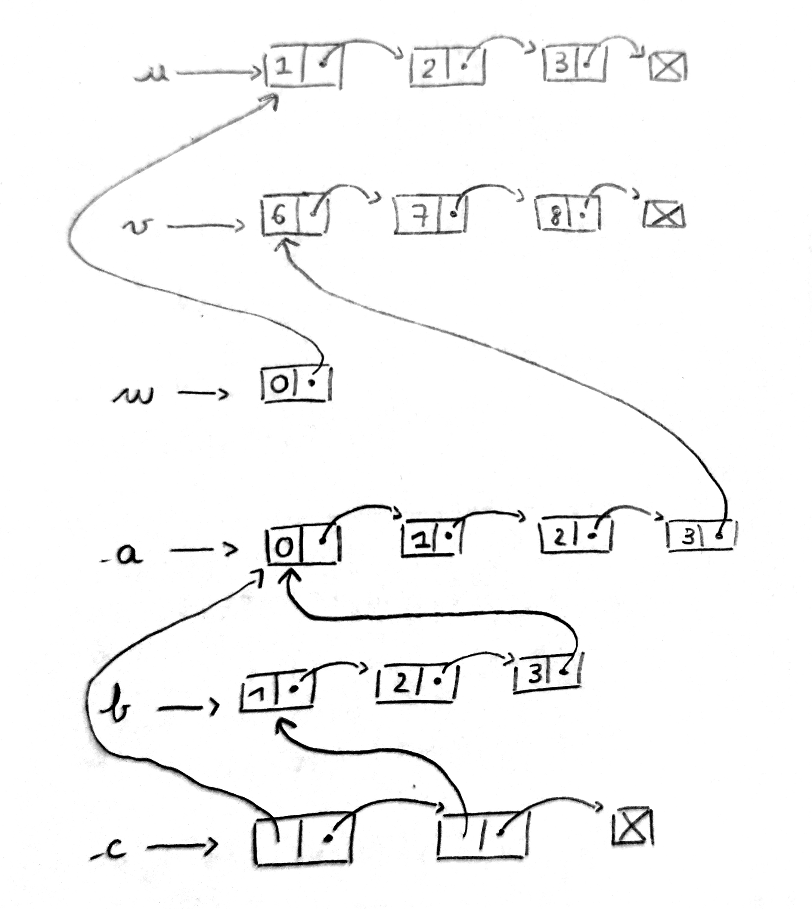
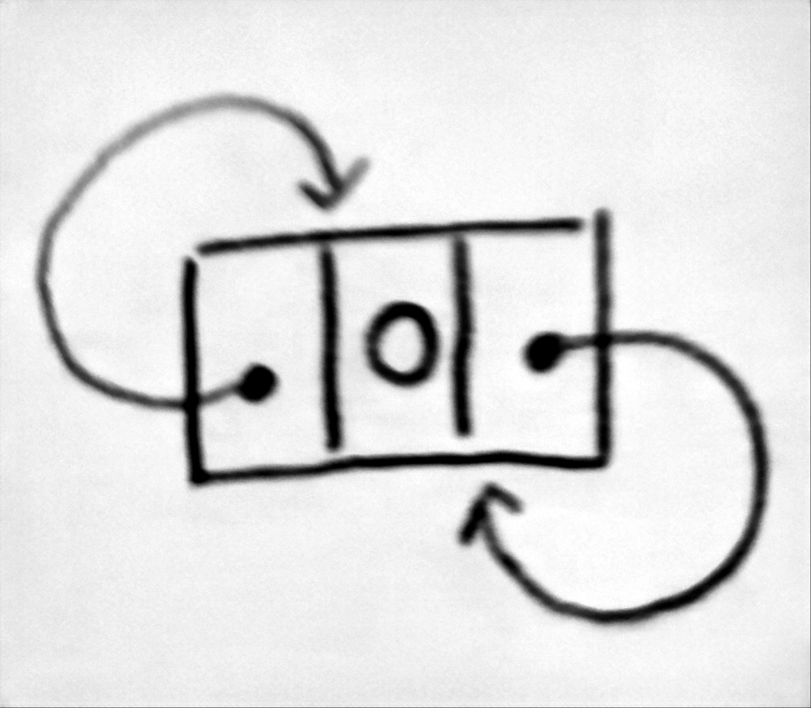
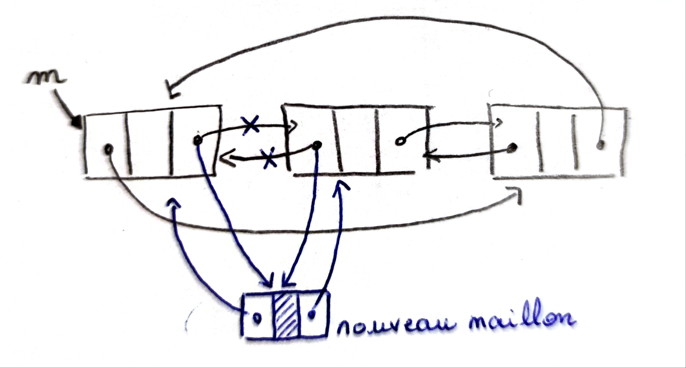

# TD : Listes chaînées

## Exercice 1



L'opérateur `::` est constant alors que l'opérateur `@` est linéaire en la taille de la première liste (même chose pour la complexité spatiale).


## Exercice 2

1. Le champ `elem` permet de stocker la valeur d'un maillon, le champ `prev` est un pointeur vers un autre maillon, le champ `next` aussi : il s'agit bien d'une liste doublement chaînée.

    Les deux champs `prev` et `next` peuvent faire référence à un maillon déjà présent dans la liste : elle peut être circulaire.

    Les deux champs `prev` et `next` sont mutables : on peut insérer/supprimer des maillons : la liste est bien mutable.

    Une `'a l2c` possède forcément un maillon à trois champs : la liste est non vide.

2. {width=10%}

3. ```ocaml
    let create valeur =
        let rec l2c_1_elem = {elem = valeur; prev = l2c_1_elem; next = l2c_1_elem} in
        l2c_1_elem
    ```

4. 

5. ```ocaml
    let add m v = (* m est modifié par effet de bord *)
        let nouveau_maillon = {elem = v; prev = m; next = m.next} in (* O(1) *)
        m.next.prev <- nouveau_maillon ; (* O(1) *)
        m.next <- nouveau_maillon (* O(1) *)
    ```

6. ```ocaml
    let remove m =
        m.next.prev <- m.prev ;
        m.prev.next <- m.next
    ```

7. Il ne se passe rien.

8. Test d'égalité physique : `==` (et `!=` pour la différence).

    Test d'égalité des valeurs : `=` (et `<>` pour la différence).

    Deux maillons différents en mémoire peuvent avoir la même valeur, on doit donc utiliser l'égalité physique.

   ```ocaml
    let length depart = (* O(n) avec n le nombre de maillons *)
        let rec length_aux l =
            if l == depart then
                1
            else
                1 + length_aux l.next
        in length_aux depart.next
    
    let mem depart valeur = (* O(n) avec n le nombre de maillons *)
        let rec mem_aux l =
            l.elem = valeur || (l != depart && mem_aux l.next)
        in mem_aux depart.next
   ```

10. ```ocaml
    let fusion m1 m2 = (* J'insère la liste dont un des maillons est m2
                          entre le maillon m1 et le maillon m1.next.
                          Les numéros correspondent à ceux du schéma ci-dessous. *)
        m1.next.prev <- m2.prev ; (* 1 *)
        m2.prev.next <- m1.next ; (* 2 *)
        m1.next <- m2 ; (* 3 *)
        m2.prev <- m1 (* 4 *)
    ```

    

11. On peut utiliser `None` pour la liste vide et `Some l` pour `l` une liste ayant au moins 1 élément.

12. Les champs ne sont plus mutables. Les maillons doivent être copiés pour les deux fonctions `add` et `remove` donc la complexité est maintenant linéaire.

13. ```ocaml
     let rec ieme_maillon_a_partir_de_m m i = match i with
         | 0 -> m
         | _ -> ieme_maillon_a_partir_de_m m.next (i - 1)
    ```

---

Par *Justine BENOUWT*

Sous licence [*CC BY-NC-SA*](https://creativecommons.org/licenses/by-nc-sa/4.0/)


Source des images : *production personnelle*
