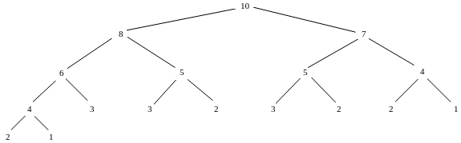

# TD : Récursivité

## Exercice 1

1. ```ocaml
    let rec fibo n = match n with
    	| 0 | 1 -> n
    	| _ -> fibo (n-1) + fibo (n-2)
    ```

2. ```ocaml
    let rec fibo_avec_conditionnelle n =
    	if n = 0 || n = 1 then
    		n
    	else
    		fibo (n-1) + fibo (n-2)
    ```
    
3. ```c
    int fibo(int n) {
        if (n == 0 || n == 1) {
            return n;
        }
        else {
            return fibo (n-1) + fibo (n-2);
        }
    }
    ```

4. Les évolutions de la pile d'appels lors de l'évaluation de `fibo 4` ont été faites en cours. La hauteur maximale de la pile lors de l'appel à `fibo n` est de `n`.

5. L'arbre d'appels lors de l'évaluation de `fibo 4` a été dessiné en cours. Il y de nombreux chevauchements (appels récursifs effectués plusieurs fois et donc présents plusieurs fois dans l'arbre).

6. On a : $`A_0 = A_1 = 0`$ (aucun appel récursif), $`A_2 = 2`$ (un appel à `fibo (n-1)` et un à `fibo (n-2)`), et donc plus généralement $`A_n = A_{n-1} + A_{n-2} + 2`$ (deux appels récursifs + ceux effectués par ces appels).

    On peut donc affirmer que $`A_n \geq 2A_{n-2}`$ car $`A_{n-1} \geq A_{n-2}`$.

    En continuant ce raisonnement, on obtient donc : $`A_n \geq 2A_{n-2} \geq 2\times 2A_{n-4} \geq 2\times 2 \times 2A_{n-6}\geq ...\geq 2^iA_{n-2i}`$.

    On cherche alors à déterminer `i` tel que `n - 2i = 2` pour retomber sur $`A_2`$ que l'on connaît. On trouve $`\frac {n-2} 2`$.

    D'où $`A_n \geq 2^{\frac {n-2} 2} A_2 = 2^{\frac {n-2} 2}\times 2 = 2^{\frac n 2}`$. Le nombre d'appels récursifs effectués par l'évaluation de `fibo n` est bien exponentiel.

7. `a` représente le dernier terme calculé et `b` l'avant dernier terme calculé.

8. Il faut appeler la fonction avec $`a = F_1, b = F_0`$.

    ```ocaml
    let fibo n =
    	let rec fibo_acc n a b = match n with
    		| 0 -> b
    		| _ -> fibo_acc (n-1) (a + b) a in
    	fibo_acc n 1 0
    ```

9. `fibo_acc` est bien récursive terminale (par contre la version initiale de `fibo` ne l'était pas).

10. Avec la même méthode que celle utilisée pour calculer $`A_n`$, on trouve : $`B_0 = 0, B_n = B_{n-1} + 1`$.

    D'où $`B_n = B_{n-i} + i`$, et avec `i = n` pour retomber sur une valeur connue, on obtient $`B_n = B_0 + n = n`$.

    La réponse $`B_n = n+1`$ est aussi acceptée si on compte l'appel initial à `fibo_acc` lancé par `fibo`.

## Exercice 2

1. $`C_0 = C_1 = 0, C_2 = C_3 = 1`$

2. $`C_n = C_{n-2} + C_{n-3}`$.

3. ```ocaml
    let rec cloture n = match n with
    	| 0 | 1 -> 0
    	| 2 | 3 -> 1
    	| _ -> cloture (n-2) + cloture (n-3)
    ```

4. ```c
    int cloture (int n) {
        if (n <= 1) {
            return 0;
        }
        else if (n <= 3) {
            return 1;
        }
        else {
            return cloture (n-2) + cloture (n-3);
        }
    }
    ```

5. 

6. La hauteur maximale de la pile d'appels correspond au nombre d'appels sur le chemin le plus long allant de la racine de l'arbre à une feuille. Pour `cloture 10`, c'est donc 5.

## Exercice 3

1. ```ocaml
    let rec ack m n = match m, n with
    	| 0, _ -> n + 1
    	| _, 0 -> ack (m-1) 1
    	| _ -> ack (m-1) (ack m (n-1))
    ```

    `ack(1, 4)` vaut 6. On peut se rendre compte en effectuant ce calcul à la main que de nombreux appels récursifs ont été nécessaires, et donc que la hauteur de la pile est très grande, ce qui peut vite engendrer un dépassement de capacité de la pile (stack overflow).

2. ```c
    int f91(int n) {
        if (n > 100) {
            return n-10;
        }
        else {
            return f91(f91(n+11));
        }
    }
    ```

    On trouve à la main `f(101) = f(100) = f(99) = 91`. On peut avoir l'intuition que la fonction termine toujours en renvoyant 91 mais on ne peut pas en être facilement certain dû aux appels imbriqués.

---

Par *Justine BENOUWT*

Sous licence [*CC BY-NC-SA*](https://creativecommons.org/licenses/by-nc-sa/4.0/)


