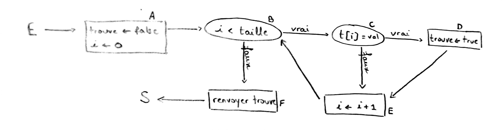

# TD : Tests

### Triangle

Graphe de flot de contrôle de la fonction `triangle` avec test exhaustif des conditions :


L'exécution sur l'entrée `j=3, k=5, l=3` donne le chemin suivant : `Entrée -> A -> B -> C -> D -> E -> F -> G -> I -> K -> M -> N -> O -> Q -> R -> Sortie`.

Un chemin infaisable est `Entrée -> A -> B -> C -> D -> E -> F -> G -> I -> K -> M -> O -> Q -> R -> Sortie`.

Un ensemble de chemins respectant le critère de couverture des arcs est :

* `Entrée -> A -> Sortie`
* `Entrée -> A -> B -> Sortie`
* `Entrée -> A -> B -> C -> Sortie`
* `Entrée -> A -> B -> C -> D -> E -> H -> Sortie`
* `Entrée -> A -> B -> C -> D -> E -> F -> H -> Sortie`
* `Entrée -> A -> B -> C -> D -> E -> F -> G -> H -> Sortie`
* `Entrée -> A -> B -> C -> D -> E -> F -> G -> I -> K -> M -> O -> P -> Sortie`
* `Entrée -> A -> B -> C -> D -> E -> F -> G -> I -> J -> K -> M -> O -> Q -> R -> Sortie`
* `Entrée -> A -> B -> C -> D -> E -> F -> G -> I -> J -> K -> L -> M -> N -> O -> Q -> S -> Sortie`

Seuls les 4 derniers sont nécessaires pour le critère de couverture des sommets.

Après exécutions symboliques, on trouve par exemple les entrées suivantes pour les tests :

* `j=-3, k=5, l=3`
* `j=3, k=-5, l=3`
* `j=3, k=5, l=-3`
* `j=1, k=1, l=3`
* `j=3, k=1, l=1`
* `j=1, k=3, l=1`
* `j=4, k=5, l=3`
* `j=3, k=3, l=5`
* `j=3, k=3, l=3`

### Somme dans un tableau

Voici les fonctions C et OCaml correspondant au graphe donné :

```c
int f(int t[], int taille_t) {
    int s = 0;
    for (int i = 0; i < taille_t; i += 1) {
        if (t[i] > 0) {
            s += t[i];
        }
    }
    return s;
}
```

```ocaml
let f t =
	let s = ref 0 in
	for i = 0 to Array.length t - 1 do
		if t.(i) > 0 then
			s := !s + t.(i)
	done ;
	!s
```

Voici un ensemble possible d'entrées de tests (boîte noire + blanche) :

* tableau vide
* tableau de taille quelconque avec aucun élément positif
* tableau de taille quelconque avec uniquement des éléments positifs
* tableau de taille quelconque avec plusieurs éléments positifs et d'autres négatifs
* tableau de taille quelconque rempli de 0

Jeu de tests OCaml correspondant :

```ocaml
let test_f () =
	assert(f [||] = 0) ;
	assert(f [|-7; -4; -2; -1|] = 0) ;
	assert(f [|1; 4; 3; 9|] = 17) ;
	assert(f [|1; -4; 3; -9; 2|] = 6) ;
	assert(f [|0; 0; 0; 0; 0; 0; 0; 0; 0; 0; 0; 0|] = 0)
```

### Recherche d'un élément



Ensemble de chemins respectant le critère de couverture des sommets :

* `Entrée -> A -> B -> C -> D -> E -> B -> F -> Sortie`

Un test sur l'entrée `int t[] = {1}, int val = 1` (et sortie `true`) suffit pour ce critère de couverture. Si on modifiait la première ligne par `bool trouve = true;`, cet unique test ne détecterait pas l'erreur.

Ensemble de chemins respectant le critère de couverture des arcs :

* `Entrée -> A -> B -> C -> D -> E -> B -> C -> E -> B -> F -> Sortie`

Un test sur l'entrée `int t[] = {1, 2}, int val = 1` (et sortie `true`) suffit pour ce critère de couverture. Si on modifiait la première ligne par `bool trouve = true;`, cet unique test ne détecterait pas non plus l'erreur.

Comme le disait Dijkstra, « Program testing can be used to show the presence of bugs, but never to show their absence. ». Un jeu de tests permet de réduire le risque d'erreurs subsistantes dans le programme, mais ne garantit rien (pour cela une preuve formelle de correction est nécessaire).

---

Par *Justine BENOUWT*

Sous licence [*CC BY-NC-SA*](https://creativecommons.org/licenses/by-nc-sa/4.0/)


