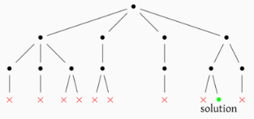
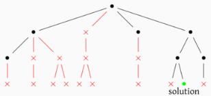

# Chapitre 10 : Exploration exhaustive

Principe des algorithmes basés sur l'exploration exhaustive des solutions potentielles.

## I. Recherche par force brute

### 1. Types de problèmes

Définition d'un problème de décision.

Rappels sur les problèmes de combinatoire et d'optimisation.

### 2. Principe d'une recherche par force brute

Algorithmes de recherche d'une solution, et de recherche de toutes les solutions d'un problème par force brute.

Manières de construire l'ensemble des solutions potentielles.

### 3. Complexité des algorithmes de recherche par force brute

La complexité inclut : la construction de l'ensemble des solutions potentielles, le parcours de cet ensemble, et le test déterminant s'il s'agit d'une solution.

Optimisation possible : ordonner les solutions potentielles (exemple : droite de balayage).

## II. Backtracking

### 1. Principe des algorithmes de type « retour sur trace »

Construction d'une solution potentielle petit à petit, en revenant en arrière si elle n'aboutit pas pour construire le reste des solutions potentielles.

Représentation sous forme d'arbre de cette construction progressive :

Algorithme générique pour une résolution par backtracking d'un problème.

### 2. Optimisations

Il existe plusieurs manières d'améliorer la complexité temporelle d'un algorithme de backtracking :

* Évaluation partielle et élagage de l'arbre :

    

* Redondance des constructions partielles de solutions et mémoïsation.

* Heuristique : définition et intérêt.

Impact de ces optimisations sur la complexité temporelle de l'algorithme.

---

Par *Justine BENOUWT*

Sous licence [*CC BY-NC-SA*](https://creativecommons.org/licenses/by-nc-sa/4.0/)

