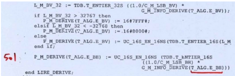

# Chapitre 8 : Représentation des nombres

## I. Représentation des entiers naturels

### 1. Base de numérotation

Réflexion sur la manière dont on peut représenter un nombre.

Définition d'une base de numérotation.

Bases courantes : binaire, décimal, octal, hexadécimal.

Écriture d'un nombre dans une base en C et en OCaml.

### 2. Écriture dans une base

Propriété sur l'écriture de 0.

Théorème sur l'existence et l'unicité de l'écriture en base `b > 2` d'un entier naturel non nul.

Vocabulaire : chiffre, bit, décomposition, poids fort et poids faible, gros-boutiste et petit-boutiste.

Propriété sur le nombre de chiffres de l'écriture en base `b` d'un entier.

Propriété sur le nombre d'entiers naturels différents qu'on peut écrire en base `b` avec un certain nombre de chiffres.

### 3. Algorithmes de changement de base

Déterminer les chiffres en base `b` d'un entier naturel : principe et algorithme.

Déterminer un entier naturel à partir des chiffres en base `b` avec l'algorithme de Hörner : principe et algorithme.

Convertir d'une base `b` à une base `B` avec `B` une puissance de `b`, et réciproquement.

## II. Représentation des entiers relatifs

On travaille avec la base `b = 2` et une taille fixée.

### 1. Opérations arithmétiques en base 2

Addition en base 2.

Multiplication en base 2.

Dépassement de capacité.

### 2. Opérations bit à bit

Conjonction, disjonction, ou exclusif, négation, décalage à gauche et à droite.

Opérateurs en C et en OCaml.

### 3. Complément à 2

Définition et exemples.

Propriété sur le nombre d'entiers relatifs représentables avec le complément à 2.

Addition d'entiers relatifs écrits avec le complément à 2.

Méthode simple pour trouver la représentation en complément à 2 d'un entier relatif.

## III. Représentation des réels

### 1. Écriture à virgule flottante

Notion de nombre dyadique.

Notation scientifique en base 2.

Méthodologie pour trouver l'écriture à virgule flottante d'un nombre dyadique.

### 2. Norme IEEE-754

Définition : signe, exposant, mantisse.

Les bits réservés à l'exposant ne seront ni tous nuls ni tous égaux à 1.

Le signe est stocké avec un 0 pour positif et un 1 pour négatif.

La partie entière de la mantisse (toujours égale à 1) n'est pas stockée.

L'exposant est stocké avec un décalage de $`+2^{e-1}-1`$ avec `e` le nombre de bits de réservés à l'exposant.

Formats simple précision et double précision de la norme IEEE-754.

### 3. Problèmes de précision

Problème lors de la représentation d'un nombre réel qui n'est pas dyadique.

Quelques codes qui contiennent des problèmes de précision des calculs flottants :

```c
#include <math.h>
#include <stdio.h>
int main() {
    double a = 0.1, b = 0.0;
    for (int i = 0; i < 10; i += 1) {
        b += a;
    }
    if (b != 1.0) {
        printf("erreur de précision, 10 fois 0.1 != 1.0 !\n");
    }

    double c = pow(2.0, 1000);
    if (c == c+1) {
        printf("erreur de précision, 2^1000+1 est arrondi à 2^1000\n");
    }

    double d = 1.0, e = pow(2.0, -53), f = 1.0;
    if (d+e-f != d-f+e) {
        printf("erreur de précision, d+e-f est évalué à 0 alors que d-f+e vaut e\n");
    }
}
```

Exemple de divergence entre le calcul théorique d'un algorithme et les valeurs calculées par un programme :

```c
#include <math.h>
#include <stdio.h>

void equation_second_degre(double a, double b, double c) {
    double delta = b*b - 4*a*c;
    if (delta < 0) {
        printf("Pas de solution !\n");
    }
    else if (delta > 0) {
        double r = sqrt(delta);
        double r1 = (-b - r) / (2*a);
        double r2 = (-b + r) / (2*a);
        printf("Il y a deux solutions : %.10f et %.10f\n", r1, r2);
    }
    else {
        printf("Il y a une solution : %.10f\n", -b/(2*a));
    }
}

int main() {
    // x² + 2^-600 x
    // devrait donner 0 et -2^(-600)
    // donne juste -0.00... car delta est arrondi à 0 lors de l'opération
    equation_second_degre(1, pow(2,-600), 0);
    // (x - 0.1)² = x² - 0.2x + 0.01
    // devrait donner juste 0.1
    // donne 2 solutions : 0.0999...7 et 0.100...13 car les coefficients du polynome ne sont pas représentables exactement
    equation_second_degre(1, -0.2, 0.01);
}
```

On ne peut comparer des flottants qu'avec une certaine précision.

Définitions : erreur relative, $`\varepsilon`$-machine, théorème sur l'approximation.

---

**Bonus :** Extrait du code source (en Ada) d'Ariane 5, qui a explosée un peu moins de 37 secondes après le décollage à cause d'un dépassement de capacité. On peut voir un certain nombre de conversions entier 32 bits vers entier 16 bits avec protection contre les dépassements de capacité, et, soulignée en rouge, une conversion flottant vers entier 16 bits non protégée :



---

Par *Justine BENOUWT*

Sous licence [*CC BY-NC-SA*](https://creativecommons.org/licenses/by-nc-sa/4.0/)


Source des images : pvs-studio
