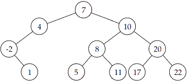
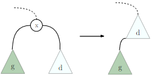

# TD : Arbres binaires de recherche et arbres bicolores

1. L'arbre suivant est-il un ABR ? {width=25%}

2. Justifiez que vérifier que chaque nœud a une étiquette plus grande que celle de son fils gauche et plus petite que celle de son fils droit ne suffit pas à déterminer si un arbre est un ABR.

3. Étant donné un ensemble totalement ordonné d'étiquettes, peut-on créer un arbre dont les nœuds contiennent chacune des étiquettes qui soit à la fois un tas et un ABR  ?

4. Supposons que l'on dispose d'un ABR $a$ ainsi que d'un élément $x$ de $a$, et que l'on définisse l'arbre $b$ ainsi :

    $`(1)\; b \leftarrow \text{copie de }a\;\;\;\;\; (2) \text{ supprimer }x \text{ de } b \;\;\;\;\;(3) \text{ insérer }x \text{ dans }b.\;\;\;\;\;`$ A-t-on en général $a = b$ ?

5. On se place dans le cas où on souhaite supprimer d'un ABR un nœud $x$ possédant deux sous-arbres non vides, $g$ et $d$. On propose la méthode suivante : on remonte $d$ ; et $g$ devient le fils gauche du minimum de $d$.

    {width=20%}

    Justifier la correction de la méthode ci-dessus, et expliquer pourquoi elle n’est pas satisfaisante.

6. * Donnez l'arbre binaire de recherche obtenu en insérant successivement les étiquettes suivantes dans un arbre initialement vide : `9,5,8,13,3,4,15,7,10,17,1,12`.
    * Déroulez dans cet arbre la recherche de l'étiquette 4 et celle de l'étiquette 11.
    * Donnez l'arbre obtenu en supprimant l'étiquette 5 par la méthode de remontée du maximum, puis celui obtenu en supprimant 5 par la méthode de fusion.
    * Donnez l'arbre obtenu en supprimant l'étiquette 9 de l'arbre initial par la méthode de remontée du minimum, puis celui obtenu en supprimant 9 par la méthode de la fusion.

7. Donnez un arbre binaire de recherche qui ne peut pas être colorié en ARN.

8. Parmi les arbres suivants, indiquez lesquels sont bien des arbres bicolores :

    

9. Déroulez l'insertion de l'étiquette 4 dans le(s) ARN correct(s) de la question précédente.

10. Déroulez la suppression de l'étiquette 14 dans le(s) ARN obtenu(s) à la question précédente.

11. Déroulez la suppression de l'étiquette 11 dans le(s) ARN correct(s) de la question 8.

12. Comparez la taille du chemin le plus long possible d'une racine à une feuille dans un ARN par rapport à celui le moins long possible.

13. Expliquez comment on pourrait implémenter une file de priorité à l’aide d’un arbre binaire de recherche. Quelles seraient les complexités des opérations principales ? Est-ce plus efficace qu'avec les tas ?

14. Est-ce une bonne idée, en terme de complexité des opérations principales, d'implémenter un tableau associatif dont les clés sont des chaînes de caractères par un arbre bicolore ? Quelle structure serait plus adaptée ?

15. Quel parcours faut-il effectuer pour obtenir les éléments d'un ABR dans l'ordre croissant ? Déduisez-en un algorithme en pseudo-code qui trie une liste en passant par un ABR.

16. À quel moment de l'algorithme interviennent les comparaisons lors du tri avec un ABR ? Calculez la complexité de votre algorithme dans le pire des cas, et celle dans le meilleur des cas. Quels listes donnent un pire cas ? un meilleur cas ? Comment pourrait-on améliorer ce tri ?

17. Déroulez à la main votre tri avec un ABR, puis votre tri avec un ARN, puis le tri par tas, sur : `7,1,12,14,2,5,3,10`.

---

Par *Justine BENOUWT*

Sous licence [*CC BY-NC-SA*](https://creativecommons.org/licenses/by-nc-sa/4.0/)

Source des images : *production personnelle*, N. Pecheux
