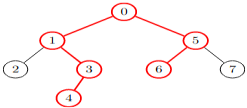
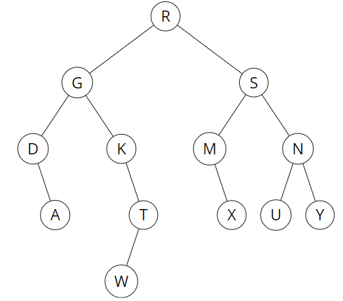
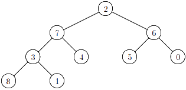
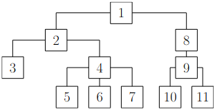
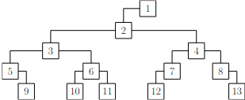
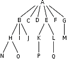

# TD : Arbres

Dans ce TD, on dit qu'un arbre binaire est « entier » si tous ses nœuds internes sont d'arité exactement 2 ; et « non entier » si ses nœuds internes peuvent être d'arité 1 ou 2. L'arbre vide est considéré comme non entier.

### I. Définitions inductives sur les arbres binaires

1. Donner une définition inductive de l'ensemble des arbres binaires entiers dont les étiquettes appartiennent à un ensemble $`\mathcal E`$. Même question pour les non entiers.

2. Définir par induction une fonction `taille` sur l'ensemble des arbres binaires non entiers, qui correspond au nombre de nœuds.

3. Définir par induction une fonction `nb_internes` sur l'ensemble des arbres binaires entiers, qui correspond au nombre de nœuds internes.

4. Définir par induction une fonction `nb_feuilles` sur l'ensemble des arbres binaires entiers, qui correspond au nombre de feuilles.

5. Définir par induction une fonction `prof_min` sur l'ensemble des arbres binaires entiers, qui correspond à la profondeur minimale d'une feuille.

6. Définir par induction une fonction `maximum` sur l’ensemble des arbres binaires entiers, qui correspond à la plus grande étiquette d’un nœud.

7. Définir par induction une fonction `in`, qui indique si $`e \in \mathcal E`$ est l'étiquette d'un nœud d'un arbre binaire non entier.

8. Définir par induction une fonction `nb_prof`, qui indique le nombre de nœuds de profondeur $`p \in\mathbb N`$ d’un arbre binaire non entier.

9. Donner une définition inductive du diamètre d'un arbre binaire non entier possédant au moins 2 nœuds. Le diamètre est la longueur maximum d'un chemin entre 2 nœuds de cet arbre.

    Par exemple, le diamètre de l'arbre suivant est 5 :{width=25%}

### II. Parcours d’arbres binaires

{width=30%}  {width=35%}

1. Pour les deux arbres binaires ci-dessus, donner l'ordre de traitement des nœuds pour un parcours en largeur, et pour un parcours en profondeur dans les ordres préfixe, infixe, et postfixe.
2. Est-ce que le parcours postfixe est l’inverse (en lisant de droite à gauche) du parcours préfixe ?
3. Dessiner tous les arbres binaires non entiers dont le parcours infixe est `1;2;3;4`.
4. Dessiner un arbre binaire à 5 nœuds dont les parcours en profondeur dans les ordres préfixe et infixe sont les mêmes. Quel type d’arbre obtient-on ?
5. Même question pour les ordres postfixe et infixe.
6. Existe-t-il des arbres binaires entiers ayant le même parcours en profondeur dans les ordres préfixe et postfixe ?

### III. Raisonner sur les arbres binaires

Pour chaque question suivante, il faut commencer par trouver la réponse (par exemple, en dessinant quelques arbres) puis montrer le résultat deviné en faisant une preuve par induction structurelle.

1.   Combien de nœuds un arbre binaire entier à $n$ arcs possède-t-il ?
2.   Combien de feuilles un arbre binaire entier à $n$ nœuds internes possède-t-il ?
3.   Combien de feuilles un arbre filiforme non vide possède-t-il ?
4.   Combien de feuilles un arbre parfait non vide de hauteur $h$ possède-t-il ?
6.   Combien de nœuds internes un arbre parfait non vide de hauteur $h$ possède-t-il ?

Pour chaque question suivante, il est demandé de montrer la propriété énoncée avec un raisonnement approprié.

6.   Toutes les feuilles d'un arbre parfait sont à la même profondeur.
7.   Il existe $`2^h`$ squelettes d'arbre filiformes de hauteur $`h\in\mathbb N`$.
8.   Il existe $`c_n`$ ($n$-ième nombre de Catalan) squelettes d'arbres binaires non entiers à $n$ nœuds.
9.   $`h+1\leqslant n \leqslant 2^{h+1}-1`$, avec $n$ le nombre de nœuds et $h$ la hauteur d’un arbre binaire non entier.
10.   Pour tout arbre binaire entier $a$, $`\displaystyle\sum_{f\in F(a)} 2^{-p_a(f)}=1`$, avec $`F(a)`$ l'ensemble des feuilles de $a$ et $`p_a(f)`$ la profondeur de la feuille $f$ dans $a$.

### IV. Arbres d’arité quelconque

1. Donner une définition inductive de l'ensemble des arbres d'arité quelconque *non vides* dont les étiquettes sont des entiers.
2. Définir par induction sur cet ensemble une fonction `hauteur`.
3. Définir par induction sur cet ensemble une fonction `produit` qui donne le produit des étiquettes des nœuds de l'arbre.
4. Définir par induction sur cet ensemble une fonction `arite` qui correspond à l'arité maximale des nœuds de l'arbre.
5. Appliquer la conversion en arbre binaire « LCRS » à l'arbre suivant :{width=22%}
6. Appliquer la conversion inverse à l'arbre suivant :{width=32%}
7. Pour l'arbre d'arité quelconque suivant, donner l'ordre de traitement des nœuds pour un parcours en largeur, et pour un parcours en profondeur dans les ordres existants : {width=16%}
8. Donner la représentation « LCRS » de l’arbre précédent.
9. Est-ce qu'un parcours en largeur d'un arbre d'arité quelconque donne le même ordre qu'un parcours en largeur de sa conversion LCRS ?
10. Donner l'ordre de traitement des nœuds pour un parcours en profondeur dans les ordres préfixe, infixe, et postfixe de la représentation LCRS de l'arbre précédent.
11. Y a-t-il des correspondances entre les parcours en profondeur de l'arbre d'arité quelconque et de sa représentation LCRS ?

### V. Reconstruction d'arbres binaires depuis leurs parcours

1. Quel est l’arbre binaire dont le parcours préfixe est `2;8;4;3;1;7;5;6` et l'infixe est
    `4;8;3;1;2;5;7;6` ?

2. On suppose que les étiquettes de l’arbre sont des entiers tous différents. Comment reconstruire l'arbre à partir de la liste des étiquettes de son parcours préfixe et de celle de son parcours infixe ? Proposer un algorithme.

3. Comment savoir si deux listes correspondent aux parcours préfixe et infixe d’un même arbre binaire ?

4. Est-il possible de reconstruire de façon unique un arbre binaire à partir de ses parcours préfixe et postfixe ?

5. On cherche maintenant à reconstruire un arbre binaire entier à partir de l'ordre de son parcours postfixe. On propose l'algorithme illustré ci-dessous :

    {width=45%}

    Terminer la reconstruction. Vérifier qu'un parcours postifxe de l'arbre reconstitué donne bien la liste de départ.

6. Proposer un algorithme qui prend en entrée une liste d'étiquettes de nœuds, accompagnées d'un booléen indiquant s'il s'agit d'une feuille ou non, et construit l'arbre binaire entier dont le parcours postfixe correspond à cette liste.

7. Avec une idée similaire, proposer un algorithme pour reconstruire un arbre entier depuis son parcours préfixe.

8. Peut-on écrire un algorithme similaire pour un parcours infixe ? en largeur ? Si oui l'écrire, sinon donner un contre-exemple.

### Pour aller plus loin

1.   Définir les types nécessaires à la manipulation des arbres binaires entiers et non entiers en C et/ou en OCaml, et écrire des fonctions récursives implémentant les fonctions inductives des questions 2 à 9 de la partie I.
2.   Implémenter les arbres d’arité quelconque en C et/ou en OCaml, et écrire des fonctions récursives implémentant les fonctions inductives des questions 2 à 4 de la partie IV.
3.   Implémenter en C et/ou en OCaml la sérialisation et désérialisation d’un arbre binaire entier, basée sur l’algorithme des questions 5 et 6 de la partie V.

---

Par *Justine BENOUWT*

Sous licence [*CC BY-NC-SA*](https://creativecommons.org/licenses/by-nc-sa/4.0/)

Source des images : *production personnelle, J.B. Bianquis, Q. Fortier*
