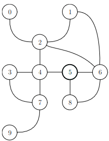
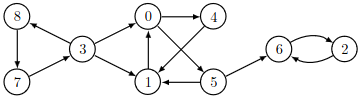
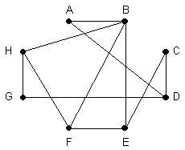

# TD : Parcours de graphes

On considère dans ce TD les deux graphes suivants :

 {width=20%}

{width=35%}

### I. Dérouler un parcours à la main

1. Donner les matrices d'adjacence et listes d'adjacence des deux graphes.
2. Dessiner les évolutions de la file et de la structure de sommets « `vus` » pour un parcours en largeur du graphe non orienté à partir du sommet 5. En déduire l'ordre d'exploration des sommets.
3. Dessiner les évolutions de la pile d'appels récursifs et de la structure de sommets « `vus` » pour un parcours en profondeur du graphe non orienté à partir du sommet 5. En déduire l'ordre d'exploration des sommets.
4. En remplaçant la file par une pile dans le parcours en largeur, dessiner les évolutions de la pile et de la structure de sommets « `vus` » pour un parcours du graphe non orienté à partir du sommet 5. En déduire l'ordre d'exploration des sommets. Justifier donc qu'il ne s'agit pas d'un parcours en profondeur.
5. Donner l'ordre de traitement des sommets pour un parcours en profondeur du graphe orienté depuis le sommet 0. Même question pour un parcours en largeur. Dessiner les arborescences obtenues pour ces deux parcours.
6. Existe-t-il un sommet de départ pour lequel un parcours du graphe orienté va permettre d'explorer l'intégralité des sommets ? L'ordre du parcours est-il alors important ?
7. Le graphe orienté possède-t-il un ordre topologique ? Comment pourrait-on s'en apercevoir lors du parcours en profondeur du graphe ?

### II. Accessibilité dans un graphe

8. Reprendre les matrices d'adjacence des deux graphes et calculer les premières puissances de ces matrices.
9. Si $M$ est la matrice d'adjacence d'un graphe, comment interpréter $`M^2 ? M^3 ? M^p ?`$
10. En déduire un algorithme déterminant si un sommet $y$ est accessible depuis un sommet $x$. Quelle est sa complexité ?
11. Proposer une autre manière de déterminer si un sommet $y$ est accessible depuis un sommet $x$ en adaptant l'un des deux parcours de graphe. L'ordre du parcours est-il important ? Comparer la complexité de cette méthode avec celle obtenue précédemment.
12. Déduire des questions précédentes une méthode *efficace* pour déterminer si un graphe non orienté est connexe. Complexité ?

### III. Résoudre une situation concrète à l'aide d'un graphe

On a les critères suivants sur le programme d'informatique de MP2I :

* les arbres doivent être étudiés avant les graphes, l'algorithmique du texte, la logique, les structures construites à l'aide d'arbre ;
* la récursivité doit être étudiée avant les structures linéaires, les arbres, les graphes, la décomposition d'un problème, l'exploration exhaustive, la logique ;
* les bases de données et la représentation des nombres peuvent être étudiées n'importe quand ;
* les bases de programmation doivent être étudiées avant la récursivité, la validation de programmes, la décomposition d'un problème, l'exploration exhaustive, l'analyse d'algorithmes ;
* les structures linéaires doivent être étudiées avant les arbres, les graphes ;
* l'analyse d'algorithmes doit être étudiée avant la décomposition d'un problème, l'exploration exhaustive ;
* les graphes doivent être étudiés avant la recherche de plus court chemin.

13. Dessiner le graphe orienté correspondant. Proposer un tri topologique de ce graphe. En déduire alors une numérotation des chapitres possible pour effectuer le programme de MP2I. Adapter l'algorithme récursif (en pseudo-code) du parcours en profondeur pour effectuer un tri topologique d'un graphe orienté acyclique.

Un groupe de 8 personnes se retrouve pour dîner. La table du dîner est ronde. Le graphe ci-dessous précise les « incompatibilités d’humeur » entre les personnes de ce groupe (une arête reliant deux personnes indique que celles-ci ne peuvent pas s’asseoir côte à côte).

{width=20%}

14. Dessiner le complémentaire du graphe. Comment trouver un plan de table pour ce groupe à partir de ce dernier ? Quel condition le graphe complémentaire doit-il respecter pour qu'un tel plan de table soit possible ?

Sept élèves, désignés par A,B,C,D,E,F et G se sont rendus à la bibliothèque aujourd’hui. L'élève A y a rencontré D,E ; B a rencontré D,E,F,G ; C a rencontré E,G ; D a rencontré A,B,E ; E a rencontré A,B,C,D,F,G ; F a rencontré B,E,G ; G a rencontré B,C,E,F.

15. Dessiner le graphe correspondant à cette situation. De combien de places assises doit disposer la bibliothèque pour que chacun ait pu travailler correctement au cours de cette journée ? À quoi ce nombre correspond-il pour le graphe ?

On considère la figure suivante : {width=3%}

16. Peut-on dessiner cette figure sans lever le crayon et sans repasser sur un trait ? Par où commencer le dessin ? En déduire une condition nécessaire et suffisante pour qu'un graphe possède un chemin eulérien.
17. Peut-on également dessiner cette figure sans lever le crayon, sans repasser sur un trait, et en revenant sur notre point de départ ? Montrer que tous les sommets d'un graphe eulérien sont de degrés pairs.

---

Par *Justine BENOUWT*

Sous licence [*CC BY-NC-SA*](https://creativecommons.org/licenses/by-nc-sa/4.0/)

