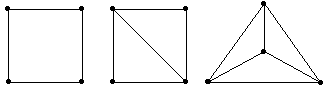

# TD : Raisonner sur les graphes

### Graphes non orientés

{width=20%}

1. Donner le degré de chacun des sommets du graphe ci-dessus. Donner son nombre chromatique.
2. Est-il connexe ? Combien de composantes connexes possède-t-il ? Est-il cyclique ? Combien de cycles possède-t-il ?
3. Certaines composantes connexes du graphe ci-dessus sont-elles isomorphes ?
4. Donner le sous-graphe du graphe ci-dessus induit par $`\{1,2,3,9,10,11\}`$. Donner un sous-graphe ayant ce même ensemble de sommets mais qui n'est pas induit.

On cherche maintenant à montrer quelques propriétés des graphes non orientés.

5. Montrer qu’un graphe a forcément un nombre pair de sommets de degré impair.
8. Montrer que dans tout graphe avec au moins 2 sommets, il existe 2 sommets de même degré.
9. Soit $`k\in \mathbb N^*`$, quel est le nombre minimum de composantes connexes d’un graphe ayant $`|S|-k`$​​ arêtes? Le montrer.
10. Montrer que si $`G = (S, A)`$ est un graphe alors $`G \text{ ou } \bar G = (S, \bar A)`$​ est connexe. Les deux peuvent-ils être connexes ?

### Graphes orientés

{width=15%}

9. Donner les degrés entrant et sortant de chacun des sommets du graphe ci-dessus.
13. Est-il faiblement connexe ? fortement connexe ? Combien de composantes fortement connexes possède-t-il ?
14. Certaines composantes fortement connexes du graphe ci-dessus sont-elles isomorphes ?

Notons $C$ l’ensemble des composantes fortement connexes d'un graphe orienté $G$, et considérons $`G^{CFC} = (C, A)`$ avec $A$ l’ensemble de couples de composantes fortement connexes distinctes vérifiant : $`(C_1, C_2) \in A`$ si et seulement s’il existe un arc entre un sommet de $`C_1`$ et un sommet de $`C_2`$ dans $G$​.

12. Dessiner $`G^{CFC}`$ pour le graphe ci-dessus.
16. Montrer que pour tout graphe $G$, le graphe $`G^{CFC}`$​ est acyclique.
17. Montrer que les composantes fortement connexes d’un graphe orienté sans circuit sont réduites à des singletons.

### Arbres dans la théorie des graphes

{width=15%}

15. Combien d'arbres couvrants différents chacun des trois graphes ci-dessus possèdent-ils ?
16. Quel est le nombre d’arêtes d’une forêt à `n` sommets, composée de `k` arbres ? Le montrer.

Soit $G$ un graphe à $n$ sommets. On souhaite montrer que les 3 propriétés suivantes sont équivalentes : *(1)* $G$ est un arbre. *(2)* $G$ est acyclique et a $n-1$ arêtes. *(3)* $G$ est connexe et a $n-1$ arêtes.

17. Combien d'arêtes un graphe connexe possède-t-il au minimum ? Combien d'arêtes un graphe acyclique possède-t-il au maximum ? En déduire *(1)* $`\Rightarrow`$ *(2),(3)*.
21. Montrer avec un raisonnement par l'absurde (i.e. en supposant l'existence d'un cycle) que *(3)* $`\Rightarrow`$ *(1)*.
22. Soit $G$ un graphe acyclique à $n-1$ arêtes. Notons $r$ le nombre de composantes connexes de $G$, et $`n_1, ..., n_r`$ le nombre de sommets de chaque composante. Combien d'arêtes possède chaque composante ? Montrer que $r = 1$, et en déduire que *(2)* $`\Rightarrow`$ *(1)*.

---

Par *Justine BENOUWT*

Sous licence [*CC BY-NC-SA*](https://creativecommons.org/licenses/by-nc-sa/4.0/)

