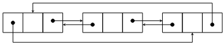

# TD : Listes implémentées par maillons chaînés

## Exercice 1 : listes chaînées en mémoire

1. On considère deux listes `u = [1; 2; 3]` et `v = [6; 7; 8]`. Schématiser ces deux listes.

2. Faire les schémas mémoire correspondant à :

    ```ocaml
    (* 1 *) let w = 0 :: u     (* 2 *) let a = w @ v     (* 3 *) let b = u @ a     (* 4 *) let c = [a; b]
    ```

3. Donner alors le nombre exact de maillons (non vides) présents en mémoire pour l'ensemble de ces variables.

4. Quelle est la complexité temporelle et spatiale des deux opérateurs `::` et `@ ` ? Lequel faut-il privilégier ?

## Exercice 2 : listes doublement chaînées circulaires mutables non vides

On souhaite implémenter en OCaml des listes doublement chaînées circulaires mutables non vides :

{width=30%}

Nous allons utiliser le type OCaml suivant :

```ocaml
type 'a l2c = {mutable elem : 'a; mutable prev : 'a l2c; mutable next : 'a l2c}
```

Pour créer une nouvelle `l2c` à 1 élément, il faut que celui-ci soit son propre successeur et prédécesseur, ce que permet aussi le mot-clef `rec` (on appelle cela une variable récursive) :

```ocaml
let rec l2c_1_elem = {elem = 0; prev = l2c_1_elem; next = l2c_1_elem}
```

1. Expliquer en quoi le type `l2c` permet bien de représenter une liste doublement chaînée circulaire mutable non vide.
2. Représenter la liste `l2c_1_elem` avec un schéma.
3. Écrire une fonction `create : 'a -> 'a l2c` qui prend en paramètre une valeur et renvoie une liste doublement chaînée circulaire dont le seul maillon contient cette valeur.
4. Faire un schéma représentant l'insertion d'un nouveau maillon dans une liste, à la suite d'un maillon `m` donné de cette liste. Vérifier que cela marche également si la liste ne possède qu'un seul maillon. Quelle est la complexité temporelle de cette opération ? spatiale ?
5. Écrire une fonction `add : 'a l2c -> 'a -> unit` telle que `add m v` ajoute un maillon contenant la valeur `v` à la suite de `m`. Pourquoi le type de retour est-il `unit` ?
6. Schématiser puis écrire une fonction `remove : 'a l2c -> unit` qui implémente la suppression d'un élément (celui donné en paramètre) d'une liste doublement chaînée circulaire, avec une complexité en $`\mathcal O(1)`$.
7. Que se passe-t-il si on appelle `remove m` alors que `m` est le seul maillon de la liste ?
8. Pour calculer la taille d'une `l2c`, il faut parcourir la liste à partir d'un certain maillon et s'arrêter quand on retombe sur ce même maillon. Pour cela, il faut utiliser un test d'égalité *physique* (deux objets sont stockés au même endroit en mémoire) avec l'opérateur `==` et non d'égalité *des valeurs* (le `=` habituel). Implémenter deux fonctions `length` et `mem` pour respectivement calculer la taille d'une `l2c` et chercher si un élément appartient à une `l2c`. Complexités ?
9. Schématiser puis écrire une fonction `fusion` pour réaliser l’union de deux `l2c`. Complexité ? Comment aurait-on pu utiliser `fusion` pour implémenter `add` ?
10. En quoi le type `'a l2c option` permet-il de représenter des listes doublement chaînées circulaires mutables (vides ou non) ?
11. Proposer une variante de cette implémentation pour des listes doublement chaînées circulaires immuables. À l'aide de schémas, discuter de l'impact sur les complexités spatiales et temporelles des fonctions précédentes.
12. Si vous avez terminé, vous pouvez schématiser et/ou implémenter les autres fonctions complémentaires sur les listes avec le type `l2c` (par exemple, accéder au maillon d'indice `i` à partir d'un maillon donné ; y insérer un élément, y supprimer un élément....).

---

Par *Justine BENOUWT*

Sous licence [*CC BY-NC-SA*](https://creativecommons.org/licenses/by-nc-sa/4.0/)


