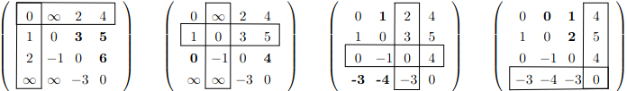
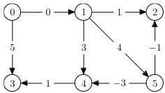
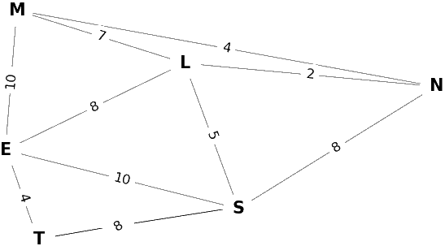
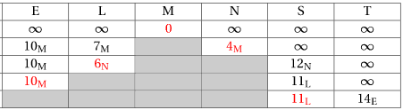
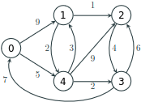
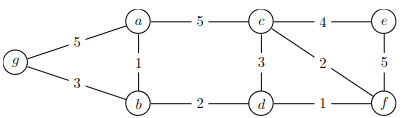

# TD : Plus court chemin dans un graphe

## I. Plus court chemin dans un graphe non pondéré

1. Rappelez la définition de la notion de *distance* dans un graphe non pondéré.
2. Rappelez l'algorithme (en pseudo-code) du parcours permettant d'explorer les sommets d'un graphe non pondéré par distance croissante par rapport au sommet de départ. On renverra un tableau associatif `distances` tel que `distances[s]` donne la distance du sommet de départ au sommet `s`.
3. Modifiez l’algorithme pour renvoyez également un tableau associatif `predecesseurs` tel que  `predecesseurs[s]` indique le prédécesseur de `s` dans le plus court chemin allant du sommet de départ à `s`.
4. Proposez un algorithme qui prend en paramètre un tableau associatif `predecesseurs` tel que décrit ci-dessus, un sommet de départ et un d'arrivée, et renvoie la liste des sommets du plus court chemin allant du départ à l'arrivée.

## II. Plus court chemin dans un graphe pondéré

5.   Rappelez la définition de la notion de *distance* dans un graphe pondéré.

6.   Dessinez le graphe pondéré dont la matrice est {width=14%}.

7.   Voici la succession de matrices obtenues lors de l'application de Floyd-Warshall sur le graphe précédent : {width=54%}

     Expliquez d'où viennent les valeurs mises à jour (celles en gras), et vérifiez à l'aide de votre dessin du graphe que les résultats finaux sont cohérents. Calculez les matrices des prédécesseurs correspondantes.

8.   Appliquez l'algorithme de Floyd-Warshall au graphe suivant :

     {width=24%}

9.   Donnez la liste d'adjacence du graphe suivant :

     {width=38%}

10.   On applique l'algorithme de Dijkstra au graphe précédent avec M comme sommet de départ. Expliquez les valeurs obtenues, donnez la dernière ligne du tableau, et déduisez-en le plus court chemin de M à S. {width=45%}

11.   Appliquez l'algorithme de Dijkstra au graphe suivant, en prenant 0 comme départ :

      {width=20%}

12.   Appliquez au graphe suivant l'algorithme de Dijkstra depuis le sommet $a$, puis l'algorithme de Floyd-Warshall : {width=40%}

13.   Trouvez un exemple de graphe pour lequel Dijkstra ne fonctionne pas, et un pour lequel Floyd-Warshall ne fonctionne pas.

14.   Change-t-on les plus courts chemins si on additionne les poids de toutes les arêtes d’un graphe par une constante? et si on les multiplie par une constante ?

15.   Comment pourrait-on déterminer le poids minimum d’un cycle dans un graphe orienté ?

16.   Quelles sont les complexités des deux algorithmes ?

## III. Implémentation

Vous devez savoir implémenter ces deux algorithmes aussi bien en C qu'en OCaml. On se contentera ici de graphes dont les sommets sont les entiers naturels consécutifs 0, 1, …, |S|-1 et les poids sont entiers.

17.   Définissez en OCaml les types nécessaires pour l’implémentation de la matrice d’adjacence d’un  graphe pondéré.
18.   Implémentez en OCaml l'algorithme de Floyd-Warshall. La fonction doit prendre en paramètre une matrice d’adjacence et renvoyer en sortie la matrice des distances obtenues.
19.   Modifiez la fonction précédente pour renvoyer également la matrice des prédécesseurs.
20.   Définissez en C les types nécessaires pour l’implémentation de la liste d’adjacence d’un  graphe pondéré.
21.   Implémentez efficacement une file de priorité en C. Quelle structure utiliser ?
22.   Implémentez alors en C l'algorithme de Dijkstra. La fonction doit prendre en paramètre une liste d’adjacence et un sommet de départ, et renvoyer en sortie un tableau `distances` tel que `distances[s]` donne la distance du sommet de départ au sommet `s`.
23.   Modifiez la fonction précédente pour calculer également le tableau des prédécesseurs.
24.   Reprenez toutes les questions précédentes dans l’autre langage !
25.   **Pour aller plus loin.** Implémentez en C et/ou en OCaml deux algorithmes (pour Dijkstra et Floyd-Warshall respectivement) qui prennent en paramètre la matrice / le tableau des prédécesseurs, le sommet de départ et le sommet d’arrivée, et renvoie le plus court chemin les reliant (stocké dans une liste par exemple).

---

Par *Justine BENOUWT*

Sous licence [*CC BY-NC-SA*](https://creativecommons.org/licenses/by-nc-sa/4.0/)

Source des images : *production personnelle*, Q. Fortier
