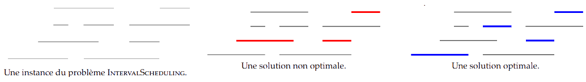

# TD : Sélection d'activité

Nous allons nous intéresser à un problème d'ordonnancement, avec résolution gloutonne et par programmation dynamique. La classe générale des problèmes d’ordonnancement est celle où l’on dispose d’un certains nombres de ressources (processeurs, employés, salles de cours, ...) et où l’on a un certain nombre de tâches à accomplir. Typiquement, ces tâches ont une durée spécifiée, éventuellement un horaire de début et de fin, ou peut-être une deadline, et surtout elles monopolisent une ressource pendant qu’on les traite. On souhaite trouver une répartition optimale des tâches sur les ressources (pour une certaine définition de « optimale »).

On considère ici un problème d'ordonnancement classique, *la sélection d'activité* (*interval scheduling*) :

* Entrée : un ensemble non vide d'intervalles non vides $`\mathcal R = \{]a_i,b_i[, 0 \leqslant i < n\}`$. On parlera de requête numéro $`i`$ pour l'intervalle $`]a_i,b_i[`$, et on notera $`d(i) = a_i`$ et $`f(i) = b_i`$.
* Sortie : le plus grand sous-ensemble de $`\mathcal R`$ (au sens de la cardinalité) constitué d'intervalles deux-à-deux disjoints. On parlera de requêtes compatibles.

Par exemple :

{width=70%}

Le principe de l'algorithme glouton pour résoudre ce problème : à chaque étape, on choisit une requête compatible avec celles déjà choisies suivant une certaine règle, et on élimine les requêtes devenues incompatibles. Plusieurs choix de règles sont envisageables : (1) prendre la requête commençant le plus tôt ; (2) prendre la requête la plus courte (minimisant $`b_i-a_i`$) ; (3) prendre la requête ayant le moins de conflit avec des requêtes non encore choisies ; (4) prendre la requête se terminant en premier.

1. Montrer que les trois premières règles ne fournissent pas toujours une solution optimale.

Soient $`\mathcal G = (i_1, ..., i_g)`$ les requêtes choisies par l'algorithme glouton avec la règle (4), et $`\mathcal O = (j_1,...,j_o)`$ un ensemble de requêtes compatibles optimal, tous deux classés par ordre croissant des temps de fin des requêtes, avec $`o \geqslant g`$.

2. Montrer par récurrence sur $`r \leqslant g`$ la propriété suivante : $`f(i_r) \leqslant f(j_r)`$.
3. Montrer alors avec un raisonnement par l'absurde que $`o = g`$.
4. Conclure sur l'optimalité de l'algorithme glouton avec la règle (4).

On travaille en C avec le type suivant pour représenter une requête :

```c
struct requete_s { int numero; int debut; int fin; };
typedef struct requete_s requete;
```

5. Écrire une fonction `void tri(int n, requete R[n])` qui prend en paramètre un tableau `R` contenant `n` requêtes et le trie dans l'ordre croissant des temps de fin. On utilisera le tri rapide avec partition de Lomuto.
6. Implémenter l'algorithme glouton suivant la règle (4) en C. On renverra un tableau de booléens `res` pour lequel `res[i]` ($`0 \leqslant i < n`$) vaut `true` si et seulement si la requête de numéro `i` est sélectionnée par l'algorithme.
7. Déterminer la complexité de cet algorithme.

S'agissant d'un problème d'optimisation, une résolution par programmation dynamique est bien entendu possible également. On note $`S_{\mathcal R}`$ le nombre maximal de requêtes compatibles dans l'ensemble de requêtes $`\mathcal R`$.

8. Donner une relation de récurrence pour $`S_{\mathcal R}`$.
9. Choisir une structure de données adaptée pour la mémoïsation.
10. Créer en OCaml un type `requete` pour représenter une requête.
11. Écrire en OCaml une fonction qui prend en paramètre un ensemble de requêtes $`\mathcal R`$ (de type `requete list`) et calcule $`S_{\mathcal R}`$, en respectant les principes de la programmation dynamique.
12. Comment retrouver le sous-ensemble de requêtes compatibles correspondant à la valeur de $`S_{\mathcal R}`$ calculée ?
13. Quelle méthode de résolution (glouton ou programmation dynamique) faut-il privilégier ?


---

Par *Justine BENOUWT*

Sous licence [*CC BY-NC-SA*](https://creativecommons.org/licenses/by-nc-sa/4.0/)


Source des images : J.B. Bianquis

