# TP : ABR et ARN

***Ce TP est à faire en C.***

Nous allons travailler ici sur quelques arbres binaires particuliers : les arbres binaires de recherche (ABR) ; et leur version équilibrée, les arbres bicolores (ARN).

## I. Arbres binaires de recherche

Un **arbre binaire de recherche** (ABR) est un arbre binaire non strict qui respecte la propriété suivante : pour tout nœud de l'arbre, l'étiquette du nœud est supérieure à toutes les étiquettes des nœuds de son sous-arbre gauche et inférieure à toutes celles de son sous-arbre droit.

L'ensemble des étiquettes de l'arbre doit donc être muni d'une relation d'ordre totale.

>   1.   Donnez une définition inductive des ABR.
>   2.   Dessinez tous les arbres binaires de recherche possibles dont l'ensemble des étiquettes est {7, -2, 4, 0}.

Dans cette partie, on se servira de cet ABR comme exemple :

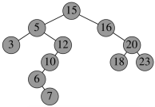

### 1. Implémentation d'un ABR

Pour simplifier, on supposera dans ce TP que toutes les étiquettes des arbres sont des entiers deux à deux distincts.

> 3.   Créez un type structuré pour représenter un nœud d'un arbre. On supposera qu'un nœud connaît son étiquette, son fils droit, son fils gauche et *son père*.
> 4.   Un arbre est un pointeur vers le nœud racine. Définissez un alias `abr`.
> 5.   Écrivez une fonction `abr construit(int e, abr g, abr d)` qui renvoie un arbre dont la racine a pour étiquette `e`, fils gauche `g` et fils droit `d`.
> 6.   Écrivez une fonction `void detruit(abr a)` pour libérer la mémoire associée au nœud `a` et ses sous-arbres.

Voici pour tester l'implémentation de l'ABR donné en exemple plus haut :

```c
int main() {
    abr trois = construit(3, NULL, NULL);
    abr sept = construit(7, NULL, NULL);
    abr six = construit(6, NULL, sept);
    abr dix = construit(10, six, NULL);
    abr douze = construit(12, dix, NULL);
    abr cinq = construit(5, trois, douze);
    abr dix_huit = construit(18, NULL, NULL);
    abr vingt_trois = construit(23, NULL, NULL);
    abr vingt = construit(20, dix_huit, vingt_trois);
    abr seize = construit(16, NULL, vingt);
    abr quinze = construit(15, cinq, seize);
    
    detruit(quinze);
}
```

>   7.   Comment faut-il parcourir un ABR pour obtenir les étiquettes dans l’ordre croissant ?
>   8.   Déduisez-en une fonction `void affiche_croissant(abr)`.

### 2. Recherche dans un ABR

Pour effectuer une recherche dans un ABR, il suffit de comparer l'étiquette recherchée à celle de la racine de l’arbre puis :

* si c'est égal, c’est terminé ;
* sinon, continuer la recherche dans le sous-arbre dans lequel l’étiquette peut se trouver.

> 9.   Déroulez cet algorithme pour rechercher 6 dans l'arbre donné en exemple plus haut. Même question pour rechercher 19.
> 10.   Implémentez une fonction récursive `bool recherche_abr(abr, int)`.
> 11.   Implémentez une version impérative `bool recherche_abr_imperatif(abr, int)` de cet algorithme.
> 12.   Justifiez que la recherche d'une étiquette est en $`\mathcal O(h)`$, avec $`h`$ la hauteur de l'ABR.

Les arbres binaires de recherche peuvent être utilisés pour implémenter des tableaux associatifs.

> 13.   Donnez un encadrement pour la hauteur $`h`$ d'un ABR (non vide) à $`n`$​ nœuds.
> 14.   Comparez alors l'efficacité du test de présence d'une clé dans un tableau associatif implémenté par une table de hachage / par un ABR.

On peut facilement retrouver le minimum et le maximum dans un ABR.

> 15.   Où se trouve le maximum dans un ABR ? le minimum ? Écrivez alors efficacement deux fonctions `int minimum_abr(abr)` et `int maximum_abr(abr)`. Complexités ?

### 3. Insertion dans un ABR

L'insertion dans un ABR se fait toujours aux feuilles. On recherche l'endroit où insérer la nouvelle étiquette de la même manière que pour la recherche décrite ci-dessus.

> 16.   Expliquez où serait inséré l'étiquette 13 dans l'arbre donné en exemple ci-dessus.
>
> 15.   Proposez un ordre d'insertion des étiquettes qui permettrait, à partir de l'arbre vide, de recréer l'arbre donné en exemple plus haut.
>
> 16.   Complétez la fonction d'insertion suivante. Si l'étiquette est déjà présente dans l'arbre, il ne doit pas être modifié.
>
>       ```c
>       // Insertion par effet de bord de l'étiquette e dans l'ABR (*a)
>       void insertion_abr(abr* a, int e) {
>                               
>           // si l'arbre était vide, il devient une feuille d'étiquette e
>           if (*a == NULL) {
>               *a = construit(/* A COMPLETER */);
>           }
>                               
>           // si l'insertion de e doit se faire à droite
>           else if ((*a)->etiq < e) {
>               // si (*a) n'a pas de sous-arbre droit, on insère ici
>               if ((*a)->droit == NULL) {
>                   /* A COMPLETER */
>               }
>               // sinon on insère récursivement dans le sous-arbre droit
>               else {
>                   insertion_abr(/* A COMPLETER */);
>               }
>           }
>                               
>           // si l'insertion de e doit se faire à gauche
>           /* A COMPLETER */
>       ```

### 4. Suppression dans un ABR

Une manière de supprimer un nœud d'un ABR est de procéder par *fusion*. On descend dans l'arbre comme pour la recherche, jusqu'à trouver le nœud `x` à supprimer. En supprimant ce nœud `x`, ses deux sous-arbres `x1` et `x2` se retrouvent alors détachés. On les fusionne comme décrit par le schéma ci-contre, puis on rattache le tout au père de `x` :

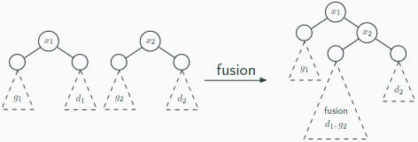

> 19. Justifiez que cette méthode produit bien un ABR.
> 20. Dessinez l'arbre produit en supprimant le nœud d'étiquette 15 de l'arbre donné en exemple plus haut.
> 21. Donnez à l'aide d'un schéma une méthode de fusion similaire qui placerait $`x_2`$​ comme racine.
> 22. Écrivez une fonction `abr fusion(abr x1, abr x2)` qui prend en paramètre deux arbres binaires de recherche et les fusionne comme décrit par le schéma ci-dessus. Aucun nouveau nœud ne doit être alloué en mémoire.
> 23. Écrivez une fonction `abr noeud_a_supprimer(abr a, int e)` qui recherche et renvoie le sous-arbre dont la racine contient l’étiquette `e`. S'il n'y en a aucun, on renverra `NULL`.
> 24. Écrivez une fonction `void suppression_abr_fusion(abr*, int)` qui supprime le nœud dont l'étiquette est passée en paramètre. Il faut trouver le nœud `x` contenant l’étiquette à supprimer, fusionner les fils de `x`, rattacher la fusion au père de `x` (du bon côté), et libérer `x`. Attention à bien gérer le cas particulier où le nœud supprimé est la racine de l’arbre.

## II. Arbres bicolores

Pour remédier aux problèmes d'efficacité des ABR lorsqu'ils ne sont pas équilibrés, nous allons voir dans cette partie suivante une autre structure : les arbres bicolores, aussi appelés arbres rouge-noir (ARN).

Voici les propriétés d'un arbre bicolore :

* c’est un ABR ;
* la racine est noire ;
* un nœud rouge ne peut pas avoir de fils rouge ;
* tous les chemins de la racine à arbre vide contiennent le même nombre de nœuds noirs.

Voici un exemple d'arbre bicolore (non étiqueté) :

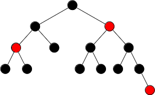

> 1.   Proposez un étiquetage de cet arbre avec les entiers naturels entre 0 et 13 qui respecte les propriétés des ABR.

Les arbres bicolores sont considérés comme *équilibrés* : le chemin le plus long possible d'une racine à une feuille (la hauteur de l'arbre) ne peut être que deux fois plus long que le plus petit possible. Dans le cas le plus déséquilibré, le plus court des chemins ne comporte que des nœuds noirs, et le plus long alterne les nœuds rouges et noirs.

>   2.   Est-il possible de colorer l'ABR suivant ?
>
>        

### 1. Implémentation des ARN

>   3.   Créez un type énuméré pour représenter les deux couleurs, et un alias `couleur` vers ce type.
>
>   2.   Créez un type structuré pour représenter un nœud d'un arbre bicolore. On supposera qu'un nœud connaît son étiquette, son fils droit, son fils gauche, et sa couleur.
>
>   3.   Un arbre bicolore est un pointeur vers son nœud racine. Définissez un alias `arn`. 
>
>   4.   Écrire deux fonctions `arn construit_arn(int e, couleur c, arn g, arn d)` et `void detruit_arn(arn a)`.
>
>   5.   Colorez l'ABR suivant afin qu'il respecte les propriétés des arbres bicolores :
>
>        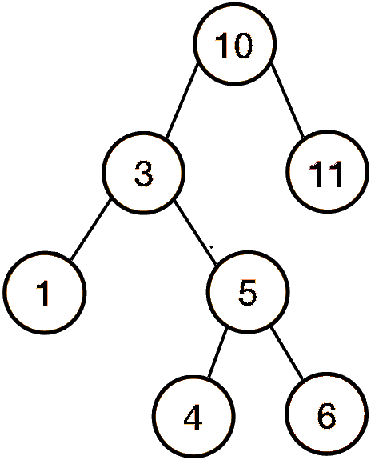{width=20%}
>
>   6.   Implémentez alors cet arbre bicolore en C en utilisant la fonction `construit_arn`.

### 2. Insertion dans un ARN

Lors de l'insertion ou de la suppression d'une étiquette, il faut s'assurer de conserver l'équilibre de l'arbre. Pour cela, le ré-équilibrage est basé sur des *rotations* :

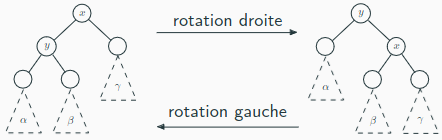

> 9.   Justifiez qu'une rotation conserve bien les propriétés d'un ABR.
> 10.   Écrivez une fonction `arn rotation_droite(arn x)` qui prend en paramètre un arbre tel que schématisé ci-dessus et lui applique une rotation droite. Aucun nouveau nœud ne doit être alloué en mémoire.
> 11.   Écrivez de même une fonction `arn rotation_gauche(arn y)`.

Pour l'insertion dans un ARN, on insère aux feuilles comme dans les ABR, et la feuille ajoutée est rouge. Mais si le père de cette feuille était rouge, on se retrouve alors avec un problème car l'arbre ne respecte plus les propriétés d'un arbre bicolore. Voici les 4 cas problématiques possibles et comment les régler :

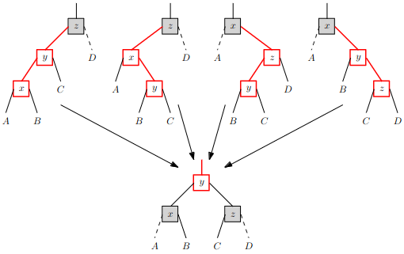

> 12. Écrivez une fonction `arn corrige_rouge(arn a)` qui prend en paramètre un nœud, et corrige les couleurs si nécessaire. Il faut :
>     * Vérifier si on se trouve dans un des 4 cas problématiques (par exemple, si `a` est noir, que son fils gauche est rouge, et que le fils gauche de son fils gauche est rouge, on est dans le premier cas).
>     * Si on est dans des 4 cas problématiques :
>         * Appliquer les rotations nécessaires (par exemple si on est dans le premier cas problématique, une rotation à droite suffit).
>         * Colorer l'arbre obtenu correctement.
>     * Renvoyer l'arbre obtenu (ou `a` si on n'était pas dans un cas problématique).

À nouveau, si le père de `z` / `x`  (devenu père de `y`) était rouge, il faut propager la recoloration. Pour cela, après chaque appel récursif effectué pour l'insertion, il faudra nécessairement appeler `corrige_rouge`.

Pour finir, si la racine de l'arbre se retrouve rouge, il faut la colorer en noir. À la fin de l'insertion, il faudra donc colorer la racine en noir.

> 13.   Écrivez une fonction `void insertion_arn(arn* a, int e)` qui insère une étiquette dans un ARN. Vous pouvez vous inspirer de l'insertion dans un ABR, en n'oubliant pas de corriger les couleurs.

La suppression est nettement plus difficile, on n'attend pas de vous de savoir l'implémenter.


## III. Exercices

>   **Autre méthode de suppression dans un ABR**
>
>   Nous avons implémenté dans la partie I. une première manière de supprimer un élément dans un ABR, appelée méthode de la fusion.
>
>   Une seconde manière de supprimer un nœud est de procéder par *remontée du minimum*. Supposons qu'on souhaite supprimer un nœud `z`. Il y a trois cas à distinguer :
>
>   * si `z` est une feuille, la suppression se fait directement :
>
>       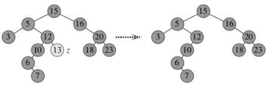
>
>   * si `z` n'a qu'un seul fils, il suffit de relier ce fils au parent de `z` :
>
>       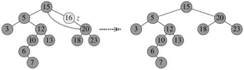
>
>   * si `z` a deux fils, on remplace `z` par le minimum de son sous-arbre droit (noté `y`) en recopiant l'étiquette de `y` dans `z` puis en supprimant `y`. Comme `y` est le minimum d’un sous-arbre, son fils gauche est nécessairement vide : on se retrouve dans le deuxième cas que l’on sait gérer.
>
>       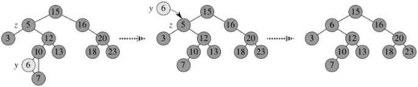
>
>   1.   Expliquez comment serait supprimé le nœud d'étiquette 15 dans l'arbre ci-dessus.
>   2.   Justifiez que dans le troisième cas (deux fils non vides), on pourrait également remplacer le nœud `z` par le maximum de son sous-arbre gauche.
>   3.   Écrivez une fonction `abr* a_supprimer(abr* a, int e)` qui recherche et renvoie un pointeur vers le sous-arbre de racine `e`. S'il n'y en a aucun, on renverra `NULL`.
>
>   La fonction suivante implémente la suppression par remontée du minimum :
>
>   ```c
>   void suppression_abr_remontee_minimum(abr* a, int e) {
>       // on recherche le nœud z à supprimer
>       abr* z = a_supprimer(a, e);
>       if (*z != NULL) {
>           // 1er cas : z est une feuille
>           if ((*z)->gauche == NULL && (*z)->droit == NULL) {
>               supprime_feuille(z);
>           }
>           // 2ème cas : z a un seul fils
>           else if ((*z)->gauche == NULL || (*z)->droit == NULL) {
>               supprime_noeud_a_un_fils(z);
>           }
>           // 3ème cas : z a deux fils
>           else {
>               supprime_noeud_a_deux_fils(z);
>           }
>       }
>   }
>   ```
>
>   4.   Implémentez les trois fonctions `void supprime_feuille(abr*)`, `void supprime_noeud_a_un_fils(abr*)` et `void supprime_noeud_a_deux_fils(abr*)` qui suppriment la racine de l'arbre passé en paramètre, en vous aidant des schémas ci-dessus.


>   **Tri via un ABR**
>
>   On peut utiliser un arbre binaire de recherche pour réaliser un algorithme de tri : on insère tous les éléments à trier dans un ABR puis on effectue un parcours infixe.
>
>   1.   Écrivez ainsi une fonction `void tri_via_abr(int n, int tableau[n])`.
>   2.   Donnez un exemple de tableau pour lequel le tri est le plus efficace, et un pour lequel il est le moins efficace. Quelle est la complexité dans le meilleur cas ? le pire cas ?
>   3.   Comment pourrait-on améliorer ce tri pour toujours obtenir la complexité dans le meilleur cas ?


## Pour aller plus loin

Un *arbre AVL* (le nom vient de ses créateurs G. Adelson-Velsky et E. Landis) est un ABR tel que pour tout nœud, ses sous-arbres gauche et droit ont la même hauteur, à 1 près. Cette propriété assure que la hauteur de l'arbre est désormais toujours logarithmique en sa taille, et donc qu'on est toujours dans le meilleur cas pour la recherche d'une étiquette. Les arbres AVL ne sont pas au programme, mais leurs opérations sont basées sur un principe similaire à ceux des ARN (les rotations) et ils sont déjà tombés plusieurs fois aux concours.

>   1.   Proposez une définition inductive d'un arbre AVL.
>   2.   Parmi les ABR dont l'ensemble d'étiquettes est {7, -2, 4, 0}, lesquels sont des arbres AVL ?

Lors de l'insertion ou de la suppression d'une étiquette, il faut s'assurer de conserver l'équilibre de l'arbre. Pour cela, le ré-équilibrage sera basé sur des rotations (comme pour les ARN). Pour éviter de recalculer les hauteurs à chaque fois, on les stockera directement dans chaque nœud de l'arbre.

>   3.   Créez une structure pour représenter un nœud d'un arbre AVL. On supposera qu'un nœud connaît son étiquette, son fils droit, son fils gauche, et sa hauteur. Un arbre sera alors un pointeur vers sa racine.
>   4.   Écrivez une fonction `rotation_droite` qui réalise une rotation droite. Attention à bien mettre à jour les hauteurs nécessaires. Écrivez de même une fonction `rotation_gauche`.

Si l'arbre est déséquilibré, comme l'insertion et la suppression font varier les hauteurs des sous-arbres d’au plus 1, c’est qu’un nœud (dont le sous-arbre associé a pour hauteur h) possède deux sous-arbres de hauteurs respectives h − 1 et h − 3.

On suppose que le sous-arbre de hauteur h − 1 est celui de gauche, l'autre cas s'en déduit par symétrie. Il y a deux cas à distinguer :

*   si $`h(\alpha) \geq h(\beta) \text{ (i.e. } h(\alpha)=h-2 \text{ et } h(\beta)=h-2-p \text{ avec }p\in \{0;1\})`$, une rotation droite suffit :

    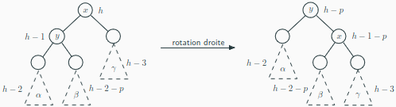

*   si $`h(\alpha) < h(\beta) \text{ (i.e. } \beta \text{ a pour sous-arbres gauche et droit } \delta, \varepsilon \text{ tels que } h(\delta)=h-3-p \text{ et } h(\varepsilon)=h-3-q \text{ avec }p,q\in \{0;1\})`$, une rotation gauche du sous-arbre gauche nous ramène (presque) au cas précédent puis une rotation droite ré-équilibre l'arbre :

    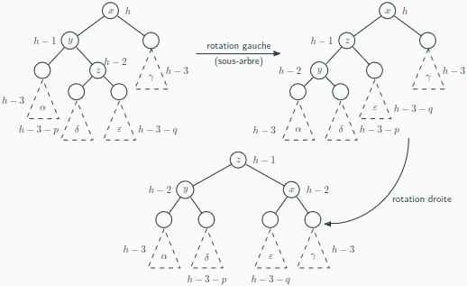

>   5.   Écrivez une fonction qui rééquilibre un AVL (il faut comparer les hauteurs du sous-arbre gauche et du sous-arbre droit de la racine, et si l'écart de hauteur est de 2, appliquer les rotations décrites ci-dessus).
>   6.   Écrivez une fonction pour insérer un élément dans un arbre AVL. Il faut effectuer l'insertion comme pour les ABR, puis ré-équilibrer l'arbre.
>   7.   Écrivez une fonction pour supprimer un élément dans un arbre AVL. Il faut effectuer la suppression avec la méthode de remontée du minimum, puis ré-équilibrer l'arbre.


---

Par *Justine BENOUWT*

Sous licence [*CC BY-NC-SA*](https://creativecommons.org/licenses/by-nc-sa/4.0/)


Sources des images : *production personnelle*, A. Lick (ABR), J.B. Bianquis (ARN).
