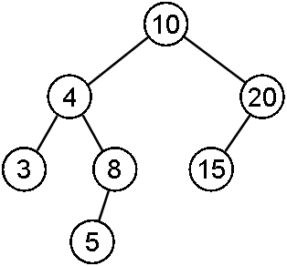
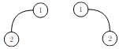

# TP : Arbres binaires en C

Nous allons dans ce TP manipuler la structure d'arbre binaire, en C. La première partie s'intéresse à l'implémentation de l'interface principale des arbres binaires stricts et non stricts et de quelques fonctions essentielles ; la seconde partie a pour but d'implémenter les parcours en profondeur et largeur des arbres binaires, et la troisième partie vise à sérialiser des arbres binaires.

## I. Implémentation d'arbres binaires

On considère un ensemble $\mathcal E$ (étiquettes des nœuds). On définit l'ensemble $\mathcal A(\mathcal E)$ des arbres binaires non stricts par induction ainsi :

* l'arbre vide $\bot$ appartient à $\mathcal A(\mathcal E)$
* si $g$ et $d$ appartiennent à $\mathcal A(\mathcal E)$, et si $e$ appartient à $\mathcal E$, alors $N(e,g,d) \in \mathcal A(\mathcal E)$

> 1. Définissez, à l'aide de cette assertion et de cette règle d'inférence, l'arbre suivant :
>
>     {width=30%}
>
>     *Remarque : pour simplifier la représentation, les arbres vides n'apparaissent pas sur ce schéma.*
>
> 2. * Quelle est l'étiquette de la racine de cet arbre ?
>     * Quelle est la taille de cet arbre ? Sa hauteur ? Son nombre de feuilles et de nœuds internes ?
>     * Quelle est la profondeur du nœud d'étiquette 20 ? son arité ?
>     * Quelle est la taille du sous-arbre enraciné en le nœud d'étiquette 4 ? sa hauteur ?

Cette définition inductive se traduit en C avec le type suivant :

```c
typedef int etiq;

struct noeud_s {
    etiq etiquette;
    struct noeud_s* gauche;
    struct noeud_s* droit;
};

typedef struct noeud_s* ab;
```

Un arbre binaire est donc un pointeur vers le nœud à la racine.

> 3. Que représente le type `etiq` par rapport à la définition inductive des arbres binaires non stricts ?
>
> 4. Écrivez une fonction `ab vide(void)` qui renvoie l'arbre binaire vide.
>
> 5. Écrivez une fonction `ab noeud(etiq, ab, ab)` prend en paramètre une étiquette et deux arbres binaires, et renvoie un arbre binaire construit avec la règle d'inférence. Pensez à l’assertion pour le `malloc`.
>
> 6. Écrivez une fonction `void libere_ab(ab)` qui libère toute la mémoire associée à un arbre binaire.
>
> 7. Écrivez les accesseurs nécessaires à la manipulation des arbres binaires :
>
>     * `bool est_vide_ab(ab)` qui réalise le test de vacuité ;
>     * `etiq etiq_racine(ab)` qui renvoie l'étiquette associée à la racine d'un arbre binaire ;
>     * `ab sous_arbre_gauche(ab)` qui renvoie le sous-arbre gauche d'un arbre binaire ;
>     * `ab sous_arbre_droit(ab)` qui renvoie le sous-arbre droit d'un arbre binaire.
>
>     Vos fonctions devront respecter les principes de la programmation défensive.
>
> 8. Dans la fonction `main`, définissez l'arbre de la première question avec ces deux fonctions.
>
>     *Remarque : vous pouvez utiliser cet arbre pour tester vos fonctions.*

Nous allons implémenter quelques fonctions classiques sur les arbres binaires afin de compléter l'interface principale définie ci-dessus.

> 9. Définissez par induction une fonction $`T : \mathcal A(\mathcal E) \rightarrow \mathbb N`$ qui à un arbre binaire non strict associe sa taille. En déduire une fonction C `int taille(ab)`.
> 10. Définissez par induction une fonction $`h : \mathcal A(\mathcal E) \rightarrow \mathbb N`$ qui à un arbre binaire non strict associe sa hauteur. En déduire une fonction C `int hauteur(ab)`.

Le raisonnement appliqué ci-dessus pour la taille et la hauteur d'un arbre binaire non strict est très classique pour les ensembles définis par inductions : on réfléchit d'abord au résultat de la fonction pour les assertions, puis pour les applications des règles d'inférence, et le code en découle souvent directement.

> 11. Avec un raisonnement de ce type, écrivez une fonction `etiq somme(ab)` qui renvoie la somme de toutes les étiquettes d'un arbre binaire (en supposant que le type des étiquettes permet l'addition).
>
> 12. Écrivez une fonction `bool egaux(ab, ab)` qui détermine si deux arbres binaires sont égaux.
>
>     *Remarque : deux arbres sont égaux s'ils ont le même squelette et si les étiquettes de deux nœuds à la même place sont égales.*
>
> 13. Les arbres suivants sont-ils égaux ?
>
>     
>
>     Définissez les en C et testez votre fonction `egaux` dessus.

La correction (totale) des fonctions récursives sur des ensembles inductifs se montre généralement par induction structurelle. Pour les arbres binaires non stricts, montrer la correction d'une fonction $f$ consiste donc à :

* Assertion : Montrer que $f$ est correcte pour l'arbre vide.
* Règle d'inférence : Supposer que $f$ est correcte pour deux arbres binaires non stricts $g$ et $d$, et montrer alors que $f$ est correcte pour $N(e, g, d)$ pour toute étiquette $e$.

> 14. Écrivez une fonction `bool appartient(ab, etiq)` qui détermine si une étiquette est présente dans un arbre binaire non strict.
>
> 15. Montrez la correction de cette fonction par induction structurelle.
>
> 16. Pour calculer la complexité des fonctions sur les arbres binaires non stricts, on procède comme pour toute fonction récursive : on trouve une relation de récurrence pour la complexité et on en déduit le terme général. Calculez ainsi la complexité de la fonction `appartient`.
>
> 17. *Appelez le professeur pour faire valider votre preuve de correction et votre calcul de complexité.*

On souhaite pouvoir représenter les arbres binaires stricts. On rappelle que l'arbre vide n'est pas un arbre binaire strict. L'assertion dans la définition inductive des arbres binaires stricts est l'arbre réduit à une feuille (et la règle d'inférence est la même que pour les arbres binaires non stricts).

On va utiliser les mêmes types que ceux définis ci-dessus, seules les fonctions d'interfaces vont changer.

> 18. Écrivez deux fonctions `ab feuille(etiq)` et `ab noeud_strict(etiq, ab, ab)` correspondantes à l'assertion et à la règle d'inférence de la définition inductive des arbres binaires stricts. On utilisera un `assert` afin de s'assurer que sous-arbres gauches et droits passés en paramètres de la fonction `noeud_strict` sont non vides.
> 19. Écrivez une fonction `bool est_feuille(ab)` qui détermine si un arbre est réduit à une feuille.

La fonction `est_vide_ab` n'est donc plus pertinente pour les arbres binaires stricts, c'est la fonction `est_feuille` qui doit être utilisée pour traiter les cas de bases des fonctions sur les arbres binaires stricts.

> 20. Écrivez une fonction `int nombre_de_feuilles(ab)` qui compte le nombre de feuilles d'un arbre binaire strict. On donnera une définition inductive de cette fonction avant de l’implémenter.
> 21. Écrivez une fonction `etiq derniere_feuille(ab)` qui renvoie l'étiquette de la feuille située la plus à droite d'un arbre binaire strict.
> 22. Les fonctions `taille` et `hauteur` définies plus haut fonctionnent-elles encore pour les arbres binaires stricts ?

Finalement, en C, les arbres binaires stricts ne sont qu'un cas particulier de définition des arbres binaires non stricts dans lesquels tous les nœuds internes sont d'arité exactement 2.

> 23. Écrivez une fonction `bool est_strict(ab)` qui renvoie `true` si et seulement si l'arbre binaire passé en paramètre est strict.

## II. Parcours d'arbres binaires

Il y a essentiellement deux manières de parcourir un arbre :

* le parcours en largeur ;
* le parcours en profondeur.

Nous allons nous intéresser au parcours d'un arbre binaire strict. On supposera donc que nos arbres ont été construits avec les fonctions d'interface `feuille` et `noeud_strict` (et jamais `vide` et `noeud`).

Dans un parcours en profondeur, on commence par descendre le plus profondément possible (jusqu'à une feuille donc) avant de remonter pour parcourir le reste de l'arbre.


On passe trois fois sur chaque nœud interne :

* avant d'explorer son fils gauche ;
* entre l'exploration du fils gauche et celle du fils droit ;
* après l'exploration du fils droit.

Cela induit trois ordres différents sur le traitement des nœuds :

* préfixe : on traite d'abord le nœud, puis le sous-arbre gauche, puis le sous-arbre droit
* infixe : on traite d’abord le sous-arbre gauche, puis le nœud, puis le sous-arbre droit
* postfixe : on traite d’abord le sous-arbre gauche, puis le sous-arbre droit, puis le nœud

> 1. Donnez l'ordre de traitement des nœuds pour les 3 parcours en profondeur de l'arbre de l'image précédente.
> 2. Écrivez une fonction `void profondeur_prefixe(ab)` qui prend en paramètre un arbre binaire strict et effectue un parcours en profondeur dans l'ordre préfixe. Le traitement d'un nœud consistera à afficher son étiquette (on pourra supposer qu'il s'agit d'un entier).
> 3. Définissez en C l'arbre de l'image précédente, et appelez la fonction `profondeur_prefixe` afin de vérifier votre réponse à la première question.
> 4. Écrivez de même deux fonctions `void profondeur_infixe(ab)` et `void profondeur_postixe(ab)`, et vérifiez vos réponses à la première question.
> 5. Pour les arbres des expressions arithmétiques vus en cours, quel ordre de traitement des nœuds permet d'obtenir la notation habituelle d'une expression ?

Dans un parcours en largeur, on parcourt les nœuds par profondeur croissante, et de gauche à droite pour une profondeur donnée.


> 6. Donnez l'ordre de traitement des nœuds pour un parcours en largeur de cet arbre.

L'implémentation du parcours en largeur est plus délicate que celle du parcours en profondeur.

Dans l'arbre de l'image précédente, après avoir traité le nœud d'étiquette 5, on doit traiter le nœud d'étiquette 6. Mais remonter jusqu'à la racine pour passer de ce nœud au suivant n'est pas efficace. L'idée est donc de conserver un ensemble de nœuds en attente d'être traités dans une structure de données séquentielle $s$ :

* on commence par traiter la racine
* quand on traite un nœud, on ajoute ses fils gauche et droit à $s$ ;
* on extrait ensuite un nœud de profondeur minimale de $s$ pour le traiter ;

Cette manière de procéder va naturellement ajouter les nœuds dans $s$ par profondeur croissante. Extraire un nœud de profondeur minimale de $s$ revient donc à extraite le nœud qui a été ajouté en premier dans $s$.

> 7. Justifiez que $s$ doit donc être une structure de type FIFO, et proposez une telle structure.
> 8. Écrivez alors une fonction `void largeur(ab)` qui effectue un parcours en largeur d'un arbre binaire strict. Le traitement d'un nœud consistera à afficher son étiquette (on pourra supposer qu'il s'agit d'un entier).
> 9. Appliquez cette fonction à l'arbre de l'image précédente et vérifiez le résultat.

## III. Sérialisation d'arbres binaires

**Sérialiser** une structure de données, c'est la stocker « à plat » dans un fichier. La sérialisation est bijective, on doit pouvoir reconstruire la structure sans équivoque à partir des données stockées.

La manière la plus simple de sérialiser un arbre binaire strict est de stocker son parcours en profondeur dans l’ordre préfixe. On différencie les nœuds internes en plaçant un 1 avant leurs étiquettes sur la ligne correspondante dans le fichier, et un 0 avant l'étiquette d'une feuille.

> 1. Indiquez ce que doit contenir le fichier après sérialisation de l'arbre binaire strict suivant :
>
>     {width=30%}
>
> 2. Écrivez une fonction `void serialise(ab, char*)` qui sérialise un arbre binaire strict dans le fichier dont le nom est passé en paramètre. On gérera les erreurs d'ouverture du fichier en affichant un message sur la sortie d'erreur standard.

Il faut maintenant réussir à reconstruire l'arbre binaire strict depuis son parcours préfixe. Pour cela, il suffit de lire le fichier dans l’ordre. Comme on sait qu’il s’agit du parcours préfixe de l’arbre, la première étiquette lue est celle de la racine. Les suivantes appartiennent au sous-arbre gauche, qu’on peut donc reconstruire récursivement. Une fois le sous-arbre gauche reconstruit, tout ce qu’il reste appartient au sous-arbre droit, qu’on peut donc reconstruire récursivement également. Les cas de base correspondent à la lecture de l’étiquette d’une feuille (repérable par le 0 stocké avec).

> 3. Déroulez à la main la désérialisation du fichier obtenu à la première question.
> 4. Écrire une fonction `ab deserialise(char*)` qui renvoie l'arbre binaire strict qui a été sérialisé dans le fichier de nom donné en paramètre. On gérera les erreurs d'ouverture du fichier en affichant un message sur la sortie d'erreur standard, et en renvoyant le pointeur `NULL`.
> 5. Testez votre fonction en sérialisant puis désérialisant l'arbre de la première question, et en vérifiant le résultat à l'aide de la fonction `egaux` de la première partie du TP.

Il existe bien évidemment d'autres manières de sérialiser un arbre binaire (nous aurions par exemple pu utiliser l'ordre postfixe).

## Pour aller plus loin

> 1. Montrez la correction des fonctions de parcours en profondeur par induction structurelle.
> 1. On s’intéresse à la variante suivante des parcours : on souhaite récupérer les étiquettes des nœuds parcourus dans une liste chaînée. Écrivez alors une seconde version des 4 fonctions de parcours qui n'affiche rien mais renvoie la liste des étiquettes.
> 1. Proposez une sérialisation et désérialisation d’un arbre binaire strict d’après son parcours postfixe.


---

Par *Justine BENOUWT*

Sous licence [*CC BY-NC-SA*](https://creativecommons.org/licenses/by-nc-sa/4.0/)


Source des images : *production personnelle*, *J.B. Bianquis* (parcours)
