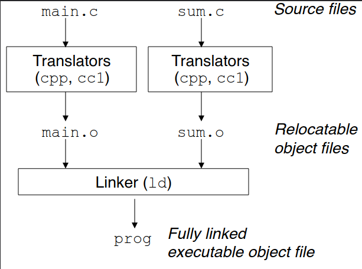
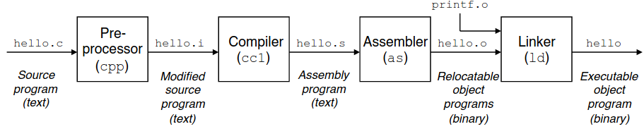

# TP : Compilation en C

**Le contenu de ce TP introduit le mécanisme de compilation en C et le fonctionnement des divers fichiers composant un programme, et doit ainsi être considéré comme du cours. Charge à vous de prendre en note les notions importantes.**

Pour programmer en C, nous utiliserons l'IDE (environnement de développement) Visual Studio Code. VS Code a l'avantage de posséder un terminal intégré, ce qui vous permettra de compiler et tester votre code sans changer sans arrêt de fenêtre.

> 0. Depuis la machine virtuelle, ouvrez Visual Studio Code, puis ouvrez le terminal intégré (onglet "Terminal" tout en haut).
> 1. Depuis le terminal intégré, créez un répertoire `tp_compilation`. *Vous pouvez éventuellement le mettre dans votre dépôt `framagit` pour pouvoir conserver votre travail.*
> 2. Depuis le terminal, déplacez vous dans le répertoire `tp_compilation`, puis créez-y un fichier `affichages.c`.
> 3. Pour ouvrir votre nouveau fichier avec VS Code, entrez la commande `code affichages.c`.

Ces manipulations seront à faire à chaque nouveau TP en C. Il faut vous habituer à n'utiliser que le terminal pour manipuler le système de fichiers.

*Remarque : au lycée, tout ce que vous enregistrez dans la machine virtuelle y reste et n'importe qui se connectant sur le même ordinateur peut y avoir accès. Je vous conseille fortement, à chaque TP, de sauvegarder vos fichiers dans votre dépôt `framagit`.*

## I. Main et compilation

*Compiler* un fichier de code source C se fait depuis un terminal. Le **compilateur** que nous utiliserons est [`gcc`](https://gcc.gnu.org/).

> 1. Dans le terminal intégré à VS Code, entrez la commande `gcc affichages.c`. Quelle erreur obtenez-vous ?

Un code C doit forcément avoir un « main ».

Le « **main** » est une fonction, obligatoire en C. C'est la fonction principale de votre programme, c'est-à-dire qu'elle est automatiquement appelée en premier lors de l'exécution de votre programme compilé.

> 2. Copiez le code suivant dans votre fichier `affichages.c` :
>
>     ```c
>     void main() {
>     }
>     ```
>
> 8. Compilez avec la même commande que précédemment. Vous ne devriez plus obtenir de message d'erreur.
>
> 4. Avec la commande appropriée, regardez le contenu de votre répertoire `tp_compilation`. Quel nouveau fichier trouvez-vous ?
>
> 5. Ce nouveau fichier est un **exécutable** : un code binaire produit par le compilateur à partir de votre code source. Pour exécuter ce fichier, il faut placer `./` devant. Essayez : `./a.out`. Il ne doit rien se passer, comme votre code est vide.
>
> 6. Il est possible de produire un exécutable avec le nom de notre choix (pour éviter d'utiliser `mv` à chaque fois). Pour cela, on utilise l'option `-o` du compilateur (pour *o*utput). Généralement, on utilisera pour l'exécutable le même nom que le fichier contenant le code source, mais ce n'est pas une obligation. Essayez : `gcc -o affichages affichages.c`. Exécutez ensuite le fichier binaire produit.
>
> 5. Supprimez les deux exécutables créés avec la commande appropriée. Il est inutile d'encombrer votre système de fichiers avec les exécutables à chaque fois, puisqu'on peut facilement les recompiler à partir du code source. À la fin de chaque TP en C, vous veillerez donc à supprimer tous les exécutables créés.

Nous venons d'avoir un premier aperçu de la **syntaxe pour définir une fonction en C** :

* on précise d'abord le type de retour (ici `void` signifie que la fonction ne renvoie rien)
* on précise ensuite le nom de la fonction (ici `main`)
* on trouve ensuite les paramètres entre parenthèses (ici les parenthèses sont vides car il n'y a aucun paramètre)
* puis le bloc de la fonction est encadré par des accolades.

> 8. Ajoutez `return 1;` dans le main :
>
>     ```c
>     void main() {
>         return 1;
>     }
>     ```
>
> 15. Compilez. Quel avertissement obtenez-vous ? Le fichier a-t-il quand même été compilé ?
>
> 16. Remplacez `void` par `int`. Compilez. L'avertissement apparaît-il toujours ?

Les **avertissements** à la compilation sont à prendre très au sérieux. Si vous les ignorez, vous obtiendrez bien souvent une erreur à l'exécution par la suite.

Par défaut, le compilateur `gcc` émet très peu d'avertissements à la compilation, ce qui ne facilite pas la tâche pour déboguer les programmes. Heureusement, il existe des options permettant d'améliorer la quantité et la qualité des avertissements. Nous utiliserons celles-ci :

* -Wall : utiliser tous les avertissements *warnings*
* -Wextra : utiliser aussi les avertissements supplémentaires
* -fsanitize=address : vérification additionnelle concernant la mémoire du programme (on ne l'utilisera que lorsqu'on étudiera les pointeurs)
* -Werror : considérer les avertissements comme des erreurs

*Remarque : les options ne sont pas à connaître pour les concours.*

> 11. Compilez le programme suivant avec la commande `gcc -Wall -Wextra -Werror -o affichages affichages.c` :
>
>     ```c
>     void main() {
>     }
>     ```
>
> 18. Que se passe-t-il cette fois ? Corrigez l'erreur.

La fonction **main renvoie toujours un entier**, même si vous n'avez pas mis de « return ». Cet entier permet d'informer le système sur la façon dont le programme s'est terminé.

Par défaut, si l'exécution a fini sans erreur, c'est `0` qui est renvoyé. Un autre nombre indique qu'une erreur s'est produite. L'entier renvoyé est toujours entre `0` et `255`.

> 13. Compilez le programme suivant, toujours avec toutes les options :
>
>     ```c
>     int main() {
>     }
>     ```
>
> 20. Il est possible d'afficher le code de retour avec la commande `echo $?`. Exécutez votre programme, puis vérifiez que `0` a bien été renvoyé.
>
> 21. Ajoutez `return 1;` dans votre main. Compilez, exécutez, et vérifiez à nouveau la valeur de retour.
>
> 22. Essayez avec `return 256;`. Essayez aussi avec `return -1;`. Comment expliquer le résultat obtenu ?

Notez bien la commande qui permet de compiler un programme *avec toutes les options*, c'est celle que vous *devrez* utiliser à chaque TP.

> 17. Essayez de compiler votre programme après avoir retiré le point-virgule sur la ligne du `return`.
> 25. Analysez le message d'erreur affiché :
>     * quelle est l'erreur ?
>     * dans quelle fonction est cette erreur ?
>     * à quelle ligne ? quel caractère ?

Si vous rencontrez des avertissements ou des erreurs lors de la compilation : il faut bien lire les messages d’erreurs et essayer de les comprendre pour se débloquer (ou vous pouvez aussi crier à l'aide...). Si vous avez plusieurs messages d'erreurs, commencez par résoudre le tout premier, puis tentez à nouveau de compiler, et recommencez ainsi si nécessaire.


## II. Entêtes et fonctions

### 1. Librairies

Un **affichage** en C se fait à l'aide de la fonction `printf`.

> 1. Copiez le code suivant dans votre fichier `affichages.c` :
>
>     ```c
>     int main() {
>         printf("Hello World !");
>     }
>     ```
>
> 2. Compilez. Que se passe-t-il ? Que suggère le compilateur pour corriger cette erreur ?
>
> 3. Ajoutez `#include <stdio.h>` en haut de votre fichier. Compilez.
>
> 4. Exécutez. Que se passe-t-il ?
>
> 5. Le caractère `\n` permet de réaliser un retour à la ligne. Ajoutez le à la fin du texte dans le `printf`. Compilez. Testez.

`stdio` (*ST*an*D*ard *I*nput *O*utput) est une **librairie** (ou bibliothèque). Elle contient un certain nombre de fonctions prédéfinies et dont on peut se servir. Il existe de nombreuses librairies en C. Le programme de MP2I mentionne que l'on peut utiliser celles-ci :

* **stdio** (entrées / sorties)
* **stdlib** (fonctionnalités générales)
* **stdint** (entiers)
* **stdbool** (booléens)
* **stddef** (NULL, autres fonctionnalités mineures)
* **assert** (assertions)

*Vous ne devez pas connaître le contenu de ces fichiers, ni aucune fonctionnalité particulière. Vous pourrez par contre supposer à l'écrit des concours qu'ils ont tous été inclus et utiliser librement leurs fonctions. Nous aurons tous l'occasion au moins une fois dans l'année de les utiliser.*

Pour utiliser une librairie, on doit inclure son **entête** au début de notre code. L'entête est simplement le nom du fichier suivi de l'extension `.h` (pour *h*eader), placé entre chevrons. L'inclusion de l'entête se fait avec la directive `#include`.

Une **directive** est une instruction adressée au préprocesseur. Elle commence toujours par un dièse `#`. C'est une des rares lignes en C qui ne finira pas par un point virgule.

Juste avant la compilation, le **préprocesseur** va remplacer dans le code source tous les `#include ...` par le contenu de la librairie mentionnée. Ainsi avec `stdio` par exemple, la déclaration de la fonction `printf` va être copiée au début de votre fichier `affichages.c`, elle sera alors définie et pourra être utilisée dans la suite du code.

> 6. Copiez le code suivant dans votre fichier `affichages.c`:
>
>     ```c
>     int main() {
>         NULL;
>     }
>     ```
>
> 7. Compilez. Expliquez ce qu'il se passe, et corrigez l'erreur.
>
> 8. Modifiez le programme pour également afficher le message `Je suis en MP2I`. Quelles bibliothèques sont donc incluses ? Compilez, testez.
>
> 9. À votre avis, dans quelle librairie se trouvent les constantes `true` et `false` ? Incluez cette librairie, remplacez `NULL` par `true`, compilez, testez.

 Nous reviendrons sur l'utilisation de `NULL` dans un prochain TP.

> 10. Vous vous trouvez devant une source d’eau qui jaillit de la montagne, et vous disposez de deux tonneaux vides de capacités 5 litres et 3 litres. Écrivez un programme qui affiche une série de transvasements permettant d’obtenir exactement 4 litres d’eau dans le plus grand tonneau. Arrêtez-vous bien dès que le grand tonneau contient exactement 4 litres. On affichera une succession d'instructions de la forme "Remplir(5)" ou "Remplir(3)" ou "Vider(5)" ou "Vider(3)" ou "Transvaser (5,3)" ou "Transvaser(3,5)".

Je ne le répéterai pas à chaque question, mais à chaque fois que vous écrivez un morceau de code, vous devez *impérativement* recompiler votre fichier *et* exécuter.

### 2. Fonctions

La fonction main n'est bien évidemment pas la seule fonction que l'on peut définir en C.

La **syntaxe pour définir une fonction** en C est la suivante :

```c
type_de_retour nom_fonction(type nom_param1, type nom_param2, ...) {
    code de la fonction
}
```

> 1. Copiez le code suivant dans votre fichier `affichages.c`, compilez, exécutez :
>
>     ```c
>     #include <stdio.h>
>     
>     void affiche_hello() {
>         printf("Hello World !\n");
>     }
>     
>     int main() {
>         affiche_hello();
>     }
>     ```
>
> 2. Quel est le type de retour de la fonction `affiche_hello` ? Combien a-t-elle de paramètres ? Comment l'évalue-t-on ?

**`void`** représente "rien" : ici, on indique donc que la fonction `affiche_hello` ne renvoie rien (et en effet, il n'y a pas de `return`).

> 3. Remplacez `void` par `int`. Que se passe-t-il à la compilation ?
>
> 4. Ajoutez un `return 0`. Que ne faut-il pas oublier à la fin de la ligne ?
>
> 5. Que se passe-t-il à la compilation ?
>
> 6. Ajoutez le code de la fonction suivante entre la fonction `affiche_hello` et le main :
>
>     ```c
>     void affiche_annee(int i) {
>         printf("Nous sommes en %d.\n", i);
>     }
>     ```
>
> 7. Quel est le type de retour de la fonction ? Combien y a -t-il de paramètres ? Quel est le type du(des) paramètre(s) ?
>
> 8. Appelez la fonction dans le main après l'appel à `affiche_hello`. Compilez, testez, vous devez obtenir :
>
>     ```bash
>     Hello World !
>     Nous sommes en 2024.
>     ```

La fonction **`printf`** permet le formatage de la chaîne à afficher. Ici, nous avons utiliser `%d` pour indiquer qu'un entier devait être affiché à cet endroit ci. L'entier `i` fournit ensuite sera donc affiché à la place du `%d`.

Voici les différents formatages que vous pourrez être amenés à utiliser :

* `%d` : entiers
* `%f` : flottants
* `%c` : caractères
* `%s` : chaînes de caractères

> 9. Ajoutez à votre fichier, au dessus du main toujours, les fonctions suivantes :
>
>     * `affiche_moyenne` qui prend en paramètre un flottant (type `double`) et affiche "La moyenne de la dernière IE était de [x]..."
>     * `affiche_classe` qui prend en paramètre quatre caractères (type `char`) et affiche "Tu es en classe de [abcd] !".
>
>     N'oubliez pas les retours à la ligne après chaque affichage.
>
> 10. Appelez successivement vos fonctions depuis le main pour obtenir l'affichage suivant :
>
>     ```
>     Hello World !
>     Nous sommes en 2024.
>     Tu es en classe de MP2I.
>     La moyenne de la dernière IE était de 3.96...
>     ```
>
> 11. Modifiez la fonction `affiche_classe` pour que le troisième paramètre soit maintenant un entier. Si on ne change pas l'appel dans le main, que se passe-t-il à la compilation ?
>
> 12. Corrigez l'appel à la fonction `affiche_classe`.

C n'est pas du tout aussi strict qu'OCaml concernant les types, bien au contraire. Ici, le caractère '2' va être automatiquement convertit en un entier. Il faudra donc en permanence faire vraiment très attention au type de toutes vos valeurs. Un programme peut compiler et tourner sans erreur, et pour autant faire complètement autre chose que ce qu'on attendait !

Il faut également noter que, tout comme en OCaml, le passage des valeurs en paramètre est un *passage par valeur* : cela signifie que tous les paramètres sont évalués avant l'appel de la fonction. Ainsi, un appel à `affiche_annee(2020 + 4)` va d'abord calculer `2020 + 4 = 2024`, puis appeler `affiche_annee(2024)`.

> 13. Essayez d'ajouter `void` en paramètre de la fonction `affiche_hello` :
>
>     ```c
>       void affiche_hello(void) {
>         ...
>     ```
> 
>     Cela change t-il quelque chose ? Expliquez pourquoi.
> 
> 14. Pouvez-vous appeler la fonction `affiche_hello` avec `void` en paramètre ?

Vous avez dû remarquer que je vous ai fait placer vos fonctions au dessus du main. Mais pourquoi donc ?

> 15. Définissez une nouvelle fonction `affiche_ligne_vide()` *en dessous* de la fonction `main`. Cette fonction doit afficher... une ligne vide.
> 16. Appelez cette fonction dans le main. Compilez, que se passe-t-il ?

Lorsque le compilateur commence à compiler un fichier source, il "oublie" tout ce qu'il connaissait avant. Il part du haut du fichier, en faisant toutes ses vérifications (syntaxe, sémantique, etc.). Quand il tombe sur la définition d'une fonction , il la "retient" en mémoire. Quand il tombe sur un appel de fonction, il regarde dans sa mémoire s'il la connaît. Si oui, il continue, sinon il émet un avertissement de type "déclaration de fonction implicite".

Pour pouvoir définir nos fonctions après le main, il va donc falloir la **déclarer** avant.

> 17. En haut de votre fichier (juste après les `#include`), ajoutez la ligne suivante pour déclarer la fonction `affiche_ligne_vide` :
>
>     ```c
>     void affiche_ligne_vide(void);
>     ```
>
> 19. Compilez, testez. Que se passe-t-il cette fois ?
>
> 19. Déplacez la définition de toutes vos fonctions en dessous du main.
>
>     Ajoutez la ligne suivante pour déclarer la fonction `affiche_annee` :
>
>     ```c
>     void affiche_annee(int);
>     ```
>
>     Déclarez de même toutes les autres fonctions. Compilez, testez.

Déclarer ses fonctions comme cela est une très bonne habitude à prendre, surtout quand on commence à avoir beaucoup de fonctions (ce qui sera très souvent le cas cette année).

De plus, déclarer les fonctions permet au compilateur de vérifier que l'appel de la fonction (nombre de paramètres, type de retour) concordent bien avec le **prototype** (ce qui est attendu). Le compilateur peut même éventuellement mettre en place d'éventuelles conversions de types si la fonction est appelée avec des paramètres qui ne correspondent pas au type du prototype.

### 3. Fichiers d'entête

En pratique, on ne déclare pas nos fonctions en haut du fichier comme cela, on le fait dans un **fichier d'entête**.

Le fichier d'entête doit avoir le même nom que le fichier de code source C mais avec l'extension `.h` (pour *h*eader, comme les librairies).

> 1. Depuis le terminal, créez un fichier `affichages.h` toujours dans le même répertoire.
> 2. Ouvrez ce fichier avec VS Code (depuis le terminal bien sûr).
> 3. Déplacez-y toutes les déclarations de fonctions, ainsi que les `#include` des librairies.
> 4. Pour indiquer au fichier source C que les déclarations de fonctions se situent dans un fichier d'entête, il faut préciser en haut du fichier `affichages.c` : `#include "affichages.h"`.
> 5. Compilez, exécutez. Vous ne devriez pas avoir d'erreur.

Le fichier d'entête s'inclut en haut du fichier source C quasiment comme les librairies. La seule différence est que l'on a remplacé les chevrons par des guillemets :

* `#include <librairie.h>` pour les **librairies existantes**
* `#include "fichier.h"` pour les **fichiers d'entête**

Chaque fois que vous créerez un fichier C cette année en TP, il faudra donc impérativement créer un fichier d'entête correspondant. Vous y placerez toutes les **librairies** à utiliser et toutes les **déclarations** de fonctions, mais **jamais de définitions de fonctions**.

Pour résumer la différence entre déclaration et définition d'une fonction :

* déclaration = prototype de la fonction : type de retour, nom de la fonction, nombre de paramètres et leurs types
* définition = on y ajoute le nom des paramètres et le corps de la fonction entre accolades

Avoir créé un fichier d'entête permet ensuite de réutiliser notre code depuis un autre programme.

> 6. Depuis le terminal, créez un fichier `main.c` et ouvrez le avec VS Code.
>
> 7. Copiez-y le code suivant :
>
>     ```c
>     #include "affichages.h"
>     
>     int main() {
>         affiche_hello();
>         affiche_ligne_vide();
>     }
>     ```
>
> 8. Essayez de compiler le programme `main.c`. Que se passe-t-il ?
>
> 9. Pour compiler `main.c`, nous avons besoin des fonctions définies dans `affichages.c`. Essayez alors de compiler avec `gcc -Wall -Wextra -Werror -o main main.c affichages.c`. Que se passe-t-il ?

Lorsqu'on organise un programme en plusieurs fichiers, nous faisons ce que l'on appelle de la **programmation modulaire** : on sépare notre code entre plusieurs fichiers C (et leurs fichiers d'entête correspondants), ayant chacun une tâche spécifique, et on ajoute un programme principal (souvent appelé `main.c`) qui s'occupe de lancer la tâche principale (qui fait elle-même appel à des fonctions réparties dans les différents fichiers).

En C, **on ne peut pas définir plusieurs fois la même entité**. C'est valable pour toutes les fonctions, y compris donc le main. Quand on compile donc un ensemble de fichiers, il faut impérativement qu'il y ait *un seul et unique* main pour l'ensemble des fichiers.

> 10. Retirer le main de `affichages.c`, et recompilez le tout. Exécutez.

Différents fichiers de code C, disons `exo1.c` et `exo2.c` peuvent avoir chacun besoin des fonctions définies dans un même autre fichier, disons `lib.c`. Ces deux fichiers là devront donc chacun avoir un `#include "lib.h"` pour récupérer les fonctions du fichier d'entête de `lib.c`. Et puis ensuite, dans le `main.c`, nous aurons besoin de deux directives pour récupérer les fonctions de `exo1.h` et `exo2.h`. Mais nous venons de voir qu'en C, on ne peut pas définir plusieurs fois la même identité ! Et si on fait ça, ce qui est déclaré dans `lib.h` sera deux fois dans le main (une fois de par exo1, une fois de par exo2).

Pour remédier aux éventuels problèmes de doublons dans les déclarations, qui provoqueraient des erreurs à la compilation, on utilise **d'autres directives** : `#define, #ifndef, #endif`.

> 11. Dans le fichier `affichages.h`, ajoutez au début (premières lignes du fichier) :
>
>     ```c
>     #ifndef _AFFICHAGE_H_
>     #define _AFFICHAGE_H_
>     ```
>
>     et à la fin (dernière ligne) :
>
>     ```c
>     #endif
>     ```
>
> 12. Compilez, testez.

Ce que cela signifie :

* si `_AFFICHAGE_H_` n'est pas définie (ifndef), l'entête est incluse normalement, et on la déclare comme définie (define)
* si `_AFFICHAGE_H_` est définie, cela signifie que l'entête a déjà été incluse donc elle est ignorée les fois suivantes

Par précaution, tous vos fichiers d'entête devront donc **systématiquement utiliser ces directives**. Vous pouvez techniquement choisir le nom que vous voulez, mais `_NOM_H_` (pour un fichier `nom.h`) est une bonne pratique.

> 13. Nous avons vu plus haut la liste des librairies que vous aurez le droit d'utiliser librement. Pour éviter de devoir retrouver cette liste toute l'année, créez un fichier d'entête `librairies.h` qui déclare toutes ces librairies. N'oubliez pas les directives !
>
>     Toute l'année, vous pourrez donc utiliser ce fichier d'entête en ajoutant `#include "librairies.h"` dans vos codes sources C.
>     
>     *Conservez bien ce fichier.*

De manière générale, la règle pour les TP en C sera :

* un fichier C par exercice ; 
* chaque fichier C sera accompagné de son fichier d'entête ;
* un seul programme principal `main.c` qui ne contient que la fonction main, et qui vous servira principalement à tester vos programmes.
* Si un même exercice porte sur des thèmes différents, il sera possible de créer plusieurs fichiers C, c'est à vous de juger si c'est nécessaire. Idem, si un exercice est vraiment indépendant des autres et est très court, il sera envisageable de ne pas lui associer de fichier d'entête et d'y inclure une fonction main directement : à vous de juger si c'est approprié.

> 14. Supprimez tous les exécutables créés précédemment, ne conservez que les codes sources et fichiers d'entête.

### 4. Retour sur la compilation

Nous venons de voir plusieurs exemples de directives qui sont destinées au **préprocesseur**, et qui sont donc réalisées **avant la compilation**. Pourtant, nous n'exécutons bien qu'une seule commande pour compiler, `gcc`... Mais que fait donc vraiment `gcc`!?

Je vous ai un peu menti au début du TP, `gcc` n'est pas vraiment un compilateur ! C'est un *compiler driver*, que l'on pourrait éventuellement traduire par « pilote du compilateur », une collection d'outils qui vont s'enchaîner pour réaliser une compilation.

Parler de « compilation » est en réalité un abus de langage qui regroupe plusieurs choses :

* le **préprocesseur**
* la **compilation**
* l'**édition de liens**

Le préprocesseur se charge notamment des directives.

La **compilation** produit, pour chaque fichier C, un **fichier objet** de même nom qui contient une traduction du code C en langage machine binaire. Un fichier objet n'est pas exécutable : il ne contient que la traduction du code du fichier lui-même, dont les *appels* des fonctions définies dans d’autres fichiers, mais *pas le binaire* de ces fonctions.

> 1. `gcc` propose une option pour compiler les fichiers C en fichiers objets : `-c`. Essayez :
>
>     ```bash
>     $ gcc -Wall -Wextra -Werror -c affichages.c
>     ```
>
> 3. Quelle est l'extension pour les fichiers objets ?
>
> 4. Compilez le fichier objet de `main.c`.
>
> 5. Pourquoi n'a-t-on pas eu d'erreur alors que nous avons compilé les fichiers objets des deux fichiers séparément ?

On remarquera au passage que les options pour les avertissements sont propres à l'étape de compilation (et pas le préprocesseur ni l'édition de liens).

On notera aussi que **les fichiers d'entête ne se compilent pas**, puisqu'ils servent uniquement à l'étape du préprocesseur.

L'étape d'**édition des liens** est celle qui va permettre d'assembler l'ensemble des fichiers objets (ainsi que les binaires des librairies) pour créer un fichier exécutable, qui contient donc toutes les informations nécessaires pour lancer notre programme. C'est l'éditeur de lien (*linker*) qui vérifie que chaque fonction appelée est bien définie, et en un seul exemplaire.

> 5. L'édition de liens se fera avec l'option `-o` permettant de choisir le nom de notre exécutable. Essayez :
>
>     ```bash
>     $ gcc -o main main.o affichages.o
>     ```
>
> 7. Exécutez. Retrouvez-vous bien la même chose que précédemment ?
>
> 8. Quel sont les avantages de fournir à un utilisateur le fichier objet plutôt que le code source ?
>
> 9. Donnez une commande permettant de supprimer d'un coup tous les fichiers objets d'un répertoire.
>
>     Comme pour les exécutables, vous veillerez à ne pas encombrer votre système de fichier avec des fichiers objets, supprimez les à la fin de chaque TP.

Au lieu de « compilation », nous devrions donc parler de « **processus de compilation** ».



Quand nous compilons "en un coup" avec `gcc`, il va donc en réalité appeler successivement :

* le préprocesseur `cpp` ;
* le compilateur C `cc1` ;
* l'éditeur de lien `ld`.

Je rappelle à nouveau que ce TP doit être considéré comme un cours : *vous devez savoir expliquer les étapes du processus de compilation et réaliser une compilation séparée.*

## III. Bonnes pratiques

Le langage C n’a pas été conçu pour faciliter sa lecture.

Un concours annuel, [International Obfuscated C Code Contest](https://www.ioccc.org/) récompense d’ailleurs le programme le plus illisible. Voici deux exemples de programmes ayant remporté ce concours :

```c
#include <stdio.h>
int O,o,i;char*I=””;
main(l){O&=l&1?*I:˜*I,*I++||(l=2*getchar(),i+=O>8
?o:O?0:o+1,o=O>9,O=-1,I="t8B˜pq'"",l>0)?main(l/2):
printf("%d\n",--i);}
```

```c
m(char*s,char*t) {
return *t-42?*s?63==*t|*s==*t&&m(s+1,t+1):
    !*t:m(s,t+1)||*s&&m(s+1,t);}
main(int c,char **v){ return!m(v[1],v[2]);}
```

*Vous n'aurez pas vos concours si vous suivez ces exemples.*

Pensez à :

* bien choisir les *noms* de vos variables et vos fonctions
* laisser des *espaces* (avant et après une parenthèse, après une virgule, avant une accolade, après un mot-clef ...)
* *aller à la ligne* à chaque nouvelle instruction (le point virgule est toujours le dernier caractère de la ligne)
* laisser des *lignes vides* (entre chaque fonction, entre chaque bloc de code, ...)
* les accolades ouvrantes se placent à la fin de la ligne, les accolades fermantes doivent être seules sur leurs lignes
* *indenter* vos blocs de codes (même règles qu'en Python)
* expliciter votre code et justifier vos choix à l'aide de *commentaires*

**La lisibilité de vos programmes compte dans la notation. Tout code ne respectant pas ces consignes sera fortement pénalisé**.


> 1. N’oubliez pas de prendre en note ce que vous avez appris dans ce TP, nous n'en reparlerons pas en cours.
> 2. Pensez à sauvegarder vos fichiers (code source `.c` et fichiers d'entêtes `.h`, pas les fichiers objets ni les exécutables) dans votre dépôt `framagit`. Il nous arrivera fréquemment de réutiliser du code déjà écrit lors de nouveaux TP, et vous perdrez trop de temps si vous devez les refaire. Pour ce TP, il est particulièrement important de conserver le fichier `librairies.h`.

## **Pour aller plus loin**

> 1. Bon, j'ai sauté une étape dans le processus de compilation... En réalité, voici le processus de compilation complet :
>
>     
>
>     Mais vous pouvez vous arrêter au schéma précédent.
>
> 1. Pour vous entraîner, vous pouvez reprendre les algorithmes vus dans le chapitre sur la récursivité (factorielle simple, factorielle terminale, pair et impair, suite de Fibonacci) et les définir en C dans un fichier de code source `recursivite.c`, les déclarer dans un fichier d'entête `recursivite.h`, les appeler dans une fonction `main`, puis compiler et exécuter !


---

Par *Justine BENOUWT*

Sous licence [*CC BY-NC-SA*](https://creativecommons.org/licenses/by-nc-sa/4.0/)


Source des images :

* Compilation : *Computer Systems: A Programmer's Perspective*, Randal E. Bryant et David R. O'Hallaron
* Fixing bugs in cour code : [Full Stack MoJo](https://www.youtube.com/watch?v=DvnHJJZP8Yk)
