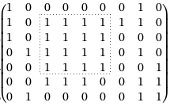
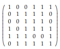
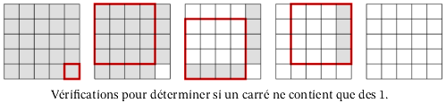

# TP : Problèmes d'optimisation

Les algorithmes de ce TP ne sont pas à connaître à proprement dit, mais vous devez être capable d'identifier un problème d'optimisation et de le résoudre avec une approche gloutonne et/ou en appliquant les principes de la programmation dynamique. Les problèmes d'optimisation de ce TP sont des grands classiques du domaine.

**Ce TP est à faire en C.**

## I. Carré de 1 dans une matrice

On considère une matrice à coefficients dans $`\{0,1\}`$, et on souhaite trouver le plus grand « carré » composé uniquement de 1 dans cette matrice.

On cherchera la largeur des côtés de ce carré de 1, ainsi que les indices (ligne et colonne) de son coin inférieur droit.

Par exemple, dans la matrice ci-dessus, le plus grand carré de 1 est de largeur de côté 4, et son coin inférieur droit est aux coordonnées (4, 5) :



> 1. Trouvez à la main la solution au problème pour la matrice suivante :
>
>     
>
> 2. Justifiez qu'il s'agit bien d'un problème d'optimisation.

On note $`M`$ la matrice, et $`(l, c)`$ ses dimensions. On note $`(m_{i,j})_{0\leqslant i < l, 0 \leqslant j < c}`$ les coefficients de la matrice $`M`$.

> 3. Dans la fonction `main` directement, copiez la définition des matrices suivantes, correspondant aux deux exemples ci-dessus :
>
>     ```c
>     int mat_ex1[7][9] = {{1, 0, 0, 0, 0, 0, 0, 1, 0}, {1, 0, 1, 1, 1, 1, 1, 1, 0}, {1, 0, 1, 1, 1, 1, 0, 0, 0}, {0, 1, 1, 1, 1, 1, 0, 1, 0}, {0, 0, 1, 1, 1, 1, 0, 0, 1}, {0, 0, 1, 1, 1, 0, 0, 1, 1}, {0, 1, 0, 0, 0, 0, 0, 1, 1}};
>     const int L_ex1 = 7;
>     const int C_ex1 = 9;
>             
>     int mat_ex2[6][6] = {{1, 0, 0, 1, 1, 1}, {0, 1, 1, 1, 1, 0}, {0, 0, 1, 1, 1, 0}, {1, 0, 1, 1, 1, 1}, {1, 1, 1, 0, 0, 1}, {0, 1, 1, 1, 1, 1}};
>     const int L_ex2 = 6;
>     const int C_ex2 = 6;
>     ```
>     
>     Vous pourrez vous en servir pour tester vos fonctions par la suite.

On décompose le problème en sous-problèmes plus simples à résoudre : pour chaque élément de la matrice $`m_{i,j}`$, on cherche la largeur des côtés du plus grand carré de 1 dont $`m_{i,j}`$ est le coin inférieur droit. On note $`t_{i,j}`$ cette largeur.

Par exemple, pour la première matrice donnée en exemple ci-dessus, $`t_{1, 7} = 1`$, $`t_{4, 1} = 0`$, et $`t_{6, 8} = 2`$.

> 4. Que vaut $`t_{i,j}`$ dans le cas où $`m_{i,j} = 0`$ ?
> 5. Que vaut  $`t_{i,j}`$ dans le cas où $`i=0`$ (première ligne) ou dans le cas où $`j=0`$ (première colonne) ?

Dans le cas restant (si $`m_{i,j} = 1, i>0, j>0`$), pour tester si un carré de largeur `c` dont le coin inférieur droit est $`m_{i,j}`$ ne contient que des 1, il suffit de regarder si les trois carrés suivants, de taille `c-1`, ne contiennent que des 1 :

* celui de coin inférieur droit $`m_{i-1,j-1}`$
* celui de coin inférieur droit $`m_{i,j-1}`$
* celui de coin inférieur droit $`m_{i-1,j}`$

Illustration :



La vérification de ces trois carrés de largeur `c-1` peut bien sûr se faire de la même manière, sur des carrés de largeur de plus en plus petite.

> 6. Justifiez la relation de récurrence suivante (cas où $`m_{i,j} = 1, i>0, j>0`$) :
>
>     $$`t_{i,j} = 1 + \min\{t_{i-1,j-1},t_{i,j-1}, t_{i-1,j} \}`$$
>
> 7. Justifiez qu'il y aura un chevauchement des sous-problèmes, c'est-à-dire que ces trois sous-problèmes vont faire appel plusieurs fois à la vérification d'un même carré.

Nous allons utiliser une matrice pour stocker les $`t_{i,j},\text{ pour } 0\leqslant i < l, 0 \leqslant j < c`$.

> 8. Écrivez une fonction `int** matrice_moins_1(int l, int c)` qui crée et renvoie une matrice remplie de -1 dont les dimensions sont passées en paramètres.
> 9. Écrivez une fonction qui prend en paramètre une telle matrice et libère toute la mémoire associée.
> 10. Écrivez une fonction `int remplir(int l, int c, int M[l][c], int** memo, int i, int j)` qui calcule récursivement $`t_{i,j}`$, stocke le résultat dans la matrice `memo`, puis le renvoie, en respectant les principes de la programmation dynamique.
> 11. Déduisez-en une fonction `int** top_down(int l, int c, int M[l][c])` qui construit et renvoie la matrice contenant les $`t_{i,j},\text{ pour } 0\leqslant i < l, 0 \leqslant j < c`$.

Le problème d'origine consiste donc à trouver $`\max\limits_{0\leqslant i < l, 0 \leqslant j < c} t_{i,j}`$.

> 12. Écrivez une fonction `int plus_grand_carre(int l, int c, int M[l][c], int* ligne, int* colonne)` qui renvoie la largeur des côtés du plus grand carré de 1 de la matrice, et stocke aux adresses données par `ligne` et `colonne` les indices du coin inférieur droit de ce carré.
>
>     *Testez sur les matrices données en exemple plus haut.*
>
> 13. Calculez les complexités temporelle et spatiale de la fonction `plus_grand_carre`.

On rappelle que pour pouvoir utiliser l'approche itérative « de bas en haut » (bottom-up) de la programmation dynamique, il faut impérativement connaître l'ordre de traitement des sous-problèmes.

> 14. Est-ce bien le cas ici ? Dans quel ordre faut-il remplir la matrice ?
> 15. Écrivez une fonction `int** bottom_up(int l, int c, int M[l][c])` qui construit la matrice contenant les $`t_{i,j},\text{ pour } 0\leqslant i < l, 0 \leqslant j < c`$, avec une approche itérative « de bas en haut ».


## II. Découpe optimale

Un tailleur de tissus dispose d’une long ruban de tissu de longueur `T` ainsi que d’un ensemble de `p` pièces qu’il peut fabriquer à l’aide de ce ruban. Chacune des `p` pièces réalisables a une longueur $`l_i`$ et un prix de vente $`v_i`$ ($`0 \leqslant i < p)`$. Toutes les dimensions et prix de vente sont des entiers strictement positifs, en centimètres et euros respectivement.

> 1. Créez un type structuré `piece` avec deux champs pour représenter une pièce de tissu. On pourra utiliser le mot-clef `unsigned` pour représenter le fait que les tailles et prix sont positifs.

On suppose que chacune des pièces peut être réalisée un nombre arbitraire de fois (éventuellement nul). On remarquera que la découpe du tissu est commutative : découper le produit `i` puis le produit `j` donne le même profit que découper le produit `j` puis le produit `i`.

Par exemple, avec `T = 16`, `p = 2`, $`l_0 = 6, v_0 = 3, l_1 = 8, v_1 = 5`$, le tailleur peut choisir de fabriquer une fois la pièce 0 et une fois la pièce 1 pour un profit de 8€ (et il lui reste 2cm de tissu).

Le tailleur doit décider quelles pièces il va réaliser pour maximiser son profit `V`.

> 2. Justifiez qu'il s'agit bien d'un problème d'optimisation.
> 3. On considère les `p = 2` pièces décrites ci-dessus ($`l_0 = 6, v_0 = 3, l_1 = 8, v_1 = 5`$). Déterminez à la main le profit maximal `V` du tailleur, pour `T = 16`, puis pour `T = 21`.
> 4. On rappelle qu'on ne peut réaliser que des découpes de pièces de longueurs entières. Pour un ruban de longueur `T`, combien y a-t-il de manières différentes de le découper ? Une résolution du problème en testant toutes les découpes possibles est-elle envisageable ?

Les pièces qu'il est possible de découper seront stockées dans un tableau de taille `p`.

On se propose d'utiliser une stratégie gloutonne pour répondre au problème. On propose comme choix glouton de sélectionner à chaque étape la pièce dont le ratio « prix de vente / longueur » est maximal, parmi les pièces de longueur inférieure à celle du ruban de tissu restant.

> 5. Écrivez une fonction `bool ratio_inf(piece p1, piece p2)` qui renvoie `true` si le ratio « prix de vente / longueur » de la pièce `p1` est strictement inférieur à celui de la pièce `p2`, et `false` sinon.
> 7. Écrivez une fonction `void tri(int p, piece pieces[p])` qui trie le tableau de pièces dans l'ordre croissant de leurs ratios « prix de vente / longueur ». Vous utiliserez l'algorithme de tri rapide avec partition de Lomuto.
> 8. Quelle est la complexité de ce tri ?
> 9. Écrivez une fonction `int decoupe_optimale_glouton(int p, piece pieces[p], unsigned int T)` qui prend en paramètres les pièces qu'il est possible de construire et la longueur `T` du ruban de tissu, et renvoie un entier correspondant au profit réalisé par le tailleur avec la stratégie gloutonne.
> 10. Cette stratégie gloutonne renvoie-t-elle toujours la solution optimale ?

On va maintenant utiliser la programmation dynamique pour répondre au problème.

On note $`V_t`$ le profit maximal pour un ruban de longueur `t`.

> 10. Que vaut $`V_0`$ ?
>
> 13. Justifiez la relation de récurrence suivante, pour `t > 0` :
>
>     $$`V_t = \max\limits_{0 \leqslant i < p,\; l_i \leqslant t} \{V_{t-l_i} + v_i\}`$$
>
> 14. Justifiez la pertinence de l'usage de la programmation dynamique.

Nous allons utiliser un tableau pour la mémoïsation.

> 13. Faîtes un schéma qui détaille l'organisation de ce tableau.
> 15. Peut-on déterminer l'ordre de résolution des sous-problèmes afin d'utiliser une approche de bas en haut ?
> 16. Écrivez une fonction `int decoupe_optimale_bottom_up(int p, piece pieces[p], unsigned int T)` faisant les calculs itérativement, « de bas en haut ».
> 17. Écrivez aussi une fonction `int decoupe_optimale_top_down(int p, piece pieces[p], unsigned int T)` utilisant de la récursivité avec mémoïsation.
> 18. Que valent les complexités temporelle et spatiale ? Commentez.

On veut maintenant reconstruire la solution optimale à partir du profit calculé.

On note `memo` la structure utilisée pour la mémoïsation ci-dessus. On cherche à retrouver, à partir de `memo`, la liste `decoupes` des longueurs des pièces à fabriquer pour réaliser le profit maximal. Il suffit pour cela de partir du profit `memo[T]` et de déterminer l'indice `i` d'une pièce telle que $`\text{memo}[T - l_i] + v_i = \text{memo}[T]`$ . On continue ensuite avec un ruban de longueur $`T - l_i`$, et ce jusqu’à ce qu’aucune pièce ne puisse plus être fabriquée.

> 18. Écrivez une fonction `liste reconstruit_decoupe_optimale(int p, piece pieces[p], unsigned int T, int* memo)` qui renvoie la liste `decoupes` définie ci-dessus.


## Pour aller plus loin

> **Résolution naïve du plus grand carré de 1**
>
> On peut résoudre « naïvement » le problème de la recherche du plus grand carré de 1 dans une matrice.
>
> 1. Écrire une fonction `int largeur_i_j(int l, int c, int M[l][c], int i, int j)` qui renvoie la largeur du plus grand carré de 1 dont $m_{i, j}$ est le coin inférieur droit. Pour cela, on regarde s'il existe un carré de 1 de largeur 1 (c'est-à-dire s'il y a un 1 à l'indice $`i, j`$), puis s'il en existe un de largeur 2, etc. jusqu'à trouver la largeur maximale.
>
>     Exemples :
>
>     ```c
>     int t_4_5 = largeur_i_j(L_ex1, C_ex1, ex1, 4, 5); // doit donner 4
>     int t_6_8 = largeur_i_j(L_ex1, C_ex1, ex1, 6, 8); // doit donner 2
>     int t_0_7 = largeur_i_j(L_ex1, C_ex1, ex1, 0, 7); // doit donner 1
>     int t_1_7 = largeur_i_j(L_ex1, C_ex1, ex1, 1, 7); // doit donner 1
>     int t_0_0 = largeur_i_j(L_ex1, C_ex1, ex1, 0, 0); // doit donner 1
>     int t_6_4 = largeur_i_j(L_ex1, C_ex1, ex1, 6, 4); // doit donner 0
>     ```
>
> 2. En déduire une fonction `int plus_grand_carre_naif(int l, int c, int M[l][c], int* ligne, int* colonne)` qui renvoie la largeur des côtés du plus grand carré de 1 de la matrice, et stocke aux adresses données par `ligne` et `colonne` les indices du coin inférieur droit de ce carré.
>
> 3. Donner la complexité de cette approche, et comparer avec la programmation dynamique mise en place au début du TP.
>
> **Choix gloutons pour la découpe du ruban**
>
> Il y a en fait plusieurs choix gloutons possibles pour trouver la découpe optimale du ruban : sélectionner à chaque étape la pièce dont le ratio prix de vente / longueur est maximal, ou sélectionner la pièce de prix de vente maximal, ou sélectionner la pièce de longueur minimale, ou ...
>
> 4. Un de ces choix gloutons donne-t-il la solution optimale ?
>
> Il est possible, comme avec la programmation dynamique, de récupérer la liste des longueurs des pièces sélectionnées par le glouton.
>
> 5. Modifiez la fonction `decoupe_optimale_glouton` pour renvoyer la liste des longueurs des pièces sélectionnées (la liste pourra être dans un ordre quelconque).
>
> **Rendu de monnaie**
>
> 6. Reprenez le problème de rendu de monnaie vu en cours et implémenter sa résolution avec un algorithme glouton et/ou avec de la programmation dynamique en C.


---

Par *Justine BENOUWT*

Sous licence [*CC BY-NC-SA*](https://creativecommons.org/licenses/by-nc-sa/4.0/)


Source des images : *production personnelle*, T. Cousin
