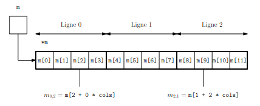

# TP : Tableaux en C

Pour rappel, vous devez compiler vos programmes avec la commande suivante :

```bash
$ gcc -Wall -Wextra -Werror -fsanitize=address -o executable codes_sources.c
```

Si vous ne l'aviez pas déjà notée quelque part lors du TP précédent, faîtes le maintenant : je ne la rappellerai plus dans les TP suivants.

> 0. Créez un fichier `tableaux.c` contenant directement la fonction principale `main` et incluant le fichier `librairies.h`.

Il y a deux manières de créer un tableau en C : on peut l'allouer **statiquement** (dans la pile, à la compilation) ou **dynamiquement** (dans le tas, lors de l'exécution).

## I. Tableaux statiques

On peut déclarer un tableau statique de la manière suivante :

```c
int nom_du_tableau[3] = {6, 9, 4};
```

On a alors un tableau d'entier (int) de taille 3 et initialisé avec les valeurs 6 (première case), 9 (deuxième case) et 4 (troisième case).

Il est également possible de déclarer un tableau statique ainsi (la taille est alors déduite de l'initialisation) :

```c
int nom_du_tableau[] = {6, 9, 4};
```

Les indices dans un tableau vont de 0 à la taille du tableau - 1. Les tableaux sont mutables.

> 1. Dans le `main`, copiez les lignes suivantes et testez :
>
>     ```c
>     int tab[3] = {6, 9, 4};
>     printf("%d\n", tab[2]);
>     ```
>
> 2. Ajoutez les lignes suivantes, et testez :
>
>     ```c
>     tab[2] = 8;
>     printf("%d\n", tab[2]);
>     ```
>
> 3. Ajoutez la ligne suivante :
>
>     ```c
>     printf("%d\n", tab[5]);
>     ```
>
>     Essayez de compiler avec toutes les options, puis essayez de compiler sans aucune option et exécutez. Que se passe-t-il ?

Comme le C ne vérifie pas la licéité des accès, tenter de lire plus loin dans la mémoire peut fonctionner (ou pas si la zone nous est interdite) mais renvoyer n'importe quoi. Pire, on pourrait modifier malencontreusement une autre variable du programme !

Il est également possible de déclarer un tableau statique sans l'initialiser :

```c
int nom_du_tableau[3];
```

> 4. Dans le main,
>
>     * copiez les lignes suivantes,
>     * essayez de compiler avec toutes les options,
>     * puis essayez de compiler sans aucune option et exécutez.
>
>     ```c
>     double tab_non_initialise[100];
>     for (int i = 0; i < 100; i += 1) {
>         printf("%f ", tab_non_initialise[i]);
>     }
>     printf("\n");
>     ```
>
>     Qu'obtenez-vous ?
>
> 4. Ajoutez au code précédent une boucle for qui initialise toutes les valeurs du tableau à 0 (avant la boucle qui fait les affichages).

On dit qu'un tableau est **statique** quand sa taille est connue à la compilation.

La taille doit donc être une constante *littérale* :

```c
int tab[3]; // OK

int n = 3;
int tab[n]; // NON
```

De plus, une fois le tableau créé, on a aucun moyen de connaître sa taille.

Lorsqu'on crée un tableau, on va donc avoir besoin de conserver en mémoire sa taille. En effet, ce ne serait pas très pratique de devoir repréciser à la main la taille du tableau à chaque fois qu'on l'utilise. Imaginez si, après avoir tout codé, on se rend compte qu’il faudrait en fait un tableau de taille 12 et non 10, il faudrait remplacer tous les 10 de notre code par des 12 (ce qui serait fastidieux, et on risquerait d’en oublier) !

Comme la taille d'un tableau est fixe, on va utiliser pour cela une constante :

```c
int tab[3];
const int TAILLE_TAB = 3;
```

C'est une bonne pratique de mettre le nom des constantes en majuscule. Pour la taille d'un tableau, on l'appellera généralement `TAILLE_NOMDUTABLEAU`.

Dans la suite, quand on parcourt le tableau notamment, on utilisera la constante `TAILLE_TAB`. La taille d'un tableau ne doit donc être écrite à la main que deux fois dans tout votre programme.

*Remarque : pour ceux qui ont déjà programmé en C, vous avez peut-être déjà utilisé la directive #define. Le programme précise clairement de ne jamais l'utiliser, donc on ne peut pas s'en servir pour la taille des tableaux.*

> 6. Dans le main toujours, déclarez un tableau d'entiers de taille 10 non initialisé.
> 7. Écrivez une boucle for qui initialise le tableau tel que chaque case ait pour valeur son indice (0 dans la case 0, 1 dans la case 1, etc.).
> 8. Écrivez une boucle for qui affiche toutes les valeurs du tableau, séparées par un espace, avec un retour à la ligne final.
> 9. Pour les trois questions précédentes, avez-vous bien écrit "10" à la main seulement deux fois ?

On remarquera que **`{1,2,3}` n'est pas un tableau**. C'est juste une syntaxe pour initialiser les premières valeurs. On ne peut donc pas affecter de valeur à un tableau, ce n'est pas une variable. Ceci ne fonctionne pas :

```c
int t5[5];
t5 = {1,2,3,4,5}; // NON ! {1,2,3,4,5} N'EST PAS UN TABLEAU !
```

Pour passer un tableau statique en paramètre d'une fonction, on procède ainsi :

```c
type_retour nom_fonction (int tab[], int taille) {
    ....
}
```

On remarque qu'on est à nouveau obligés de passer la taille du tableau en paramètre.

> 10. Toujours dans le fichier `tableaux.c`, écrivez une fonction `affiche_tableau` qui affiche le contenu d'un tableau d'entiers (en séparant les entiers par un espace et en revenant à la ligne à la fin).
> 11. Écrivez une fonction `initialise_0` qui initialise toutes les valeurs d'un tableau passé en paramètre à 0. Le type de retour de cette fonction est `void`.

Voici donc un **résumé des manipulations pour les tableaux statiques** (taille connue à la compilation) :

```c
// création non initialisée :
type t[/*TAILLE LITTERALE*/];
const int TAILLE_T = /*TAILLE LITTERALE*/;

// création initialisée :
type t[/*TAILLE LITTERALE*/] = {/*valeurs séparées par des virgules*/};
const int TAILLE_T = /*TAILLE LITTERALE*/;

// accès à un élément d'indice i (entre 0 inclus et TAILLE_T exclus) :
t[i]; // si i invalide on peut avoir un segfault ou une valeur quelconque

// modification d'un élément d'indice i :
t[i] = /*nouvelle_valeur*/;

// parcours d'un tableau :
for (int i = 0; i < TAILLE_T; i += 1) {
    /* ... */
}
```

## II. Tableaux et pointeurs

Pour passer un tableau statique en paramètre d'une fonction, on procède ainsi :

```c
type_retour nom_fonction (int tab[], int taille) {
    ....
}
```

La déclaration de la fonction dans le fichier d'entête se fait alors ainsi :

```c
type_retour nom_fonction (int*, int);
```

Ce qui signifierait qu'un tableau `type t[]` serait équivalent à un pointeur `type* t` ?

Et bien oui ! En C, tout tableau est en réalité **un pointeur dont la valeur est l'adresse du premier élément du tableau**.

Dans la déclaration `int tab[10]`, `tab` est donc un pointeur dont la valeur est `&tab[0]`, c'est-à-dire l'adresse de `tab[0]`.

Pour accéder à un élément d'indice `i`, on a donc deux syntaxes possibles :

* `tab[i]`
* `*(tab + i)`

Ainsi, les 3 programmes suivants sont équivalents :

```c
// PROGRAMME 1
int main() {
    int t[5] = {1,4,7,0,9};
    const int TAILLE_T = 5;
    for (int i = 0; i < TAILLE_T; i += 1) {
        printf("%d\n", t[i]);
    }
}

// PROGRAMME 2
int main() {
    int t[5] = {1,4,7,0,9};
    const int TAILLE_T = 5;
    for (int i = 0; i < TAILLE_T; i += 1) {
        printf("%d\n", *(t + i));
    }
}

// PROGRAMME 3
int main() {
    int t[5] = {1,4,7,0,9};
    const int TAILLE_T = 5;
    for (int* p = t; p < t+TAILLE_T; p += 1) {
        printf("%d\n", *p);
    }
}
```

> 1. Lequel est le plus lisible ? Lequel faut-il donc mieux utiliser ?

Mais quel est l'avantage au fait qu'un tableau soit un pointeur vers son premier élément ?

Quand on passe un tableau en paramètre à une fonction, ce n'est pas l'ensemble du tableau qui est transmis, mais simplement l'adresse de la première case du tableau. Il n'y a donc pas de copie intégrale du tableau comme c'est le cas pour les types de base. Ce qui est très bien pour la complexité spatiale de nos programmes.

> 2. Testez les deux programmes suivants sur [C Tutor](https://pythontutor.com/visualize.html#mode=edit), voyez-vous bien la différence en terme de mémoire ? :
>
>     ```c
>     // PROGRAMME 1
>     #include <stdio.h>
>     void f(int a, int b, int c, int d) {
>         printf("%d %d %d %d\n",a, b, c, d);
>     }
>     int main() {
>         int a = 1;
>         int b = 2;
>         int c = 3;
>         int d = 4;
>         f(a,b,c,d);
>     }
>     ```
>     
>     ```c
>     // PROGRAMME 2
>     #include <stdio.h>
>     void f(int t[]) {
>         printf("%d %d %d %d\n",t[0], t[1], t[2], t[3]);
>     }
>     int main () {
>         int t[4] = {1,2,3,4};
>         f(t);
>     }
>     ```
>

Les deux définitions suivantes sont donc strictement équivalentes lorsqu'on souhaite passer un tableau statique en paramètre d'une fonction :

```c
type_retour fonction(type tableau[], int taille) {
    ...
}
type_retour fonction(type* tableau, int taille) {
    ...
}
```

Mais `type* tableau` pourrait aussi très bien désigner... un pointeur sur une adresse unique, qu'on aurait maladroitement appelé "`tableau`". On préférera donc la première écriture pour éviter les confusions.

> 3. Avec juste le code suivant et sans explications, pouvez-vous déterminer si le paramètre est un tableau ou un pointeur vers un entier ?
>
>     ```c
>     void f(int* a, int b) {
>         if (*a < b) {
>             printf("%d\n", *a);
>         }
>     }
>     ```
>
>     Testez le avec le main suivant dans [C Tutor](https://pythontutor.com/visualize.html#mode=edit), :
>
>     ```c
>     int main () {
>         int t[4] = {1,2,3,4};
>         f(t,10);
>         int x = 1;
>         f(&x,10);   
>     }
>     ```
>
>     Est-ce que cela fonctionne ? Comprenez-vous bien pourquoi ?
>
>     Comprenez-vous pourquoi on choisira d'écrire `int a[]` comme paramètre de la fonction si elle est destinée à des tableaux ?

Si un tableau est un pointeur, on peut donc raisonner dans l'autre sens et se dire qu'un pointeur est un tableau à une case. Autrement dit, si `p` est un pointeur, les expressions `p[0]` et `*p`. sont équivalentes...

Pour plus de lisibilité et éviter les erreurs d'accès hors bornes :

* on utilise `*x` sur les pointeurs sur des types de base
* on utilise `x[...]` sur les tableaux.

## III. Tableaux dynamiques

La manipulation de tableaux statiques possède des inconvénients :

* on ne peut pas créer de tableaux dont la taille est une variable du programme (quand on ne connaît pas la taille à l'avance)
* on ne peut pas renvoyer un tableau créé dans une fonction (puisqu'il est dans la pile)
* on ne peut pas créer de tableaux bidimensionnels dont les lignes n'ont pas tous le même nombre d'éléments
* ...

Ces opérations deviennent possibles dès qu'on manipule des **tableaux alloués dynamiquement** :

```c
int taille_tableau = ...;
type* nom_tableau = malloc(taille_tableau * sizeof(type));
...
free(nom_tableau);
```

> 1. Testez le code suivant dans [C Tutor](https://pythontutor.com/visualize.html#mode=edit) :
>
>     ```c
>     #include <stdlib.h>
>     int main () {
>         int n = 5;
>         int* t = malloc(n * sizeof(int));
>         for (int i = 0; i < n; i += 1) {
>             t[i] = i;
>         }
>         free(t);
>     }
>     ```
>     
>     Le tableau est-il créé sur la pile ou sur le tas ?
>     
>     À partir de quelle instruction est-il licite de lire des valeurs dans le tableau (à partir de quelle ligne le tableau est-il initialisé) ?

Il faut être vigilent, `malloc` nous alloue une zone pour stocker les valeurs de notre tableau, mais il n'est pas initialisé. C'est à nous de le faire à la main.

> 2. Écrire (dans le fichier `tableaux.c`) une fonction `cree_n_x` qui prend en paramètre une taille `n` et un entier `x` et crée un tableau de `n` cases toutes initialisés à `x`. Que doit renvoyer cette fonction ?
>
>     Pour tester votre fonction, placez les lignes suivantes dans le `main` :
>
>     ```c
>     const int TAILLE_T = 10;
>     int* t = cree_n_x(TAILLE_T, 1);
>     for (int i = 0; i < TAILLE_T; i += 1) {
>         printf("%d ", t[i]);
>     }
>     free(t);
>     ```
>
>     Pourquoi l'allocation du tableau doit-elle être dynamique ?

L'allocation du tableau est certes dynamique (zone mémoire allouée au cours de l'exécution), mais sa taille reste fixe. Une fois alloué, la taille du tableau ne peut plus changer. On pourrait se dire qu'il suffit de libérer l'espace puis d'en allouer un plus grand, mais est-ce alors vraiment le même tableau ?

> 3. Testez le code suivant dans le `main` :
>
>     ```c
>     int petit_n = 5;
>     int grand_n = 20;
>     int* t;
>     t = malloc(petit_n * sizeof(int));
>     printf("le tableau est situé à l'adresse : %p\n", t);
>     free(t);
>     t = malloc(grand_n * sizeof(int));
>     printf("le tableau est situé à l'adresse : %p\n", t);
>     free(t);
>     ```
>     
>     Alors, est-ce le même tableau ?

Pour résumer :

* on alloue **statiquement** un tableau (avec la syntaxe vu au début du TP) lorsqu'on connaît sa taille à l'avance (à la compilation) et il sera alors stocké dans la **pile** d'exécution ;
* on alloue **dynamiquement** un tableau (avec `malloc` et `free` vus dans le TP précédent) lorsque sa taille ne sera déterminée qu'au cours de l'exécution ou qu'on veut qu'une fonction puisse renvoyer le tableau, et il sera alors stocké dans le **tas**.

## IV. Tableaux multidimensionnels

Un tableau multidimensionnel est, par définition, un tableau contenant d'autres tableaux (contenant éventuellement d''autres tableaux...).

On peut bien sûr les allouer statiquement ou dynamiquement.

Voici **la syntaxe pour l'allocation statique** :

```c
int tab1[2][3] = {{1,2,3},{4,5,6}}; // initialisé
int tab2[2][3]; // non initialisé
const int NB_LIGNES = 2;
const int NB_COLONNES = 3;
```

On accède alors à la valeur de la ligne `i`  et colonne `j` avec `tab[i][j]`.

> 1. Recopiez et complétez les lignes suivantes dans le `main`, pour initialiser le tableau `t` avec des 0 puis l'afficher:
>
>     ```c
>     int t[5][10];
>     const int NB_LIGNES_T = 5;
>     const int NB_COLONNES_T = 10;
>     for (int i = 0; i < /*COMPLETER ICI*/; i += 1) {
>         for (int j = 0; j < /*COMPLETER ICI*/; j += 1) {
>             t[/*COMPLETER ICI*/][/*COMPLETER ICI*/] = 0;
>         }
>     }
>     /*
>     AJOUTER ICI LE NÉCESSAIRE POUR AFFICHER t
>     */
>     ```
>

Dans le code précédent :

* `t` est un tableau d’éléments de type `int*`
* chaque `t[i]` est un tableau d’éléments de type `int`.

`t` étant un pointeur pointant vers un élément de type `int*`, `t` est donc de type `int**`.

Voici **la syntaxe pour l'allocation dynamique** :

```c
// constantes pour la taille
const int NB_LIGNES = 2;
const int NB_COLONNES = 3;
// allocation du tableau bidimentionnel
int** t = malloc(NB_LIGNES * sizeof(int*));
for (int i = 0; i < NB_LIGNES; i += 1) {
    t[i] = malloc(NB_COLONNES * sizeof(int));
}
// initialisation
for (int i = 0; i < NB_LIGNES; i += 1) {
    for (int j = 0; j < NB_COLONNES; j += 1) {
        t[i][j] = 1;
    }
}
// liberation
for (int i = 0; i < NB_LIGNES; i += 1) {
    free(t[i]);
}
free(t);
```

> 2. Quand on crée un tableau bidimensionnel, combien d'allocations sont nécessaires ? de quelles tailles ? de quels types ? Combien de libération sont nécessaires ?

Pour réaliser une allocation dynamique d'un tableau bidimensionnel `type**`, il faut :

* allouer une zone mémoire constituée de pointeurs `type*` (une case par ligne du tableau)
* allouer à chaque pointeur `type*` (donc à chaque ligne) une zone mémoire constituée d'éléments de type `type` (une case par colonne)

Lors de la libération, il faut donc que chaque `malloc` soit associé à un `free` donc il faut bien libérer chaque ligne puis libérer le tableau.

> 3. Écrire (dans `tableaux.c`) une fonction `cree_tableau_dynamique_bidimensionnel` qui prend en paramètre un nombre de lignes, un nombre de colonnes, et un entier, et renvoie un tableau à deux dimensions initialisés avec l'entier. Quel est son type de retour ?
> 
>     Testez votre fonction en n'oubliant pas de libérer ce qu'il faut.

Pour prendre en paramètre un tableau bidimensionnel, notre fonction aura la forme suivante :

```c
type_retour fonction (type** tableau, int nb_lignes, int nb_colonnes)
```

Il est bien évidemment possible de suivre ces mêmes méthodes pour manipuler des tableaux à plus de deux dimensions.

> 4. De quel type serait un tableau d'entiers à 3 dimensions ? 4 dimensions ?

On conviendra que ce n'est pas très pratique d'allouer un tableau bidimensionnel ainsi. On est obligés de faire une boucle pour allouer chaque ligne une par une ; et recommencer pour la libération...

Pour remédier à cet inconvénient, il est possible de **linéariser** des tableaux multidimensionnels.

La solution la plus simple serait d'avoir un seul et unique `malloc` qui alloue toutes les cases nécessaires d'un coup. On a donc besoin de `n * m` cases pour un tableau bidimensionnel de `n` lignes et `m` colonnes.

```c
int n = /*nombre de lignes*/;
int m = /*nombre de colonnes*/;
type* t = malloc(n * m * sizeof(type))
```

> 5. Pourquoi le type du tableau est-il alors `type*` et non `type**` ?
>
>     Comment faut-il alors libérer la mémoire ?

Si on a un seul `malloc`, il faut donc un seul `free`.

Pour accéder à la case située à la ligne `i` et colonne `j`, on ne peut par contre plus écrire `t[i][j]`. Il faut faire un petit calcul pour trouver la case : `t[i * m + j]`.

Exemple en image :



De manière générale, on choisira :

* un tableau multidimensionnel classique lorsqu'il est déclaré statiquement
* un tableau multidimensionnel linéarisé lorsqu'il est alloué dynamiquement

Mais si un énoncé ne vous impose rien, vous êtes libres de choisir ce que vous préférez.

> 6. Écrire une fonction `int* linearise(int** t, int nb_lignes, int nb_colonnes)` qui prend en paramètre un tableau à 2 dimensions et le linéarise.
> 7. Même question dans l'autre sens.

## V. Exercices

Pour cette partie, les définitions des fonctions sont à placer dans un fichier `algorithmique_tableaux.c`, leurs déclarations dans un fichier d'entête correspondant, et on testera les fonctions depuis le fichier `tableaux.c`.

Vous veillerez à bien conserver ce fichier `algorithmique_tableaux.c`, les fonctions vous resserviront très certainement !

> **Exercice 1 : algorithmes simples**
>
> Pour chacun des problèmes suivants, écrivez une fonction qui renvoie la solution. On travaille à chaque fois sur un tableau non vide d'entiers.
>
> 1. Calculer la somme des éléments.
> 3. Trouver le nombre d'occurrences d'une valeur dans le tableau.
> 4. Trouver le premier indice d'une valeur dans un tableau.
> 5. Trouver le dernier indice d'une valeur dans un tableau.
> 6. Trouver le minimum et le maximum du tableau (il faudra stocker au moins l'un des deux dans un pointeur passé en paramètre !).
> 7. Trouver l'indice du minimum du tableau.
> 8. Trouver l'indice du maximum du tableau.
> 9. Déterminer si le tableau est trié dans l'ordre croissant.
> 
>*Vous devez impérativement être capables de ré-écrire toutes ces fonctions rapidement.*

> **Exercice 2 : copie de tableaux**
>
> Pour copier un tableau dans un autre, on ne *peut pas* simplement écrire `tab2 = tab1` (puisque ce sont des pointeurs, on copie ici l'adresse pas les valeurs). Il faut parcourir `tab1`  et initialiser les valeurs de `tab2` une par une.
>
> 1. Écrivez une fonction `void copie_tableau (int tab_original[], int tab_copie[], int taille)` qui copie le contenu du premier tableau dans le second. Les 2 tableaux ont donc la même taille.
> 2. Écrivez une fonction `int* copie(int tab[], int n)` qui renvoie la copie du tableau passé en paramètre.
> 3. Écrivez une fonction qui prend en paramètre un tableau bidimensionnel et renvoie une copie de ce tableau.

> **Exercice 3 : initialisation de tableaux statiques**
>
> 1. Écrivez une fonction `initialise_croissant` qui initialise les valeurs d'un tableau passé en paramètre avec les entiers de 0 à la taille du tableau - 1. Le type de retour est `void`.
> 2. Écrivez de même une fonction `initialise_decroissant` qui initialise les valeurs d'un tableau de la taille du tableau -1 à 0.
> 3. Écrivez de même une fonction `initialise_lecture` qui initialise les valeurs d'un tableau avec un entier lu sur l'entrée standard (avec `scanf`).
> 4. * Écrivez de même une fonction `initialise_aleatoire` qui initialise toutes les valeurs d'un tableau avec des nombres aléatoires compris entre 0 et la taille du tableau - 1. Vous pourrez utiliser la fonction `int rand(void)` de la bibliothèque `stdlib.h`.
>     * Testez votre fonction plusieurs fois. Que remarquez-vous ?
>     * Pour avoir des nombres réellement aléatoires, il faut initialiser le générateur avec `srand(time(NULL))`, en incluant la bibliothèque `<time.h>`. Cette bibliothèque n'étant pas au programme, incluez la directement dans votre fichier `tableaux.h` et non pas dans `librairies.h`. Initialisez le générateur (dans le `main`) et retestez.
>

> **Exercice 4 : renvoi de tableaux dynamiques**
>
> 1. On considère une suite numérique $`(u_n)_{n\in\mathbb N}`$ donnée par son premier terme $`u_0`$ et la relation de récurrence $`u_{n+1}=a\times u_n+b`$ avec `a` et `b` des réels. Écrire une fonction `double* premiers_termes(double u0, double a, double b, int n)` qui renvoie un tableau de taille `n` contenant les `n` premiers termes de la suite.
> 2. Écrivez une fonction qui lit sur l'entrée standard une taille ainsi que l'entier souhaité pour l'initialisation, et renvoie un tableau de taille souhaitée initialisé avec la valeur lue.
> 3. Écrivez une fonction qui lit sur l'entrée standard la taille `n` du tableau d'entiers souhaité puis lit une par une les valeurs à placer dans le tableau.
> 4. Écrivez une fonction qui lit sur l'entrée standard un nombre de lignes et de colonnes, crée le tableau bidimensionnel correspondant, puis initialise toutes les cases à 0.
> 5. Écrivez une fonction qui prend en paramètre une longueur, une hauteur et une profondeur et renvoie un tableau à trois dimensions correspondant, dont tous les cases sont initialisées à 0.
> 6. Écrire une fonction qui prend en paramètre un nombre de lignes et un nombre de colonnes et renvoie un tableau linéarisé dont chaque case `i, j` vaut `i + j`.

> **Exercice 5 : triangle de Pascal**
>
> Contrairement aux tableaux déclarés statiquement, on peut choisir des tailles différentes pour chaque ligne d'un tableau alloué dynamiquement.
>
> On veut créer des tableaux `t` de taille `n + 1` tels que $`t[i] = \binom n i`$ (c'est-à-dire la `n`-ième ligne du triangle de Pascal).
>
> ```c
> int t0[] = {1};
> int t1[] = {1,1};
> int t2[] = {1,2,1};
> int t3[] = {1,3,3,1};
> ```
>
> Étant donné un tel tableau `t` (pour un certain `n`), on peut construire la ligne `n+1` comme suit :
>
> * on crée un tableau de taille `n+2`
> * on met 1 dans la première et la dernière case
> * pour toute autre case d'indice `i`, on met la valeur de `t[i-1] + t[i]`.
>
> 1. Écrire une fonction `int* prochaine_ligne(int t[], int n)` implémentant cet algorithme.
> 2. Écrire une fonction `int** triangle_de_pascal(int n)` qui renvoie un tableau contenant les `n` premières lignes du triangle de Pascal.
> 3. Afficher les 10 premières lignes du triangle de Pascal.

## Pour aller plus loin

> **Initialisation partielle d'un tableau statique**
>
> Il est possible d'initialiser partiellement seulement un tableau statique avec des valeurs.
>
> Testez le code suivant avec [C Tutor](https://pythontutor.com/visualize.html#mode=edit), et en déduire les règles pour l'initialisation des tableaux :
>
> ```c
> int main() {
>  int tab1[5] = {0, 1, 2, 3, 4};
>  int tab2[5] = {0, 1, 2};
>  int tab3[5] = {0};
>  int tab4[15] = {2};
>  double tab5[100] = {7.2};
> }
> ```
>
> **Retour sur les pointeurs**
>
> On considère les deux fonctions suivantes :
>
> ```c
> void extrema (int t[], int taille, int* min, int* max) {
>  int mini = t[0];
>  int maxi = t[0];
>  for (int i = 1; i < taille; i += 1) {
>    if (t[i] < mini) {
>        mini = t[i];
>    }
>    if (t[i] > maxi) {
>        maxi = t[i];
>    }
>  }
>  *min = mini;
>  *max = maxi;
> }
> 
> void exxtrema (int t[], int taille, int* min, int* max) {
>  int mini = t[0];
>  int maxi = t[0];
>  for (int i = 1; i < taille; i += 1) {
>    if (t[i] < mini) {
>        mini = t[i];
>    }
>    if (t[i] > maxi) {
>        maxi = t[i];
>    }
>  }
>  min = &mini;
>  max = &maxi;
> }
> ```
>
> * Que font-elles ?
>
> * Sont-elles équivalentes ? Faut-il privilégier une version par rapport à l’autre ?
>
> * Pour vous aider, exécutez le code suivant sur [C Tutor](https://pythontutor.com/visualize.html#mode=edit) :
>
>     ```c
>     int main(){
>         int t[] = {1,2,3,2,5,4,1,7,6,9,1};
>         int* min = malloc(sizeof(int));
>         int* max = malloc(sizeof(int));
>         extrema(t, 11, min, max);
>         printf("min = %d, max = %d\n", *min, *max);
>         int* min1 = malloc(sizeof(int));
>         int* max1= malloc(sizeof(int));
>         exxtrema(t, 11, min1, max1);
>         printf("min = %d, max = %d\n", *min1, *max1);
>         free(min);
>         free(max);
>         free(min1);
>         free(max1);
>     }
>     ```
>
> **S'entraîner à coder en C**
>
> Si vous avez terminé, vous pouvez aller vous entraîner sur [France-IOI](http://www.france-ioi.org/algo/chapters.php). Ce site propose de nombreux cours, exercices et problèmes dans plusieurs langages de programmation. Il n'est pas bien adapté à OCaml, mais est vraiment très bien fait pour le C.


---

Par *Justine BENOUWT*

Sous licence [*CC BY-NC-SA*](https://creativecommons.org/licenses/by-nc-sa/4.0/)


Source des images : *production personnelle*
