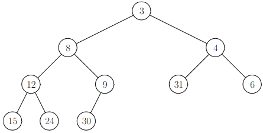
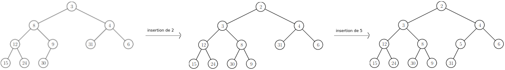
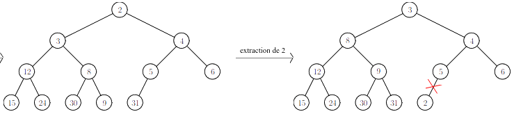

# TP : Tas

***Ce TP est à faire en C.***

Nous allons découvrir ici quelques arbres binaires particuliers, les *tas* ; la structure qu'ils permettent d'implémenter, la *file de priorité* ; et un dernier algorithme de tri, *le tri par tas*.

*Nous ne ferons pas de TD sur les tas, il est donc important de faire **toutes** les questions, pas seulement celles demandant de programmer !*

## I. Implémentation des tas

> 1. Rappelez ce qu'est un arbre binaire complet à gauche.
> 2. Rappelez comment stocker un arbre binaire complet à gauche dans un tableau :
>     * dans quel ordre sont stockés les nœuds ?
>     * où sont stockés les fils gauche et droit d'un nœud rangé à l'indice `i` ?
>     * où est stocké le père d'un nœud rangé à l'indice `i` ?
> 3. En utilisant de la programmation défensive, implémentez les trois fonctions suivantes :
>     * `int fils_gauche(int i, int n)` renvoie l'indice du fils gauche du nœud rangé à l'indice `i` dans un tableau représentant un arbre binaire complet à gauche à `n` nœuds, ou -1 s'il n'en possède pas ;
>     * `int fils_droit(int i, int n)` renvoie l'indice du fils droit du nœud rangé à l'indice `i` dans un tableau représentant un arbre binaire complet à gauche à `n` nœuds, ou -1 s'il n'en possède pas ;
>     * `int pere(int i, int n)` renvoie l'indice du père du nœud rangé à l'indice `i` dans un tableau représentant un arbre binaire complet à gauche à `n` nœuds, ou -1 s'il n'en possède pas.

On suppose que l'ensemble des étiquettes de l'arbre est muni d'une relation d'ordre totale $`\prec`$. Un **tas** est un arbre binaire complet à gauche tel que pour chaque nœud $`x`$, tous ses fils $`y`$ respectent $`x\prec y`$.

Voici `exemple1`, un exemple de tas avec la relation $`\leqslant`$, aussi appelé **tas-min** :



Voici `exemple2`, un autre exemple de tas muni cette fois de la relation $`\geqslant`$, aussi appelé **tas-max** :


> 4. Donnez une définition inductive d'un tas-max, et une d'un tas-min.

On supposera pour ce TP que les étiquettes des nœuds des tas sont des entiers, et on utilisera le type suivant pour implémenter nos tas :

```c
struct tas_s {
    int* elements; // tableau représentant le tas
    int nb_elements; // nombre actuel de nœuds dans le tas
    int capacite_maximale; // nombre maximal de nœuds que peut contenir le tas
    bool est_tas_min; // true s'il s'agit d'un tas-min, false s'il s'agit d'un tas-max
};
typedef struct tas_s tas;
```

Le champ `capacite_maximale` correspond à la taille de la zone allouée pour le champ `elements`. On considérera pour commencer que cette capacité est fixe : si le nombre d'éléments est égal à la capacité maximale, alors le tas est plein et on ne peut plus lui ajouter de nœuds.

> 5. Écrivez une fonction `tas* tas_vide(int, bool)` qui crée un tas vide de capacité maximale et de type (tas-min ou tas-max) donnés en paramètre.
>
> 6. Écrivez une fonction `void tas_detruit(tas*)` qui libère toute la mémoire associée à un tas.
>
> 7. Que fait la fonction suivante ? Ajoutez les assertions nécessaires à la vérification des préconditions.
> 
>     ```c
>     void tas_initialise(tas* t, int n, int tableau[n]) {
>         // préconditions : le tas est vide, et de capacité suffisante
>         for (int i = 0; i < n; i += 1) {
>             t->elements[i] = tableau[i];
>         }
>         t->nb_elements = n;
>         }
>    ```
> 
>8. Dessinez le tas implémenté par `exemple3` dans le `main` suivant. De quel type de tas s'agit-il ?
> 
>    ```c
>     int main() {
>         int tmp[6] = {20, 13, 16, 7, 8, 1};
>         tas* exemple3 = tas_vide(20, false); // capacité 20 pour pouvoir réaliser de futures insertions
>         tas_initialise(exemple3, 6, tmp);
>     }
>    ```
> 
> 9. Implémentez les deux tas `exemple1` et `exemple2` schématisés ci-dessus.

La première opération élémentaire sur les tas est la lecture du minimum (pour les tas-min) / du maximum (pour les tas-max).

> 10.   Où se situe le maximum dans un tas-max ? et le minimum dans un tas-min ?
> 11.   Écrivez une fonction `int tas_lecture_minimum_ou_maximum(tas)` qui prend en paramètre un tas, et renvoie le minimum s'il s'agit d'un tas-min / le maximum s'il s'agit d'un tas-max. On utilisera de la programmation défensive.

La seconde opération élémentaire sur les tas est l'insertion d'un nouvel élément. Pour insérer un élément dans un tas, on l'insère à la prochaine position qui permet de conserver la propriété d'arbre complet à gauche. Puis si l'élément ne respecte pas la relation d'ordre avec son père, on échange leurs valeurs, et ainsi de suite jusqu'à ce que les propriétés du tas soient respectées. On appelle cela une percolation vers le haut (*sift-up*).

Voici deux exemples d'insertion dans le tas-min `exemple1` :



> 12.   Dessinez le tas après insertion de 17 dans le tas-max `exemple2`. Dessinez ensuite ce même tas après insertion de 2.
> 13.   Écrivez une fonction `void tas_insertion(tas*, int etiquette_a_inserer)` qui insère une étiquette dans le tas donné en paramètre, avec percolation vers le haut si nécessaire. On utilisera de la programmation défensive pour le cas où le tas était plein.

La dernière opération élémentaire, et la plus intéressante, est la suppression de l'élément à la racine d'un tas. Pour extraire l'élément à la racine, on échange la racine et le dernier élément du tas (celui situé le plus à droite à la profondeur maximale de l’arbre).

On effectue ensuite une percolation vers le bas (*sift-down*) de cet élément. Voici comment cela fonctionne sur un tas-min :

* On compare l'élément à ses deux fils :
    * s’il est inférieur ou égal à ses deux fils, on s’arrête ;
    * sinon, on l’échange avec le plus petit de ses deux fils et on recommence.

Voici par exemple l’extraction de la racine du tas issu de l’exemple précédent :



> 14. Déroulez ces étapes pour extraire le minimum de `exemple1`, et dessinez le tas résultant de cette extraction.
>
> 15. Même question en adaptant l'algorithme pour extraire le maximum du tas-max `exemple2`.
>
> 16. Justifiez que l'arbre binaire ainsi créé est toujours un tas.
>
> 17. Écrivez une fonction `int tas_extraction_racine(tas*)` qui prend en paramètre un tas, et extrait l'élément à la racine (suppression avec percolation vers le bas, et renvoi de la valeur).  
>     *Indication : vous pouvez par exemple écrire une fonction auxiliaire récursive pour la percolation, prenant en paramètre l'indice du nœud à percoler.*
>
> 18. Simulez en dessinant les évolutions du tas, les insertions successives de 12, 15, 14 et 40 dans le tas `exemple3`.
>
>     Simulez ensuite, en dessinant les évolutions progressives du tas, 5 extractions successives du maximum.
>
> 19. À l'aide de la question précédente, écrivez une série de tests pour vos fonctions d'insertion et de suppression.
>
> 20. Est-ce qu’insérer un élément dans un tas-min plus petit que tous ceux déjà présents, puis l’extraire immédiatement, redonne le même tas qu’à l’origine ?

Les trois opérations précédentes (lecture de la valeur à la racine, insertion à l'aide d'une percolation vers le haut et suppression à l'aide d'une percolation vers le bas) constituent l'interface principale d'un tas. Ce sont les trois opérations pour lesquelles la structure de tas est plus efficace que d'autres structures vues plus tôt cette année.

> 21. Quelle est la hauteur d'un tas contenant `n` éléments ?
>
> 17. Quelle est la complexité de la lecture du minimum (si tas-min) / maximum (si tas-max) dans un tas de taille `n` ?
>
> 18. Quelle est la complexité de l'insertion d'un élément dans un tas de taille `n` ?
>
> 19. Quelle est la complexité de l'extraction du minimum (si tas-min) / maximum (si tas-max) dans un tas de taille `n` ?
>
> 20. Si on avait utilisé une simple liste pour stocker les éléments :
>
>     * en conservant les éléments dans un ordre quelconque dans la liste, quelles auraient été les complexités des trois opérations principales ?
>     * en conservant les éléments dans l'ordre croissant (si extraction du min) / décroissant (si extraction du max), quelles auraient été les complexités des trois opérations principales ?
>
>     Comparez avec les tas.

Les tas auront 2 intérêts particuliers pour nous cette année :

* le tri par tas ;
* l'implémentation d'une file de priorité.

## II. Tri par tas

Le **tri par tas** est le dernier algorithme de tri que nous verrons cette année. On suppose posséder un tableau de $n$ éléments que l'on souhaite ranger en place dans l'ordre croissant.

La première étape est de transformer le tableau en tas-max. Pour cela, il faut parcourir le tableau des indices $`\big\lfloor \frac {n-2}2 \big\rfloor`$ à 0 et effectuer une percolation vers le bas pour chaque indice.

La seconde étape est de faire $n$ extractions du maximum, puisque lors d'une extraction la racine est échangée avec l'élément en dernière position.

> *Application*
>
> 1. Dessinez les évolutions progressives de l'arbre lors du tri par tas du tableau `7,1,12,14,2,5,3,10`.
>
>     Il faut :
>
>     * dessiner l'arbre binaire complet à gauche correspond au tableau ;
>     * dessiner le résultat de chaque percolation vers le bas de la première étape du tri par tas (le dernier dessin de cette étape est donc un tas-max) ;
>     * dessiner le résultat de chaque extraction du maximum de la seconde étape (le dernier dessin de cette étape est donc un tas vide).
>
> *Analyse*
>
> 2. En remplaçant le $`\big\lfloor \frac {n-2}2 \big\rfloor`$ par $`n-1`$, montrez, en exhibant un invariant, que la première étape crée bien un tas-max.
> 2. Expliquez pourquoi il est correct de commencer à l'indice $`\big\lfloor \frac {n-2}2 \big\rfloor`$​.
> 3. Montrez la correction de la seconde étape du tri par tas et justifiez donc la correction de l'algorithme de tri par tas.
> 4. Justifiez que la complexité temporelle dans le pire des cas de la première étape est en $`\mathcal O(n)`$.
> 5. Calculez la complexité temporelle de la seconde étape, et en déduire la complexité temporelle du tri par tas.
> 6. Donnez la complexité spatiale du tri par tas.
> 7. Comparez l'efficacité (temporelle et spatiale) du tri par tas à celles des autres algorithmes de tris vus cette année.
>
> *Implémentation*
>
> 9. Implémentez cet algorithme, `void tri_par_tas(int* tableau_a_trier, int taille_tableau)`.
> 10. Proposez un algorithme permettant de trier un tableau en place dans l'ordre décroissant, et implémentez le : `void tri_par_tas_decroissant(int*, int)`.

Le tri par tas a une complexité temporelle quasi-linéaire, et a l'avantage d'avoir une complexité spatiale constante. Il est très souvent utilisé, par exemple la fonction `sort` du module `Array` en OCaml utilise un tri par tas.

## III. Files de priorité

Une **file de priorité** est une structure de données abstraite dont l'interface est la suivante :

* Créer.
    * Entrées et préconditions : aucune.
    * Sorties et postconditions : une file de priorité vide.

* Test de vacuité.
    * Entrées et préconditions : une file de priorité.
    * Sorties et postconditions : le booléen vrai si la file est vide, faux sinon.

* Enfiler.
    * Entrées et préconditions : une file de priorité $f$, un élément $e$ de type quelconque, une priorité $p$ de type entier.
    * Sorties et postconditions : aucune sortie, mais $f$ contient un élément supplémentaire, $e$, associé à sa priorité $p$.

* Défiler.
    * Entrées et préconditions : une file de priorité $f$ non vide.
    * Sorties et postconditions : l'élément le plus prioritaire est renvoyé, et $f$​​​ ne contient plus cet élément.


Comme nous sommes ici en C, nous ajouterons également cette cinquième opération élémentaire :

* Détruire.
    * Entrées et préconditions : une file de priorité.
    * Sorties et postconditions : aucune sortie, mais toute la mémoire associée à la file est libérée.

> 1. Quels sont les types de ces opérations élémentaires ? (constructeur, etc.)

Pour implémenter une file de priorité, le plus efficace est d'utiliser un tas.

Il existe deux types de files de priorité : soit l'élément le plus prioritaire est celui de priorité associée maximale, soit l'élément le plus prioritaire est celui de priorité associée minimale.

> 2. Pour chacun des deux types de files existantes, indiquez s'il est préférable d'utiliser un tas-min ou un tas-max.

Nous implémenterons ici le second type de file de priorité, ainsi l'opération « défiler » devra supprimer et renvoyer l'élément de priorité associée minimale.

> 3. Que devront contenir les nœuds du tas implémentant la file de priorité ? Comment sera organisé ce tas ?
> 4. Indiquez, pour chaque opération élémentaire de l'interface des files de priorité, à quel opération sur le tas cela correspond.

Les éléments d'une file de priorité pouvant être de n'importe quel type, nous utiliserons l'alias suivant en C :

```c
typedef int contenu; // remplacer 'int' par le type des éléments de la file de priorité
```

> 5. En vous inspirant de la structure définie au début du TP, définissez un type `file_de_priorite`.

Nos files de priorité doivent pouvoir contenir un nombre quelconque d'éléments. Contrairement à ce que nous faisions au début du TP, il faudra donc redimensionner la zone de mémoire allouée, avec la stratégie habituelle :

* si on doit enfiler un élément et que la zone allouée est pleine, on réalloue une zone deux fois plus grande ;
* si on défile un élément et que moins d'un quart de la zone est utilisée, on réalloue une zone deux fois plus petite.

À la création de la file de priorité, on choisit d'allouer une zone pouvant contenir 2 éléments.

> 6. Implémentez toutes les opérations de l'interface des files de priorité :
>     * `file_de_priorite* fp_creer(void)`
>     * `bool fp_est_vide(file_de_priorite* fp)`
>     * `void fp_enfiler(file_de_priorite* fp, contenu element, int priorite)`
>     * `contenu fp_defiler(file_de_priorite* fp)`
>     * `void fp_detruire(file_de_priorite* fp)`
> 7. Calculez soigneusement la complexité de chacune de ces opérations.

Les files de priorité sont primordiales pour implémenter certains algorithmes, comme par exemple l'algorithme de Dijkstra sur les graphes que nous verrons prochainement.

## IV. Exercices

Si les opérations principales d'un algorithme sont celles implémentées dans la première partie du TP, les tas sont donc particulièrement adaptés. C'est le cas pour le tri par tas et pour l'implémentation des files de priorité.

L'objectif de cette partie est d'étudier l'efficacité des tas pour d'autres opérations classiques. On utilise à nouveau dans cette partie le type `tas` implémenté au début du TP.

>   **Vérification de la propriété de tas**
>
>   1. Écrivez une fonction `bool tas_verification(tas)` qui prend en paramètre un tas et vérifie qu'il s'agit bien d'un tas, autrement dit que tous les nœuds respectent la relation d'ordre avec leurs fils ($`\leqslant`$ pour un tas-min, $`\geqslant`$​ pour un tas-max).
>   2. Quelle est la complexité de cette fonction ?

>   **Recherche d’un élément quelconque**
>
>   1.   Supposons qu'on se trouve, au cours de la recherche d'une étiquette `j`, sur un nœud d'étiquette `i < j` d'un tas-min. Peut-on déterminer dans quel sous-arbre du nœud `i` se trouve le nœud `j` ?
>   2.   Donnez donc la complexité dans le pire des cas de la recherche d'une étiquette dans un tas. Est-ce mieux que la recherche d'une étiquette dans un arbre binaire quelconque ? dans une liste d'étiquettes ?
>   3.   Et dans le meilleur des cas, la recherche d'une étiquette dans un tas est-elle plus efficace que celle dans un arbre binaire quelconque ? dans une liste d'étiquettes ?
>   4.   Écrivez une fonction `int tas_recherche(tas, int)` qui recherche une étiquette dans un tas, en stoppant la recherche dès que possible. On renverra la profondeur minimale à laquelle on a trouvé l'étiquette, ou -1 si elle n'apparaît pas dans le tas.

>   **Modification de l’étiquette d’un nœud**
>
>   1.   On considère un nœud d'un tas-min d'étiquette `i`. On remplace `i` par une nouvelle étiquette `j`. Si `i < j`, quelle opération peut être nécessaire pour que l'arbre soit à nouveau un tas-min ? Et si `i > j` ?
>
>   2. Écrivez une fonction `void tas_modifie_indice(tas*, int, int)` qui prend en paramètres un tas, une nouvelle étiquette, et l'indice d'un nœud dans le tableau implémentant le tas, et remplace l'étiquette de ce nœud. Après appel à la fonction, l'arbre devra toujours être un tas.
>
>   3. Quelle est la complexité de cette fonction ?
>
>   4. Écrivez une fonction `void tas_modifie_etiquette(tas*, int j, int i)` qui prend en paramètres un tas, une nouvelle étiquette `j`, et l'étiquette actuelle `i` d'un nœud, et remplace l'étiquette actuelle `i` par la nouvelle `j`. On supposera que `i` est l'étiquette d'un unique nœud du tas. Après appel à la fonction, l'arbre devra toujours être un tas.
>
>   5. Quelle est la complexité de cette fonction ?
>
>   6. L'interface des files de priorité inclut parfois une opération supplémentaire, la modification de la priorité d'un élément présent dans la file :
>
>       * Entrées et préconditions : une file de priorité $f$, un élément $e$ de type quelconque appartenant à $f$, une priorité $p$ de type entier.
>       * Sorties et postconditions : aucune sortie, mais la priorité associée à $e$ dans $f$ est maintenant $p$.
>
>       Quelle serait la complexité de cette opération, pour une file de priorité implémentée par un tas ?

>   **Comparaison de deux tas**
>
>   1.   Peut-on obtenir deux tas différents à partir d'un même ensemble totalement ordonné d'étiquettes ? Si oui donnez un exemple, si non le montrer.
>   2.   Écrivez une fonction `bool tas_identiques(tas, tas)` qui prend en paramètre deux tas et déterminent s'ils sont identiques.
>   3.   Quelle est la complexité de cette fonction ?
>   4.   Écrivez une fonction `bool tas_memes_elements(tas, tas)` qui prend en paramètre deux tas et déterminent s'ils possèdent le même ensemble d'étiquettes. On supposera que les étiquettes d'un tas sont deux à deux distinctes. *Interdiction de trier les tas.*
>   5.   Quelle est la complexité de cette fonction ?  Aurait-on pu faire mieux en triant les tas ?

## Pour aller plus loin

> Implémentez en OCaml :
>
> * les tas-min et tas-max (opérations d'insertion et d'extraction de l'élément à la racine) ;
> * le tri par tas ;
> * les files de priorité.


---

Par *Justine BENOUWT*

Sous licence [*CC BY-NC-SA*](https://creativecommons.org/licenses/by-nc-sa/4.0/)


Sources des images : *production personnelle*
