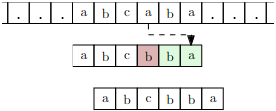
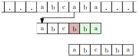
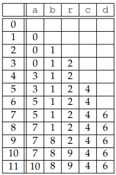
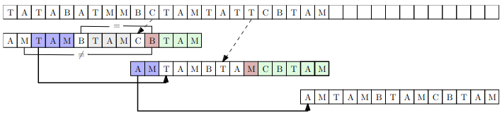
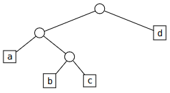

# TD / TP : Algorithmique du texte

Ce TD / TP a pour objectif de présenter les algorithmes de recherche textuelle (Boyer-Moore et Rabin-Karp) et de compression d'un texte (Huffman et Lempel-Ziv-Welch). Il est découpé en deux parties :

* **Partie TD (à faire impérativement en premier)** : cette partie a pour but de découvrir les algorithmes et de s'entraîner à les dérouler sur des exemples. C'est la partie la plus importante. Vous devez la faire sur papier. À l'issue de cette séance, vous devez être capables de dérouler chacun de ces 4 algorithmes à la main sur des exemples de texte.
* **Partie TP (à faire dans un second temps)** : cette partie a pour but d'implémenter les algorithmes découverts dans la partie TD. N'abordez cette partie que si vous maîtrisez parfaitement le déroulé des algorithmes. L'implémentation de ces algorithmes est longue, elle serait très certainement guidée dans un sujet de concours. Ce qu’on attend de vous est surtout de comprendre le principe des algorithmes et de savoir les appliquer, l’implémentation est secondaire.

**Le plus important est vraiment de maîtriser le principe de chacun des 4 algorithmes, c'est ce qu'on attend de vous. Pas d'inquiétude si vous ne les implémentez pas pendant la séance.**

## I. Partie TD (à faire impérativement)

Nous travaillerons ici avec les caractères classiques (ceux ASCII), donc 128 caractères possibles, codés sur 1 octet, et nos algorithmes ont pour but d'effectuer une recherche ou une compression de textes pouvant contenir un très grand nombre de caractères. Le nombre de caractères distincts que peuvent contenir les chaînes de caractères sera toujours négligeable devant la taille des chaînes de caractères. On parle d’*algorithmique du texte* pour désigner des algorithmes tirant partie de cette contrainte sur les données.

### 1. Algorithmes de recherche textuelle

On s'intéresse dans cette partie au problème suivant :

* Entrées et préconditions : un *texte* et un *motif*, qui sont deux chaînes de caractères telles que la taille du motif est inférieure ou égale à celle du texte.
* Sortie et postconditions : si le motif apparaît dans le texte, l'indice `i` correspondant à la première occurrence du motif dans le texte est renvoyé ; sinon, `-1` est renvoyé.

> 1. Que renvoie cet algorithme pour le motif `ADAB` et le texte `ABRACADABRA` ? et pour le motif `CAR` ?
> 2. Quel problème de décision peut-on associer au problème décrit ci-dessus ?

La recherche d'un motif dans un texte repose sur des comparaisons de *caractères*. Les algorithmes de recherche textuelle ont pour objectif d'optimiser ce nombre de comparaisons. Nous calculerons donc la complexité de nos algorithmes en comptant le nombre de comparaisons de caractères effectuées.

#### a. Résolution par force brute

Une recherche textuelle par force brute consiste simplement à :

* vérifier si le motif apparaît à l'indice 0 du texte (en comparant le premier caractère du texte avec le premier caractère du motif, puis s'ils correspondent on passe au second caractère, et ainsi de suite...) ;
* puis si cela ne correspond pas, on « décale » le motif d'un cran vers la droite, afin de vérifier si le motif apparaît à l'indice 1 du texte ;
* et ainsi de suite, jusqu'à trouver une occurrence du motif ou arriver à la fin du texte.

> 3. Déroulez à la main une recherche par force brute du motif `ADAB` dans le texte `ABRACADABRA`.
> 4. Comptez le nombre de comparaisons de caractères effectuées dans la question précédente.
> 5. Calculez la complexité (temporelle dans le pire des cas) d'une recherche par force brute, exprimée en fonction de la taille du motif et de la taille du texte.
> 6. Et dans le meilleur des cas ?

Nous allons voir deux algorithmes, basés sur deux stratégies différentes, pour améliorer cette complexité.

#### b. Algorithme de Boyer-Moore

Dans la recherche par force brute, à chaque fois qu'une comparaison échoue, on ne décale le motif que d'une position vers la droite, *sans tenir compte des comparaisons déjà effectuées*. L'algorithme de Boyer-Moore est basé sur un *prétraitement* du motif qui permet ensuite d'effectuer des décalages plus grands dans la recherche. Avec un tel prétraitement, on sacrifie un peu de temps avant de commencer la recherche, pour ensuite accélérer la recherche elle-même.

Ce prétraitement construit une *fonction de décalage*, qui a une position dans le texte et dans le motif associe le décalage à effectuer (de combien d'indices le motif doit être décalé vers la droite) pour la prochaine comparaison.

> 7. Quel serait la fonction de décalage de l'algorithme de recherche par force brute ?

Commençons par une version simplifiée de l'algorithme de Boyer-Moore, utilisant une seule fonction de décalage (appelée version de *Horspool*) :

* On teste l’occurrence du motif `m` dans le texte `t` à des positions `i` de plus en plus grandes, en partant de `i = 0`. Cela n’est pas différent pour l’instant de ce que fait la recherche par force brute.
* Pour une position `i` donnée, on va comparer les caractères de `m` et de `t` *de la droite vers la gauche* : il s’agit là du sens inverse de celui utilisé précédemment.
* Si tous les caractères coïncident, on a trouvé une occurrence. Sinon, soit `j` l’indice de la première différence, c’est-à-dire le plus grand entier tel que $`\texttt{m[j]} \neq \texttt{t[i+j]}`$. On décale alors `i` de :
    * `j + 1` si `t[i+j]` n'apparaît pas dans `m` (si un caractère du texte n'apparaît pas dans le motif, on sait qu'on peut continuer la comparaison en se plaçant après ce caractère)
    * `j - d` si `j - d` est positif, avec `d` le plus grand entier tel que `m[d] = t[i+j]` (on décale le motif à un endroit où on sait qu'au moins un caractère correspond)
    * `1`  sinon.

Déroulons cet algorithme sur un exemple : le texte est `CACGTTCACATACT` et le motif `ATAC`.

* 1ère étape : `i = 0`

    ```
    CACGTTCACATACT
    ATAC
    ```

    On compare de droite à gauche : le `C` (indice 3) de `ATAC` ne correspond pas au `G` de `CACG`. De plus, `G` n'apparaît pas dans `ATAC` donc on sait qu'on peut faire un décalage de `3+1 = 4` (i.e. on continue la recherche après le `G`)

* 2ème étape : `i = 4`

    ```
    CACGTTCACATACT
        ATAC
    ```

    On compare de droite à gauche : le `C` (indice 3) de `ATAC` ne correspond pas au `A` de `TTCA`. On cherche donc le plus grand entier `d` tel que `m[d] = A` : c'est 2. On décale donc de `3 - 2 = 1` (i.e. on continue la recherche en alignant les `A`).

* 3ème étape : `i = 5`

        CACGTTCACATACT
             ATAC

    On compare de droite à gauche : le `C` (indice 3) de `ATAC` correspond au `C` de `TCAC` ; le `A` (indice 2) de `ATAC` correspond au `A` de `TCAC` ; le `T` (indice 1) de `ATAC` ne correspond pas au `C` de `TCAC`. On cherche donc le plus grand entier `d` tel que `m[d] = C` : c'est 3. Comme `1-3 = -2` est négatif, on ne décale que de 1 (i.e. on ne peut pas aligner les `C` car il est trop loin dans le motif).

* 4ème étape : `i = 6`

    ```
    CACGTTCACATACT
          ATAC
    ```

    On compare de droite à gauche : le `C` (indice 3) de `ATAC` ne correspond pas au `A` de `CACA`. On cherche donc le plus grand entier `d` tel que `m[d] = A` : c'est 2. On décale donc de `3 - 2 = 1` (i.e. on continue la recherche en alignant les `A`).

* 5ème étape : `i = 7`

    ```
    CACGTTCACATACT
           ATAC
    ```

    On compare de droite à gauche : le `C` (indice 3) de `ATAC` ne correspond pas au `T` de `ACAT`. On cherche donc le plus grand entier `d` tel que `m[d] = T` : c'est 1. On décale donc de `3 - 1 = 2` (i.e. on continue la recherche en alignant les `T`).

* 6ème étape : `i = 9`

    ```
    CACGTTCACATACT
             ATAC
    ```

    On compare de droite à gauche : le `C` (indice 3) de `ATAC` correspond au `C` de `ATAC` ; le `A` (indice 2) de `ATAC` correspond au `A` de `ATAC` ; le `T` (indice 1) de `ATAC` correspond au `T` de `ATAC` ; le `A` (indice 0) de `ATAC` correspond au `A` de `ATAC`. Fin de la recherche, sortie : `i = 9`.

On voit dans cet exemple qu'on a testé uniquement 6 indices avec Boyer-Moore-Horspool, contre 9 pour la recherche par force brute.

> 8. Déroulez cet algorithme pour la recherche du motif `ADAB` dans le texte `ABRACADABRA`.
> 9. Déroulez cet algorithme pour la recherche du motif `CAR` dans le texte `ABRACADABRA`.
> 10. Pour chacune des deux recherches ci-dessus, comparez le nombre d'indices `i` testés par Boyer-Moore-Horspool par rapport à la recherche par force brute.

On peut remarquer dans l’exemple déroulé qu'aux deuxième et quatrième étapes, on effectue deux fois le même calcul pour trouver le décalage (on cherche deux fois le plus grand entier `d` tel que `m[d] = A`). C'est là l'intérêt d'un prétraitement : avant de commencer la recherche, on calcule une bonne fois pour toute, pour chaque caractère existant, le plus grand indice auquel il apparaît dans le motif. On stocke ces résultats dans une *table de décalage*. On met `-1` dans la table de décalage pour un caractère qui n'est pas présent dans le motif.

> 11. Donnez la table de décalage pour le motif `TCCACTCTT` et l'ensemble des caractères existants `{A,T,G,C}`.
> 11. Justifiez qu'on peut remplir la table de décalage en un seul parcours du motif.

On rappelle qu'en algorithmique du texte, le nombre de caractères existants est toujours négligeable devant la taille des chaînes de caractères.

> 13. Quelle est la complexité de la construction de la table de décalage ?
> 14. Quelle est la complexité dans le pire des cas de l'algorithme de *Boyer-Moore-Horspool* ? Donnez un exemple de texte et motif pour lequel ce pire des cas est atteint. Est-ce mieux que l'algorithme de recherche par force brute ?
> 15. Même question pour le meilleur des cas.

Dans certains cas, on fait encore un décalage de 1 alors qu'on pourrait faire mieux. Considérons la situation suivante :



Le `b` (indice 3, en rouge) du motif ne correspond pas au `a` du texte. On cherche donc le plus grand entier `d` tel que `m[d] = a` : c'est 5. `3 - 5 < 0` donc on tombe dans le cas où on ne décale que de 1. 

Cependant, on voit bien qu'il y avait un second `a` dans le motif et qu'on aurait pu aligner le `a` du texte avec celui-là :



On doit alors utiliser une table de décalage à deux dimensions : pour chaque préfixe du motif, on stocke pour chaque caractère existant le plus grand indice où il apparaît dans le préfixe.

Voici par exemple la table de décalage du motif `ABRACADABRA` (l'entier indiqué sur chaque ligne correspond à la taille du préfixe considéré) :



Seuls les caractères du motif sont représentés ici, les autres colonnes seraient remplies de -1.

> 16. Expliquez d'où viennent les valeurs de la ligne 6.
> 17. Construisez à la main la table de décalage du motif `cherchera`.
> 18. Déroulez à la main l'algorithme de Boyer-Moore-Horspool pour la recherche du motif `chercher` dans le texte `J'ai recherché, tu recherchais et il recherchera encore.`

L'algorithme complet de Boyer-Moore (pour l'instant nous avons utilisé la version de Horspool) utilise, en plus de la table de décalage déjà décrite, une seconde table de décalage qui permet encore d'améliorer la complexité de l'algorithme.

On s'intéresse pour cela au *suffixe* du motif qui est déjà correctement aligné.



* À la première étape, la comparaison échoue pour le B (en rouge sur la figure) : on a lu un C à la place. Avec la version de Horspool, on aurait donc un décalage de 1 (pour aligner les C). Cependant, on sait que l’on a réussi à lire TAM, puis échoué à lire un B. On cherche donc dans le motif l’occurrence la plus à droite de TAM qui n’est pas immédiatement précédée par un B, et on l’aligne avec le TAM lu dans le texte.
* À la deuxième étape, la comparaison échoue pour le `M` (en rouge sur la figure) : avec la version de Horspool, on aurait donc un décalage de 2 (pour aligner les T). Mais on a lu avec succès CBTAM dans le texte, avant d’échouer à lire M. On fait donc la même recherche qu’à l’étape précédente : une occurrence de CBTAM qui ne soit pas précédée d’un M. Il n’y en a aucune : on cherche alors le plus grand préfixe du motif qui soit un suffixe de CBTAM. En l’occurrence, c’est AM : on décale en conséquence.

L'algorithme de Boyer-Moore utilise à chaque étape le meilleur décalage entre celui proposé par la *règle du mauvais caractère* (première table de décalage) et celui proposé par la *règle du bon suffixe* (décrit ci-dessus).

> 19. Déroulez l'algorithme de Boyer-Moore (avec les deux règles de décalage) du motif `aababab` dans le texte `aabbbababacaabbabacbaaacabaabababb`.

On admettra que l'algorithme de Boyer-Moore a une complexité linéaire en la taille du motif pour le prétraitement (constructions des deux tables de décalage et quelques autres modifications mineures), et linéaire en la taille du texte pour la recherche même.

#### c. Algorithme de Rabin-Karp

Le plus coûteux dans une recherche textuelle, c'est la comparaison du motif avec le morceau de texte à la position actuelle. Pour éviter ces comparaisons, l'algorithme de Rabin-Karp consiste à calculer une *empreinte* du motif et à la comparer avec l'empreinte du morceau de texte à la position actuelle. Une empreinte est le résultat d'une *fonction de hachage*. C'est donc un entier : on peut comparer deux empreintes en temps $`\mathcal O(1)`$.

* Si les deux empreintes sont différentes, on est certain que le morceau de texte à la position actuelle ne correspond pas au motif : on passe à la position suivante.
* Si par contre les empreintes sont égales, alors il faut comparer manuellement les caractères du motif et du texte : si ils sont tous égaux on a trouvé une occurrence du motif, sinon c'est qu'il s'agissait d'une *collision* avec le hash du motif, on passe à la position suivante.

La fonction de hachage doit respecter plusieurs critères pour que l'algorithme soit efficace :

* il doit y avoir *peu de collisions* avec le hash du motif ;
* le calcul de l'empreinte du motif doit se faire en complexité linéaire en la taille du motif
* on doit pouvoir calculer l'empreinte du morceau de texte en position `i+1` *en temps constant* à partir de l'empreinte du morceau de texte en position `i` (on parle d'*empreinte tournante*).

> 20. Si la fonction de hachage respecte tous les critères, quelle est la complexité de l'algorithme de Rabin-Karp ?
> 21. Comparez cette complexité avec celle de Boyer-Moore (algorithme complet, pas la version de Horspool).
> 22. Pourquoi doit-il y avoir peu de collisions ? S'il y en a beaucoup, quelle est la complexité de Rabin-Karp ?
> 23. On considère les caractères `{A,T,G,C}`, la fonction `f` telle que `f(A) = 1, f(T) = 2, f(G) = 3, f(C) = 4`. On cherche à appliquer l'algorithme de Rabin-Karp avec comme fonction de hachage la fonction `h` qui, à une chaîne de caractères sur cet alphabet, associe la somme des images de chaque caractère par la fonction `f`.
>     * Donnez l'empreinte du motif `ATAC`. Montrez qu'il peut y avoir des collisions.
>     * Comment calculer l'empreinte du morceau de texte en position `i+1` *en temps constant* à partir de l'empreinte du morceau de texte en position `i` ?
>     * Calculez l'empreinte du premier morceau du texte `CAGGATCACATACT`. Est-il nécessaire de comparer le morceau de texte en position `i=0` avec le motif ?
>     * Déduisez-en l'empreinte du morceau de texte en position `i=1`. Est-il nécessaire de comparer le facteur en position `i=1` avec le motif ?
>     * Continuez ainsi d'appliquer l'algorithme de Rabin-Karp.
>     * Par rapport aux 3 critères énoncés ci-dessus, cette fonction de hachage était-elle bien choisie ?

Réaliser une bonne fonction de hachage est une question complexe qui dépasse le cadre du cours de MP2I. Cependant, il est possible de réaliser une fonction de hachage répondant aux contraintes de complexité assez facilement : on peut utiliser la fonction $`h(c_0c_1...c_{k-1}) = \displaystyle\sum_{i=0}^{k-1} 128^{k-1-i}c_i`$ (les $`c_i`$ étant les codes ASCII des $k$ caractères de la chaîne). Le 128 vient du fait que les codes ASCII sont des entiers compris entre 0 et 127.

> 24. Justifiez que l'on a : $`h(c_{j+1}c_{j+2}...c_{j+k}) = 128\times(h(c_{j}c_{j+1}...c_{j+k-1})-128^{k-1}c_j) + c_{j+k}`$​.
> 25. Déduisez-en que l'on peut calculer l'empreinte du facteur en position `i+1` *en temps constant* à partir de l'empreinte du facteur en position `i`.
> 26. Rappelez en quoi consiste la méthode de Horner et donnez alors la complexité du calcul de l'empreinte pour le morceau de texte en première position.

* Avantage de cette fonction de hachage : cette valeur est unique pour chaque chaîne de caractères.
* Inconvénient : on va dépasser la capacité d'un entier très rapidement. On travaille donc modulo un entier `p` que l'on choisit aussi grand que possible et premier (pour éviter les collisions).

> 27. Justifiez que $`2^{31}-1`$ est un bon choix pour le modulo.

### 2. Algorithmes de compression

Un algorithme de compression sans perte consiste à définir deux fonctions `comp` et `decomp` telles que `decomp(comp(c)) = c` pour toute chaîne de caractères `c`, et pour la plupart des chaînes qui nous intéressent, la taille de `comp(c)` est inférieure à celle de `c`.

Nous allons étudier deux algorithmes permettant de compresser / décompresser un texte.

#### a. Algorithme de Huffman

L'algorithme de Huffman se base sur la construction d'un arbre binaire, appelé *arbre de Huffman optimal*, pour déterminer comment compresser les caractères d'un texte.

* La première étape de l'algorithme consiste à calculer les nombres d'occurrences de chaque caractère apparaissant dans le texte.
* Ensuite, on construit une forêt composée d'arbres réduits à une feuille, ces feuilles étant étiquetées par chaque caractère du texte. Le poids de chaque arbre est le nombre d'occurrences du caractère dans le texte.
* Tant que la forêt contient au moins 2 arbres, les deux arbres de plus petits poids sont réunis pour construire un unique arbre dont le poids est la somme des poids de ses deux sous-arbres.
* L'unique arbre restant dans la forêt est l'arbre de Huffman optimal. Chaque caractère du texte est alors codé en parcourant l'arbre depuis la racine et en construisant une suite de bits par concaténation : 0 pour une branche gauche, 1 pour une branche de droite.
* Pour finir, la compression du texte consiste à remplacer chaque caractère du texte d'origine par son code déterminé à l'étape précédente, et à concaténer le tout.

Déroulons cet algorithme sur le texte « scienceinformatique ». Voici la construction progressive de l'arbre de Huffman correspondant :


On en déduit les codes suivants pour les caractères : `n = 000, a = 0010, f = 0011, m = 0100, o = 0101, q = 0110, r = 0111, s = 1000, t = 1001, e = 101, i = 110, u = 1110, c = 1111`.

Le texte est alors compressé ainsi : « `10001111110101000111110111000000110101011101000010100111001101110101` ».

En codant chaque caractère sur 8 bits, on aurait eu besoin de $`19 \times 8 = 152`$​ bits pour stocker le texte. La compression par l'algorithme de Huffman donne 68 bits (plus le stockage de l'arbre). Pour les grands textes, le gain est important.

Pour décompresser une suite de bits à partir de l'arbre de Huffman, il suffit de parcourir la chaîne en descendant dans l'arbre à gauche si on lit un 0 / à droite si on lit un 1. Quand on arrive sur une feuille, on ajoute le caractère au résultat et on repart de la racine.

> 28. Vérifiez que les caractères les plus fréquents dans le texte d'origine sont bien ceux codés avec le moins de bits.
>
> 29. Avec le même arbre de Huffman que celui de l'exemple ci-dessus, décompressez la suite de bits `0011011100100001111101`.
>
> 30. Dessinez l'arbre de Huffman associé au code suivant : `a = 010, b = 011, c = 001, d = 10, e = 11`. Quelles étaient probablement les lettres les plus fréquentes dans le texte d'origine ?
>
> 31. * Déterminez le code associé à l'arbre de Huffman suivant :
>
>         
>
>     * Décompressez la suite de bits `010001`.
>
> 32. Justifiez rapidement que la décompression d'une suite de bits (avec arbre fourni bien entendu) fournit sans ambiguïté le texte d'origine.
>
> 33. * Donnez l'arbre de Huffman associé au texte « `des algorithmes de compression` » (attention l'espace est un caractère).
>     * Déduisez-en une compression du texte.
>
> 34. Pour pouvoir décompresser un texte, il faut avoir sauvegardé l'arbre de Huffman associé. Comment pourrait-on sérialiser cet arbre ?

L’algorithme de Huffman a deux inconvénients principaux :

* il est nécessaire de connaître à l’avance l’intégralité du texte pour construire le code ;
* le texte compressé seul ne suffit pas pour effectuer la décompression : on doit aussi stocker l'arbre de Huffman.

#### b. Algorithme de Lempel-Ziv-Welch

L’idée de l’algorithme LZW (Lempel-Ziv-Welch) est de construire au fur et à mesure de la lecture du texte un tableau contenant des motifs déjà rencontrés (des facteurs du mot à compresser). Quand on rencontre un motif déjà vu, on le code avec une référence vers ce tableau (l’indice de la case où il est rangé) ; quand on rencontre un motif pour la première fois, on l’ajoute au tableau.

On se fixe une longueur de code $d$ : on peut alors avoir un tableau de taille $`2^d`$, et les codes feront tous $d$ bits. L’algorithme fonctionne ainsi :

*   On initialise les 128 premières cases du tableau en rangeant à l’indice $i$ le caractère de code ASCII $i$.
*   On maintient un « buffer » contenant les caractères lus mais pas encore traités (initialement vide).
*   À chaque étape, on lit le caractère suivant $c$ du texte, on l’ajoute au buffer, et :
    *   si le motif du buffer est déjà dans le tableau, on ne fait rien.
    *   sinon :
        *   on ajoute le motif du buffer au prochain indice disponible du tableau ;
        *   on ajoute à la compression le code correspondant au motif du buffer sans $c$ ;
        *   on ne laisse que $c$ dans le buffer
*   Quand on arrive à la fin du texte, on ajoute à la compression le code du motif restant dans le buffer.

Voici un exemple, pour le texte « ACACGACCAC » (le code ASCII de A est 65, de C est 67 et de G est 71) :

| caractère lu | buffer | présent dans le tableau ? | ajout au tableau | ajout à la compression |
| :----------: | :----: | :-----------------------: | :--------------: | :--------------------: |
|      A       |   A    |            oui            |        -         |           -            |
|      C       |   AC   |            non            | indice 128 : AC  |           65           |
|      A       |   CA   |            non            | indice 129 : CA  |           67           |
|      C       |   AC   |            oui            |        -         |           -            |
|      G       |  ACG   |            non            | indice 130 : ACG |          128           |
|      A       |   GA   |            non            | indice 131 : GA  |           71           |
|      C       |   AC   |            oui            |        -         |           -            |
|      C       |  ACC   |            non            | indice 132 : ACC |          128           |
|      A       |   CA   |            oui            |        -         |           -            |
|      C       |  CAC   |            non            | indice 133 : CAC |          129           |
|     EOF      |   C    |             -             |        -         |           67           |

Le texte « ACACGACCAC » compressé sera donc « 65 ; 67 ; 128 ; 71 ; 128 ; 129 ; 67 », chacun des 7 entiers étant converti en binaire sur un certain nombre $d$ de bits.

> 35. Compressez avec l'algorithme LZW la chaîne `aababaaab` (`a = 97` et `b = 98` dans la table ASCII).
> 36. Compressez avec l'algorithme LZW la chaîne `rechercher` (`c = 99, e = 101, h = 104, r = 114`).

Regardons maintenant comment la décompression fonctionne. Il faut, en plus de décompresser le texte, reconstruire en parallèle la table qui avait été créée lors de la compression (et qu'on ne possède plus).

Prenons par exemple le texte compressé suivant : `97 97 98 129 128 129`.

| Étape | Octet | Texte émis | Nouvelle entrée  |                         Explications                         |
| :---: | :---: | :--------: | :--------------: | :----------------------------------------------------------: |
|   1   |  97   |     a      |        -         | Le premier code est 97 qui est le code ASCII du caractère `a`. |
|   2   |  97   |     a      | indice 128 : aa  | Le deuxième code étant `a`, on émet la chaîne `a`. Comme l'émission précédente était `a`, on en déduit que le nouveau code (128) est associé à `aa`. |
|   3   |  98   |     b      | indice 129 = ab  | On émet `b` (code 98). Comme l'émission précédente était `a`, on en déduit que le nouveau code (129) est associé à `ab`. |
|   4   |  129  |     ab     | indice 130 = ba  | On émet `ab` (code 129). Comme l'émission précédente était `b`, on en déduit que le nouveau code (130) est associé à `ba`. |
|   5   |  128  |     aa     | indice 131 = aba | À chaque étape, on ajoute un nouveau code à la table : la chaîne émise à l'étape précédente suivie du premier caractère de l'étape courante. |
|   6   |  129  |     ab     | indice 132 = aaa |                                                              |
|   7   |  EOF  |     -      |        -         |                                                              |

> 37. Décompressez le texte suivant : `97 98 114 97 99 97 100 128 130`.
> 38. Décompressez le texte suivant : `108 101 115 98 111 110 131 110 115 115 132 116 134 115`.


## II. Partie TP (à faire uniquement si vous maîtrisez la partie TD)

*Pour l'implémentation de ces derniers algorithmes de l'année, je vous laisse choisir le langage de programmation que vous préférez.*

* On rappelle qu'en C, on obtient le code ASCII d'un `char c` avec `(int) c` ; et le caractère à partir d'un code ASCII `int a` avec `(char) a`.
* En OCaml, on obtient le code ASCII d'un caractère avec `Char.code : char -> int` et inversement on obtient le caractère à partir de son code ASCII avec `Char.chr : int -> char`.

### 1. Algorithmes de recherche textuelle

> 1. Écrivez une fonction qui effectue une recherche par force brute d'un motif dans un texte. On n'effectuera que des comparaisons *de caractères* (autrement dit, on n'utilisera pas `strcmp` en C ou l'opérateur `=` sur des `string` en OCaml).
> 2. *   Écrivez une fonction qui prend en paramètre un motif et renvoie la table de décalage à deux dimensions construite par le prétraitement de Horspool.
>     *   Implémentez l'algorithme de Boyer-Moore, version de Horspool (c'est-à-dire uniquement la règle du mauvais caractère).
> 3. *   Écrivez une fonction qui calcule l’empreinte initiale de Rabin-Karp, autrement dit la fonction de hachage qui à une chaîne de caractère $`c_0c_1...c_{k-1}`$ (les $`c_i`$ sont les codes ASCII) associe l'entier $`\displaystyle\sum _{i=0}^{k-1} 128^{k-1-i}c_i \mod (2^{31}-1)`$.
>     *   Implémentez l'algorithme de Rabin-Karp.

### 2. Algorithmes de compression

> 4. * Proposez un type pour représenter un arbre de Huffman.
>     * Écrivez une fonction qui prend en paramètre une chaîne et renvoie un tableau (ou tableau associatif) associant à chaque caractère son nombre d'occurrences.
>     * Écrivez une fonction qui prend en paramètre une chaîne de caractères et renvoie l'arbre de Huffman associé. On pourra stocker la forêt dans une file de priorité (les deux arbres extraits à chaque étape étant ceux de poids minimaux).
>     * Écrivez une fonction qui prend en paramètre un arbre de Huffman et renvoie le codage associé à la compression de Huffman. On pourra par exemple renvoyer un tableau associatif qui à chaque caractère associe son code.
>     * Implémentez l'algorithme de compression de Huffman.
>     * Écrivez une fonction qui prend en paramètre une chaîne (ou liste ou tableau) de bits et un arbre de Huffman et applique la méthode de décompression.
> 5. * Implémentez l'algorithme de compression de Lempel-Ziv-Welch. On pourra supposer prendre en paramètre la taille $d$ des codes en plus du texte à compresser.
>     * Implémentez la décompression associée.
> 6. Écrivez un programme `./mp2zip` qui prend en argument un nom de fichier source et un nom de fichier destination, applique un algorithme de compression au fichier source et enregistre le résultat dans le fichier destination. Écrivez de même un programme `./mp2dzip`.

### Pour aller plus loin

Nous allons comparer l'efficacité (= complexité temporelle) de nos deux algorithmes de recherche textuelle (Boyer-Moore et Rabin-Karp) ; et l'efficacité (= taille de la compression) de nos deux algorithmes de compression (Huffman et LZW).

> 7. Téléchargez le roman [Le Rouge et le Noir](./tp/code/le_rouge_et_le_noir.txt) de Stendhal.
> 2. Comparez les temps obtenus par Boyer-Moore-Horspool et par Rabin-Karp pour la recherche du mot `Julien` dans *Le Rouge et le Noir*. Pour mesurer le temps d'exécution d'un programme, vous pouvez utiliser `Sys.time ()` en OCaml et `clock()` de `<time.h>` en C.
> 3. Comparez les tailles (en nombre d'octets) des compressions du roman *Le Rouge et le Noir* obtenues par Huffman et par LZW.

---

Par *Justine BENOUWT*

Sous licence [*CC BY-NC-SA*](https://creativecommons.org/licenses/by-nc-sa/4.0/)


Source des images : *production personnelle*, J.B. Bianquis, N. Pécheux
