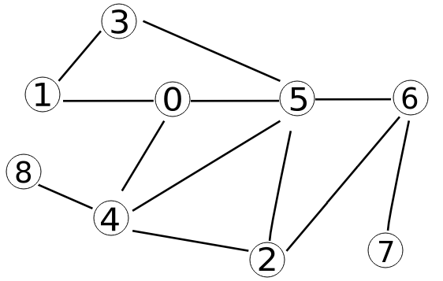
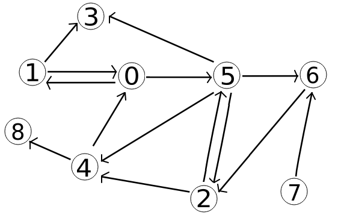
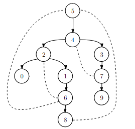

# TP : Parcours de graphes

Ce TP a pour objectif d’implémenter les parcours de graphes, puis d’étudier plusieurs applications des parcours.

On travaillera avec des graphes orientés ou non orientés, avec la définition classique (pas de boucle ni de multi-arête).

## I. Implémentation des parcours

Pour parcourir un graphe, il est nécessaire de parcourir de nombreuses fois les voisins (si non orienté) / successeurs (si orienté) des sommets. La représentation du graphe la plus efficace pour cette opération est la liste d’adjacence.

>   1.   Pourquoi la représentation du graphe la plus efficace pour parcourir les voisins / successeurs est la liste d’adjacence et non la matrice d’adjacence ?

On utilisera les implémentations suivantes :

*   En OCaml :

    ```ocaml
    type 'a graphe = ('a, 'a list) Hashtbl.t
    ```

*   En C :

    ```c
    struct graphe_s {
        int nb_sommets;
        int liste[20][20]; // sentinelles pour marquer la fin des listes
    };
    typedef struct graphe_s graphe;
    ```

>   2.   Avec ces types, y a-t-il des restrictions sur les sommets des graphes ?

On considère dans cette partie les deux graphes suivants :

{width=30%}   {width=30%}

>   3.   Définissez en OCaml et en C les listes d’adjacence de ces deux graphes, dans des variables `gno` (pour le graphe non orienté) et `go` (pour le graphe orienté).
>   4.   Déroulez le parcours en profondeur à la main sur les deux graphes précédents à partir du sommet 0.
>   5.   Déroulez le parcours en largeur à la main sur les deux graphes précédents à partir du sommet 0.
>   6.   Les sommets sont-ils tous explorés lors de ces deux parcours ? Expliquez.

On rappelle que les algorithmes de parcours de graphes ont un principe assez similaires aux parcours d’arbres, avec une différence majeure : a priori, il y a des cycles, et il ne faut pas tourner en rond ! Il faut donc se souvenir des sommets que l’on a déjà visités.

On rappelle l’algorithme du **parcours en profondeur** :

  

$$
\begin{array}{l}
\text{FONCTION}\texttt{ PARCOURS\_PROFONDEUR}(\text{graphe }G,\text{ sommet de départ }{dep}) : \\
\;\;\;\;\;\;\;\;{vus} \leftarrow \emptyset \\
\;\;\;\;\;\;\;\;\text{FONCTION \texttt{EXPLORER}}(\text{sommet }  s) :\\
\;\;\;\;\;\;\;\;\;\;\;\;\;\;\;\;\text{SI } s \not\in {vus} : \\
\;\;\;\;\;\;\;\;\;\;\;\;\;\;\;\;\;\;\;\;\;\;\;\; {vus} \leftarrow {vus}\, \cup \{ s\} \\
\;\;\;\;\;\;\;\;\;\;\;\;\;\;\;\;\;\;\;\;\;\;\;\;\text{POUR } v \in \text{voisins de }s \text{ dans } G : \\
\;\;\;\;\;\;\;\;\;\;\;\;\;\;\;\;\;\;\;\;\;\;\;\;\;\;\;\;\;\;\;\;\texttt{EXPLORER}(v) \\
\;\;\;\;\;\;\;\;\texttt{EXPLORER}(dep)
\end{array}
$$

On devra tester l'appartenance à la structure `vus` de nombreuses fois, il est important que cette opération soit efficace.

>   7.   Quelle structure de données vous semble appropriée pour les graphes en C ? en OCaml ?  
>        *Appelez le professeur pour vérifier que vous faîtes le bon choix, ce sera primordial pour la complexité.*
>   8.   Implémentez le parcours en profondeur en C, `void parcours_profondeur(graphe G, int dep)`. On affichera les sommets dans l’ordre d’exploration.
>   9.   Même question en OCaml, `parcours_profondeur : 'a graphe -> 'a -> unit`. L’affichage des sommets fait perdre en généralité pour le type, ce ne sera pas un problème ici, on veillera seulement à ce que sans cet affichage les types soient respectés.

On rappelle l’algorithme du **parcours en largeur** :

  

$$
\begin{array}{l}
\text{FONCTION}\texttt{ PARCOURS\_LARGEUR}(\text{graphe }G,\text{ sommet de départ }{dep}) : \\
\;\;\;\;\;\;\;\;{vus} \leftarrow \{dep\} \\
\;\;\;\;\;\;\;\;a\_traiter \leftarrow \text{file contenant seulement } dep \\
\;\;\;\;\;\;\;\;\text{TANT QUE } a\_traiter \text{ n'est pas vide}:\\
\;\;\;\;\;\;\;\;\;\;\;\;\;\;\;\;s\leftarrow \text{ defiler} (a\_traiter) \\
\;\;\;\;\;\;\;\;\;\;\;\;\;\;\;\;\text{POUR } v \in \text{voisins de }s \text{ dans } G : \\
\;\;\;\;\;\;\;\;\;\;\;\;\;\;\;\;\;\;\;\;\;\;\;\;\text{SI } v \not\in {vus} : \\
\;\;\;\;\;\;\;\;\;\;\;\;\;\;\;\;\;\;\;\;\;\;\;\;\;\;\;\;\;\;\;\;{vus} \leftarrow {vus}\, \cup \{ v\}\\
\;\;\;\;\;\;\;\;\;\;\;\;\;\;\;\;\;\;\;\;\;\;\;\;\;\;\;\;\;\;\;\;a\_traiter \leftarrow\text{enfiler}(v)
\end{array}
$$

>   10.   Implémentez le parcours en largeur en OCaml, `parcours_largeur : 'a graphe -> 'a -> unit`. On affichera les sommets dans l’ordre de parcours. À nouveau l’affichage des sommets fait perdre en généralité pour le type, ce ne sera pas un problème ici, on veillera seulement à ce que sans cet affichage les types soient respectés.
>   11.   De quel type seront les éléments stockés dans la file $a\_traiter$ en C ? Reprenez une implémentation d’une file, et implémentez le parcours en largeur, `void parcours_largeur(graphe G, int dep)`.
>   12.   Remplacez la file par une pile dans une de vos implémentations du parcours en largeur, et appliquez la au graphe non orienté à partir du sommet 0. Le résultat est-il un parcours en profondeur ? Quel est le problème ?
>   13.   Quelle est la complexité spatiale des deux parcours précédents ?

On rappelle l’algorithme de **parcours générique** d’un graphe :


$$
\begin{array}{l}
\text{FONCTION}\texttt{ PARCOURS}(\text{graphe }G,\text{ sommet de départ }{dep}) : \\
\;\;\;\;\;\;\;\;{vus} \leftarrow \emptyset \\
\;\;\;\;\;\;\;\;a\_traiter \leftarrow \text{structure contenant seulement } dep \\
\;\;\;\;\;\;\;\;\text{TANT QUE } a\_traiter \text{ n'est pas vide}:\\
\;\;\;\;\;\;\;\;\;\;\;\;\;\;\;\;s\leftarrow \text{ extraire un sommet de } a\_traiter \\
\;\;\;\;\;\;\;\;\;\;\;\;\;\;\;\;\text{SI } s \not\in {vus} : \\
\;\;\;\;\;\;\;\;\;\;\;\;\;\;\;\;\;\;\;\;\;\;\;\;{vus} \leftarrow {vus}\, \cup \{ s\}\\
\;\;\;\;\;\;\;\;\;\;\;\;\;\;\;\;\;\;\;\;\;\;\;\;\text{POUR } v \in \text{voisins de }s \text{ dans } G : \\
\;\;\;\;\;\;\;\;\;\;\;\;\;\;\;\;\;\;\;\;\;\;\;\;\;\;\;\;\;\;\;\;a\_traiter \leftarrow\text{ajouter } v
\end{array}
$$
Si la structure $a\_traiter$ respecte le principe « FIFO » on retrouve un ordre de parcours en largeur, et si elle respecte le principe « LIFO » un ordre de parcours en profondeur. Pour toute autre stratégie, l’ordre de parcours est quelconque.

>   14.   Quelle est la complexité spatiale de cet algorithme ? Pourquoi n’est-ce pas la même que les algorithmes précédents ?
>   15.   Implémentez cet algorithme en OCaml en utilisant une pile pour $a\_traiter$, `parcours_generique : 'a graphe -> 'a -> unit`. On affichera les sommets dans l’ordre de parcours. À nouveau l’affichage des sommets fait perdre en généralité pour le type, ce ne sera pas un problème ici, on veillera seulement à ce que sans cet affichage les types soient respectés.
>   16.   Implémentez cet algorithme en C en utilisant une file pour $a\_traiter$, `void parcours_generique(graphe G, int dep)`. On affichera les sommets dans l’ordre de parcours. Vérifiez qu’on retrouve bien un parcours en largeur.
>   17.   Quelle est la complexité temporelle de cet algorithme ?


## II. Applications des parcours

Tous les algorithmes sur les graphes sont basés sur les trois algorithmes de parcours vus dans la partie précédente, il ne s'agira que de les adapter légèrement pour répondre au problème posé.

On s’intéresse dans cette partie à plusieurs applications très classiques des parcours.

>   **Connexité d’un graphe non orienté**
>
>   On souhaite pour commencer adapter un parcours de graphe afin de déterminer si un graphe non orienté est connexe. Pour cela, on se basera sur la remarque suivante : avec l’algorithme générique de parcours de graphe, les sommets appartenant à $vus$ à l’issue du parcours sont les sommets accessibles depuis le sommet de départ $dep$, donc comme $G$ est non orienté, ce sont les sommets de la composante connexe de $dep$.
>
>   1.   Le sommet de départ du parcours importe-t-il ?
>   2.   Adaptez l’algorithme générique afin d’écrire une fonction C `bool est_connexe(graphe G)` renvoyant `true` si le graphe non orienté `G` est connexe, `false` sinon.
>   3.   Même question en OCaml, `est_connexe : ‘a graphe -> bool`. Attention aux types.
>   4.   Aurait-on pu adapter le parcours en profondeur au lieu de l’algorithme générique ? le parcours en largeur ?

>   **Distances d’un sommet aux autres**
>
>   On souhaite maintenant adapter un parcours de graphe afin de déterminer les distances du sommet $dep$ à tous les autres sommets du graphe. On rappelle qu’une distance entre deux sommets, dans un graphe non pondéré, est le nombre minimal d’arêtes / d’arcs d’un chemin reliant ces deux sommets. On se basera sur la remarque suivante : avec l’algorithme de parcours en largeur, 
>
>   *   au moment où un sommet est marqué comme $vus$, on est arrivé jusqu’à lui avec un chemin de longueur minimale depuis $dep$ ;
>   *   si on connaît la distance jusqu’au sommet $s$, on peut immédiatement en déduire la distance jusqu’aux voisins $v$ non vus de ce sommet $s$ ;
>   *   le sommet $dep$ est à distance $0$ de lui-même.
>
>   1.   Pourquoi utilise-t-on un parcours en largeur ?
>   2.   Adaptez le parcours en largeur afin d’écrire une fonction OCaml `distances : 'a graphe -> 'a -> ('a, int) Hashtbl.t`. On renvoie un tableau associatif qui à chaque sommet $s$ du graphe accessible depuis $dep$ associe la distance de $dep$ à $s$. Les autres sommets (non accessibles) ne seront pas dans le résultat, ce qui n’est pas gênant (on considère généralement qu’ils sont à une distance $`+\infty`$).
>   3.   Même question en C, `void distances(graphe G, int dep, int dist[20])`, après appel à la fonction `dist[i]` doit contenir la distance du sommet de départ au sommet `i`. On pourra supposer qu’initialement, tous les cases de `dist` sont initialisées à `-1`.
>   4.   Vos fonctions peuvent-elles bien prendre en paramètre un graphe orienté ou non orienté ? Si ce n’est pas le cas, corrigez les.

>   **Tri topologique d’un graphe orienté acyclique**
>
>   On souhaite ici effectuer un tri topologique d’un graphe orienté acyclique. On rappelle que cela consiste à rechercher une énumération de tous les sommets du graphe qui respecte l’ordre topologique. Un ordre topologique sur un graphe orienté acyclique $`G=(S,A)`$ est une relation d’ordre totale $\prec$ sur $S$ telle que si $`(s_i, s_j) \in A`$ alors $`s_i \prec s_j`$.
>
>   1.   Soit $`s_i`$ et $`s_j`$ deux sommets d'un graphe orienté acyclique $`G = (S, A)`$ tels que $`(s_i,s_j) \in A`$. Montrez que si on effectue un parcours en profondeur de $G$ (depuis n'importe quel sommet), alors l'exploration de $s_j$ termine avant celle de $s_i$.
>
>   On déduit de la question précédente la propriété suivante : pour obtenir un tri topologique d'un graphe orienté acyclique, il suffit d'ordonner les sommets par dates décroissantes de fin de parcours en profondeur (autrement dit, le sommet dont l'exploration s'est terminée en premier sera le dernier du tri, etc.).
>
>   2.   Adaptez le parcours en profondeur afin d’écrire une fonction C `void tri_topologique(graphe G, int topo[20])` qui prend en paramètre un graphe orienté acyclique et complète le tableau `topo` de manière à ce qu'il contienne une énumération de tous les sommets du graphe respectant l'ordre topologique.  
>        *Indication : il peut être difficile de savoir à quel indice du tableau `topo` écrire $s$ lorsque l'exploration d'un sommet $s$ est terminée. Pour remédier à ce problème, on pourra stocker dans une structure de données intermédiaire les sommets dont l'exploration est terminée, et remplir le tableau `topo` uniquement à la fin (une fois que l'exploration de l'intégralité des sommets est terminée, et donc une fois que la structure intermédiaire contient tous les sommets). Pour choisir cette structure intermédiaire, on remarquera que le sommet qui sera extrait de cette structure en premier pour remplir le tableau, devra être celui qui y a été ajouté en dernier...*
>   3.   Même question en OCaml, `tri_topologique : 'a graphe -> 'a list`.
>   4.   Un graphe orienté cyclique admet-il un ordre topologique ? Pourquoi ?

Comme le montre les applications précédentes des parcours de graphes, il arrive parfois qu'un algorithme de parcours soit préférable aux autres (comme pour le calcul des distances), voire même que ce soit la seule option (comme pour le tri topologique). D'autres fois, les différents types de parcours sont équivalents (comme pour le test de connexité).

>   **Arborescence d’un parcours**
>
>   On peut construire un arbre couvrant enraciné en effectuant un parcours d'un graphe non orienté connexe, on appelle cela l'*arborescence d'un parcours*.
>
>   Soit $G = (S, A)$ un graphe non orienté connexe et `dep` le sommet de départ du parcours : l'arborescence du parcours de $G$ depuis `dep` est le graphe $G' = (S, A')$ où $`(s_i,s_j) \in A'`$ si et seulement si le sommet $`s_j`$ a été exploré à partir du sommet $`s_i`$.
>
>   Voici un exemple d'arborescence d'un parcours en profondeur du graphe non orienté suivant à partir du sommet 5 :
>
>   
>
>   1.   Dessinez l'arborescence d'un parcours en profondeur du graphe non orienté de la partie précédente​ à partir du sommet 0. Même question pour un parcours en largeur.
>   2.   Écrivez une fonction C `graphe arborescence_profondeur(graphe G, int dep)` qui construit et renvoie l'arborescence enracinée en `dep` d'un parcours en profondeur du graphe `G` supposé non orienté connexe.
>   3.   Même question en OCaml pour un parcours en largeur, `arborescence_largeur : 'a graphe -> 'a -> 'a graphe`.
>
>   En réalité, on peut construire sur un principe similaire l’arborescence du parcours de n’importe quel type de graphe, pas uniquement les graphes non orientés connexes. Simplement, pour les autres types de graphes, l’arborescence n’est pas forcément un arbre *couvrant* du graphe parcouru. Elle ne contiendra comme sommets que ceux accessibles depuis le sommet de départ du parcours.

Pour les applications suivantes, ce sera à vous de choisir quel parcours adapter pour répondre au problème.

>   **Composantes connexes d’un graphe non orienté**
>
>   On cherche à trouver les composantes connexes d’un graphe non orienté.
>
>   1.   Adaptez un parcours de graphe afin d’écrire une fonction OCaml `composantes_connexes : 'a graphe -> ('a, int) Hashtbl.t` qui renvoie un tableau associatif qui à chaque sommet du graphe associe le numéro de la composante connexe à laquelle il appartient. Ainsi, la valeur associée à un sommet `si` est égale à la valeur associée à un sommet `sj` dans le résultat si et seulement si les sommets `si` et `sj` appartiennent à la même composante connexe. L’ordre de numérotation des composantes dépendra de l’ordre de parcours des sommets et n’est pas importante.  
>     *Indication : pour tester, vous pouvez par exemple supprimer les arêtes 0 — 1, 3 — 5 et 6 — 7 du graphe non orienté de la partie précédente.*
>        
>2.   Même question en C, `void composantes_connexes(graphe G, int comp[20])`, avec `comp[si] == comp[sj]` si et seulement si les deux sommets `si` et `sj` appartiennent à la même composante connexe.

>   **Détection de cycles dans un graphe orienté**
>
>   On souhaite déterminer si un graphe orienté possède un cycle (aussi appelé circuit).
>
>   1.   Adaptez un parcours de graphe afin d’écrire une fonction OCaml `cycle_dep -> 'a graphe -> 'a -> bool` telle que `cycle_dep g dep` renvoie `true` s’il existe un cycle dont le sommet `dep` fait partie et `false` sinon.
>   2.   Déduisez-en une fonction OCaml `cyclique : 'a graphe -> bool` qui détermine si le graphe orienté donné possède un cycle.
>   3.   Écrivez de même une fonction C `bool cyclique(graphe G)` qui détermine si un graphe orienté est cyclique.

## Pour aller plus loin

>   1.   On souhaite déterminer si un graphe non orienté est biparti. On rappelle qu’un graphe $`G=(S,A)`$ est biparti si et seulement si $`\exists S_a \subset S,\; \exists S_b \subset S, \quad S = S_a\cup S_b, \; S_a \cap S_b = \emptyset,\;\text{et } \forall \{s_i, s_j\} \in A,\, (s_i \in S_a \text{ et } s_j \in S_b) \text{ ou } (s_i \in S_b \text{ et } s_j \in S_a)`$. Adaptez un parcours de graphe afin d’écrire une fonction C `bool est_biparti(graphe G)` et / ou OCaml `est_biparti : 'a graphe -> bool` .
>
>   2.   Adaptez un parcours de graphe pour écrire une fonction permettant de déterminer si un graphe orienté est fortement connexe.
>   3.   Adaptez un parcours de graphe pour écrire une fonction permettant de trouver les composantes fortement connexes d’un graphe orienté.  
>        *Remarque : il existe un algorithme efficace pour cette application, l’algorithme de Kosaraju, que vous verrez en MPI !*


---

Par *Justine BENOUWT*

Sous licence [*CC BY-NC-SA*](https://creativecommons.org/licenses/by-nc-sa/4.0/)


Source des images : *production personnelle*, J.B. Bianquis (arborescence)
