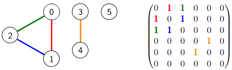
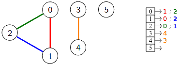

# TP : Représentation des graphes

L’objectif de ce TP est d’étudier le fonctionnement de l’implémentation des graphes, orientés et non orientés, par leurs matrices d’adjacence et listes d’adjacence, en OCaml et en C.

Un **graphe non orienté** fini $`G = (S,A)`$ est défini par :

* l'ensemble fini non vide $`S = \{s_0, s_1, s_2, \dots\}`$ dont les éléments sont appelés **sommets** ;
* l'ensemble fini $`A \subset S^2`$ composé de *paires non ordonnées* $`\{s_i,s_j\}`$ appelées **arêtes**.

Un **graphe orienté** fini $`G = (S,A)`$ est défini par :

* l'ensemble fini non vide $`S = \{s_0, s_1, s_2, \dots\}`$ dont les éléments sont appelés sommets ;
* l'ensemble fini $`A \subset S^2`$ composé de *couples ordonnés* $`(s_i,s_j)`$ appelées **arcs**.

On note **$`|S|`$** le nombre de sommets du graphe et **$`|A|`$** le nombre d'arêtes / d’arcs. On exprimera généralement nos complexités en fonction de ces deux valeurs.


## I. Matrice d’adjacence

On rappelle le fonctionnement de la représentation d’un graphe par une matrice d’adjacence :



>   0.   Quelle est la complexité spatiale d’un graphe stocké via sa matrice d’adjacence ?

### 1. En OCaml

On considère dans cette partie uniquement des graphes orientés, représentés par leurs matrices d’adjacence en OCaml.

On utilisera le type suivant :

```ocaml
type matrice_adjacence = int array array
```

>   1.   Dessiner le graphe orienté dont la matrice d’adjacence est :
>
>        ```ocaml
>        let mat_go = [| [|0; 1; 0; 0; 0; 0; 0; 0; 0|];
>                        [|1; 0; 0; 1; 0; 0; 0; 0; 0|];
>                        [|0; 0; 0; 0; 1; 1; 0; 0; 0|];
>                        [|0; 0; 0; 0; 0; 0; 0; 0; 0|];
>                        [|1; 0; 0; 0; 0; 0; 0; 0; 1|];
>                        [|1; 0; 1; 1; 1; 0; 1; 0; 0|];
>                        [|0; 0; 1; 0; 0; 0; 0; 0; 0|];
>                        [|0; 0; 0; 0; 0; 0; 1; 0; 0|];
>                        [|0; 0; 0; 0; 0; 0; 0; 0; 0|] |]
>        ```
>
>   2.   Écrire une fonction `nb_sommets_arcs : matrice_adjacence -> int * int` qui renvoie le nombre de sommets et le nombre d’arcs d'un graphe orienté représenté par sa matrice d'adjacence.  
>        Quelle est sa complexité ?

Une *boucle* est un arc reliant un sommet à lui-même.

>   3.   Écrire une fonction `possede_boucle : matrice_adjacence -> bool` qui prend en paramètre un graphe orienté et détermine s'il possède une boucle.  
>        Quelle est sa complexité ?

S'il y a un arc $`(s_i, s_j)`$, on dit que $`s_j`$ est un *successeur* de $`s_i`$ et que $`s_i`$ est un *prédécesseur* de $`s_j`$.

>   4.   Écrire une fonction `est_successeur : matrice_adjacence -> int -> int -> bool` qui prend un paramètres un graphe orienté et deux sommets et détermine si le premier est un successeur du second.  
>        Quelle est sa complexité ?
>   5.   Écrire une fonction `est_predecesseur : matrice_adjacence -> int -> int -> bool` qui prend un paramètres un graphe orienté et deux sommets et détermine si le premier est un prédécesseur du second.  
>        Quelle est sa complexité ?

Le *degré sortant* d'un sommet $s$, noté $`d_+(s)`$, est son nombre de successeurs ; et le *degré entrant*, noté $`d_-(s)`$, est son nombre de prédécesseurs. 

>   6.   Écrire une fonction `degres : matrice_adjacence -> int -> int * int` qui prend en paramètre un graphe et un sommet et renvoie ses degrés entrant et sortant.  
>        Quelle est sa complexité ?

### 2. En C

On considère dans cette partie uniquement des graphes non orientés, représentés par leurs matrices d’adjacence en C.

Il y a plusieurs manières d’implémenter une matrice d’adjacence en C, le programme de MP2I suggère d’utiliser un *tableau statique linéarisé*.

Pour avoir un tableau statique, nous devons connaître sa taille à la compilation : nous allons donc supposer avoir un nombre maximal de sommets fixé, disons 30 pour ce TP. Un graphe sera alors constitué d'un tableau statique de ce genre, et d'un entier stockant le réel nombre ($`\leqslant 30`$) de sommets du graphe. 

Voici donc le type que nous utiliserons :

```c
typedef int mat_adjacence[900]; // matrice (30,30) linéarisée
struct graphe_s {
    int nb_sommets; // nombre de sommets du graphe, toujours <= 30
    mat_adjacence mat;
};
typedef struct graphe_s graphe;
```

>   7.   Dessiner le graphe non orienté dont la matrice d’adjacence est :
>
>        ```c
>        graphe mat_gno = {9,  { 0, 1, 0, 0, 1, 1, 0, 0, 0,
>                                1, 0, 0, 1, 0, 0, 0, 0, 0,
>                                0, 0, 0, 0, 1, 1, 1, 0, 0,
>                                0, 1, 0, 0, 0, 1, 0, 0, 0,
>                                1, 0, 1, 0, 0, 1, 0, 0, 1,
>                                1, 0, 1, 1, 1, 0, 1, 0, 0,
>                                0, 0, 1, 0, 0, 1, 0, 1, 0,
>                                0, 0, 0, 0, 0, 0, 1, 0, 0,
>                                0, 0, 0, 0, 1, 0, 0, 0, 0 } };
>        ```
>
>   8.   Écrire une fonction `int nb_aretes(graphe g)` qui renvoie le nombre d’arêtes du graphe non orienté passé en paramètre.  
>        Quelle est sa complexité ?

Deux sommets sont dits *voisins* s'il existe une arête les reliant.

>   9.   Écrire une fonction `bool sont_voisins(graphe, int, int)` qui détermine si les deux sommets sont voisins.  
>        Quelle est sa complexité ?
>   10.   Quel propriété possède la matrice d’adjacence d’un graphe non orienté ? En déduire une fonction `bool verifie_orientation(graphe)` qui vérifie que le graphe passé en paramètre possède bien cette propriété.  
>         Quelle est sa complexité ?

Le *degré* d’un sommet $s$, noté $`d(s)`$, est son nombre de voisins.

>   11.   Écrire une fonction `int degre(graphe, int)` qui renvoie le degré du sommet passé en paramètre.  
>         Quelle est sa complexité ?
>   12.   Écrire une fonction `int sommet_degre_max(graphe)` qui renvoie le sommet de degré maximal du graphe.  
>         Quelle est sa complexité ?


## II. Liste d’adjacence

On rappelle le fonctionnement de la représentation d’un graphe par une liste d’adjacence :



>   0.   Quelle est la complexité spatiale d’un graphe stocké via sa liste d’adjacence ?

### 1. En OCaml

On considère dans cette partie uniquement des graphes non orientés, représentés par leurs listes d’adjacence en OCaml.

On utilisera le type suivant :

```ocaml
type liste_adjacence = int list array
```

>   1.   Définir dans une variable globale `lst_gno` la liste d’adjacence du graphe non orienté dessiné en question 7 de la partie précédente.

***Dans l'intégralité de cette partie, l'utilisation de références sur les listes est interdite !***

>   2.   Écrire une fonction `nb_aretes : liste_adjacence -> int` qui renvoie le nombre d’arêtes du graphe non orienté passé en paramètre.  
>        Quelle est sa complexité ? Comparer avec la version sur la matrice d'adjacence.
>   3.   Écrire une fonction `sont_voisins : liste_adjacence -> int -> int -> bool` qui détermine si les deux sommets sont voisins.  
>        Quelle est sa complexité ? Comparer avec la version sur la matrice d'adjacence.
>   4.   Écrire une fonction `verifie_orientation : liste_adjacence -> bool` qui vérifie qu’il s’agit bien de la matrice d’adjacence d’un graphe non orienté.  
>        Quelle est sa complexité ? Comparer avec la version sur la matrice d'adjacence.
>   5.   Écrire une fonction `degre : liste_adjacence -> int -> int` qui renvoie le degré du sommet passé en paramètre.  
>        Quelle est sa complexité ? Comparer avec la version sur la matrice d'adjacence.
>   6.   Écrire une fonction `sommet_degre_max : liste_adjacence -> int` qui renvoie le sommet de degré maximal du graphe.  
>        Quelle est sa complexité ? Comparer avec la version sur la matrice d'adjacence.

### 2. En C

On considère dans cette partie uniquement des graphes orientés, représentés par leurs listes d’adjacence en C.

Il y a plusieurs manières d’implémenter une liste d’adjacence en C, le programme de MP2I suggère d’utiliser un *tableau statique bidimensionnel*.

Tout comme pour les matrices, nous supposerons donc avoir un nombre maximal de sommets fixé (30 pour ce TP).

La ligne `i` du tableau bidimensionnel implémentant la liste d'adjacence contient les successeurs du `i`-ème sommet du graphe. On doit alors retenir le nombre de successeurs que possède le sommet `ì` (pour savoir où s'arrêter dans le parcours du tableau). Pour cela, deux méthodes sont possibles :

* on stocke dans la première case du tableau le nombre de successeurs ;
* on utilise une *sentinelle* qui marque la fin des successeurs.

Voici donc le type que nous utiliserons :

```c
typedef int lst_adjacence[30][31];
struct graph_s {
    int nb_sommets;
    lst_adjacence lst;
};
typedef struct graph_s graph; // graph sans 'e' pour ne pas avoir de conflit avec la représentation précédente
```

La liste d’adjacence ci-dessous


peut donc être représentée des deux manières suivantes :

```c
// PREMIÈRE POSSIBILITÉ : DEGRÉ
// La première case de chaque ligne i donne d(i).
// Si cette case contient un entier n, on sait donc qu'on ne doit parcourir que les cases de 1 à n :
// le tableau statique ne contient plus aucun voisin ensuite.
graph ex_v1 = {6,   { {2, 1, 2},
                      {2, 0, 2},
                      {2, 0, 1},
                      {1, 4},
                      {1, 3},
                      {0}       }  };

// DEUXIÈME POSSIBILITÉ : SENTINELLE
// La valeur -1, qui ne correspond à aucun numéro de sommet, peut par exemple servir de sentinelle.
// Dès que l'on croise cette valeur, on sait qu'on peut arrêter le parcours :
// le tableau statique ne contient plus aucun voisin ensuite.
graph ex_v2 = {6,   { {1, 2, -1},
                      {0, 2, -1},
                      {0, 1, -1},
                      {4, -1},
                      {3, -1},
                      {-1}       }  };
```

>   7.   Définir des deux manières possibles la liste d’adjacence du graphe orienté de la question 1 de la partie I.

***Pour toutes les fonctions de cette partie, on écrira deux versions, utilisant respectivement les deux possibilités de stockage décrites ci-dessus.***

>   8.   Écrire une fonction `int nb_arcs(graph)` qui renvoie le nombre d’arcs du graphe orienté passé en paramètre.  
>        Quelle est sa complexité ? Est-ce la même pour les deux manières de stocker la liste d’adjacence ? Comparer avec la version sur la matrice d'adjacence.
>   9.   Écrire une fonction `bool possede_boucle(graph)` qui détermine si le graphe passé en paramètre possède une boucle.  
>        Quelle est sa complexité ? Est-ce la même pour les deux manières de stocker la liste d’adjacence ? Comparer avec la version sur la matrice d'adjacence.
>   10.   Écrire une fonction `bool est_successeur(graph, int, int)` qui détermine si le premier sommet est un successeur du second sommet.  
>         Quelle est sa complexité ? Est-ce la même pour les deux manières de stocker la liste d’adjacence ? Comparer avec la version sur la matrice d'adjacence.
>   11.   Écrire une fonction `bool est_predecesseur(graph, int, int)` qui détermine si le premier sommet est un prédécesseur du second sommet.  
>         Quelle est sa complexité ? Est-ce la même pour les deux manières de stocker la liste d’adjacence ? Comparer avec la version sur la matrice d'adjacence.
>   12.   Écrire une fonction qui prend en paramètre un graphe et un sommet et trouve ses degrés entrant et sortant. Peut-on renvoyer un couple ? Comment faut-il alors procéder ?  
>         Quelle est sa complexité ? Est-ce la même pour les deux manières de stocker la liste d’adjacence ? Comparer avec la version sur la matrice d'adjacence.


## III. Sérialisation d’un graphe

Tout comme n’importe quelle structure de données, on peut avoir besoin de sérialiser un graphe.

Les fichiers devront avoir le format suivant :

* la première ligne contient le nombre de sommets du graphe ;
* les lignes suivantes contiennent des couples $i, j$ signifiant qu'il y a un arc / une arête de $i$ à $j$.

***Toutes les fonctions de cette partie doivent pouvoir s’appliquer à des graphes aussi bien orientés que non orientés.***

>   1.   Écrire une fonction OCaml `serialise : matrice_adjacence -> string -> unit` qui prend en paramètre un graphe (stocké via sa matrice d’adjacence), un nom de fichier, et sérialise ce graphe au format décrit ci-dessus.
>   2.   Écrire une fonction OCaml `deserialise : string -> matrice_adjacence` qui prend en paramètre le nom d’un fichier dans lequel un graphe a été sérialisé et renvoie sa matrice d’adjacence.  
>        *Indication : on pourra commencer par une fonction auxiliaire qui récupérer les entiers `i` et `j` d’une chaîne au format `"i,j"`.*
>   3.   Écrire une fonction C `void serialise(char* nom_fichier, graph g)` pour sérialiser un graphe représenté par sa liste d'adjacence. On écrira deux versions de cette fonction, pour les deux manières de stocker la liste d’adjacence.
>   4.   Écrire une fonction C `graph deserialise(char* nom_fichier)` réciproque de la précédente. On écrira à nouveau deux versions de cette fonction, pour les deux manières de stocker la liste d’adjacence.
>   5.   Reprendre les quatre fonctions précédentes dans l’autre langage.


## IV. Exercices

>   **Exercice 1 : changements de représentations (C)**
>
>   Vous avez pu constater que les deux représentations ne donnent généralement pas les mêmes complexités pour les opérations classiques sur les graphes. En fonction du problème étudié, on privilégiera donc souvent une représentation à l'autre. 
>
>   On peut alors avoir besoin de trouver la matrice d’adjacence d’un graphe à partir de sa liste d’adjacence et inversement.
>
>   1.   Écrire en C une fonction `graphe matrice_of_liste(graph)`. La fonction doit pouvoir s’appliquer à des graphes aussi bien orientés que non orientés. On écrira deux versions de cette fonction, pour les deux manières de stocker la liste d’adjacence.
>   2.   Écrire en C une fonction `graph liste_of_matrice(graphe)`. La fonction doit pouvoir s’appliquer à des graphes aussi bien orientés que non orientés. On écrira deux versions de cette fonction, pour les deux manières de stocker la liste d’adjacence. De plus, les listes devront contenir les sommets dans l'ordre croissant.
>   3.   Quelles sont les complexités des deux fonctions précédentes ?

>   **Exercice 2 : représentation par tableau associatif (OCaml)**
>
>   Quand les sommets du graphe ne sont pas des entiers naturels consécutifs, on peut stocker leur liste d’adjacence dans un tableau associatif. En OCaml, on utilisera le type suivant :
>
>   ```ocaml
>   type 'a graphe = ('a, 'a list) Hashtbl.t
>   ```
>
>   1.   Écrire avec cette représentation une fonction `boucle : 'a graphe -> bool` qui prend en paramètre un graphe (orienté ou non) et détermine s’il possède une boucle.
>   2.   Écrire avec cette représentation une fonction `degres : 'a graphe -> 'a -> int * int` qui prend en paramètre un graphe supposé orienté et un sommet et renvoie ses degrés entrant et sortant.
>   3.   Écrire avec cette représentation une fonction `orientation : 'a graphe -> bool` qui renvoie `true` si le graphe est orienté, `false` sinon.
>   4.   Quelles sont les complexités des trois fonctions précédentes ?


## Pour aller plus loin

>   1.   Reprendre l’exercice 1 de la dernière partie en OCaml. Les références vers des listes sont interdites.
>   2.   Proposer des types permettant de stocker des graphes *pondérés*.


---

Par *Justine BENOUWT*

Sous licence [*CC BY-NC-SA*](https://creativecommons.org/licenses/by-nc-sa/4.0/)


Source des images : *production personnelle*, Q. Fortier
