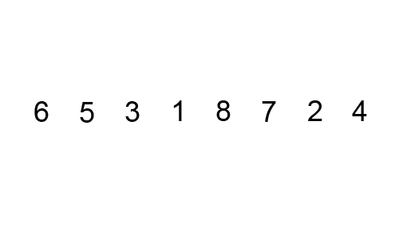

# TP : Premiers algorithmes de tris (OCaml et C)

Dans ce TP, nous allons étudier un grand classique de l'informatique : les algorithmes de tris.

* On choisit ici de trier des listes en OCaml et des tableaux en C.
* Préconditions : tous les éléments des listes/tableaux sont deux à deux distincts, et les listes/tableaux ne sont pas vides.
* On pourra se limiter à des listes/tableaux d'entiers lorsque nécessaire (en C notamment on manipulera des `int*`), mais le principe des algorithmes doit rester généralisable à tout type de liste/tableau.
* Aucune fonction existante n'est autorisée (en particulier celles du module `List` en OCaml).

> **Préparation de l'espace de travail**
>
> 1. Créez un fichier `.ml` du nom de votre choix pour le code en OCaml, et un fichier `.c` du nom de votre choix pour le code en C (on y placera le `main` directement pour ce TP).
> 2. Ajoutez à votre fichier en C une fonction itérative qui affiche proprement les éléments d'un tableau, et à votre fichier en OCaml une fonction récursive qui affiche les éléments d'une liste.
>     *Vous pourrez dans la suite du TP appeler ces fonctions depuis le main / le toplevel afin de vérifier que vos tris fonctionnent.*

Il existe une infinité d'algorithmes de tris, nous allons en étudier aujourd'hui quelques uns. Nous en verrons d'autres plus efficaces au second semestre.

**Pour chaque algorithme du TP, un certain nombre de questions d'analyse sont demandées. Vous devez impérativement les rédiger proprement sur papier et les faire valider par le professeur.**

## I. Tri par sélection

On s'intéresse tout d'abord au *tri par sélection*. Le principe est de sélectionner le plus petit élément du tableau, de le placer en première position, puis de recommencer ces deux étapes avec le reste du tableau.

Animation illustrant ce tri : 

> **Principe du tri par sélection**
>
> 1. Déroulez à la main, étape par étape, le tri par sélection des éléments suivants :
>     `6, 10, 5, 4, 1, 3, 2, 9, 7, 8`.
>
> **Tri par sélection sur les tableaux (en C)**
>
> 2. Écrivez une fonction `void tri_selection(int tab[], int taille_tab)` qui trie en place (c'est-à-dire avec un effet de bord, en modifiant directement le tableau d'origine) un tableau d'entiers quelconques selon le principe du tri par sélection.
> 3. Montrez la terminaison de la boucle « interne » de votre fonction (celle qui trouve le minimum), en exhibant un variant de boucle.
> 4. Montrez la terminaison de l'autre boucle de votre fonction en exhibant un variant de boucle.
> 5. En déduire la terminaison de votre fonction.
> 6. Montrez la correction de la boucle « interne » de votre fonction en exhibant un invariant de boucle.
> 7. Montrez la correction de l'autre boucle de votre fonction en exhibant un invariant de boucle.
> 8. En déduire la correction de votre fonction. La correction est-elle donc partielle ou totale ?
>
> *N'oubliez pas d'appeler le professeur pour faire valider votre rédaction aux questions d'analyse.*
>
> **Tri par sélection sur les listes (en OCaml)**
>
> 9. Peut-on trier une liste "en place" en OCaml ?
> 10. Écrivez une fonction `extrait_minimum : 'a list -> 'a * 'a list` qui prend en paramètre une liste et renvoie la valeur du minimum ainsi que la liste privée de cet élément. Votre fonction doit parcourir une unique fois la liste.
> 11. Implémentez alors le tri par sélection, `tri_selection : 'a list -> 'a list`.
> 12. Montrez la correction (totale) de vos deux fonctions. *N'oubliez pas d'appeler le professeur pour faire valider votre rédaction aux questions d'analyse.*

## II. Tri à bulles

On s'intéresse maintenant à un second algorithme de tri appelé *tri à bulles*. Il consiste à comparer répétitivement deux éléments consécutifs du tableau et les échanger si nécessaire.

Animation illustrant ce tri : 

> **Principe du tri à bulles**
>
> 1. Déroulez à la main, étape par étape, le tri à bulles des éléments suivants : `6, 10, 5, 4, 1, 3, 2, 9, 7, 8`.
> 2. À votre avis, d'où l'algorithme tire-t-il son nom ?
>
> **Tri à bulles sur les tableaux (en C)**
>
> 3. Implémentez en C cet algorithme (en place) : `void tri_bulles(int tab[], int taille_tab)`.
> 4. Montrez la correction de votre fonction, en exhibant pour chaque boucle un variant et un invariant de boucle.
>
> **Tri à bulles sur les listes (en OCaml)**
>
> 5. Écrivez une fonction `un_tour : 'a list -> 'a list` qui parcourt une unique fois la liste en échangeant deux éléments consécutifs si nécessaire. Par exemple, `un_tour [6;5;3;1;8;7;2;4]` donne `[5;3;1;6;7;2;4;8]`.
> 6. Implémentez alors le tri à bulles, `tri_bulles : 'a list -> 'a list`.
> 7. Montrez la correction de vos deux fonctions.
>
> *N'oubliez pas d'appeler le professeur pour faire valider votre rédaction aux questions d'analyse.*

## III. Tri par insertion

Le dernier tri que nous allons étudier ici est le *tri par insertion*. C'est celui que la plupart des gens utilisent naturellement pour trier un jeu de carte. On regarde les éléments un par un, et on les insère à la bonne place parmi les éléments déjà triés.

Animation illustrant ce tri : 

> **Principe du tri par insertion**
>
> 1. Déroulez à la main, étape par étape, le tri par insertion des éléments suivants : `6, 10, 5, 4, 1, 3, 2, 9, 7, 8`.
>
> **Tri par insertion sur les tableaux (en C)**
>
> 2. Implémentez en C cet algorithme (en place) : `void tri_insertion(int tab[], int taille_tab)`.
> 3. Montrez la correction totale de votre fonction, en exhibant pour chaque boucle un variant et un invariant de boucle.
>
> **Tri par insertion sur les listes (en OCaml)**
>
> 4. Écrivez une fonction `insere : 'a -> 'a list -> 'a list` qui étant donnés une liste triée et un élément, renvoie la liste triée dans laquelle l'élément a été inséré à la bonne place.
> 5. Implémentez alors le tri par insertion, `tri_insertion : 'a list -> 'a list`.
> 6. Montrez la correction de vos deux fonctions.
>
> *N'oubliez pas d'appeler le professeur pour faire valider votre rédaction aux questions d'analyse.*

## IV. Comparaison des tris

Nous allons calculer les complexités des trois algorithmes de tris implémentés afin de comparer leur efficacité.

On rappelle que le terme « complexité » sans plus de précision désigne la complexité temporelle dans le pire des cas.

> **Tri par sélection**
>
> 1. Calculez soigneusement la complexité de votre fonction `tri_selection` qui trie un tableau par sélection en C.
> 2. Calculez soigneusement la complexité de votre fonction `tri_selection` qui trie une liste par sélection en OCaml.
> 3. Donnez en justifiant brièvement la complexité temporelle dans le meilleur des cas et dans le cas moyen du tri par sélection.
> 4. La structure de données utilisée (liste / tableau) a-t-elle un impact sur l'efficacité du tri par sélection ?
>
> **Tri à bulles**
>
> 5. Calculez la complexité de votre fonction `tri_bulles` qui trie un tableau en C.
> 6. Calculez la complexité de votre fonction `tri_bulles` qui trie une liste en OCaml.
> 7. Calculez également les complexités dans le meilleur des cas de vos deux implémentations.
> 8. La structure de données utilisée (liste / tableau) a-t-elle un impact sur l'efficacité du tri à bulles ?
>
> **Tri par insertion**
>
> 9. Calculez la complexité de votre fonction `tri_insertion` qui trie un tableau en C.
> 10. Calculez la complexité de votre fonction `tri_insertion` qui trie une liste en OCaml.
> 11. Calculez également les complexités dans le meilleur des cas de vos deux implémentations.
> 12. Donnez des exemples de tableaux/listes pour lesquels ces deux complexités sont atteintes.
>
> *On remarquera que quand on vous demande une complexité dans le meilleur ou le pire des cas, il faut bien **d'abord la calculer**, puis seulement éventuellement ensuite donner un exemple pour lequel le meilleur ou le pire des cas est atteint. Simplement dire, "le meilleur des cas est le tableau trié et on fait alors `n` opérations" n'est **absolument pas** une justification correcte. Vous montrez que le tableau trié fait `n` opérations, mais cela ne signifie pas que c'est bel et bien le meilleur des cas. **Donner un cas particulier n'est dont pas une justification acceptable pour un meilleur ou un pire des cas.***
>
> **Bilan**
>
> 13. En termes de complexité, comment peut-on qualifier ces trois algorithmes de tris ?
> 14. Comparez leur efficacité.
>
> *N'oubliez pas d'appeler le professeur pour faire valider votre rédaction aux questions d'analyse.*

Le problème du tri d'une structure de données est un grand classique en informatique. Les algorithmes que nous avons étudiés aujourd'hui ne sont pas très efficaces. Nous aurons l'occasion au second semestre d'en rencontrer d'autres, comme le tri rapide ou le tri fusion, qui utilisent une stratégie appelée "diviser pour régner" et ont une meilleure complexité.

## V. Faut-il trier ?

Parfois, pour certains problèmes manipulant des structures de données, il peut être pertinent de trier la structure. On arrive alors parfois à réduire la complexité de la résolution du problème.

On s'intéresse dans cette partie au problème suivant :

* **Problème à résoudre :** déterminer si un ensemble `E` est inclus dans un second ensemble `F`, c'est-à-dire si tous les éléments de `E` appartiennent à `F`.
* **Préconditions** : les ensembles sont non vides et ne contiennent que des entiers.
* **Structures de données** : les éléments d'un ensemble sont stockés dans un ordre quelconque dans un tableau en C, et dans une liste en OCaml.

### 1. Résolution en C

Nous allons pour le moment tenter de résoudre le problème de la manière la plus simple : on parcourt l'ensemble `E` et pour chaque élément, on parcourt `F` afin de vérifier s'il est présent.

> **Résolution du problème sans trier**
>
> 1. Écrivez une fonction `bool inclusion_v1(int E[], int taille_E, int F[], int taille_F)` qui prend en paramètre deux ensembles `E` et `F` et indique si $`\texttt{E} \subset \texttt{F}`$. On ne cherche pas ici à être efficace, notamment on utilise des boucles bornées et on ne souhaite pas sortir de la boucle avant la fin.
> 2. Montrez la correction totale de votre fonction, et calculez soigneusement sa complexité.
> 3. On souhaite désormais stopper le parcours de l'ensemble `F` dès que l'on trouve l'élément recherché. Reprenez votre fonction précédente, que l'on nommera `inclusion_v2` en remplaçant la boucle bornée "interne" par une boucle non bornée.
> 4. Calculez la complexité dans le pire des cas de votre fonction, et comparez avec celle de la première version.
> 5. On souhaite désormais stopper également le parcours de `E` dès que l'on tombe sur un élément qui n'est pas présent dans `F`. Modifiez votre fonction précédente, que l'on nommera `inclusion_v3` pour que la boucle "externe" soit une boucle non bornée également.
> 6. Calculez la complexité dans le pire des cas de votre fonction, et comparez avec celle de la fonction précédente.
> 7. Comparez les complexités dans le meilleur des cas des trois versions de votre fonction.

Une seconde méthode pour vérifier si $`\texttt{E} \subset \texttt{F}`$ serait de trier l'ensemble `F`. Pour chacune des valeurs de `E`, on pourrait alors arrêter de parcourir `F` dès que l'on croise une valeur supérieure. Une troisième méthode pourrait être de trier également `E`.

> **Résolution du problème en triant F**
>
> 8. Écrivez une fonction `bool inclusion_v4(int E[], int taille_E, int F[], int taille_F)` qui trie l'ensemble `F` puis vérifie si chaque élément de `E`  appartient à `F`.
> 9. Quelle est la complexité de cette fonction (*n'oubliez pas de compter le tri !*) ? Comparez avec les premières versions de la résolution (celles sans tri).
>
> Si on possède un tableau trié, il est également possible de rechercher une valeur grâce à l'algorithme de **recherche dichotomique**.
>
> 10. Implémentez une fonction `bool recherche_dichotomique(int tab[], int taille_tab, int elt)`.
> 11. Montrez la terminaison et la correction de votre fonction.
> 12. Montrez que cet algorithme est en $`\mathcal O(\log_2(\text{taille\_tab}))`$.
> 13. Écrivez alors une fonction `inclusion_v5` qui trie l'ensemble `F` puis pour chaque élément de `E` utilise une recherche dichotomique pour vérifier s'il appartient à `F`.
> 14. Quelle est la complexité de cette fonction (*n'oubliez pas de compter le tri !*) ? Comparez avec les versions précédentes.
>
> **Résolution du problème en triant les deux ensembles**
>
> 15. Écrivez une fonction `bool inclusion_v6(int E[], int taille_E, int F[], int taille_F)` qui trie les ensemble `E` et `F` puis vérifie si chaque élément de `E` appartient à `F` de la manière la plus efficace possible.
> 16. Justifiez la correction de votre fonction.
> 17. Quelle est la complexité de cette fonction (*n'oubliez pas de compter les tris !*) ? Comparez avec les versions précédentes.
>
> **Comparaison des méthodes**
>
> Nous verrons en cours plus tard dans l'année une preuve du fait qu'un tri "par comparaisons" nécessite une complexité temporelle d'au moins $`\mathcal O (n \log_2(n))`$.
>
> 18. En supposant qu'on ait à notre disposition un tel algorithme de tri, donnez la complexité qu'aurait vos deux fonctions `inclusion_v5` et `inclusion_v6`.
> 19. Concluez sur l'efficacité des diverses méthodes vérifiant si $`\texttt{E} \subset \texttt{F}`$. Faut-il trier ?

### 2. Résolution en OCaml

> 20. Écrivez une fonction récursive `inclusion_simple : 'a list -> 'a list -> bool` qui ne trie pas les ensembles pour résoudre le problème.
> 21. Justifiez la terminaison et la correction de votre fonction.
> 22. Calculez sa complexité. À laquelle des trois premières fonctions sur les tableaux en C la fonction `inclusion_simple` s'apparente-t-elle ?
> 23. Écrivez une fonction `inclusion_un_tri` qui trie l'ensemble F uniquement pour résoudre le problème. Peut-on utiliser une recherche dichotomique ?
> 24. Écrivez une fonction `inclusion_deux_tris` qui trie les deux ensembles pour résoudre le problème.
> 25. Montrez la correction de vos deux fonctions, et calculez leur complexité.
> 26. Le choix de la structure de données (liste / tableau) pour représenter les ensembles impacte-t-il ici l'efficacité de l'algorithme ?

## Pour aller plus loin

> **Variante du tri par sélection : sélection du maximum (en C et en OCaml)**
>
> On s'intéresse à une variante du tri par sélection : on sélectionne désormais le *maximum*, que l'on échange avec le *dernier* élément, puis on recommence avec le reste.
>
> 1. Implémentez cette variante sur les tableaux en C, avec un tri en place.
> 2. Justifiez la correction de votre fonction. Quelle est sa complexité ?
> 3. Implémentez maintenant cette variante sur les listes en OCaml.
> 4. Quelle est la complexité de votre fonction ? Justifiez précisément.
> 5. La structure de données utilisée (liste / tableau) a-t-elle un impact sur l'efficacité de cette variante du tri par sélection ?
>
> **Tri par sélection sans effet de bord (en C)**
>
> 1. Écrivez en C une fonction similaire à `tri_selection` qui cette fois n'a pas d'effet de bord et renvoie un nouveau tableau contenant les éléments triés.
>
>     *Pour tester votre fonction, vous prendrez soin d'afficher à la fois le tableau d'origine et celui obtenu après le tri. N'oubliez pas de libérer ce qu'il faut dans le main !*
>
> 2. Laquelle des deux versions est la plus "naturelle" à écrire pour les tableaux ? Y a-t-il une différence en terme de complexité temporelle ? spatiale ? Laquelle privilégiera-t-on à votre avis ?
>
> **Faut-il trier ? (généralisation en C et en OCaml)**
>
> On souhaite répondre au même problème que dans la partie V, mais cette fois les éléments de `E`  et `F` ne sont plus forcément deux à deux distincts, on peut donc trouver plusieurs fois certaines valeurs dans chaque ensemble. Faîtes les modifications nécessaires dans l'ensemble de vos fonctions précédentes, en C et en OCaml.

---

Par *Justine BENOUWT*

Sous licence [*CC BY-NC-SA*](https://creativecommons.org/licenses/by-nc-sa/4.0/)

Source des images : Wikipedia

