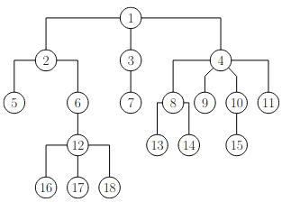
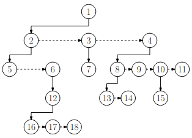
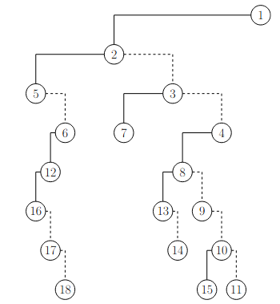

# TP : Arbres en OCaml

Ce TP s’intéresse à la manipulation d’arbres binaires et d’arbres d’arité quelconque en OCaml.


## I. Fonctions élémentaires sur les arbres binaires

On considère un ensemble $\mathcal F$ (étiquettes des feuilles), et un ensemble $\mathcal I$ (étiquettes des nœuds internes). On définit l'ensemble $\mathcal A_{\mathcal I, \mathcal F}$ des arbres binaires stricts par induction ainsi :

* *Assertion* : si $`f \in \mathcal F`$ alors $`\boxed{f} \in \mathcal A_{\mathcal I, \mathcal F}`$ (autrement dit, une feuille est un arbre)
* *Règle d’inférence* : si $`e\in \mathcal I, g \in \mathcal A_{\mathcal I, \mathcal F}, d \in \mathcal A_{\mathcal I, \mathcal F}`$, alors $`\texttt{Noeud}(e,g,d) \in \mathcal A_{\mathcal I, \mathcal F}`$

Cela se traduit simplement en OCaml avec un type somme :

```ocaml
type ('i, 'f) ab_strict =
	| Feuille of 'f
	| Noeud of 'i * ('i, 'f) ab_strict * ('i, 'f) ab_strict
```

>   1.   Représentez graphiquement les arbres suivants :
>
>        ```ocaml
>        let strict_premier_exemple =
>            Noeud(0,
>                Noeud(4,
>                    Feuille 'i',
>                    Feuille 'n'),
>                Noeud(2,
>                    Feuille 'f',
>                    Feuille 'o'))
>        
>        let strict_deuxieme_exemple =
>            Noeud(0,
>                Noeud(4,
>                    Feuille 11,
>                    Feuille 12),
>                Noeud(2,
>                    Noeud(20,
>                        Feuille 36,
>                        Feuille 37),
>                    Feuille 22))
>        
>        let strict_troisieme_exemple =
>            Noeud(1.2,
>                Noeud(9.5,
>                    Noeud(6.7,
>                        Feuille 3,
>                        Feuille 6),
>                    Feuille 3),
>                Feuille 4)
>        ```
>
>   2. Que renvoie la fonction `mystere` suivante ?
>
>       ```ocaml
>       let rec mystere arbre = match arbre with
>           | Feuille _ -> 0
>           | Noeud (_, g, d) -> 1 + max (mystere g) (mystere d)
>       ```
>
>   3. Calculez les complexités temporelle et spatiale de la fonction `mystere`.
>
>   4. Écrivez une fonction `taille : ('i, 'f) ab_strict -> int`.
>
>   5. Écrivez deux fonctions `nb_feuilles : ('i, 'f) ab_strict -> int` et `nb_noeuds_internes : ('i, 'f) ab_strict -> int` qui renvoient respectivement le nombre de feuilles et le nombre de nœuds internes d'un arbre binaire strict.
>
>   6. Écrivez une fonction `appartient : ('a, 'a) ab_strict -> ‘a -> bool` qui teste l’appartenance d’une étiquette dans l’arbre.

On considère un ensemble $\mathcal E$ (étiquettes des nœuds). On définit l'ensemble $\mathcal A_{\mathcal E}$ des arbres binaires non stricts par induction ainsi :

* *Assertion* : $`\bot \in \mathcal A_{\mathcal E}`$ (avec $`\bot`$ l’arbre vide)
* *Règle d’inférence* : si $`e\in \mathcal E, g \in \mathcal A_{\mathcal E}, d \in \mathcal A_{\mathcal E}`$, alors $`\mathcal N(e,g,d) \in \mathcal A_{\mathcal E}`$

Cela se traduit à nouveau en OCaml avec un type somme :

```ocaml
type 'e ab =
	| Vide
	| N of 'e * 'e ab * 'e ab
```

> 7. Représentez graphiquement l'arbre suivant :
>
>     ```ocaml
>     let non_strict_premier_exemple =
>     	N('m',
>     		N('a',
>     			N('o',
>     				Vide,
>     				N('c', Vide, Vide)),
>     			Vide),
>     		N('l', Vide, Vide))
>     
>     let non_strict_deuxieme_exemple =
>         N(0,
>             N(4,
>                 N(11, Vide, Vide),
>                 N(12, Vide, Vide)),
>             N(2,
>                 N(20,
>                     N(36, Vide, Vide),
>                     N(37, Vide, Vide)),
>                 N(22, Vide, Vide)))
>     ```
>
> 8. Que renvoie la fonction `mystere` suivante ?
>
>     ```ocaml
>     let rec mystere arbre = match arbre with
>     	| Vide -> 0
>     	| N (_, g, d) -> 1 + mystere g + mystere d
>     ```
>
> 9. Calculez les complexités temporelle et spatiale de la fonction `mystere`.
>
> 10. Écrivez une fonction `hauteur : ‘e ab -> int`.
>
> 11. Écrivez deux fonctions `nb_feuilles : 'e ab -> int` et `nb_noeuds_internes : 'e ab -> int` qui renvoient respectivement le nombre de feuilles et le nombre de nœuds internes d'un arbre binaire non strict.
>
> 12. Écrivez une fonction `appartient : 'e ab -> ‘e -> bool` qui teste l’appartenance d’une étiquette dans l’arbre.

Un arbre binaire strict n’est finalement qu’un cas particulier d’arbre binaire non strict où tous les nœuds internes sont d’arité 2.

>   13.   Écrivez une fonction `est_strict -> 'e ab -> bool` qui renvoie `true` si l’arbre est non vide et que tous ses nœuds internes sont d’arité 2, et `false` sinon.
>   14.   Écrivez une fonction `egaux_strict_et_non_strict : ('a, 'a) ab_strict -> 'a ab -> bool` qui détermine si deux arbres (un strict et l'autre non) sont égaux, en supposant qu'une feuille d'un arbre strict est égale à un nœud d'un arbre non strict ayant la même étiquette et deux sous-arbres vides.


## II. Fonctions élémentaires sur les arbres d’arité quelconque

On considère maintenant des arbres d'arité quelconque *non vides*.

On utilisera le type OCaml suivant :

```ocaml
type 'a arbre_aq = {etiquette : 'a ; fils : 'a arbre_aq list}
```

> 1. Représentez graphiquement l'arbre suivant :
>
>     ```ocaml
>     let arite_quelconque_premier_exemple =
>         {etiquette = 0; fils = [
>             {etiquette = 1; fils = [
>                 {etiquette = 5; fils = []}
>             ]};
>             {etiquette = 2; fils = [
>                 {etiquette = 6; fils = [
>                     {etiquette = 11; fils = []}
>                 ]};
>                 {etiquette = 7; fils = []};
>                 {etiquette = 8; fils = []}
>             ]};
>             {etiquette = 3; fils = [
>                 {etiquette = 9; fils = []};
>                 {etiquette = 10; fils = [
>                 	{etiquette = 12; fils = []};
>                 	{etiquette = 13; fils = []};
>                 	{etiquette = 14; fils = []};
>                 	{etiquette = 15; fils = []};
>                 	{etiquette = 16; fils = []}
>                 ]}
>             ]};
>             {etiquette = 4; fils = []}
>         ]}
>     ```
>
> 2. Écrivez une fonction `taille : 'a arbre_aq -> int`.
>
> 3. Écrivez une fonction `hauteur : 'a arbre_aq -> int`.
>
> 4. Écrivez une fonction `arite : 'a arbre_aq -> int`.
>
> 5. Écrivez une fonction `egaux : 'a arbre_aq -> 'a arbre_aq -> bool`.

Tout arbre d'arité quelconque peut être transformé en arbre binaire. La manière standard de le faire est la représentation « LCRS » (*left child, right sibling*).

On part d'un arbre d'arité quelconque, par exemple :



Chaque nœud contient :

* un lien vers la liste chaînée de ses fils, c'est-à-dire vers son fils le plus à gauche (*left child*)
* un lien dans sa propre liste chaînée vers son frère juste à droite (*right sibling*) (sauf la racine qui n'est pas dans une liste)

On représente ces listes chaînées sur ce même exemple :



La binarisation de l'arbre en découle directement :

* le fils gauche de chaque nœud de l'arbre binaire correspond au fils le plus à gauche du nœud dans l'arbre d'origine
* le fils droit de chaque nœud de l'arbre binaire correspond au frère droit du nœud dans l'arbre d'origine.

Cela donne sur notre exemple :



Cet algorithme est réversible (essentiellement, nous avons une bijection de l'ensemble des arbres d’arité quelconque dans l'ensemble des arbres binaires des représentations LCRS).

> 6. Dessinez la représentation LCRS de l’arbre `arite_quelconque_premier_exemple`.
> 7. Écrivez une fonction `binarise : 'a arbre_aq -> 'a ab` qui renvoie la représentation LCRS de l’arbre d’arité quelconque passé en paramètre.
> 8. Écrivez une fonction `debinarise : 'a ab -> 'a arbre_aq` qui réalise la conversion inverse.
>
> Pour tester vos fonctions, voici l'arbre d'arité quelconque de l'image ci-dessus :
>
> ```ocaml
> let arite_quelconque_deuxieme_exemple =
>     {etiquette = 1; fils = [
>         {etiquette = 2; fils = [
>             {etiquette = 5; fils = []};
>             {etiquette = 6; fils = [
>                 {etiquette = 12; fils = [
>                     {etiquette = 16; fils = []};
>                     {etiquette = 17; fils = []};
>                     {etiquette = 18; fils = []}
>                 ]}
>             ]}
>         ]};
>         {etiquette = 3; fils = [
>             {etiquette = 7; fils = []}
>         ]};
>         {etiquette = 4; fils = [
>             {etiquette = 8; fils = [
>                 {etiquette = 13; fils = []};
>                 {etiquette = 14; fils = []}
>             ]};
>             {etiquette = 9; fils = []};
>             {etiquette = 10; fils = [
>                 {etiquette = 15; fils = []}
>             ]};
>             {etiquette = 11; fils = []}
>         ]}
>     ]}
> ```

En fonction de ce que les arbres servent à représenter, on a parfois besoin de considérer l’arbre vide comme étant un arbre d’arité quelconque.

>   9.   Proposez un type permettant de représenter l’ensemble des arbres d’arité quelconque incluant l’arbre vide.
>   10.   Ré-écrivez les fonctions `taille` et `hauteur` avec ce type.


## III. Parcours

On considère dans cette partie que le « traitement » d’un nœud lors du parcours d’un arbre consiste  uniquement à afficher son étiquette. On reprend les types des deux parties précédentes, mais on se limite donc à des étiquettes de type `int`.

Une première manière de parcourir un arbre est le parcours en largeur. On rappelle que le module `Queue` implémente les files en OCaml.

>   1.   Donnez l’ordre des étiquettes pour un parcours en largeur des arbres donnés en exemples dans les deux parties précédentes.
>   2.   Écrivez deux fonctions `largeur_strict : (int, int) ab_strict -> unit` et `largeur_non_strict : int ab -> unit` implémentant le parcours en largeur sur les arbres binaires.
>   3.   *   Copiez-collez une de vos deux fonctions de parcours en largeur et changez les files par des piles (module `Stack`).
>        *   Exécutez sur un exemple, retrouve-t-on un parcours connu ?
>        *   Et si on empile le sous-arbre droit avant le sous-arbre gauche ?
>   4.   Écrivez une fonction `largeur : int arbre_aq -> unit` implémentant le parcours en largeur sur des arbres d’arité quelconque.

Une seconde manière de parcourir un arbre est le parcours en profondeur.

>   5.   Quels sont les ordres de traitement possibles pour un parcours en profondeur d’un arbre binaire ? Appliquez les à la main aux arbres binaires de la première partie.
>   6.   Implémentez le parcours en profondeur dans tous les ordres possibles sur les arbres binaires (non stricts et/ou stricts, au choix).
>   7.   Quels sont les ordres de traitement possibles pour un parcours en profondeur d’un arbre d’arité quelconque ? Appliquez les à la main aux arbres de la seconde partie.
>   8.   Implémentez le parcours en profondeur dans tous les ordres possibles sur les arbres d’arité quelconque `int arbre_aq`.

Plutôt que d’afficher les étiquettes, on peut souhaiter les récupérer dans une liste.

>   9.   Reprenez les fonctions de cette partie pour renvoyer la liste des étiquettes, rangées dans l’ordre du parcours concerné (les fonctions n’affichent alors plus rien).
>   10.   Comparez les complexités des versions affichant les étiquettes avec les complexités des versions renvoyant les étiquettes dans une liste.

On rappelle qu’on peut sérialiser un arbre binaire strict en stockant son parcours en profondeur dans l’ordre préfixe ou bien postfixe, en distinguant feuille et nœud interne.

>   11.   Expliquez en quoi il est utile de stocker des arbres construits dans des fichiers plutôt que de les conserver dans le programme lui-même.
>   14.   Proposez deux fonctions `serialise` et `deserialise` sur les arbres binaires stricts `(string, string) ab_strict` utilisant le parcours préfixe.


## IV. Exercices

>   **Arbres filiformes**
>
>   On rappelle qu’un arbre filiforme est un arbre d’arité 1. Parmi les arbres filiformes, les peignes gauche (resp. droit) sont ceux où l’unique fils de chaque nœud interne est toujours à gauche (resp. droite).
>
>   1.   Écrivez deux fonctions `est_peigne_gauche : 'a ab -> bool` et `est_peigne_droit : 'a ab -> bool` qui déterminent respectivement si l’arbre binaire non strict donné en paramètre est un peigne gauche / un peigne droit.
>   2.   Écrivez une fonction `est_filiforme : 'a arbre_aq -> bool` qui détermine si l’arbre donné en paramètre est filiforme.
>   3.   Écrivez une fonction `peigne_gauche : int -> int ab` qui prend en paramètre un entier `n` et renvoie un peigne gauche à `n` nœuds dont les étiquettes, lues dans l’ordre *préfixe* du parcours en profondeur, sont `n, n-1, ..., 2, 1`.
>   4.   Écrivez une fonction `peigne_droit : int -> int ab` qui prend en paramètre un entier `n` et renvoie un peigne droit à `n` nœuds dont les étiquettes, lues dans l’ordre *postfixe* du parcours en profondeur, sont `n, n-1, ..., 2, 1`.
>   5.   Écrivez une fonction `filiformes : int -> int ab list` qui prend en paramètre un entier `n > 0` et renvoie la liste de tous les arbres filiformes à `n` nœuds dont les étiquettes, lues dans l’ordre *préfixe* du parcours en profondeur, sont `n, n-1, ..., 2, 1`.

>   **Arbres parfaits**
>
>   On rappelle qu’un arbre parfait est un arbre binaire strict dont toutes les feuilles sont à la même profondeur.
>
>   1.   Écrivez une fonction `est_parfait ('i, 'f) ab_strict -> bool` qui détermine si l’arbre donné est parfait. *On essaiera d’être efficace (autrement dit, on parcourra une unique fois l’arbre).*
>   7.   *   Écrivez une fonction `parfait : int -> (int, int) ab_strict` qui prend en paramètre un entier `n > 0` et renvoie un arbre parfait de hauteur `n — 1`, dont les nœuds situés à profondeur `k` portent l'étiquette `n — k`.
>        *   Quelle est la complexité temporelle de la fonction `parfait` ? Si ce n'est pas $`\mathcal O(\texttt n)`$, améliorez la fonction.
>        *   Combien d’espace l’arbre construit par la fonction `parfait` occupe-t-il en mémoire ?

## Pour aller plus loin

> 1.   Écrivez une fonction `feuille_basse : ('i, 'f) ab_strict -> 'f` qui renvoie l'étiquette de la feuille située la plus à gauche parmi celles de profondeur maximale. *On ne parcourra qu'une seule fois l'arbre.*
> 2.   Si vous avez terminé, vous pouvez reprendre les fonctions de la partie quatrième partie en C.


---

Par *Justine BENOUWT*

Sous licence [*CC BY-NC-SA*](https://creativecommons.org/licenses/by-nc-sa/4.0/)


Source des images : *J.B. Bianquis* (LCRS)
