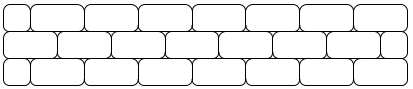
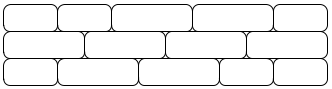
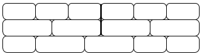
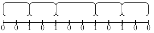
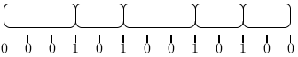

# TP : Compter les briques

Ce TP a pour objectif principal de mettre en place de la programmation dynamique pour résoudre un problème. On travaille également sur la notion de tableau associatif implémenté par une table de hachage et sur la représentation des nombres.

**Ce TP est à faire en OCaml.**

## I. Formulation du problème

Léon le maçon est un artiste et il est malheureux avec les briques classiques avec lesquelles il répète toujours le même motif :



Sa vie change quand il peut utiliser des briques de tailles 2 ou 3 : nous allons étudier quelles possibilités s'offrent à lui dans ce cas.

On cherche à construire un mur à partir de briques horizontales de taille $`2\times1 \text{ et }3\times1`$. Un mur est correctement construit si la jointure verticale entre deux briques ne se trouve jamais immédiatement au-dessus d'une autre jointure verticale. Ainsi le mur suivant est correctement construit :



En revanche, celui-ci ne l'est pas :



L'objectif du TP est de compter le nombre de façons différentes de construire un mur de largeur et de hauteur données.

> 1. De quel type de problème s'agit-il ?

## II. Rangées possibles

Pour dénombrer les murs on les représente comme des ensembles de rangées de briques.

On remarque qu'une rangée de longueur $`n \geqslant 3`$ est obtenue :

* soit en ajoutant une brique de taille 2 à droite d’une rangée de taille $`n − 2`$,
* soit en ajoutant une brique de taille 3 à droite d’une rangée de taille $`n − 3`$.

> 1. Donnez ainsi une relation de récurrence exprimant le nombre de de façons différentes de construire une rangée de largeur $`n \in \mathbb N^*`$.
>
> 2. Écrivez alors une fonction récursive simple `nb_rangees_non_efficace : int -> int` qui calcule le nombre de rangées possibles de largeur donnée en paramètre (par exemple, `nb_rangees_non_efficace 50` donne 525456).
>
> 3. L'appel à `nb_rangees_non_efficace 75` commence à demander beaucoup de temps... Montrez que nous avons ici un chevauchement des sous-problèmes. Donnez en justifiant brièvement un ordre de grandeur des complexités temporelle et spatiale de la fonction.

Nous allons utiliser de la programmation dynamique afin d'améliorer la complexité. Le stockage des calculs se fera dans un tableau.

> 4. Dessinez et remplissez le tableau qu'on obtiendrait pour calculer le nombre de rangées de largeur 10. Vous veillerez à indiquer quelles cases du tableau correspondent aux cas de base, quelles cases correspondent aux cas récursifs, et l'ordre de remplissage du tableau.
>5. Écrivez une fonction `nb_rangees_top_down : int -> int` utilisant l'approche récursive avec mémoïsation (top-down) pour calculer le nombre de rangées possibles.
> 6. Écrivez une fonction `nb_rangees_bottom_up : int -> int` utilisant l'approche itérative « de bas en haut » (bottom-up) pour calculer le nombre de rangées possibles.
>7. Calculez les complexités *temporelle et spatiale* de vos deux fonctions. Y avait-il une approche plus pertinente que l'autre ici ? A-t-on bien amélioré la complexité temporelle par rapport à la fonction d'origine ? Qu'en est-il de l'impact sur la complexité spatiale ?
> 8. Il est possible d'obtenir une complexité spatiale en $`\mathcal O(1)`$, en ne conservant que les résultats qui sont encore utiles au calcul en cours. Écrivez ainsi une fonction `nb_rangees : int -> int`.
>9. Justifiez que votre fonction a bien une complexité spatiale constante, et vérifiez que la complexité temporelle n'a pas changé.

Une rangée de largeur $`n`$ sera représentée par une série de $`n+1`$ bits : le $`i`$-ème bit indique si, au niveau de la $`i`$-ème unité de largeur, il y a ou non une jointure entre deux briques. Les deux extrémités seront toujours des bits 0.

Ainsi, la rangée de briques de largeur 11 suivante :



est représentée par les 12 bits `001010010100`. Cette rangée est donc représentée par l'entier `660`.

Comme les premiers 0 ne sont pas visibles, 660 représente aussi la rangée de largeur 12 suivante :



même si celle-ci est représentée par 13 bits `0001010010100`.

> 10. Quelles rangées peut représenter l'entier 2724 ?
>
> 7. Quel entier représente la rangée suivante ?
>
>     
>
> 8. Montrez que l'entier qui représente une rangée est toujours divisible par 4.

Pour simuler l'ajout d'une brique à droite d'une rangée, on aura besoin d'utiliser l'opérateur `lsl` afin de décaler les bits vers la gauche. Par exemple, `5 lsl 2` donne 20, car $`5 = \overline{101}^2`$ et $`\overline{10100}^2=20`$.

> 13. Écrivez deux fonctions `plus2 : int -> int` et `plus3 : int -> int` qui prennent en paramètre un entier représentant une rangée et renvoient l'entier représentant la rangée obtenue en ajoutant respectivement une brique de taille 2 ou 3 à sa droite.
>
>     Par exemple, `plus2 4` donne 20, et `plus3 4` donne 40.
>
> 14. Écrivez une fonction `ajout_brique : int -> int list -> int list` qui prend en paramètre la taille d'une brique (2 ou 3 uniquement) et une liste d'entiers représentants des rangées, et renvoie la liste des entiers représentants les rangées obtenues en ajoutant la brique de taille donnée à droite de chaque rangée.
>
>     Par exemple, `ajout_brique 2 [4; 12; 40; 204]` donne `[20; 52; 164; 820]`.
>
> 15. Écrivez une fonction `rangees : int -> int list`  qui calcule, sous forme d'entiers les représentant, la liste des rangées possibles de largeur donnée en paramètre.
>
>     L'ordre des entiers dans la liste n'est pas important.
>
>     *On prendra soin de minimiser la complexité temporelle et aussi la complexité spatiale.*
>
>     Par exemple, `rangees 10` donne `[328; 296; 168; 292; 164; 148; 340]`. On remarquera que la liste renvoyée est de taille 7, ce qui correspond bien à ce que renvoie `nb_rangees 10`.

## III. Nombre de murs

On voit que deux rangées sont superposable si et seulement si elles ont même longueur et si elles n’ont pas chacune un 1 à la même place. Ceci peut se vérifier simplement en utilisant l'opérateur `land` (conjonction bit à bit).

> 1. Que vaut `n land m` quand les écritures binaires de `n` et `m` n'ont pas de bit 1 à la même position ?
> 1. Écrivez une fonction `compatibles : int -> int -> bool` qui prend en paramètre les entiers représentants deux rangées et indique si elles sont superposables.

On veut calculer le nombre de murs de largeur $`n`$ et de hauteur $`h`$ constructibles, c'est-à-dire tels que chaque rangée soit compatible avec celle du dessous.

On note $`R_n`$ l'ensemble des rangées possibles de largeur $`n`$, et $`\rho_n`$ leur nombre.

On note $`M(n,h)`$ le nombre de murs constructibles de largeur $`n`$ et de hauteur $`h`$.

> 3. Une idée naïve serait de trouver tous les assemblages de murs de largeur $`n`$ et de hauteur $`h`$, puis de compter ceux qui sont constructibles. Donnez la complexité de cette approche. Est-ce une bonne idée de procéder ainsi ?

On note $`m(n,h,r)`$ le nombre de constructions de murs possibles, de largeur $`n`$ et de hauteur $`h`$, au-dessus d'une rangée $`r`$.

On a donc $`M(n,h) = \displaystyle \sum _{r\in R_n} m(n,h-1,r)`$. Si on remarque que toute rangée est compatible avec la rangée fictive de numéro 0, on peut simplifier et écrire $`M(n,h)=m(n,h,0)`$.

Il reste à déterminer comment calculer les $`m`$. La récursivité porte sur $`h`$ : pour construire un mur de hauteur $`h`$ au dessus de $`r`$, on doit construire un mur de hauteur $`h-1`$ au dessus d'une rangée $`r'`$ compatible avec $`r`$ :

$$`m(n,h,r) = \displaystyle \sum _{\substack{r' \in R_n \\ r \texttt{ land } r' \,= \;0}} m(n,h-1,r')`$$

> 4. Écrivez une fonction `nb_murs_non_efficace n h` qui renvoie le nombre de murs constructibles de largeur `n` et de hauteur `h`. On appliquera la relation de récurrence ci-dessus sans chercher à être efficace.
>     * `nb_murs_non_efficace 15 15` renvoie 27 483 324 ; le temps de calcul se compte en dizaines de secondes.
>     * `nb_murs_non_efficace 16 16` renvoie 327 019 964 ; le temps de calcul se compte en minutes.

## IV. Tables de hachage

Le programme ci-dessus est correct mais sa complexité est mauvaise. Ceci est dû au fait qu’à cause des appels récursifs, le calcul de $`m(n,h,r)`$ est effectué de très nombreuses fois pour les mêmes valeurs (chevauchements). Pour régler le problème, nous allons utiliser la mémoïsation : on stocke les valeurs lorsqu'on les calcule, et les fois suivantes on ira chercher le résultat directement sans le recalculer.

On a donc besoin d'une structure de données qui à un couple `(h, r)` associe le nombre `nb` de murs constructibles.

> 1. Expliquez pourquoi la structure adaptée ici est le tableau associatif.
> 1. Définissez une variable globale `taille` valant 5003.

Nous allons implémenter notre propre tableau associatif avec une table de hachage :

* On définit une fonction de hachage `hash` qui associe à tout couple `(h, r)` un entier. On essaiera de définir une fonction qui peut discriminer raisonnablement les couples.
* On définit un tableau `th` de longueur `taille`. Comme il est impossible de s'assurer que deux éléments auront toujours un hash distinct, les éléments de la table sont des listes. On espère que les collisions seront peu nombreuses et donc que les listes ne seront pas trop longues.
* Pour ajouter un élément `(h, r, nb)` dans la table de hachage `th` on calcule son hash `i = (hash h r) mod taille` puis on l'ajoute en tête de la liste `th.(i)`.

> 3. Copiez la fonction suivante dans votre fichier :
>
>     ```ocaml
>     let hash h r =
>     	r/4 + h*178543
>     ```
>     
> 3. Écrivez une fonction `mem h r liste` qui indique s'il existe ou non un élément de la forme `(h, r, _)` dans la liste.
>
> 4. Écrivez une fonction `assoc h r liste` qui renvoie la valeur `nb` telle que `(h, r, nb)` est dans la liste si un tel élément existe. Sinon, on lèvera une exception.
>
> 6. Implémentez les fonctions suivantes de l'interface d'une table de hachage :
>     * `cree_table_h ()` qui crée une table de taille `taille` (la variable globale) dont les éléments sont des listes vides
>     * `existe h r table_h` qui teste s’il existe un triplet dans la table dont les premières composantes sont `h` et `r`
>     * `valeur h r table_h` qui renvoie la valeur de `nb` de l’élément `(h, r, nb)` dans la table.
>     * `ajoute h r nb table_h` qui ajoute un triplet `(h, r, nb)` à la table `table_h` s’il n’y avait pas d’élément de la forme `(h, r, p)` dans la table.

Nous pouvons maintenant utiliser notre implémentation d'une table de hachage afin d'écrire une version avec mémoïsation de notre fonction qui compte le nombre de murs constructibles.

> 7. Modifiez ainsi la fonction `nb_murs_non_efficace`. Admirez l'accélération !

## Pour aller plus loin

> 1. Reprenez la dernière partie du TP en utilisant le module `Hashtbl` d'OCaml.


---

Par *Éric DÉTREZ*, *Justine BENOUWT*

Sous licence [*CC BY-NC-SA*](https://creativecommons.org/licenses/by-nc-sa/4.0/)


Source des images : *production personnelle*

