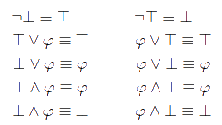
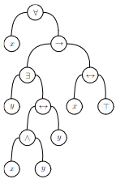

# TP : Logique propositionnelle

**Ce TP est à faire en OCaml.**

La première partie implémente quelques fonctions classiques sur l'ensemble des formules propositionnelles. La seconde partie s'intéresse à la sémantique des formules propositionnelles. La dernière partie implémente l'algorithme de Quine afin de résoudre le problème SAT.

## I. Fonctions sur l'ensemble des formules propositionnelles

Soit $`\mathcal V = \{x_0,x_1,x_2,...\}`$ l’ensemble des **variables propositionnelles**. On définit l'ensemble des **formules propositionnelles** $`\mathcal P`$ par induction ainsi : $`\mathcal V \subset \mathcal P\;\;;\; \top \in \mathcal P\;\;;\; \bot \in \mathcal P\;\;;\; p\in \mathcal P \Rightarrow \lnot p \in \mathcal P\;\;;\; p,q\in \mathcal P \Rightarrow p\land q \in \mathcal P\;\;;\; p,q\in \mathcal P \Rightarrow p\lor q \in \mathcal P`$.

> 1. Quelles sont les assertions dans cette définition ? les règles d'inférence ?
> 2. Cette définition est-elle ambiguë ? Si oui, modifiez la légèrement.

Nous utiliserons le type suivant pour représenter une formule propositionnelle :

```ocaml
type formule =
	| Top
	| Bottom
	| Var of int
	| Non of formule
	| Ou of formule * formule
	| Et of formule * formule
```

Voici des exemples de formules (qui pourront vous servir pour tester vos fonctions) :

```ocaml
let ex1 = Non (Ou (Et (Var 0, Var 1), Et (Var 0, Var 2)))
let ex2 = Ou (Et (Var 1, Bottom), Non (Var 3))
let ex3 = Et (Top, Non (Ou (Bottom, Et (Top, Non (Bottom)))))
```

> 3. Donnez la formule propositionnelle correspondant à la variable `ex1`.
>
> 4. Dessinez les **arbres syntaxiques** correspondant aux formules `ex1` et `ex2`.
>
> 5. Quel type de parcours d'arbre faut-il effectuer pour récupérer la formule écrite avec la syntaxe usuelle ? Et pour récupérer la formule écrite en OCaml ?
>
> 6. Écrivez une fonction `string_of_formule : formule -> string` renvoyant la représentation usuelle d'une formule propositionnelle sous forme d'une chaîne de caractères. Attention au parenthésage. Exemples :
>
>     ```ocaml
>     # string_of_formule ex1 ;;
>     - : string = "¬((x_0 ∧ x_1) ∨ (x_0 ∧ x_2))"
>     # string_of_formule ex2 ;;
>     - : string = "((x_1 ∧ ⊥) ∨ ¬x_3)"
>     # string_of_formule ex3 ;;
>     - : string = "(⊤ ∧ ¬(⊥ ∨ (⊤ ∧ ¬⊥)))"
>     ```
>
> 7. Écrivez une fonction `nb_var_distinctes : formule -> int` qui renvoie le nombre de variables propositionnelles distinctes apparaissant dans une formule. *On essaiera d'être efficace, autrement dit on ne parcourra qu’une fois la formule.* Exemples :
>
>     ```ocaml
>     # nb_var_distinctes ex1 ;;
>     - : int = 3
>     # nb_var_distinctes ex2 ;;
>     - : int = 2
>     # nb_var_distinctes ex3 ;;
>     - : int = 0
>     ```

Nous allons définir quelques fonctions classiques sur l'ensemble des formules propositionnelles.

> 8.   Rappelez la définition inductive de la **taille** d'une formule propositionnelle. Donnez les tailles des formules `ex1, ex2, ex3`.
> 9.   Déduisez-en une fonction récursive `taille : formule -> int`.
> 10.   Rappelez la définition inductive de la **hauteur** d'une formule propositionnelle. Donnez les hauteurs des formules `ex1, ex2, ex3`.
> 11.   Déduisez-en une fonction `hauteur : formule -> int`.
> 12.   Rappelez la définition inductive de $`\varphi[\psi/x], \text{ avec } \varphi, \psi\in \mathcal P, x\in \mathcal V`$ (**substitution**). Déduisez-en une fonction `substitue : formule -> int -> formule -> formule`.
> 13.   Rappelez la définition inductive de l’ensemble des **sous-formules** d’une formule propositionnelle. Déduisez-en une fonction `ensemble_sous_formules : formule -> formule list`. La liste renvoyée pourra éventuellement contenir des doublons.
> 14.   Écrivez une fonction `sous_formule : formule -> formule -> bool` qui détermine si une formule est une sous-formule d'une autre.

## II. Sémantique des formules propositionnelles

On utilise dans cette partie le même type `formule` défini dans la partie précédente.

On définit une **valuation** comme un tableau de booléens :

```ocaml
type valuation = bool array
```

Si `v` est de type `valuation`, alors `v.(i)` donne la valeur de vérité associée à la variable propositionnelle `Var i`.

> 1. Écrivez une fonction `max_var : formule -> int option` qui calcule l’indice maximal d’une variable propositionnelle utilisée dans une formule. Le type `option` sert au cas où la formule ne contient aucune variable. Exemples :
>
>     ```ocaml
>     # max_var ex1 ;;
>     - : int option = Some 2
>     # max_var ex2 ;;
>     - : int option = Some 3
>     # max_var ex3 ;;
>     - : int option = None
>     ```
>
> 2. Calculez soigneusement la complexité de la fonction `max_var`. Si cette  la complexité n’est pas linéaire en la taille de la formule, modifiez la fonction.
>
> 3. Écrivez une fonction `peut_etre_evaluee : formule -> valuation -> bool` qui indique si une formule peut être évaluée selon une valuation donnée (autrement dit, si chaque variable de la formule a une valeur de vérité associée dans la valuation donnée).
>
> 4. Écrivez une fonction `satisfait : formule -> valuation -> bool` qui indique si une valuation satisfait une formule (satisfait = est un **modèle** de).
>
> 5. Calculez la complexité de la fonction `satisfait`.
>
> 6. Dressez à la main la table de vérité de la formule correspondant à la variable `ex1` définie dans la partie précédente. Pour chaque valuation existante, vérifiez ensuite votre résultat à l'aide la fonction `satisfait`. Combien y a-t-il de valuations à tester ?
>
> 7. Écrivez une fonction `consequence : formule -> formule -> valuation list -> bool` telle que `consequence phi psi valuations` détermine si $`\varphi\vDash \psi`$ avec `valuations` la liste de toutes les valuations existantes. Exemples :
>
>     ```ocaml
>     # let vals = [[|false;false;false;false|]; [|true;false;false;false|]; [|false;true;false;false|]; [|true;true;false;false|]; [|false;false;true;false|]; [|true;false;true;false|]; [|false;true;true;false|]; [|true;true;true;false|]; [|false;false;false;true|]; [|true;false;false;true|]; [|false;true;false;true|]; [|true;true;false;true|]; [|false;false;true;true|]; [|true;false;true;true|]; [|false;true;true;true|]; [|true;true;true;true|]] ;;
>     # consequence ex1 ex2 vals ;;
>     - : bool = false
>     # consequence ex1 (Ou (Var 2, Ou (Non (Var 0), Et (Non (Var 1), Non (Var 2))))) vals ;;
>     - : bool = true
>     ```
>
> 8. Écrivez une fonction `equivalence : formule -> formule -> valuation list -> bool` telle que `equivalence phi psi valuations` détermine si $`\varphi\equiv \psi`$ avec `valuations` la liste de toutes les valuations existantes. Exemples :
>
>     ```ocaml
>     (* vals vient de l'exemple précédent *)
>     # equivalence ex1 ex2 vals ;;
>     - : bool = false
>     # equivalence ex1 (Ou (Non (Var 0), Et (Non (Var 1), Non (Var 2)))) vals ;;
>     - : bool = true
>     ```
>
> 9. Quelle équivalence fondamentale le test suivant permet-il de montrer ?
>
>     ```ocaml
>     equivalence (Var 0) (Non (Non (Var 0))) [[|false|]; [|true|]]
>     ```
>
> 10. Montrez les lois de De Morgan à l'aide de la fonction `equivalence`.

Si $`\varphi`$ est une formule, on peut définir les quantificateurs universel et existentiel ainsi : $`\forall x. \varphi \equiv \varphi[\top/x]\land \varphi[\bot/x] \text{ et }\exists x. \varphi \equiv \varphi[\top/x]\lor \varphi[\bot/x]`$

> 11.   Déduisez-en deux fonctions `quantificateur_universel : int -> formule -> formule` et `quantificateur_existentiel : int -> formule -> formule`.

## III. Problème SAT

On utilise dans cette partie les mêmes types `formule` et `valuation` définis dans les parties précédentes.

On s'intéresse ici au **problème SAT**, c'est-à-dire qu'on cherche à déterminer si une formule propositionnelle est satisfiable.

>   1.   De quel type de problème s’agit-il ?

Il existe un algorithme efficace pour résoudre le problème SAT : l'**algorithme de Quine**, qui utilise une approche par *backtracking*. Pour appliquer l'algorithme de Quine, nous avons besoin de quelques règles qui permettent de simplifier une formule :



> 2. Écrivez une fonction `elimine_constantes : formule -> formule` qui prend en entrée une formule $\varphi$ et utilise les règles ci-dessus afin de renvoyer une formule $`\varphi'`$ telle que $`\varphi'\equiv \varphi`$, et soit $\varphi'$ est réduite à une constante, soit elle ne contient aucune constante.
>     
>     Exemples :
>     
>     ```ocaml
>     # elimine_constantes ex2 ;;
>     - : formule = Non (Var 3)
>     # elimine_constantes ex3 ;;
>     - : formule = Bottom
>     ```

L'algorithme de Quine consiste, à partir d'une formule `f`, à :

* Calculer `f' = elimine_constantes f`.
* S'il reste au moins une variable propositionnelle dans `f’` :
    * sélectionner arbitrairement une variable $x$ restante dans `f’` ;
    * tester récursivement si `f'`$`[\top/x]`$ est satisfiable ;
    * tester récursivement si `f'`$`[\bot/x]`$ est satisfiable.
* Sinon, conclure.

> 3. Montrez par induction structurelle sur `f` que si `f` ne contient pas de variable alors `elimine_constantes f` est réduite à une constante.
> 4. Déduisez-en que l'algorithme de Quine termine.

Comme tout algorithme de backtracking, on peut dessiner l'arbre correspondant à l'algorithme de Quine.

Considérons par exemple la formule $`\varphi = (a\lor b)\land (\lnot b \lor \lnot c)\land(\lnot a \lor c)\land(a\lor c)`$, qui est donc la racine de notre arbre.

On sélectionne la variable `a` arbitrairement, on va la substituer par $`\bot`$ puis poursuivre (sous-arbre gauche) et la substituer par $`\top`$ puis poursuivre également (sous-arbre droit).

Étudions par exemple la branche droite. Par substitution on obtient la formule $`\varphi' = (\top\lor b)\land (\lnot b \lor \lnot c)\land(\lnot \top \lor c)\land(\top\lor c)`$, puis en appliquant les règles de simplification pour enlever les constantes on trouve donc $`\varphi' \equiv \top\land (\lnot b \lor \lnot c)\land(\bot \lor c)\land\top \equiv (\lnot b \lor \lnot c)\land c`$.

On sélectionne à partir de là arbitrairement une variable restante, disons `b`. On substitue `b` par  $`\bot`$ puis on poursuit (sous-arbre gauche) et on la substitue par $`\top`$ puis on poursuit également (sous-arbre droit).

Suivons cette fois la branche gauche. Par substitution puis simplification on obtient $`\varphi'' = (\lnot \bot \lor \lnot c)\land c \equiv (\top \lor \lnot c)\land c \equiv \top \land c \equiv c`$.

On sélectionne la dernière variable restante, `c`, qu'on substitue dans la branche gauche par $`\bot`$ et dans a branche droite par $`\top`$.

Il ne reste plus aucune variable, les feuilles sont étiquetées par des constantes. Voici l'arbre correspondant au cheminement qu'on vient de faire :


> 5.   Complétez les branches de l'arbre non détaillées plus haut.
> 6.   À quelle condition sur l'arbre obtenu la formule est-elle satisfiable ? La formule de l’exemple ci-dessus est-elle donc satisfiable ?
> 7.   À quelle condition sur l'arbre obtenu la formule est-elle une tautologie ? une antilogie ?

**Il faut savoir implémenter l'algorithme de Quine.** On utilisera le type suivant pour représenter l’arbre :

```ocaml
type arbre_quine =
	| Feuille of bool
	| Branchement of int * arbre_quine * arbre_quine
```

Pour tester vos codes, voici la formule de l’exemple précédent :

```ocaml
(* ((a ∨ b) ∧ (¬b ∨ ¬c)) ∧ ((¬a ∨ c) ∧ (a ∨ c))
   avec c = Var 0, b = Var 1, a = Var 2 *)
let (exemple : formule) =   Et  (   Et  (   Ou (Var 2, Var 1),
                                            Ou (Non (Var 1), Non (Var 0))
                                        ),
                                    Et  (   Ou (Non (Var 2), Var 0),
                                            Ou (Var 2, Var 0)
                                        )
                                )
```

> 8.   Écrivez une fonction `quine : formule -> arbre_quine` qui prend en paramètre une formule et renvoie l'arbre associé par l'algorithme de Quine. On pourra ré-utiliser certaines fonctions écrites plus haut dans le TP (par exemple, `substitue`).
> 9.   Déduisez-en une fonction `satisfiable_quine : formule -> bool` qui détermine si une formule est satisfiable en construisant l'arbre de l'algorithme de Quine puis en regardant les feuilles.
> 10.   Si la formule est satisfiable, comment retrouver un modèle depuis l’arbre de Quine ?
> 11.   Modifiez la fonction précédente pour renvoyer une valuation qui satisfait la formule propositionnelle. Le type sera `valuation_quine : formule -> valuation option` pour gérer le cas où la formule n'est pas satisfiable.
> 12.   Avec l'algorithme de Quine, écrivez une fonction qui détermine si une formule propositionnelle est une tautologie. Même question pour une antilogie.

Le problème SAT est un problème absolument central en informatique, parce que d’innombrables problèmes se réduisent naturellement à lui.

## IV. Exercices

>   **Exercice 1 : portée des variables**
>
>   Les variables propositionnelles seront dans cet exercice de type `'a`.
>
>   1.   Modifiez le type `formule` afin d'y ajouter les deux quantificateurs ainsi que les connecteurs d'implication et d'équivalence. On appelle ce type `'a formule_complete`.
>
>   2.   Définissez dans une variable `ex_complet : char formule_complete` la formule propositionnelle correspondant à l'arbre suivant :
>
>        
>
>   Une occurrence d'une variable $x$ dans une formule est un nœud de l'arbre étiqueté par $x$.
>
>   Une occurrence de $x$ est dite *libre* si le chemin reliant l'occurrence à la racine ne contient pas de nœud $`\forall x`$ (ou plus précisément, de nœud $`\forall`$ dont le fils gauche est $x$) ni de nœud $`\exists x`$. Une occurrence de $x$ est dite *liée* dans le cas contraire.
>
>   Une variable est dite libre dans une formule si elle a au moins une occurrence libre, liée si elle a au moins une occurrence liée.
>
>   3.   Écrivez une fonction `est_liee : 'a formule_complete -> 'a -> bool` qui indique si une variable est liée dans une formule.
>   4.   Écrivez une fonction `est_libre : 'a formule_complete -> 'a -> bool` qui indique si une variable est libre dans une formule.
>
>   La *portée* d’une variable liée $x$ est la sous-formule $`\varphi`$ des formules $`\forall x. \varphi \text{ et }\exists x. \varphi`$.
>
>   5.   Écrivez une fonction `portee : 'a formule_complete -> bool * 'a -> 'a formule_complete option` qui prend en paramètre une formule et un couple `(b, i)` où `b` vaut `true` pour désigner le quantificateur universel et `false` pour désigner le quantificateur existentiel, et `i` désigne une variable propositionnelle ; et renvoie sa portée. S'il y a plusieurs occurrences liées de cette variable, on renverra la sous-formule située la plus à gauche dans l'arbre de la formule. Si elle n'apparaît pas dans la formule, on renverra `None`.

>   **Exercice 2 : résolution par force brute du problème SAT**
>
>   On reprend dans cet exercice les types `formule` et `valuation` définis dans les premières parties du TP.
>
>   L’algorithme de Quine est une approche par backtracking de la résolution de problème SAT. Comme tout problème de décision, on peut aussi le résoudre avec une approche par force brute.
>
>   Cette approche suit en fait un principe similaire à celui des tables de vérité : on évalue la formule propositionnelle pour chaque valuation existante et on regarde si l’une d’elle donne la valeur de vérité V.
>
>   On propose de construire l’ensemble des valuations existantes ainsi :
>
>   *   On commence par la valuation associant la valeur de vérité F à toutes les variables.
>   *   Pour passer à la valuation suivante :
>       *   On cherche la plus grande variable propositionnelle qui a pour valeur de vérité F.
>       *   On passe sa valeur de vérité à V.
>       *   On passe la valeur de vérité de toutes les variables propositionnelles plus grandes à F.
>
>   1.   En appliquant cette méthode pour passer d’une valuation à la suivante, quelle sera la seconde valuation testée ? la troisième ? quatrième ? dernière ?
>
>   On définit l’exception suivante :
>
>   ```ocaml
>   exception Derniere_valuation
>   ```
>
>   2.   Écrivez une fonction `valuation_suivante : valuation -> unit` qui modifie la valuation passée en paramètre pour construire la valuation suivante selon la méthode décrite ci-dessus. Cette fonction lève l’exception `Derniere_valuation` si la valuation passée en paramètre était la dernière à tester.
>   3.   Écrivez une fonction `satisfiable_brute : formule -> bool` qui détermine si une formule est satisfiable en essayant toutes les valuations possibles (jusqu'à les épuiser ou en trouver une convenable).
>   4.   Écrivez de même deux fonctions `tautologie : formule -> bool` et `antilogie : formule -> bool` qui déterminent respectivement si une formule propositionnelle est une tautologie ou antilogie avec une approche par force brute.

## Pour aller plus loin

> 1. Modifiez la fonction `ensemble_sous_formules` de la première partie pour que la liste renvoyée ne contienne aucun doublon.
> 2. Proposez une implémentation en C d'une formule propositionnelle, et implémentez alors l'algorithme de Quine.


---

Par *Justine BENOUWT*

Sous licence [*CC BY-NC-SA*](https://creativecommons.org/licenses/by-nc-sa/4.0/)


Source des images : *production personnelle*
