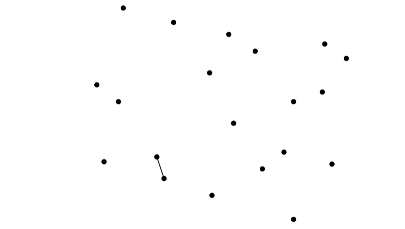
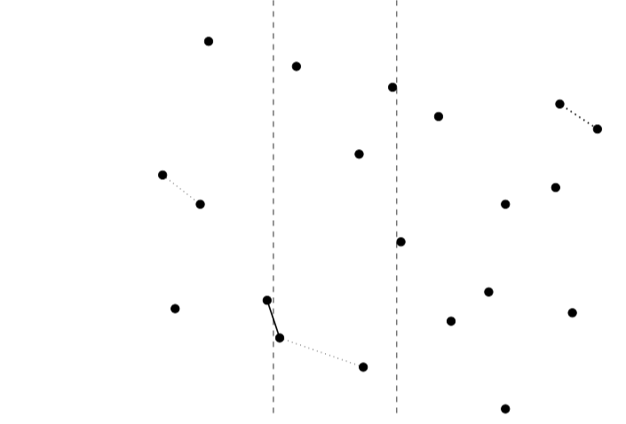
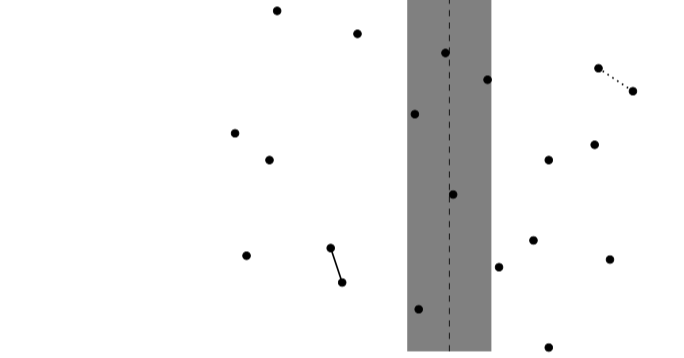
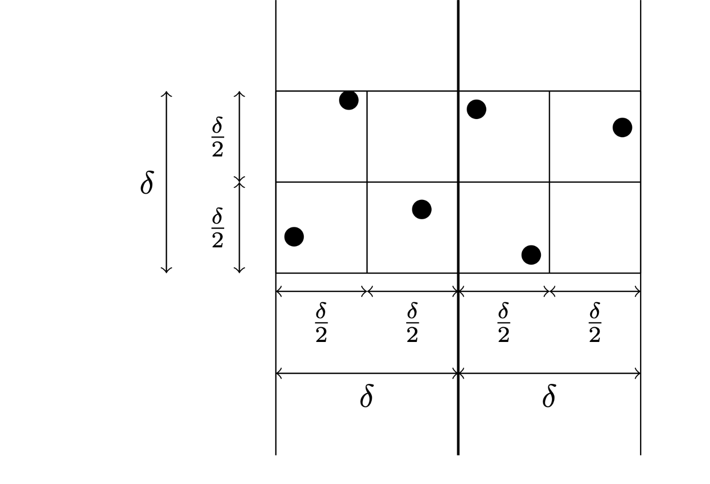

# TP : Distance minimale dans un nuage de points

L'objectif de ce TP est de mettre en place une stratégie de type « diviser pour régner » sur un problème concret.

« Diviser pour régner » est une stratégie de résolution d'un problème qui consiste à :

* diviser notre problème en plusieurs sous-problèmes indépendants plus petits ;
* résoudre récursivement ces sous-problèmes ;
* combiner les solutions obtenues pour retrouver la solution au problème initial.

**Ce TP est à faire en OCaml.**

## I. Étude du problème

Nous nous intéressons ici au problème de trouver la paire $`(P,Q)`$ dans un nuage de points du plan telle que la distance de $`P`$ à $`Q`$ est minimale parmi toutes les distances entre points.


Les concepts seront illustrés par le nuage suivant :

{width=50%}

Un point est codé sous la forme suivante :

```ocaml
type point = {x : float; y : float}
```

> 1. Copiez le type `point` dans votre fichier.
> 2. Écrivez une fonction `distance : point -> point -> float` qui renvoie la distance euclidienne entre deux points.

Les points seront donnés sous la forme d'un tableau (supposé sans doublon) :

```ocaml
(* points de tests : *)
let pts0 = [|{x = 10.3 ; y = 5.4}; {x =  1.2 ; y = 2.5}; {x =  3.4 ; y = 2.7}; {x = 10.7 ; y = 2.4}; 
             {x =  5.7 ; y = 1.1}; {x =  0.9 ; y = 5.7}; {x =  6.4 ; y = 7.8}; {x =  6.6 ; y = 4.1}; 
             {x = 11.3 ; y = 6.8}; {x =  8.7 ; y = 2.9}; {x =  5.6 ; y = 6.2}; {x =  9.1 ; y = 5.0}; 
             {x =  2.0 ; y = 8.9}; {x =  7.8 ; y = 2.2}; {x =  9.1 ; y = 0.1}; {x =  1.8 ; y = 5.0}; 
             {x =  3.7 ; y = 1.8}; {x =  7.5 ; y = 7.1}; {x = 10.4 ; y = 7.4}; {x =  4.1 ; y = 8.3}|]
```

Le résultat recherché est un triplet formé de deux points à distance minimale et de leur distance :

```ocaml
type triplet = {mutable point1 : point; mutable point2 : point; mutable dist : float}
```

> 3. Copiez le tableau `pts0` et le type `triplet` dans votre fichier.
> 4. Écrivez une fonction `best : triplet -> triplet -> triplet` qui renvoie le triplet passé en paramètre dont le champs `dist` est minimal.

Le but des différentes parties du TP est d'écrire une fonction `points_proches : point array -> triplet` qui prend un tableau de points comme paramètre et qui renvoie un triplet optimal.

La méthode la plus "simple" est de calculer toutes les distances possibles entre paires de points pour en déterminer la distance minimale.

> 5. Écrivez une fonction `points_proches_v1` qui calcule ainsi les points les plus proches.
>6. Combien de distances entre points sont calculées ?
> 7. Déduisez-en la complexité de la fonction.

## II. « Diviser pour régner » naïf

On va utiliser une méthode diviser pour régner afin d'obtenir un algorithme de complexité quasi-linéaire.

Pour écrire cet algorithme on aura besoin de trier les points selon leur abscisse ou leur ordonnée. On utilise une fonction de tri de complexité quasi-linéaire, le tri fusion, qui est implémenté en OCaml par la fonction `Array.stable_sort` :

```ocaml
Array.stable_sort : ('a -> 'a -> int) -> 'a array -> unit
```

Le premier paramètre, de signature ` 'a -> 'a -> int`, est une fonction de comparaison qu'on peut noter `cmp`. 

* `cmp x y` doit renvoyer 0 si `x` et `y` sont égaux pour la relation de comparaison.
* `cmp x y` doit renvoyer un entier strictement positif si `x` est strictement supérieur à `y`.
* `cmp x y` doit renvoyer un entier strictement négatif si `x` est strictement inférieur à `y`.

Par exemple, pour comparer les points selon leur abscisse, on peut utiliser :

```ocaml
let compare_x p q  =
    if p.x = q.x then
        0
    else if p.x < q.x then
        -1
    else
        1
```

`Array.stable_sort cmp tab` modifie le tableau en conservant ses éléments et en les plaçant dans l'ordre croissant pour la fonction `cmp` avec stabilité, c'est-à-dire en conservant l'ordre initial en cas d'égalité.

> 1. On devra utiliser notre algorithme avec un tableau de points triés selon les abscisses. Placez donc la ligne suivante dans votre fichier :
>
>     ```ocaml
>     let _ = Array.stable_sort compare_x pts0
>     ```

Pour déterminer la paire de points de distance minimale on propose l'algorithme suivant : 

* on sépare le tableau en deux partie de cardinaux presqu'égaux avec les plus petits éléments et les plus grands,
* on calcule récursivement la paire de points de distance minimale dans chaque sous-tableau,
* on sélectionne laquelle des paires de points est la plus proche.

{width=50%}

Pour pouvoir calculer une paire dans chaque partie issue de la séparation, il faut que ces parties contiennent au moins deux points donc on ne sépare que des parties avec au moins 4 éléments.

> 2. Écrivez une fonction `pp3 : point array -> triplet` qui renvoie les points les plus proches pour *un tableau contenant exactement 3 points.*
> 3. Écrivez une fonction `sub : point array -> int -> int -> point array` telle que `sub tab debut taille` renvoie le sous-tableau de `tab` commençant à l'indice `debut` et contenant `taille` éléments.
> 4. Écrivez une fonction `points_proches_v2` qui calcule les points les plus proches selon la méthode « diviser pour régner » décrite ci-dessus.
> 5. Prouvez que le nombre de calculs de distances effectués pour le calcul dans le cas de `n` points est majoré par `n`.
> 6. En calculant `points_proches_v2 pts0`, montrez que cet algorithme n'est pas correct.

## III. « Diviser pour régner » correct

Le problème est que la distance minimale peut être atteinte pour deux points de chaque coté de la séparation. C'est le cas de l'exemple lors du second appel récursif de la partie gauche.

{width=50%}

Le minimum de gauche n'est pas calculé, on aurait eu comme résultat le minimum des deux distances pointillées.

Il faut donc rassembler les résultats plus finement. 

On note $`x_0`$ une valeur de séparation : les points de gauche ont une abscisse inférieure ou égale à $`x_0`$ et les points de droite ont une abscisse supérieure ou égale à $`x_0`$. Dans la suite on prendra pour valeur de $`x_0`$ l'abscisse du premier point de la partie de droite.

On note $`\delta`$ le minimum de deux distances minimales entre points de la partie gauche et entre points de la partie droite. C'est un candidat à la distance minimale mais il peut exister une distance plus petite entre deux points situés de chaque coté de la frontière entre les deux parties. 

On peut remarquer que, pour un tel couple de points, les abscisses appartiennent à $`[x_0-\delta ; x_0+\delta]`$.

On va donc extraire les points de la bande $`[x_0-\delta;x_0+\delta]\times \mathbb R`$ et on cherche la distance minimale. 

{width=50%}

L'algorithme procède donc de la manière suivante. On commence toujours par trier, une fois pour toute, le tableau selon les abscisses.

On applique alors, récursivement, le calcul des points proches d'un tableau :

* **Diviser.** On sépare le tableau s'il est de taille au moins 4 en deux parties presqu'égales.
* **Régner.** On calcule les points proches de chaque sous-tableau, avec la distance.
* **Combiner.**
    * (1) On calcule le minimum des deux distances, $`\delta`$, et on détermine la bande autour du point de séparation, de largeur $`2\delta`$.
    * (2) On trie la bande selon l'ordonnée.
    * (3) On recherche la paire de points les plus proches de la bande en ne gardant que les distances inférieures à $`\delta`$. On remarque que, pour chercher les distances à partir d'un point $`(x,y)`$, on cherche les distances avec les successeurs $`(x',y')`$, c'est-à-dire $`y'\ge y`$, en s'arrêtant lorsque $`y'\ge y + \delta`$ car on ne trouvera plus de points à une distance plus proche de $`(x, y)`$ que $`\delta`$.
    * (4) On conclut en comparant les résultats.


> 1. Écrivez une fonction `bande pts p0 delta` qui reçoit un tableau de points rangés dans l'ordre croissant des abscisses, un point `p0` et un flottant `delta` et qui renvoie le tableau des éléments de `pts` qui vérifient que leur abscisse appartient à l'intervalle $`[x_0 - \delta; x_0+\delta]`$ où $`x_0`$ est l'abscisse de `p0`.
> 7. Écrivez une fonction `points_proches_bande bde delta` qui détermine un triplet de distance minimale dans la bande. Il s'agit donc de l'étape (3) de la partie « combiner » de l'algorithme.
> 8. Écrivez une fonction `points_proches_v3` qui calcule ainsi les points les plus proches.

## IV. « Diviser pour régner » amélioré

### 1. Nombre de calculs de distances 

On a séparé les points en deux parties, calculé la valeur de $`\delta`$ et déterminé la bande que l'on trie selon les abscisses. Quand on est partis d'un tableau de taille $`n`$, la bande peut contenir jusqu'à $`n`$ éléments ; on pourrait imaginer qu'on fait alors jusqu'à $`\frac{n(n-1)}2`$ calculs de distances, ce qui ruinerait l'amélioration souhaitée. Cependant on a pris soin de limiter les calculs et nous allons voir que cette méthode est efficace.

On cloisonne la bande en carrés de cotés $`\frac \delta 2`$ au dessus du point que l'on traite.


{width=50%}

> 1. Prouvez que la fonction `point_proche_bande` effectue au plus 8 calculs de distances par point.
> 2. Si on note $`C_d(n)`$ le nombre de calculs de distances effectués par `points_proches_v3 pts` avec `pts` tableau de taille $`n`$, prouver qu'on a $`C_d(n)\le C_d(m)+C_d(n-m)+8n \text{ avec }m= \lfloor\frac n2\rfloor`$.
> 3. Déduisez-en que $`C_d(2^k) \le 8\cdot k \cdot 2^k`$ puis prouver que, si on admet que $`C_d`$ est une fonction croissante de $`n, C(n) =\mathcal O\bigl(n\cdot\log_2(n)\bigr)`$.

### 2. La complexité cachée

Le calcul ci-dessus est trompeur : en effet on a estimé le nombre de calculs de distances mais le tri de la bande pourrait introduire de nombreuses comparaisons qui n'ont pas été prises en compte.

On note $`C_c(n)`$ le nombre maximal de comparaisons et de copies d'éléments entre tableaux dans le calcul de `points_proches_v3 pts` avec `pts` tableau de taille $`n`$.

On admet que le nombre de comparaisons et de copies effectuées par le tri fusion d'un tableau de taille $`n`$ est majoré par $`4\cdot n \cdot \log_2(n)`$. 

> 4. Prouvez qu'on a $`C_c(n) = C_c(m)+C_c(n-m)+ \mathcal O\big(n \cdot \log_2(n)\big) \text{ avec } m=\lfloor\frac n2\rfloor \text{ pour } n\ge 2`$.
> 5. Déduisez-en que $`C_c(2^k) = \mathcal O(k^2 \cdot 2^k)`$  puis prouver que, si on admet que $`C_c`$ est une fonction croissante de $`n, C(n) =\mathcal O\bigl(n\cdot\log_2^2(n)\bigr)`$.

### 3. Retour à la quasi-linéarité

Cette complexité supplémentaire provient du tri fusion des bandes à chaque étape. Or celui-ci suit aussi le schéma diviser pour régner. On peut espérer revenir à une récurrence $`C_c(n) \leq C_c(m)+C_c(n-m)+ K \cdot n`$  avec $`K`$ une constante, en n'effectuant que la fusion. Pour cela, la fonction `points_proches` devra renvoyer aussi le tableau des points triés selon les ordonnées croissantes.

> 6. Écrivez une fonction `fusion : point array -> point array -> point array` qui renvoie la fusion de deux tableaux de points triés selon les ordonnées. Le résultat doit donc lui aussi être trié selon les ordonnées croissantes.
> 6. Ré-écrivez la fonction `bande`. Les points ne sont plus triés, et il ne faut pas les trier.
> 6. Écrivez une fonction `points_proches_v4` qui calcule ainsi les points les plus proches avec une complexité quasi-linéaire.

## Pour aller plus loin

> 1. Implémentez la fonction `Array.stable_sort`.
> 2. Résoudre le problème de la recherche des points les plus proches efficacement en C.


---

Par *Éric DÉTREZ, Justine BENOUWT*

Sous licence [*CC BY-NC-SA*](https://creativecommons.org/licenses/by-nc-sa/4.0/)


Source des images : *production personnelle*

