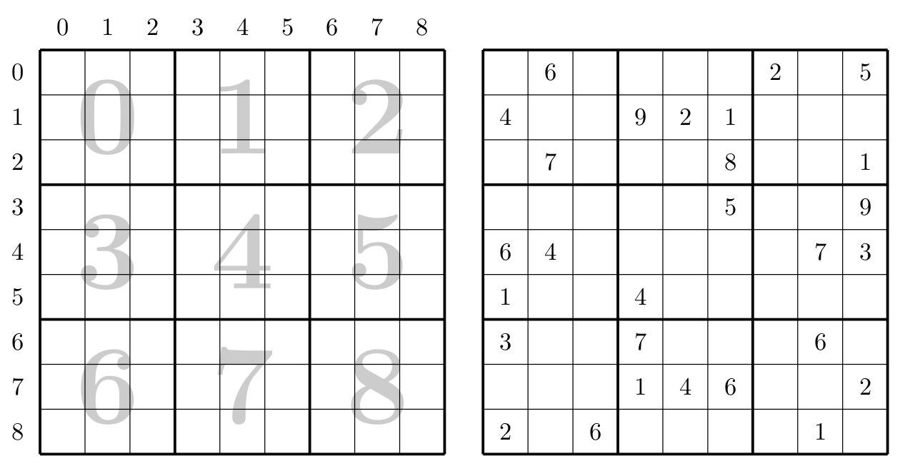

# TP : Sudoku

**Ce TP est à faire en OCaml.**

L'objectif de ce TP est de résoudre des grilles de Sudoku, en utilisant des algorithmes de type « exploration exhaustive ».

## Présentation

* Une grille de Sudoku est une grille de taille $`9 \times 9`$, découpée en 9 carrés de taille $`3 \times 3`$.

* Le but est de la remplir avec des chiffres appartenant à $\{1,2,3,4,5,6,7,8,9\} = I_9$, de sorte que chaque ligne, chaque colonne et chacun des 9 carrés de taille $`3 \times 3`$ contienne une et une seule fois chaque entier de $`I_9`$. On dira alors que la grille est complète.

* En pratique, certaines cases sont déjà remplies et on fera l'hypothèse que le Sudoku qui nous intéresse est bien écrit, c’est-à-dire qu’il possède une solution.

* Le contenu d'une case sera représenté par le type suivant (semblable à `int option`) ; le constructeur `V` représente une case vide tandis que `C k` représente une case avec la valeur `k`. On ne donnera que des valeurs dans `{1, 2, 3, 4, 5, 6, 7, 8, 9}`.

    ```ocaml
    type case = V | C of int
    ```

*  On représente une grille de Sudoku par un tableau de tableau de taille $`9 \times 9`$ de cases.

    ```ocaml
    type grille = case array array
    ```

* Voici le choix de numérotation des lignes, colonnes et carrés ainsi qu'un exemple qui serra utilisé dans la suite :

    {width=70%}

* Cette grille est représentée par :

    ```ocaml
    let gr0 = [|[|   V; C 6;   V;   V;   V;   V; C 2;   V; C 5|];
                [| C 4;   V;   V; C 9; C 2; C 1;   V;   V;   V|];
                [|   V; C 7;   V;   V;   V; C 8;   V;   V; C 1|];
                [|   V;   V;   V;   V;   V; C 5;   V;   V; C 9|];
                [| C 6; C 4;   V;   V;   V;   V;   V; C 7; C 3|];
                [| C 1;   V;   V; C 4;   V;   V;   V;   V;   V|];
                [| C 3;   V;   V; C 7;   V;   V;   V; C 6;   V|];
                [|   V;   V;   V; C 1; C 4; C 6;   V;   V; C 2|];
                [| C 2;   V; C 6;   V;   V;   V;   V; C 1;   V|]|]
    ```


## I. Gestion des conditions

Nous allons remplir une grille en ajoutant un par un des éléments ; on pourra aussi remplacer un élément par un autre. On souhaite n'ajouter que des éléments compatibles pour éviter les calculs inutiles.

À cet effet, on doit vérifier les 3 conditions :

* l'élément ajouté n'est pas déjà sur la même ligne,  

* l'élément ajouté n'est pas déjà sur la même colonne,

* l'élément ajouté n'est pas déjà dans le même carré.

> 1. Écrire une fonction `compatible_ligne : grille -> int -> int -> int -> bool` qui détermine si une valeur `k` qu'on souhaite placer aux coordonnées `i` et `j` est bien différente des autres valeurs de la même ligne déjà connues dans la grille.
>
> 2. Écrire une fonction `compatible_colonne : grille -> int -> int -> int -> bool` qui détermine si une valeur `k` qu'on souhaite placer aux coordonnées `i` et `j` est bien différente des autres valeurs de la même colonne déjà connues dans la grille.  
>
> 3. Quelles sont les coordonnées de la case en haut et à gauche du carré contenant la case de coordonnées `i` et `j` ?  
>    Par exemple, pour `i = 1` et `j = 4`, la réponse est `(0, 3)`.
>     
>4. Écrire une fonction `compatible_carre : grille -> int -> int -> int -> bool` qui détermine si une valeur `k` qu'on souhaite placer aux coordonnées `i` et `j` est bien différente des autres valeurs du même carré déjà connues dans la grille.
> 
>5. Écrire une fonction `compatible : grille -> int -> int -> int -> bool` qui détermine si une valeur `k` qu'on souhaite placer aux coordonnées `i` et `j` est compatible avec la grille.


## II. Remplissage d'une grille

On souhaite maintenant compléter une grille. On va procéder de manière brutale avec un peu (quand même) de réflexion.

La manière brutale non réfléchie consisterait à déterminer tous les remplissages possibles et à tester lesquels donnent une grille qui répond aux conditions. Pour cela on donne les 9 valeurs possibles aux cases libres, il y en a `81-p` si on a une grille avec `p` cases remplies.

Le principe est le suivant :

* On remplit les cases libres avec des 1.
* Tant que la grille est incorrecte,
    * on incrémente la dernière case libre ayant une valeur inférieure à 9 ;
    * on remplit les cases libres suivantes avec des 1.

> 6. Combien de grilles différentes pourraient être testées par cet algorithme dans le pire des cas ?
> 7. Quelle serait donc la complexité de cet algorithme ?

Cette méthode, appelée **par force brute** (*brute force*) est quelquefois la seule possible quand la condition recherchée ne peut se calculer qu'avec un objet rempli : pensez par exemple à la recherche d'un mot de passe de `n` caractères.


Dans notre problème, la non-correction peut se voir plus rapidement : si un élément qu'on veut ajouter est déjà dans la ligne (ou colonne ou carré) il sera impossible d'obtenir une grille correcte quel que soit le remplissage qui suivra. On peut donc cesser la recherche avec cet élément.

On se donne un ordre des cases (il était implicite ci-dessus) : 

$`(0, 0) {\to} (0, 1) {\to} \cdots {\to} (0, 8) {\to} (1, 0) {\to} \cdots {\to} (7, 8) {\to} (8, 0) {\to} \cdots {\to} (8, 8) {\to} (9, 0)`$

> 8. Écrire une fonction `suivant : int -> int -> int * int` qui calcule les coordonnées qui suivent `(i, j)`.
>
>    Par exemple, `suivant 2 5` doit renvoyer `(2, 6)` et `suivant 3 8`doit renvoyer `(4, 0)`.

Le **backtracking** (*retour sur trace*) consiste alors à utiliser une fonction récursive « remplir » qui prend pour paramètres une grille et deux indices `i` et `j`. Elle a comme précondition que toutes les cases avant `(i, j)` sont remplies.

Voici le principe de l'algorithme :

* Si la case `(i, j)` est déjà remplie, alors remplir à partir de la case suivante.
* Sinon, pour `k` allant de 1 à 9 :
    * si la valeur `k` est compatible avec les valeurs déjà présentes, alors :
        * placer `k` dans la case `(i, j)`
        * remplir à partir de la case suivante ;
    * vider la case `(i, j)`

On note la nécessité de remettre à vide la case qu'on a étudiée pour permettre à la fonction qui a appelé `remplir` récursivement de poursuivre avec la même grille.

On remarque aussi qu'il n'y a pas de condition d'arrêt. Comme on a donné le successeur `(9, 0)` à `(8, 8)`, la grille est complètement remplie lorsqu'on a `i = 9`, on cessera donc à ce moment.

Pour tout arrêter dès qu'on a une solution on va utiliser une exception qui sera levée lorsqu'on atteint  `i = 9` :

```ocaml
exception Solution
```

Après avoir écrit la fonction `remplir`, la résolution se fera donc sous la forme :

```ocaml
let resoudre grille_sudoku =
    try
        remplir grille_sudoku 0 0 ;
        failwith "pas de solution"
    with Solution -> grille_sudoku
```

> 9. Écrire la fonction `remplir : grille -> int -> int -> unit`.
> 10. Les fonctions écrites ci-dessus modifient une grille pour la remplir ; la grille initiale est perdue. Modifier la fonction `resoudre : grille -> grille` ci-dessus en commençant par copier la grille dans une nouvelle grille avant d'appeler `remplir` avec cette copie pour paramètre.
> 11. Résoudre la grille `gr0` donnée en exemple.

## III. Compléments

> 12. Écrire une fonction `imprime : grille -> unit` qui affiche une grille sous une forme lisible. Par exemple, la grille de l'image `gr0` sera affichée sous la forme :
>
>     ```ocaml
>     ----- ----- -----
>     |  6  |     |2   5|
>     |4    |9 2 1|     |
>     |  7  |    8|    1|
>      ----- ----- -----
>     |     |    5|    9|
>     |6 4  |     |  7 3|
>     |1    |4    |     |
>      ----- ----- -----
>     |3    |7    |  6  |
>     |     |1 4 6|    2|
>     |2   6|     |  1  |
>      ----- ----- -----
>     ```
>     
> 13. Écrire une fonction `nb_sol : grille -> int` qui détermine le nombre de solutions d'une grille. On pourra s'inspirer de `remplir` et `resoudre`.

On peut souhaiter aussi créer des grilles à soumettre aux amateurs. Une idée est de partir d'une grille correcte *au hasard* et d'enlever des éléments tant que le nombre de solutions de la grille est 1.

Pour construire une grille remplie on peut partir d'une grille vide et utiliser `resoudre`, cependant on obtient toujours la même grille. Pour créer de l'aléatoire on peut remplacer les valeurs `pour k allant de 1 à 9` de l'algorithme par une itération de la forme $`k_0, k_0+1, \ldots, 9, 1, 2, \ldots, k_0-1`$ avec $`k_0`$ choisi aléatoirement entre 1 et 9 avec `Random.int`.

Si on veut éviter un aléatoire qui se reproduit à chaque fois, on peut initialiser aléatoirement le générateur aléatoire par `Random.self_init ()`.

> 14. Modifier `remplir` et `resoudre` en `remplir_alea` et `resoudre_alea` afin qu'elles calculent une solution de manière aléatoire (dans le cas d'une solution unique on retrouvera bien sur cette solution).
> 14. En déduire une fonction qui crée une grille incomplète avec une solution unique en essayant d'avoir peu de valeurs.

## IV. Amélioration de la vérification

Dans la vérification de la compatibilité dans la première partie, on teste l'égalité de l'élément qu'on veut introduire avec tous les autres éléments de la ligne, de la colonne ou du carré. Nous allons ici améliorer cette vérification en introduisant un type de données qui modélise les ensembles avec des opérations rapides pour l'appartenance, l'ajout et le retrait d'un élément.

Les ensembles considérés sont des sous-ensembles de $`I_9 = \{1, 2, 3, \ldots, 9\}`$ donc on pourrait modéliser ces ensembles par des tableaux de booléens, par exemple. Si `t` représente $`E \subset I_9`$, on a $`i\in E`$ si et seulement si `t.(i-1)` contient `true`.

Comme l'ensemble $`I_9`$ est petit, on peut utiliser une représentation plus compacte en exploitant la représentation en base 2 : un sous-ensemble $E$ de $`I_9`$ est représenté par l'entier $`\displaystyle n_E=\sum_{k=0}^8 a_k 2^k`$ avec $`a_k = 1`$ si $`k+1\in E`$ et $`a_k=0`$ sinon.

Par exemple $`\{1, 2, 4, 7, 8, 9\}`$ est représenté par $`1\cdot 2^0 +1\cdot 2^1 +0\cdot 2^2 +1\cdot 2^3 +0\cdot 2^4 +0\cdot 2^5 +1\cdot 2^6 +1\cdot 2^7 +1\cdot 2^8 =459`$. En base 2, on le représentera par `111001011`.

> 16. Par quel entier est représenté le singleton $`\{k\}`$ ?

Pour traduire les opérations ensemblistes, on va utiliser les opérateurs logiques bit-à-bit.

> 17. Compléter les tables des opérateurs logiques `and`, `or`, et `xor` (0 représente *faux* et 1 représente *vrai*) :
>
>     | `a`  | `b`  | `a and b` | `a or b` | `a xor b` |
>     | :--: | :--: | :-------: | :------: | :-------: |
>     |  0   |  0   |           |          |           |
>     |  0   |  1   |           |          |           |
>     |  1   |  0   |           |          |           |
>     |  1   |  1   |           |          |           |

OCaml définit les opérateurs infixes `land`, `lor` et `lxor`, et l'opérateur`lnot`, qui distribuent ces opérateurs sur les bits :

|    `a`    |    `b`    | `a land b` | `a lor b` | `a lxor b` |
| :-------: | :-------: | :--------: | :-------: | :--------: |
|    42     |    301    |     40     |    303    |    263     |
| 000101010 | 100101101 | 000101000  | 100101111 | 100000111  |

> 18. Vérifier à la main les résultats du tableau ci-dessus.

OCaml introduit aussi les opérateurs infixes `lsl` et `lsr` :

* `n lsl k` décale les bits de `k` rangs vers la gauche (*Logical Shift Left*). Cela revient à multiplier par $`2^k`$ mais les bits qui dépassent la taille de la représentation des nombres disparaissent : `21 lsl 3` donne 168 mais `1 lsl 127`donne 0 pour des entiers sur 128 bits (en fait, pour $`m> 127`$, le résultat n'est pas spécifié).
* `n lsr k` décale les bits de `k` rangs vers la droite (*Logical Shift Right*), cela revient à diviser par $`2^k`$,  les `k` bits à droite disparaissent.

> 19. En utilisant l'opérateur `lsl`, comment représenter le singleton $`\{k\}`$ pour $`k\in I_9`$ ?

Pour ajouter $`k`$ à un ensemble on en fait l'union (`lor`) avec le singleton $`\{k\}`$.

On va maintenant enrichir la représentation d'une grille : en plus du tableau $`9 \times 9`$ on ajoute 3 tableaux de taille 9 qui représentent les ensembles des valeurs déjà placées par lignes, par colonnes et par carrés.

```ocaml
type sudoku = {	grl : grille;
                lig : int array;
                col : int array;
                car : int array}
```

L'exemple donné au début du sujet sera représenté par

```ocaml
let sdk0 = { grl = gr0 ;
             lig = [|50; 267; 193; 272; 108; 9; 100; 43; 35|];
             col = [|47; 104; 32; 329; 10; 177; 2; 97; 279 |];
             car = [|104; 387; 19; 41; 24; 324; 38; 105; 35|] }
```

> 20. Écrire une fonction `ajouter : sudoku -> int -> int -> int -> unit` telle que `ajouter sdk i j k` ajoute la valeur `k` à la case de coordonnées `i` et `j` *supposée vide* dans le sudoku représenté par `sdk`.
> 21. En déduire une fonction `vers_sudoku : grille -> sudoku` qui convertit une grille vers le sudoku associé.
> 22. Écrire une résolution qui utilise ce type de données.

## Pour aller plus loin

> 23. Si vous avez terminé, vous pouvez vous inspirer du [TP sur la gestion de fichiers](../fichiers.md) afin d'écrire un programme qui prend en argument le nom d'un fichier texte contenant un sudoku, l'ouvre et le lit afin de créer un objet de type `sudoku` associé, puis affiche sur la sortie standard sa solution. Vous pouvez récupérer [ici](./code/sudoku/) quelques fichiers contenant des sudokus.
> 23. Implémenter la résolution « par force brute » évoquée dans la partie II.


---

Par *Éric DÉTREZ*, *Justine BENOUWT*

Sous licence [*CC BY-NC-SA*](https://creativecommons.org/licenses/by-nc-sa/4.0/)


Source des images : *Éric Détrez*

