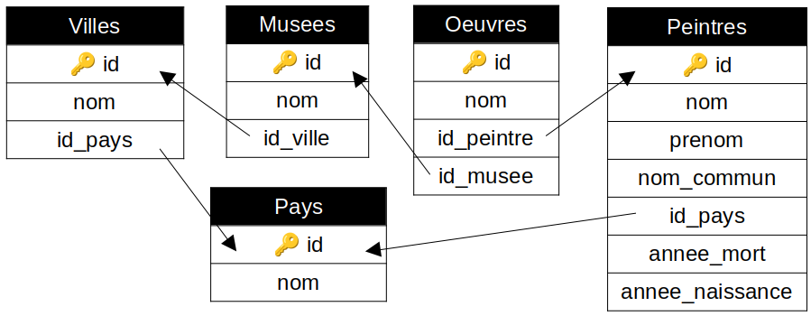

# TP : Bases de données

Au travers de la base de données sur les locations de voitures (en DM et TP), vous avez appris tout ce qu’il faut pour manipuler les bases de données. Vous êtes donc maintenant en mesure d’écrire des requêtes SQL utilisant l’ensemble des mots-clefs présentés.

Dans quasiment tous les sujets de concours, on vous demande d'écrire quelques requêtes SQL : c'est un incontournable et ce sont des points facilement gagnés. Or contrairement à la plupart des notions abordées cette année, les bases de données ne sont pas revues en MPI.

Ce TP a donc pour objectif de servir d’entraînement en posant des questions similaires à ce que vous pourriez avoir aux concours : la partie I. présente la base de données et pose quelques questions concernant le modèle relationnel, et les parties II. et III. demandent d’écrire des requêtes SQL.

## I. Étude de la base

Voici le schéma relationnel de la base avec laquelle nous allons travailler :

>   1.   Quelles sont les relations ?
>   2.   Pour chaque relation, quels sont ses attributs ?
>   3.   Pour chaque attribut, quel est son domaine ?
>   4.   Pour chaque relation, quelle est sa clé primaire ? À quoi sert-elle ?
>   5.   Quelles sont les clés étrangères ? À quoi servent-elles ?

Les questions précédentes sont celles que vous devez vous poser avant de commencer à écrire les requêtes SQL, c’est ce qui définit la structure de la base avec laquelle on travaille. Les questions suivantes sont plus du style de questions de concours.

>   6.   Pourquoi a-t-on nécessairement dû ajouter un attribut `id` à la relation `Peintres` ?
>   7.   D’après le schéma relationnel de la base, plusieurs œuvres peuvent-elles avoir le même nom ?
>   8.   D’après le schéma relationnel de la base, deux musées de noms différents peuvent-ils avoir le même identifiant ?
>   9.   D’après le schéma relationnel de la base, un peintre peut-il avoir réalisé plusieurs œuvres ?
>   10.   D’après le schéma relationnel de la base, une œuvre peut-elle exposée dans plusieurs musées différents ?
>   11.   D’après le schéma relationnel de la base, une ville peut-elle ne contenir aucun musée ?
>   12.   D’après le schéma relationnel de la base, un musée peut-il exposer une œuvre réalisée par un peintre non référencé dans la relation `Peintres` ?
>   13.   D’après le schéma relationnel de la base, deux musées différents de même nom peuvent-ils exposer la même œuvre ?
>   14.   D’après le schéma relationnel de la base, un peintre peut-il être originaire d’un pays ne contenant aucun musée ?
>   15.   D’après le schéma relationnel de la base, un musée peut-il se situer dans le pays d’origine du peintre d’une des œuvres qu’il expose ?
>   16.   D’après le schéma relationnel de la base, une œuvre peut-elle être exposée dans aucun musée ?

La base de données correspondant à ce schéma relationnel se trouve ici : [peintures.db](code/peintures.db).

>   17.   Ouvrez cette base dans DB Browser.
>   18.   Grâce à l’onglet « Parcourir les données », donnez le nombre d’enregistrements de chaque relation.

Contrairement au TP précédent, aucune indication n’est fournie concernant le résultat attendu des requêtes SQL. Il est donc *très fortement conseillé* de retourner fréquemment dans l’onglet « Parcourir les données » pour vérifier vos résultats.

## II. Requêtes SQL élémentaires

Quand on construit une requête SQL, les mots-clefs doivent suivre un ordre bien précis, résumé par le schéma ci-dessous :

Dans l’intégralité de cette partie, il faut trouver une requête SQL permettant de récupérer les données souhaitées dans la base. Les requêtes sont guidées : on vous indique le type de mots-clefs SQL à utiliser.

Par défaut, si rien n’est précisé, c’est qu’on attend la sélection de tous les attributs.

Même si ce n'est pas précisé, on attend de vous **un renommage systématique des colonnes du résultat** si c'est nécessaire. C'est un peu comme donner des bons noms à vos variables en C ou en OCaml : ça facilite la lecture de votre requête. N’hésitez pas également à utiliser des commentaires (avec deux tirets) si nécessaires.

>   **Sélection avec ou sans formatage**
>
>   Toutes les requêtes de cette partie sont de la forme `SELECT … FROM … WHERE …`. Certaines requêtes nécessitent un formatage additionnel : `ORDER BY … LIMIT … OFFSET …`.
>
>   1.   ★ Quels sont, sans doublons, les noms des musées ?
>   2.   ★ Qui est le peintre d’identifiant 180 ?
>   3.   ★ Quels sont, dans l’ordre alphabétique, les noms des villes ?
>   4.   ★ Quelles sont les œuvres dont le nom commence par le mot « Le » ?
>   5.   ★ Quel est le pays au nom le plus long ?
>   6.   ★ Quelles sont les œuvres du peintre d’identifiant 40 exposées dans le musée d’identifiant 5 ?
>   7.   ★★ Qui sont les deuxième et troisième peintres originaires du pays d’identifiant 1 morts en dernier ?

>   **Fonctions d’agrégation et groupes**
>
>   Les requêtes de cette partie demandent d’utiliser des fonctions d’agrégation (`MIN / MAX / SUM / AVG / COUNT`) et / ou de faire des groupes (`GROUP BY … HAVING …`).
>
>   1.   ★ Combien y a-t-il de pays ?
>   2.   ★ Quels sont les identifiants et nombre d’œuvres de chaque peintre ? Les peintres n’ayant rien réalisé n’ont pas besoin d’apparaître dans le résultat.
>   3.   ★ À quel âge est mort le peintre ayant vécu le moins longtemps ?
>   4.   ★ Quels sont les identifiants des villes possédant 2 musées ?
>   5.   ★ Combien de villes possèdent un musée ?
>   6.   ★ Quels sont les identifiants des pays dont au moins quatre peintres sont originaires ?
>   7.   ★★ Quels sont les identifiants des peintres dont une seule œuvre est exposée au musée d’identifiant 1 ?

>   **Jointures**
>
>   Les requêtes de cette partie demandent d’utiliser des jointures internes (`JOIN … ON …`) ou externes (`LEFT JOIN … ON …`).
>
>   1.   ★ Quels sont les prénom et nom des peintres, et noms de leurs pays d’origine ?
>   2.   ★ Quels sont les noms des œuvres exposées au Musée du Louvre ?
>   3.   ★ Quels sont les noms des œuvres exposées et noms des villes dans lesquelles on peut les trouver ?
>   4.   ★★ Quels sont les noms des œuvres exposées en France ?
>   5.   ★★ Quel est le nom et nombre de villes de chaque pays ? Le résultat doit aussi contenir les pays n’ayant aucune ville.
>   6.   ★★ Quels sont les identifiants et nombre d’œuvres de chaque peintre ? Le résultat doit contenir *tous* les peintres.
>   7.   ★★★ Pour chaque œuvre exposée, quel est son nom, nom du pays dans lequel on peut la trouver, et nom du pays d’origine du peintre l’ayant réalisée ?

>   **Sous-requêtes**
>
>   Les requêtes de cette partie demandent d’utiliser des requêtes imbriquées et / ou des opérateurs ensemblistes (`UNION / INTERSECT / EXCEPT`).
>
>   1.   ★ Quelles sont les années ayant vu naître et mourir un peintre ?
>   2.   ★ Qui sont les peintres morts ayant vécu plus longtemps que la moyenne ?
>   3.   ★ Quels sont les identifiants des pays dont aucun peintre n’est originaire ?
>   4.   ★ Qui est(sont) le(s) peintre(s) le(s) plus ancien(s) ?
>   5.   ★ Quel(s) est(sont) le(s) nom(s) du(des) musée(s) dont le nom est de taille maximale ?
>   6.   ★★ Quels sont les noms communs des peintres qui en ont un et noms complets (prénoms et noms concaténés) des peintres qui n’en ont pas ? Le résultat doit avoir une unique colonne intitulée « nom d’usage ».
>   7.   ★★★ Quels sont les identifiants des pays ayant strictement plus de villes que le pays d’identifiant 2 ?

## III. Requêtes SQL avancées

Les questions de cette partie ne sont plus guidées : à vous de trouver les mots-clefs SQL nécessaires à l’écriture de la requête permettant d’y répondre. C’est ce type de questions que vous aurez aux concours.

Les questions sont séparées en trois parties de difficultés croissantes :

*   Niveau ★ : requêtes simples ne nécessitant que quelques mots-clefs souvent de la même catégorie (suffisant pour la plupart des questions des épreuves de CCINP).
*   Niveau ★★ : requêtes de niveau intermédiaire pouvant nécessiter de combiner plusieurs types de mots-clefs (suffisant pour la plupart des questions des épreuves de Centrale / Mines).
*   Niveau ★★★ : requêtes complètes pouvant nécessiter des mots-clefs de tous types et / ou des imbrications.

>   Niveau ★
>
>   1.   Quels sont, sans doublon, les deux derniers chiffres des années de naissance des peintres ?
>   2.   Quelles sont les œuvres qui ne sont pas exposées ?
>   3.   Qui sont les peintres qui sont morts avant leur quarantième anniversaire ?
>   4.   Quels sont les âges des peintres encore en vie ?
>   5.   Quel est le nom complet (nom et prénom concaténés) et nom commun des peintres qui en ont un ? Pensez au renommage.
>   6.   Qui sont les peintres nés une année paire et mort une année impaire du même siècle ?
>   7.   Qui sont les peintres ayant un prénom composé ?
>   8.   Quels sont les noms des œuvres actuellement exposées dont le nom comporte deux *e* encadrant exactement 2 caractères ?
>   9.   Quel est le nom complet (prénom et nom concaténés) des peintres dont le prénom contient un *a*, le nom ne commence pas par *Ve* et dont l’avant dernière lettre est un *i* ?
>   10.   Combien y a-t-il d’œuvres exposées ?
>   11.   Combien de caractères contient le plus long nom d’œuvre ?
>   12.   Quelle est la moyenne d’âge des peintres à leur mort ?
>   13.   Combien de villes ont un nom qui finit par un *e* ou par un *s* ?
>   14.   Qui sont les cinq derniers peintres morts ?
>   15.   Quels sont, suivant l’ordre lexicographique croissant de leur nom, les troisième, quatrième et cinquième pays ?
>   16.   Combien de villes y a-t-il dans chaque pays ?
>   17.   Quels sont les identifiants des pays ayant au moins 2 villes ?
>   18.   Quels sont les noms des œuvres peintes par *Édouard Manet* ?
>   19.   Quels sont les prénoms et noms des peintres qui n’ont vécu qu’au XVIIe siècle, ou qui sont français et ont vécu au moins 70 ans ?
>   20.   Pour *toutes* les œuvres, quel est leur nom et, le cas échéant, le nom du musée l’exposant ?
>   21.   Quelles sont les années de morts de peintres qui ne sont pas aussi des années de naissance d'autres peintres ?

>   Niveau ★★
>
>   1.   Quels sont les nom et prénom du peintre naît en dernier ? On donnera deux requêtes différentes pour cette question.
>   2.   Quels sont (sans doublon) les noms qui sont ceux d’au moins deux œuvres différentes ? On donnera deux requêtes différentes pour cette question.
>   3.   Existe-t-il des musées n’exposant aucune œuvre ? On donnera deux requêtes différentes pour cette question.
>   4.   Qui est le peintre mort, ayant un nom commun, ayant un prénom ou un nom de plus de 10 lettres, et né une année bissextile, qui a vécu le plus longtemps ?
>   5.   Quels sont les noms des œuvres peintes par *Le Titien* exposées à *Paris* ?
>   6.   Combien d’œuvres sont exposées au musée *Unterlinden* ?
>   7.   Quelle est la longueur totale des noms des œuvres de *Vincent van Gogh* ?
>   8.   Pour *toutes* les œuvres, quel est leur nom et, le cas échéant, le nom du pays dans lequel on peut la trouver ? On triera le résultat par ordre lexicographique des noms de pays puis, en cas d’égalité, par ordre lexicographique décroissant des noms d’œuvres.
>   9.   Quelles sont les villes se trouvant dans un même pays ? Le résultat doit comporter trois colonnes, contenant respectivement deux noms de villes se trouvant dans un même pays, et l’identifiant de ce pays.
>   10.   Qui est le cinquième peintre français le plus ancien ?
>   11.   Quels sont les noms des peintres qui ont une œuvre de nom plus long que la moyenne ?
>   12.   Combien de peintres sont nés après l’année moyenne de naissance d’un peintre ?
>   13.   Pour *tous* les pays, quel est son nom et nombre de peintres qui en sont originaires ?
>   14.   Quel est l’identifiant du musée exposant le plus d’œuvres ?
>   15.   Pour chaque pays ayant vu naître au moins deux peintres, quel est son nom et année de naissance du plus récent peintre né dans ce pays ?
>   16.   Quels sont les identifiants des musées qui exposent au moins deux œuvres dont le titre commence par *L* ?
>   17.   Quels sont les prénom et nom des peintres dont une seule œuvre est exposée au musée du *Louvre* ?
>   18.   Quels sont, sans doublon, les noms des musées qui exposent au moins deux œuvres du peintre de nom commun *Le Titien* ?
>   19.   Quels sont les prénoms et noms de peintres, ainsi que les noms des pays dans lesquels un peintre a pu voyager, sachant que l’on ne prend pas en compte un pays dont le peintre est originaire ?

>   Niveau ★★★
>
>   1.   Quel est le nom du peintre dont le plus d’œuvres sont exposées dans un même musée ?
>   2.   Combien y a-t-il de peintres ayant vécu à partir du XVème siècle dont le nom contient la particule *di* ou *van* et dont une œuvre est exposée à *Paris* ?
>   3.   Quel est le nombre moyen d’œuvres par peintre ?
>   4.   Quels sont les noms des œuvres exposées dans le pays d’origine du peintre l’ayant réalisée ?
>   5.   Quel est l’identifiant du troisième pays dont le plus de peintres nés au XIXème siècle sont originaires ?
>   6.   Quels sont les identifiants, prénoms et noms des peintres originaires du même pays que le peintre connu sous le nom commun *Sandro Botticelli* ?
>   7.   Combien y a-t-il de villes portant le nom d’un pays ?
>   8.   Quels sont les noms des pays pour lesquels aucun peintre originaire de ce pays dont une œuvre est exposée à Paris n’est né après 1800 ?
>   9.   Quels sont (sans doublon) les noms des peintres qui sont exposés dans un musée dans lequel il y a au moins un autre peintre de même nationalité qui est exposé ?
>   10.   Combien y a-t-il de pays qui contiennent un musée mais dont aucun peintre n’est originaire ?
>   11.   Quelles sont les années qui ont vu *soit* la naissance *soit* la mort d’un peintre ?
>   12.   Quel est le nom des peintres qui ont peint au moins une œuvre exposée dans un pays dans lequel est exposé dans une autre ville de ce pays au moins une œuvre d’un peintre qui est mort strictement plus tôt ?
>   13.   Qui sont les peintres (prénom et nom) exposés au musée d’Orsay et au musée du Louvre ?
>   14.   Qui sont les peintres italiens dont au moins deux œuvres sont exposées en Italie ?
>   15.   Qui sont les peintres dont toutes les œuvres ont un nom plus long que la moyenne ?
>   16.   Combien de musées exposent strictement plus d’œuvres que le *Rijksmuseum* ?
>   17.   Quel est le nombre moyen d’œuvres dans les musées français qui exposent au moins deux œuvres ?
>   18.   Qui sont les peintres ayant réalisé plus d’œuvres que la moyenne ?
>   19.   Quelle(s) est(sont) la(s) ville(s) possédant le plus de musées ?
>   20.   Quels sont les noms des peintres exposés dans tous les musées parisiens ?

## Pour aller plus loin

>   1.   Inventez vos propres questions concernant cette base de données, et demandez à votre voisin d’écrire une requête SQL pour y répondre !
>   2.   Pour plus d’entraînement, vous pouvez aller sur le site [sqlzoo](https://sqlzoo.net/wiki/SQL_Tutorial). Les exercices sont de difficultés croissantes. Ne faîtes pas les derniers exercices concernant la création de bases, ils sont hors programme.
>   3.   Vous avez survécu à un crash d’avion, et vous vous retrouvez coincé sur une île : SQL Island. Allez sur [ce site](https://sql-island.informatik.uni-kl.de/) et trouvez un moyen de vous échapper de l'île ! *Remarques : 1) Si le site est en Allemand, cliquez sur le menu (barres horizontales en haut à gauche) puis sur "Sprache wechsein" et changez la langue. 2) Plusieurs requêtes présentées sur ce site sont hors programme, privilégiez plutôt sqlzoo.*

---

Par *Justine BENOUWT*

Sous licence [*CC BY-NC-SA*](https://creativecommons.org/licenses/by-nc-sa/4.0/)

Source des images : *production personnelle*

Inspirations : N. Pecheux
