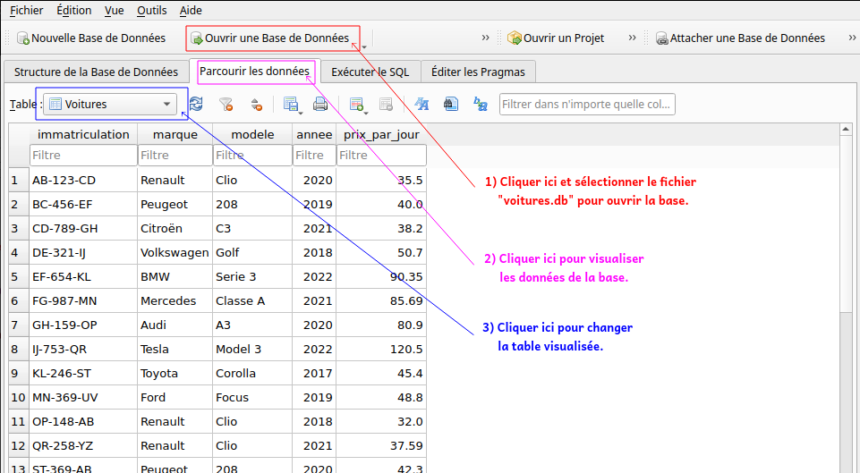
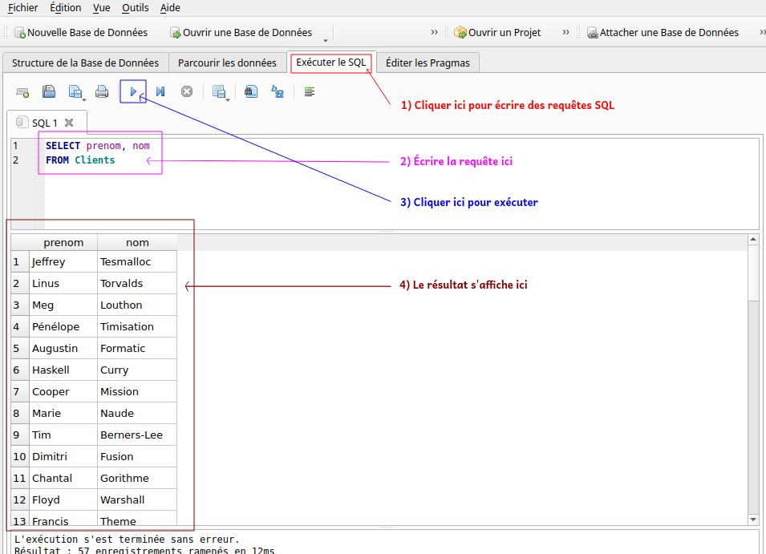

# DM n° 9 : introduction aux bases de données 

Ce DM est une introduction à la manipulation des **bases de données**. Il présente les bases du langage **SQL**, qu'il faut impérativement connaître pour pouvoir faire le prochain TP, il est donc important d’**étudier attentivement l'intégralité de ce DM**.

*   À rendre le **mardi 22 avril**.
*   Durée estimée : 3h.

Vous aurez besoin d'un ordinateur pour faire ce DM. Il faut télécharger :

* le logiciel « DB Browser for SQLite » : [https://sqlitebrowser.org/dl/](https://sqlitebrowser.org/dl/) 
* le fichier contenant la base de données : [https://framagit.org/jb_info/mp2i/-/blob/main/docs/tp/sql/code/voitures.db](./code/voitures.db) .

Une fois installé, ouvrez le logiciel DB Browser puis cliquez en haut à gauche sur l'onglet « Ouvrir une base de données » et sélectionner le fichier "voitures.db". Une fois ouvert, cliquez sur l'onglet « Parcourir les données » pour visualiser les données de la base.

Une base de données est constituée de plusieurs **tables**, contenant chacune une partie des données. La base « voitures.db » contient trois tables :

* une table « Voitures » qui contient les données sur les voitures existantes ;
* une table « Clients » qui contient les données des clients de l’agence de location ;
* une table « Location » qui contient les données des locations de voitures effectuées à l’agence.

Le menu déroulant en haut à gauche de DB Browser permet de sélectionner la table dont on veut afficher les données.



Pour rechercher des données dans une base, on utilise des **requêtes SQL**.

Il faut aller dans l'onglet « Exécuter le SQL » de DB Browser, entrer la requête dans la zone dédiée puis exécuter en cliquant sur le triangle au dessus. Le résultat s'affiche en dessous.



L'objectif du DM est de découvrir les mots-clefs permettant d'écrire une requête SQL.

**Vous devez reporter sur le document réponse uniquement vos réponses aux questions précédées du symbole ✍️.**

### I. Sélection simple

> 1. Une requête de sélection commence toujours pas le mot clef `SELECT` suivi des informations à récupérer puis du mot-clef `FROM` suivi de la table dans laquelle chercher ces données. Tester dans DB Browser :
>
>     ```sql
>     SELECT prenom, nom
>     FROM Clients
>     ```
>
> 2. Si on souhaite récupérer toutes les données d'une table, on utilise le symbole `*`. Tester :
>
>     ```sql
>     SELECT *
>     FROM Clients
>     ```
>
> 4. Si on souhaite supprimer les doublons du résultat, on utilise le mot-clef `DISTINCT`. Tester :
>
>     ```sql
>    SELECT DISTINCT prenom
>     FROM Clients
>    ```
> 
>     Tester aussi en enlevant le `DISTINCT`.
>
> 5. ✍️ Écrire une requête SQL permettant de récupérer, sans doublon, les marques des voitures.
>

### II. Filtrer les lignes

> 5. Si on souhaite filtrer les résultats selon une certaine condition, on utilise le mot-clef `WHERE`. Tester :
>
>     ```sql
>     SELECT marque, modele, prix_par_jour
>     FROM Voitures
>     WHERE prix_par_jour > 100
>     ```
>
> 7. On peut relier plusieurs conditions avec les opérateurs `AND`, `OR` et `NOT`. Tester :
>
>     ```sql
>     SELECT prenom, nom
>     FROM Clients
>     WHERE (prenom = 'Dimitri' OR prenom = 'André') AND annee_naissance < 1982
>     ```
>
>     Le `=` est l'opérateur d'égalité et le `<>` l'opérateur de différence (comme en OCaml).
>
> 8. ✍️ Écrire une requête SQL permettant de récupérer toutes les informations des voitures de Peugeot ou Renault qui ne sont sorties ni en 2008 ni en 2020.
>
> 9. Une case vide en SQL (pas de donnée renseignée dans la table) est symbolisée par le mot-clef `NULL`. On regarde si une case est vide avec `IS NULL` (ou `IS NOT NULL`). Tester :
>
>     ```sql
>     SELECT prenom, nom, adresse
>     FROM Clients
>     WHERE adresse IS NULL
>     ```
>
>     Tester aussi en enlevant le `WHERE`.
>
> 10. ✍️ Écrire une requête SQL permettant de récupérer les prénoms et noms des clients dont le numéro de téléphone est renseigné mais pas l’adresse mail.
>
> 11. On peut comparer un texte selon un motif avec le mot-clef `LIKE`. Tester :
>
>       ```sql
>       SELECT prenom
>       FROM Clients
>       WHERE prenom LIKE 'F%'
>       ```
>
> 12. Le `%` remplace un nombre quelconque de caractères, le `_` remplace un unique caractère. Tester :
>
>       ```sql
>      SELECT modele
>       FROM Voitures
>       WHERE modele LIKE '_3'
>       ```
> 
>       Tester aussi en remplaçant le `_` par un `%`.
>
> 13. ✍️ Écrire une requête SQL permettant de récupérer les prénoms et noms des clients lillois.
>
> 14. ✍️ Écrire une requête SQL permettant de récupérer les modèles de voitures contenant exactement trois caractères.

### III. Formatage

> 14. On renomme une colonne du résultat avec le mot-clef `AS`. Tester :
>
>     ```sql
>     SELECT prenom, nom, 2025 - annee_naissance AS 'age'
>     FROM Clients
>     ```
>
> 9. On range un résultat dans l'ordre croissant ou décroissant avec `ORDER BY`. Tester les deux requêtes suivantes :
>
>     ```sql
>     SELECT *
>     FROM Voitures
>     ORDER BY prix_par_jour ASC
>     ```
>
>     ```sql
>     SELECT *
>     FROM Voitures
>     ORDER BY prix_par_jour DESC
>     ```
>
> 10. ✍️ Écrire une requête SQL permettant de récupérer les marques, modèles et âges des voitures (en renommant la colonne), rangées dans l'ordre de la plus jeune à la plus vieille.
>
> 11. On peut ajouter `LIMIT n` pour ne sélectionner que les `n` premiers résultats.Tester :
>
>     ```sql
>     SELECT *
>     FROM Voitures
>     ORDER BY prix_par_jour ASC
>     LIMIT 4
>     ```
>
> 12. On peut ajouter `OFFSET m` pour ignorer les `m` premiers résultats. Tester :
>
>     ```sql
>     SELECT *
>     FROM Voitures
>     ORDER BY prix_par_jour ASC
>     LIMIT 4
>     OFFSET 1
>     ```
>
> 13. ✍️ Écrire une requête SQL permettant de récupérer le nom de la quatrième voiture la plus vieille.

### IV. Opérations ensemblistes

> 20. On peut faire l'union de deux résultats de requêtes avec le mot-clef `UNION`. Tester :
>
>     ```sql
>     SELECT nom AS 'tous les noms et prénoms'
>     FROM Clients
>     	UNION
>     SELECT prenom
>     FROM Clients
>     ```
>
> 22. On peut aussi faire l'intersection avec `INTERSECT`. Tester :
>
>      ```sql
>      SELECT nom AS 'tous les noms qui sont aussi des prénoms'
>      FROM Clients
>      	INTERSECT
>      SELECT prenom
>      FROM Clients
>      ```
>
> 23. Enfin, on peut récupérer les résultats de la première requête privé des résultats de la deuxième avec `EXCEPT`. Tester :
>
>     ```sql
>     SELECT nom AS 'tous les noms qui ne sont pas des prénoms'
>     FROM Clients
>     	EXCEPT
>     SELECT prenom
>     FROM Clients
>     ```
>
> 24. ✍️ Écrire une requête SQL permettant de récupérer les prénoms des clients qui s'appellent comme un modèle de voiture.
>
> 25. ✍️ Écrire une requête SQL permettant de récupérer les années ayant vu naître une voiture mais pas un client.

### V. Fonctions d'agrégation

> 25. On peut appliquer une fonction au résultat d'une requête : `MIN` (minimum du résultat), `MAX` (maximum du résultat), `SUM` (somme du résultat), `AVG` (moyenne du résultat) et `COUNT` (compte le nombre de lignes du résultat). Tester les cinq requêtes suivantes :
>
>     ```sql
>     SELECT MIN(prix_par_jour)
>     FROM Voitures
>     ```
>
>     ```sql
>     SELECT MAX(prix_par_jour)
>     FROM Voitures
>     ```
>
>     ```sql
>     SELECT SUM(prix_par_jour)
>     FROM Voitures
>     ```
>
>     ```sql
>     SELECT AVG(prix_par_jour)
>     FROM Voitures
>     ```
>
>     ```sql
>     SELECT COUNT(prix_par_jour)
>     FROM Voitures
>     ```
>
> 27. ✍️ Écrire une requête SQL permettant de récupérer l’année de naissance moyenne des clients.
>
> 28. ✍️ Écrire une requête SQL permettant de récupérer le nombre de clients nés en 2000.
>
> 29. On peut utiliser `DISTINCT` à l’intérieur d’un `COUNT` pour ne pas compter les doublons. Tester :
>
>     ```sql
>     SELECT COUNT(DISTINCT marque)
>     FROM Voitures
>     ```
> 
>     Tester aussi en enlevant le `DISTINCT`.
> 
> 30. ✍️ Écrire une requête SQL permettant de récupérer le nombre d’années ayant vu naître un client.

### VI. Groupes

> 30. On peut regrouper les lignes du résultat qui ont la même valeur pour une colonne avec `GROUP BY`. Les fonctions d'agrégation s'appliquent alors à chaque groupe et non plus à tout le résultat. Tester ces deux requêtes :
>
>     ```sql
>     SELECT prenom, COUNT(numero_permis) AS 'nombre de clients ayant ce prénom'
>     FROM Clients
>     GROUP BY prenom
>     ```
>
>     ```sql
>     SELECT prenom, AVG(annee_naissance) AS 'annee de naissance moyenne pour les clients ayant ce prénom'
>     FROM Clients
>     GROUP BY prenom
>     ```
>
> 32. ✍️ Écrire une requête SQL permettant de récupérer, pour chaque marque, l'année de sa plus vieille voiture.
>
> 33. Il est possible de filtrer les groupes avec le mot-clef `HAVING`. Par exemple la requête suivante ne conserve que les noms appartenant à aux moins deux personnes, tester :
>
>     ```sql
>     SELECT prenom, COUNT(numero_permis) AS 'nombre de clients ayant ce prénom'
>     FROM Clients
>     GROUP BY prenom
>     HAVING COUNT(numero_permis) >= 2
>     ```
>
> 34. ✍️ Écrire une requête SQL permettant de récupérer, pour chaque année ayant vu naître quatre voitures, le prix moyen par jour des locations de ces quatre voitures.
>
> 35. ✍️ Écrire une requête SQL permettant de récupérer les marques possédant au moins deux modèles de voitures différents.

### VII. Jointures

> 35. Si on a besoin de données réparties sur plusieurs tables, il faut réaliser une jointure avec `JOIN`. La jointure se fait sur la colonne que les tables ont en commun. Ici, les tables « Voitures » et « Locations » ont une colonne en commun (l’immatriculation de la voiture), on peut donc les relier ainsi, tester :
>
>     ```sql
>     SELECT modele, date_debut
>     FROM Voitures
>     JOIN Locations ON Voitures.immatriculation = Locations.immat_voiture
>     ```
>
> 37. ✍️ Écrire une requête SQL permettant de récupérer, pour chaque location effectuée, son identifiant (`id`) et le prix total de cette location (calculé par rapport au prix par jour de la voiture louée et du nombre de jours de la location).
>
> 38. On peut enchaîner les jointures pour relier plus de tables, tester :
>
>     ```sql
>     SELECT modele, date_debut, nom
>     FROM Voitures
>     JOIN Locations ON Voitures.immatriculation = Locations.immat_voiture
>     JOIN Clients ON Locations.permis_client = Clients.numero_permis
>     ```
>
> 39. ✍️ Écrire une requête SQL permettant de récupérer (sans doublons) les noms et prénoms des clients ayant loué une voiture de plus de 100€ par jour.
>
> 40. ✍️ On peut combiner tous les mots-clefs découverts pour écrire des requêtes SQL plus complexes. Expliquer ce que la requête SQL suivante permet de récupérer :
>
>     ```sql
>     SELECT nom AS 'nom du client'
>     FROM Clients
>     JOIN Locations ON Locations.permis_client = Clients.numero_permis
>     JOIN Voitures ON Voitures.immatriculation = Locations.immat_voiture
>     WHERE adresse LIKE 'Montpellier%'
>     GROUP BY numero_permis
>     HAVING COUNT(id) >= 3
>     ORDER BY AVG(prix_par_jour) DESC
>     LIMIT 1
>     ```


---

Par *Justine BENOUWT*

Sous licence [*CC BY-NC-SA*](https://creativecommons.org/licenses/by-nc-sa/4.0/)


