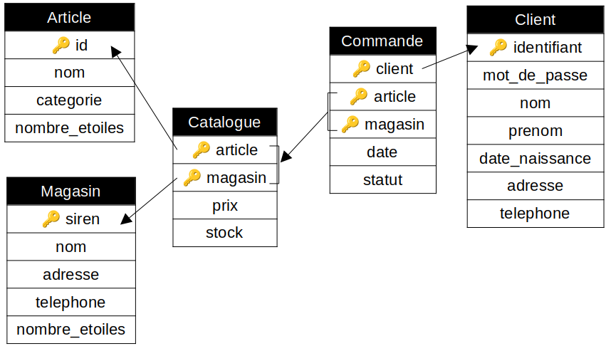

# TP : Bases de données (suite du DM)

Ce TP fait suite au DM, on reprend la base de données concernant les [locations de voitures](code/voitures.db).

La première partie du TP a pour but d’expliquer l’organisation d’une base de données et la seconde partie apporte quelques compléments sur les mots-clefs du langage SQL découverts dans le DM, avec notamment trois nouveaux concepts (produit cartésien, jointures externes, requêtes imbriquées).

**Ce TP présente les dernières notions de SQL à connaître, il est impératif de le terminer jusqu’au bout.**

## I. Découverte du modèle relationnel

### 1. Paradigme logique

De nombreux programmes en informatique manipulent d'énormes quantités de données. Dès lors, il est nécessaire de pouvoir gérer ces données de manière efficace.

Une première possibilité pour stocker toutes ces données est de les conserver directement dans le programme, une seconde possibilité est de les conserver dans un fichier texte à part.

>   1.   Donnez plusieurs inconvénients de ces deux possibilités de stockage.

La troisième possibilité est de stocker les données dans une **base de données**. On manipule alors les données par l’intermédiaire d’un **S**ystème de **G**estion de **B**ase de **D**onnées (**SGBD**). Le rôle des SGBD est de simplifier la gestion des données en permettant :

* d'avoir des structures de données efficaces, et d'éviter donc à l'utilisateur de s'interroger sur la manière dont sont stockées les données
* de garantir une rapidité d'accès, en lecture, en écriture, et en modification
* de gérer les accès multiples et simultanés, en gérant par exemple les conflits si plusieurs utilisateurs modifient la base en même temps
* de s'occuper de la maintenance des données (sauvegarde des données, gestion des pannes, ...)
* de gérer les autorisations d'accès aux données
* ...

Les SGBD s'occupent donc de tout pour nous : on n'a qu'à leur demander ce qu'on souhaite faire ! Les SGBD respectent les principes du **paradigme logique** : un programme est une description des propriétés que doit satisfaire le résultat, et on ne fournit aucune indication sur la manière de calculer ce résultat. Par exemple, on dit au SGBD : « Trie mes données. », mais on n'explicite pas l'algorithme de tri... C'est lui qui fait tout !

>   2.   Expliquez en quoi le paradigme logique est totalement différent des deux paradigmes utilisés jusqu'à présent (impératif et fonctionnel).

Il existe de nombreux SGBD, nous utiliserons SQLite, qui est le SGBD disponible dans le logiciel DB Browser déjà utilisé pour le DM.

>   3.   Ouvrez la base de données des locations de voitures avec DB Browser.

### 2. Organisation d’une base

>   4.   Pour cette partie, on visualisera les données grâce à l’onglet « Parcourir les données » de DB Browser.

Les bases de données peuvent être construites selon différent modèles. Le plus utilisé est le **modèle relationnel**, défini par E.F. Codd en 1970. Nous allons commencer par étudier son fonctionnement.

On appelle **relation** un ensemble d’informations relatives à un même sujet. Par exemple dans notre base, `Clients` est une relation.

>   5.   Quelles sont les deux autres relations de notre base ?

Une relation peut être visualisée comme un tableau à deux dimensions dont :

*   chaque colonne correspond à une caractéristique de la donnée, appelée **attribut** ;
*   chaque ligne correspond à une donnée, appelée **enregistrement**.

Par exemple pour la relation `Clients` :

*   « `adresse` » est un attribut ;
*   il y a 60 enregistrements.

>   6.   Quels sont les six autres attributs de la relation `Clients` ?
>   7.   Combien d’attributs possèdent les deux autres relations de la base ?
>   8.   Combien d’enregistrements possèdent les deux autres relations de la base ?
>   9.   Avez-vous une information sur la manière dont sont stockées toutes ces données dans la base ?

Chaque attribut prend ses valeurs dans un ensemble appelé **domaine**. Un domaine est constitué :

*   d’un type : `TEXT`, `INTEGER` ou `REAL` (il y en a plus mais ce sont les seuls au programme) ;
*   d’éventuelles informations supplémentaires sur le format (par exemple, “positif”, “au plus cinq caractères”, etc.) ;
*   d’une indication concernant la possibilité qu’un enregistrement ne possède pas de valeur pour cet attribut (case vide = `NULL`).

Par exemple, le domaine de l’attribut `adresse` de la relation `Clients` est : type `TEXT`, format « [Ville], [numéro] [type de voie] [nom de la voie] », peut être `NULL`.

>   10.   Donnez les domaines des six autres attributs de la relation `Clients`.

### 3. Clés primaires et étrangères

Dans une base de données, chaque enregistrement d’une relation doit être unique. Pour garantir cela, chaque relation doit posséder une **clé primaire**. Une clé primaire est un attribut, ou un groupe d'attribut, qui identifie de manière unique une ligne (autrement dit, deux enregistrements différents ont nécessairement deux valeurs différents pour la clé primaire). L'existence d'une clé primaire est une **contrainte d'unicité** qui permet de vérifier qu'il n'existe pas deux enregistrements identiques dans la base.

>   11.   Expliquez pourquoi l’attribut `numero_permis` est un bon choix pour la clé primaire de la relation `Clients`.
>   12.   Identifiez la clé primaire de la relation `Voitures`.
>   13.   Expliquez pourquoi l’attribut `permis_client` ne peut pas servir de clé primaire de la relation `Locations`.
>   14.   Expliquez pourquoi l’attribut `immat_voiture` ne peut pas servir de clé primaire de la relation `Locations`.
>   15.   Expliquez pourquoi le groupe d’attributs « `permis_client`, `immat_voiture` » ne peut pas servir de clé primaire  de la relation `Locations`.

Parfois, une relation ne possède pas « naturellement » d’attribut ou de groupe d’attributs pouvant servir de clé primaire. C’était par exemple le cas de la relation `Locations`. Quand ceci se produit, on ajoute à la relation un attribut supplémentaire, souvent appelé « `id` », qui sert exclusivement à `id`entifier chaque enregistrement de la relation de manière unique, donc qui sert de clé primaire.

>   16.   Quel est le domaine de cet attribut `id` ?
>   17.   Est-il possible d’avoir des enregistrements avec `NULL` pour un attribut constituant la clé primaire d’une relation ?

La clé primaire permet de garantir une certaine cohérence au sein de chaque relation (avoir deux fois la même donnée poserait problème au moment de la lecture / modification de données).

Pour garantir également la cohérence entre les différentes relations, les bases de données possèdent également des **clés étrangères**. Une clé étrangère est un attribut ou un groupe d'attributs d'une relation qui référence, c'est à dire *fait le lien avec*, une clé primaire d'une autre relation.

Par exemple dans notre base, l’attribut `permis_client` de la relation `Locations` est une clé étrangère qui référence la clé primaire `numero_permis` de la relation `Clients`. Ce qui signifie par exemple que la location d’identifiant 1, qui a pour valeur « 582136947521 » pour l’attribut `permis_client`, a été effectuée par Alan Turing (car c’est son numéro de permis).

>   18.   Expliquez en quoi il est plus judicieux d’utiliser deux relations distinctes `Clients` et `Locations` reliées par une clé étrangère, plutôt que de placer toutes les informations concernant les clients directement dans la relation `Locations`.
>   19.   Donnez la seconde clé étrangère présente dans notre base de données.

Une clé étrangère est une **contrainte d'intégrité** qui permet de garder une cohérence entre les deux relations :

* ses valeurs doivent pré-exister dans la relation à laquelle elle fait référence : on ne peut pas ajouter à la clé étrangère une valeur qui n'est pas présente parmi les valeurs de la clé primaire de l'autre relation ;
* on ne peut pas supprimer une valeur d'une clé primaire qui est référencée dans une clé étrangère ;
* comme la référence est vers la *clé primaire* de l'autre relation, on bien un lien unique entre deux enregistrements.

Si la clé primaire référencée était un groupe d'attributs et non un seul attribut, la clé étrangère est donc elle aussi un groupe d'attributs.

### 4. Schéma relationnel

Un ensemble de relations, avec chacune leurs attributs et clé primaires, et reliées entre elles par des clé étrangères, forment ce qu’on appelle un **schéma relationnel**. 

Voici un exemple de schéma relationnel, pour la base de données d'un site de commerce en ligne :



*Remarque :* les domaines des attributs ont été omis pour des questions de lisibilité.

>   20.   Combien la base de données représentée par ce schéma contient-elle de relations ? Quels sont les attributs de ces relations ? Quels sont les clés primaires ? Les clés étrangères ?
>   21.   Pourquoi la clé primaire de la relation `Catalogue` contient-elle deux attributs ?
>   22.   Pourquoi la clé étrangère reliant les relations `Commande` et `Catalogue` contient-elle deux attributs ?
>   23.   Dessinez le schéma relationnel de notre base de locations de voitures. On fera figurer à côté de chaque attribut les types (`INTEGER, REAL, TEXT`) et non les domaines complets pour plus de lisibilité.

Le schéma relationnel fournit absolument toutes les informations dont on a besoin pour manipuler la base de données. **C’est le schéma relationnel qui est fourni dans les sujets de concours (vous n’aurez pas les enregistrements).**

## II. Compléments SQL

Pour manipuler une base de données, on utilise des **requêtes** écrites en langage **SQL** (Structured Query Langage). Ce langage respecte les principes du paradigme logique : on décrit le résultat souhaité sans s’occuper de la manière de l’obtenir (SQL s'occupe du "quoi" mais pas du "comment"). Les seules requêtes au programme sont celles de recherche dans la base de données, les **requêtes en lecture**.

Cette partie apporte quelques compléments sur les mots-clefs SQL découverts dans le DM.

### 1. Généralités

**Quelques généralités sur la syntaxe SQL :**

*   Les mots-clefs de SQL sont écrits intégralement en majuscule.
*   Les noms des attributs sont entièrement en minuscules.
*   Les noms des relations commencent par une majuscule et la suite est en minuscule.
*   On retourne à la ligne très fréquemment (pratiquement à chaque mot-clef).
*   On évite les lettres accentuées et caractères spéciaux qui peuvent poser des problèmes d'encodage.

**Il est impératif de respecter ce format pour les requêtes.**

Comme tout langage de programmation, il peut être pertinent d’ajouter des commentaires dans son code. Un **commentaire en SQL** est précédé de deux tirets :

```sql
-- un petit commentaire
```

On travaille dans cette partie dans l’onglet « Exécuter le SQL », mais tout au long du TP il est conseillé de *vérifier vos résultats* en retournant dans l'onglet « Parcourir les données ».

### 2. Sélection simple

On rappelle qu’on effectue une sélection avec `SELECT` et `FROM`. On peut utiliser `DISTINCT` pour supprimer les doublons du résultat. On peut utiliser `AS` pour renommer un attribut ou une relation. Quelques précisions :

*   Le résultat est renvoyé dans un ordre arbitraire.
*   Il est possible de préciser le nom de la relation avant le nom de l’attribut (par exemple écrire `Voitures.marque` au lieu de seulement `marque`), mais ce n’est pas nécessaire si on travaille sur une seule relation.
*   On peut se servir de l’alias mis après un `AS` dans la suite de la requête.

>   1.   Expliquez pourquoi les requêtes suivantes sont équivalentes :
>
>        ```sql
>        -- q1, requête 1
>        SELECT numero_permis
>        FROM Clients
>        -- q1, requête 2
>        SELECT Clients.numero_permis
>        FROM Clients
>        -- q1, requête 3
>        SELECT C.numero_permis
>        FROM Clients AS C
>        -- q1, requête 4
>        SELECT DISTINCT numero_permis
>        FROM Clients
>        ```
>
>   2.   Écrivez une requête permettant de récupérer (sans doublons) les immatriculations des voitures ayant été louées.
>
>   3.   Si on ne connaissait pas les noms des attributs de la relation `Voitures`, quelle requête permettrait d’afficher tous les enregistrements au complet ?

On dispose des opérateurs suivants sur les `INTEGER` et les `REAL` :

* `+` (addition)
* `-` (soustraction)
* `*` (multiplication)
* `/` (division entière pour `INTEGER`, flottante pour `REAL`)
* `%` (modulo)
* `ABS` (valeur absolue)

On dispose des opérateurs suivants sur les `TEXT` :

* `||` (concaténation)
* `LENGTH` (longueur)
* `LOWER` / `UPPER` (mise en minuscule / majuscule)

>   4.   Effectuez quelques tests, par exemple :
>
>        ```sql
>        -- q4, requête 1
>        SELECT 10 / 3
>        -- q4, requête 2
>        SELECT LOWER ('AZErtY')
>        -- q4, requête 3
>        SELECT ABS (-4.2)
>        -- ...
>        ```
>
>   5. Que fait la requête suivante ?
>
>       ```sql
>       -- q5
>       SELECT prenom || ' ' || nom AS '???'
>       FROM Clients
>       ```

*Par défaut si rien ne vous est précisé, c'est qu'on attend l'affichage de tous les attributs avec `SELECT *`.*

### 3. Filtrer les enregistrements

On rappelle que pour filtrer les enregistrements, on utilise le mot-clef `WHERE`. On peut :

* comparer des données avec les opérateurs : `=`, `<>`, `>`, `>=`, `<`, `<=` ;
* tester si une donnée est renseignée ou non avec `IS NULL` et `IS NOT NULL` (l'opérateur `=` ne fonctionne pas pour `NULL`) ;
* relier des conditions grâce aux opérateurs booléens `AND`, `OR`, `NOT` ;
* comparer du texte selon un motif avec `LIKE` et les symboles `_` et `%`.

>   6.   Écrivez une requête permettant de récupérer les clients de prénom Dimitri, dont le nom contient maximum six lettres, et nés une année paire (indication pour vérifier : il y en a 2).
>   7.   Écrivez une requête permettant de récupérer les clients dont une information de contact est manquante (indication pour vérifier : il y en a 18).
>   8.   Écrivez une requête permettant de récupérer les locations ayant débuté en janvier (indication pour vérifier : il y en a 1).
>   9.   Écrivez une requête permettant de récupérer les clients dont le prénom contient deux « e » encadrant exactement trois lettres (indication pour vérifier : il y en a 2).

### 4. Formatage

On rappelle qu’on formate le résultat d’une requête avec les mots-clefs `ORDER BY (ASC / DESC), LIMIT, OFFSET`. Quelques précisions :

*   On ne peut pas utiliser `OFFSET` sans `LIMIT` avant.
*   On peut utiliser `LIMIT` sans `ORDER BY` mais ça n'a pas d'intérêt : à quoi bon n'afficher que certaines données si elles apparaissent dans un ordre arbitraire...
*   Par défaut le tri avec `ORDER BY` est croissant mais le programme impose de préciser quand même `ASC`.
*   On peut trier selon l’ordre lexicographique de plusieurs critères en les séparant par des virgules.

>   10.   Que cherche la requête suivante ?
>
>         ```sql
>         SELECT prenom || ' ' || nom AS 'client', 2025 - annee_naissance AS 'age'
>         FROM Clients
>         ORDER BY age DESC, client ASC
>         LIMIT 3
>         ```
>
>   11.   Écrivez une requête permettant de récupérer les quatrième et cinquième voitures les moins chères (indication pour vérifier : elles sont immatriculées OP-258-YZ et OP-148-AB).

### 5. Opérations ensemblistes

On rappelle qu’il est possible de combiner les ensembles d'enregistrements renvoyés par plusieurs requêtes en utilisant les opérateurs  `UNION, INTERSECT, EXCEPT`. Quelques précisions :

*   Les deux requêtes reliées par un opérateurs ensemblistes doivent sélectionner le même nombre d’attributs, et des attributs de même domaine aux mêmes positions (par exemple faire l’intersection d’un texte et d’un entier n’a aucun sens).
*   Le résultat d’une requête utilisant un opérateur ensembliste est un ensemble, autrement dit ne contient pas de doublons.
*   Si on souhaite utiliser `AS` pour renommer une colonne du résultat, on le fait sur le premier `SELECT`.

>   12.   Écrivez une requête permettant de récupérer les noms de clients qui sont aussi des prénoms (indication pour vérifier : il y en a 2).
>   13.   Écrivez une requête permettant de récupérer les immatriculations des voitures n’ayant jamais été louées (indication pour vérifier : il y en a 3).

Il existe une dernière opération ensembliste : le **produit cartésien**. Cela fonctionne comme le produit cartésien de deux ensembles en maths : chaque enregistrement de la première relation est juxtaposé à chaque enregistrement de la seconde relation.

>   14.   Testez :
>
>         ```sql
>         -- q14
>         SELECT immatriculation, nom
>         FROM Voitures, Clients
>         ```
>
>         Expliquez pourquoi le résultat de cette requête contient 1920 lignes.

Le seul réel intérêt des produits cartésien est quand il est nécessaire de faire intervenir plusieurs fois la même relation.

>   15.   Que permet de récupérer la requête suivante ?
>
>         ```sql
>         -- q15
>         SELECT DISTINCT Loc1.permis_client
>         FROM Locations AS Loc1, Locations AS Loc2
>         WHERE Loc1.id <> Loc2.id AND Loc1.permis_client = Loc2.permis_client
>         ```
>
>   17.   Avec un produit cartésien, récupérez les marques de voitures ayant au moins deux modèles différents (indication pour vérifier : il y en a 4).

### 6. Fonctions d’agrégation

On rappelle que les fonctions d’agrégation `MIN, MAX, SUM, AVG, COUNT` utilisent toutes les valeurs des lignes sélectionnées pour renvoyer un seul résultat. Quelques précisions :

*   On applique `SUM` et `AVG` uniquement à des attributs de type `INTEGER` ou `REAL`. Comme tout langage de programmation, les calculs et comparaisons impliquant des `REAL` sont problématiques.
*   Concernant `COUNT` : `COUNT(*)` compte toutes les lignes sans se soucier du contenu, `COUNT(attribut)` compte toutes les lignes pour lesquelles une donnée est renseignée pour l’attribut (autrement dit, toutes les lignes où `attribut IS NOT NULL`), et `COUNT(DISTINCT attribut)` compte le nombre de valeurs différentes que peut prendre l’attribut (en ignorant les `NULL` aussi).
*   Il n’est pas possible d’imbriquer les fonctions d’agrégation.

>   Écrivez des requêtes permettant de répondre à ces questions :
>
>   17.   Quelle est la durée de la plus longue location effectuée ?
>   19.   Quel est l’âge moyen des clients ?
>   20.   Combien d’argent par jour peut gagner l’entreprise si toutes ses voitures sont louées ?
>   21.   Combien y a-t-il de marques de voitures différentes ?
>   22.   Combien de jours au total a été louée la voiture immatriculée GH-963-TU ?
>   23.   Combien y a-t-il de clients dont l’adresse mail est renseignée ?
>   24.   Combien y a-t-il de clients lillois ?

### 7. Groupes

On rappelle qu’on peut regrouper plusieurs lignes du résultat avec `GROUP BY`, et filtrer les groupes avec `HAVING`. Quelques précisions :

*   Dès qu’un groupe est fait, il n’est plus possible de récupérer les informations individuelles des enregistrements du groupe.
*   Si une requête possède un `GROUP BY`, les fonctions d’agrégation s’appliquent à chaque groupe plutôt qu’à tout le résultat.
*   Il est possible de faire des groupes sur plusieurs attributs en commun en les séparant par des virgules.

>   24.   Écrivez une requête permettant de récupérer pour chaque voiture louée, son immatriculation et sa plus longue durée de location (indication pour vérifier : la voiture immatriculée GH-963-TU a été louée 7 jours la plus longue fois).
>   25.   Écrivez une requête permettant de récupérer le nombre de voitures de chaque marque et modèle (indication pour vérifier : il y a 2 « Renault Megane »).
>   26.   Écrivez une requête permettant de récupérer les prix étant ceux d’au moins deux voitures (indication pour vérifier : il n’y en a qu’un, 22.5€).

Le `WHERE` filtre les *enregistrements* selon certains critères *AVANT* que les groupes soient faits ; le `HAVING` filtre les *groupes* selon certains critères *APRÈS* que les groupes soient faits.

Par exemple, si on souhaite récupérer les immatriculations des voitures ayant été louées deux fois pendant au moins six jours, alors :

*   Le critère « au moins six jours » s’applique à un enregistrement seul, c’est une information qu’on récupère directement dans la relation `Locations`, on précise cette condition dans le `WHERE`.
*   Le critère « louées deux fois » s’applique à chaque voiture, autrement dit on doit regrouper les locations concernant une même voiture pour pouvoir compter le nombre de locations par voiture, donc c’est un critère qu’on ne peut appliquer qu’une fois les groupes effectués, on précise cette condition dans le `HAVING`.

>   27.   Écrivez ainsi une requête permettant de récupérer les immatriculations des voitures ayant été louées deux fois pendant au moins six jours (indication pour vérifier : il y en a 5).
>   28.   Écrivez une requête permettant de récupérer les numéros de permis des clients dont les locations de 2024 durent en moyenne au moins quatre jours (indication pour vérifier : il y en a 5).
>   29.   Écrivez une requête permettant de récupérer les marques ayant au moins deux modèles différents pour des voitures du XXème siècle (indication pour vérifier : il n’y en a qu’une, Chevrolet).

### 8. Jointures

On rappelle que pour récupérer des informations réparties dans plusieurs relations, on utilise `JOIN ... ON ...`. **Les jointures se font au moyen des clés étrangères**. Quelques précisions :

*   Les jointures ont donc ce format :

    ```sql
    SELECT ...
    FROM Relation1
    JOIN Relation2 ON Relation1.cle_primaire = Relation2.cle_etrangere
    ...
    ```

*   On peut bien sûr renommer les relations :

    ```sql
    SELECT ...
    FROM Relation1 AS R1
    JOIN Relation2 AS R2 ON R1.cle_primaire = R2.cle_etrangere
    ...
    ```

*   Si les relations reliées par une jointure possèdent des attributs de même nom, il faut systématiquement préciser le nom de la relation avant l’attribut partout dans la requête.

*   Le mot-clef `JOIN` est le seul en SQL qu’on peut enchaîner plusieurs fois.

>   30.   Écrivez une requête permettant d’obtenir les noms et prénoms des clients et marque et modèle des voitures de chaque location effectuée.

Certaines voitures n’ont jamais été louées, donc quand on fait une jointure entre les relations `Voitures` et `Locations`, elles n’apparaissent pas dans le résultat. Si on souhaite les conserver quand même, on peut faire une **jointure externe** avec le mot-clef `LEFT JOIN` (conserve tous les enregistrements de la relation à gauche de la jointure).

>   31.   Testez :
>
>         ```sql
>         SELECT *
>         FROM Voitures
>         LEFT JOIN Locations ON Voitures.immatriculation = Locations.immat_voiture
>         ```
>
>         Que se passe-t-il pour les voitures n’ayant jamais été louées ?
>
>   32.   Écrivez une requête permettant de compter le nombre de fois où chaque voiture a été louée (même les voitures jamais louées).

On peut utiliser `RIGHT JOIN` de manière similaire (conserve tous les enregistrements de la relation à droite de la jointure).

### 9. Sous-requêtes

Une sous-requête est une requête imbriquée dans une autre requête SQL, on la place entre parenthèses. On peut en avoir besoin si la requête principale nécessite de trouver un premier résultat intermédiaire.

>   Identifiez ce que font les requêtes suivantes :
>
>   33.   ```sql
>         -- q33
>         SELECT COUNT(*)
>         FROM (	SELECT DISTINCT marque, modele
>         		FROM Voitures )
>         ```
>         
>   34.   ```sql
>         -- q34
>         SELECT immatriculation
>         FROM Voitures
>         WHERE annee > (	SELECT AVG(annee)
>                         FROM Voitures )
>         ```
>         
>   35.   ```sql
>         -- q35
>         SELECT marque, MAX(nb_modeles)
>         FROM ( SELECT marque, COUNT(DISTINCT modele) AS 'nb_modeles'
>                FROM Voitures
>                GROUP BY marque )
>         ```

Les sous-requêtes sont particulièrement utiles dans les deux cas suivants :

*   quand on a besoin du résultat d’une fonction d’agrégation pour filtrer les enregistrements ;
*   quand on a besoin d’appliquer successivement plusieurs fonctions d’agrégation.

>   Écrivez des requêtes permettant de répondre au questions suivantes :
>
>   36.   Quelles sont les voitures moins chères que la moyenne ? A-t-on nécessairement besoin d’une sous-requête pour répondre à cette question ?
>   37.   Si seules les voitures les moins chères de chaque marque sont louées, combien l’entreprise peut-elle gagner par jour ?

Il est bien sûr possible qu’une sous-requête comporte elle-même une sous-requête.

>   38.   Que fait cette requête ?
>
>         ```sql
>         SELECT immatriculation
>         FROM Voitures
>         WHERE prix_par_jour = ( SELECT MIN(prix)
>                                 FROM ( SELECT prix_par_jour AS prix
>                                        FROM Voitures
>                                        WHERE prix <> ( SELECT MIN(prix_par_jour)
>                                                        FROM Voitures )
>                                      )
>                               )
>         ```
>
>   37.   Ré-écrivez la requête précédente plus simplement en utilisant un formatage.
>
>   38.   Écrivez une requête permettant de trouver les nom et prénom des clients ayant loué le plus de voitures (indication pour vérifier : il y en a 2, Alan Turing et Ada Lovelace).

## Pour aller plus loin

>   Répondez aux questions suivantes à l’aide de requêtes SQL :
>
>   *   Quels sont les noms complets (prénom et nom concaténés) des clients ? On les rangera du client ayant le nom complet le plus long à celui ayant le plus court.
>   *   Quels sont les prénoms et noms des clients ayant loué une voiture de plus de 50€ par jour ?
>   *   Quels sont les clients qui ont loué une voiture Peugeot ou Renault, mais pas les deux ?
>   *   Pour chaque client (même ceux n’ayant rien loué), quels sont leur noms, prénoms, et prix moyen des locations effectuées ?
>   *   Quelles sont les marques de voitures ayant été louées par Augustin Ternet et par Rajah Vascript ?
>   *   Où habite le client ayant loué le plus de voitures ?
>   *   En moyenne, combien les clients dépensent-ils au maximum pour leurs voitures louées ?
>   *   Y a-t-il des clients ayant loué au moins une fois chaque voiture ?


---

Par *Justine BENOUWT*

Sous licence [*CC BY-NC-SA*](https://creativecommons.org/licenses/by-nc-sa/4.0/)


Source des images : *production personnelle*
